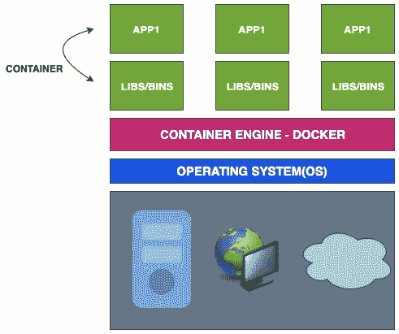
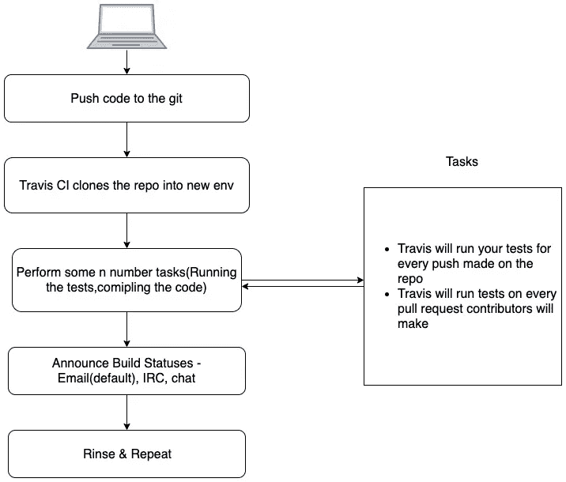
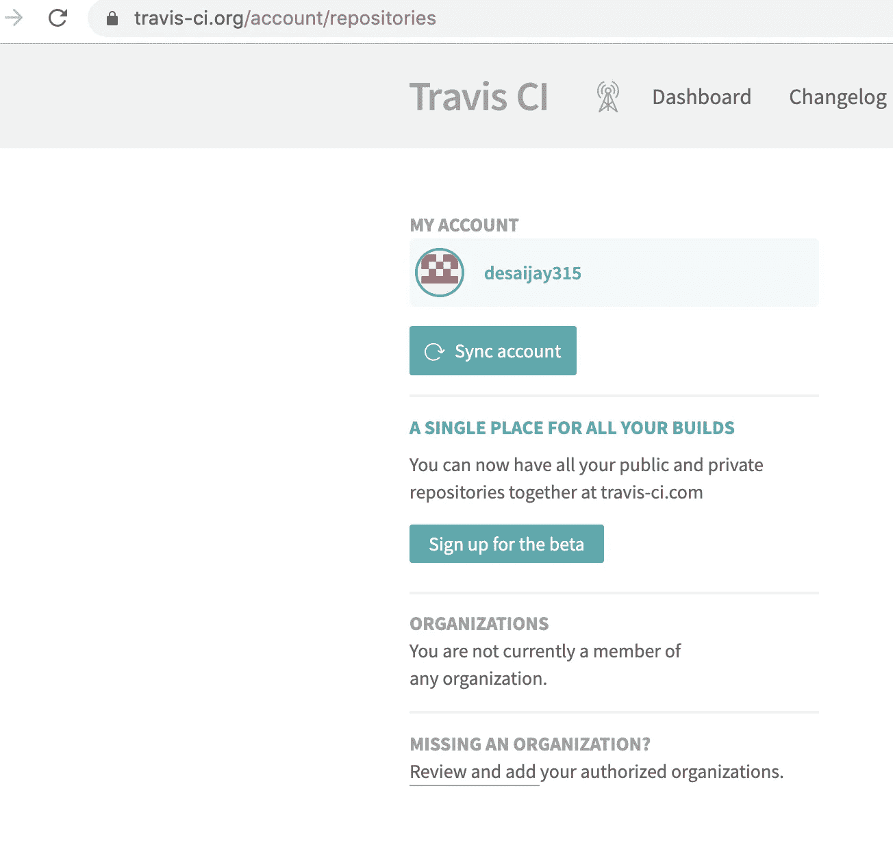
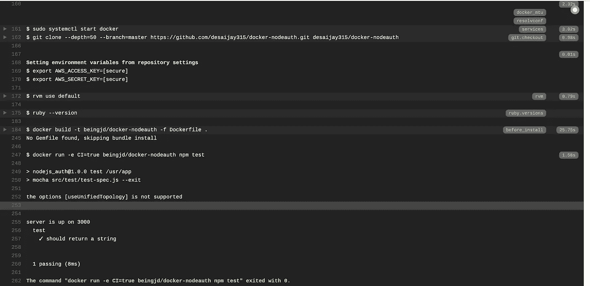
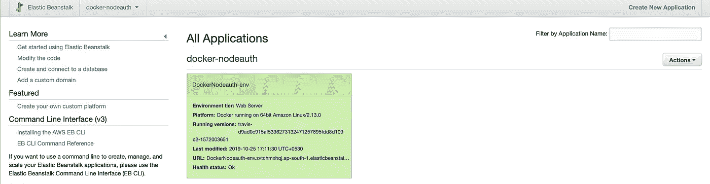
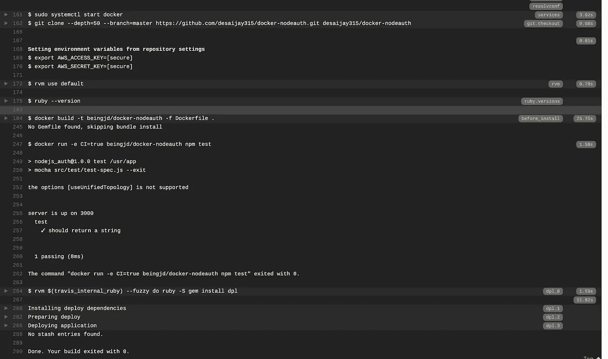
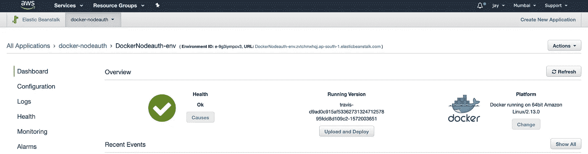

# DevOps Essentials —与 Docker 的持续集成和持续部署

> 原文：<https://levelup.gitconnected.com/devops-essentials-continuous-integration-and-deployments-of-docker-applications-with-aws-373f60daf320>


在我之前的博客《 [*用 Node.js*](https://blog.usejournal.com/handling-authentication-with-nodejs-24fc29265e0f) *》中，*我们学习了如何通过为我们的应用程序创建一个 RESTful API 来使用 JSON Web Token (JWT)进行身份验证。

[](https://blog.usejournal.com/handling-authentication-with-nodejs-24fc29265e0f) [## 使用 Nodejs 处理身份验证

### 信息的机密性和完整性是相辅相成的。它需要处理进程访问管理…

blog.usejournal.com](https://blog.usejournal.com/handling-authentication-with-nodejs-24fc29265e0f) 

在本文中，我们将从 DevOps 的角度来看如何使用 Docker、Github 和 Travis CI 处理 Node.js 应用程序的部署，并了解一些业界最佳实践。

## **我们将学习:**

1.  如何归档申请
2.  如何使用 Travis CI 和 GitHub 自动化部署
3.  如何在 AWS 弹性豆茎上部署 Dockerised 应用程序

如果你还是 docker 世界的初学者，可以从这里开始[:](https://medium.com/@desaijay315/docker-the-beginners-guide-85a27e50c271)

[](https://medium.com/@desaijay315/docker-the-beginners-guide-85a27e50c271) [## docker——初学者指南

### Docker 在软件开发公司和团队中非常受欢迎，它极大地提高了生产率，因为…

medium.com](https://medium.com/@desaijay315/docker-the-beginners-guide-85a27e50c271) 

# Docker 是什么？

Docker 是一款开源工具，专为开发人员、开发人员和系统管理员设计，用于在虚拟机、笔记本电脑或云上构建、发布和运行分布式应用。

## 基于集装箱的环境



> *容器是映像的一个实例，它在自己的隔离环境中运行自己的一组硬件和物理资源、内存和网络中的程序。*

容器共享单个主机操作系统，这使得快速部署和可移植性更加高效。我们只需要那些封装在应用程序容器中的组件。我们在不同的容器中运行不同的应用程序，并隔离运行时环境。容器比虚拟机消耗更少的 CPU 和内存，并且更具成本效益。

我们将使用 Docker 图像来创建 Docker 容器。

**Dockerfile**

Dockerfile 文件包含一组指令和命令，用于构建唯一且独立的映像。

## **克隆回购**

[](https://github.com/desaijay315/nodejs_auth) [## desaijay315/nodejs_auth

### 此时您不能执行该操作。您已使用另一个标签页或窗口登录。您已在另一个选项卡中注销，或者…

github.com](https://github.com/desaijay315/nodejs_auth) 

## 在根文件夹中创建一个 docker 文件

```
touch Dockerfile
```

## *在 Dockerfile* 中输入以下命令

Dockerfile 文件内容

`**FROM**` ***—*** 从 DockerHub 中指定基础图像

由于 ocker 运行在 Linux 环境中，我们将为我们的应用程序指定存储位置。我们所有的命令(`**COPY**` **、**、`**RUN**`、**、**、`**CMD**`)都会在这个目录下运行。如果`**/usr/app**` 没有创建，则`WORKDIR`命令会自动创建

## 安装一些依赖项

`**COPY**` —将文件从源文件复制到目标文件。我们正在将`package.json`文件复制到`/usr/app`文件夹中

`**RUN**` —这将运行命令`npm install`并安装所有依赖项

`**EXPOSE**`—公开容器监听的端口，并使应用程序在外部环境中可用

`**CMD**` —这将在容器启动时运行命令

## Docker 撰写

Docker Compose 用于同时启动多个容器。它使得在 docker-compose.yml 文件中定义的不同服务能够在一个隔离的环境中运行

## 在根文件夹中创建 docker-compose.yml

```
touch docker-compose.yml
```

## 输入如下说明

```
version: '3'
services:
 app:
  container_name: docker_nodejsauth
  restart: always
  build: .
  ports:
   - 3000:3000
  links:
   - mongomongo:
 container_name: mongo
 restart: always
 image: mongo
 ports:
  - 27017:27017
```

`**version**` —定义作曲者文件版本

`**services**` —定义服务的种类

`**app**` —这是使用 Dockerfile 构建的 Node.js 应用程序，如上所示。这可以是你想要的任何名字。(例如。节点应用、网络应用、任何东西)

`**container_name**` —节点应用程序容器的名称

`**restart**` —无论何时失败，重启我们的应用程序

`**build**` —从我们创建的 docker 文件构建 docker 容器。(点)指定 Dockerfile 的相对路径。

`**ports**` —将端口从我们的容器映射到 Node.js 应用程序端口

`**links**` —由于我们使用 MongoDB 作为现有应用程序的数据库，我们将从 Docker Hub 存储库中设置 mongo 映像/服务。

`**mongo**` —来自 Docker Hub 存储库的 Mongo 映像。为 Mongo 指定`container_name`、`image`、`restart`和`ports`。

注意:这里，我们使用 Mlab.com 服务来托管我们的数据库，所以请相应地检查 MongoDB 连接。

# 特拉维斯·CI

Travis CI 用于持续集成和部署。一旦代码库被推送到 git，Travis 将把 repo 克隆到全新的环境中。它将运行你的所有测试，并通过邮件和聊天 IRC 提供持续的反馈。



## Travis 入门

1.  用你的 Github 账户在 [**Travis-CI**](https://travis-ci.org) 上注册(该账户拥有这个回购)。
2.  在设置页面，通过点击同步账户来同步你所有的 Git 回复



## 在根文件夹中创建. travis.yml 文件

```
touch .travis.yml
```

## 在. travis.yml 文件中输入以下指令

```
sudo: required
services:
 - dockerbefore_install:
 - docker build -t beingjd/docker-nodeauth -f Dockerfile .script:
 - docker run -e CI=true beingjd/docker-nodeauth npm test
```

由于我们正在使用 docker，我们将使用 docker 服务，要求 Travis CI 安装 docker 并构建 Docker 应用程序

`**before_install**`:安装依赖项前执行所有命令。这里，我们首先构建 docker 映像。

`**script**`:执行使构建通过或失败的命令。我们在 docker 映像上运行`npm test`命令来运行测试。

现在将文件推送到 GitHub，让 Travis 运行您所有的测试。



您可以看到测试成功通过，并准备在 AWS 上部署。

# 使用 AWS ElasticBeanstalk 部署

注册亚马逊网络服务。请记住，有些服务确实需要您的信用卡，所以请在使用 Elastic Beanstalk 创建应用程序之前完成所有步骤。

## ***弹性豆茎的一些优点:***

1.  Elastic Beanstalk 有许多 EC2 实例、一个可选的数据库以及一些其他的 AWS 组件(弹性负载平衡器、自动伸缩组、安全组)。
2.  Elastic Beanstalk 不会在它为您创建的这些资源上增加任何成本，并且它会在 AWS 内部需要软件更新时管理这些资源。
3.  如果流量增加，它可以自动产生更多的 EC2 实例。

***创建应用程序，并为其提供一个合适的名称，使其类似于 GitHub repo 的名称***



## 修改. travis.yml 文件并添加以下说明:

一旦我们在 GitHub 上推送更改，Travis 将使用上述指令自动部署应用程序。



Travis 在 elastic beanstalk 上部署节点应用程序

一旦部署了节点应用程序，访问在 AWS Elastic Beanstalk 中创建的应用程序，它应该显示“Health Ok”状态，这意味着我们已经成功地在 AWS 上部署了应用程序。

**点击 URL 访问应用程序。**



# 结论

在本文中，我们学习了一种实用的方法来将应用程序 Docker 化，在 AWS Elastic Beanstalk 上部署 Docker 应用程序，并使用 Travis CI 和 Github 自动进行测试和部署。

我已经在我的 [Github](https://github.com/desaijay315/docker-nodeauth) 上创建了我们的应用的存储库，请随意分叉代码并尝试运行我上面提到的所有命令/代码。

我还上传了 [Postman](https://www.getpostman.com/) 集合，用于在 GitHub 上测试我们这个 app 的所有 API。

下面是用 Postman 测试上述应用程序的[链接](https://www.topcoder.com/blog/testing-nodejs-application-with-postman/)

> 如果你喜欢，请留下一些掌声以示支持。此外，请在下面留下您的回答，如果您遇到任何问题，请联系我。
> 
> *关注我*[*Twitter*](http://www.twitter.com/beingjaydesai)*|查看我的*[*LinkedIn*](https://www.linkedin.com/in/iamjaydesai/)*|查看我的* [*GitHub*](https://github.com/desaijay315)