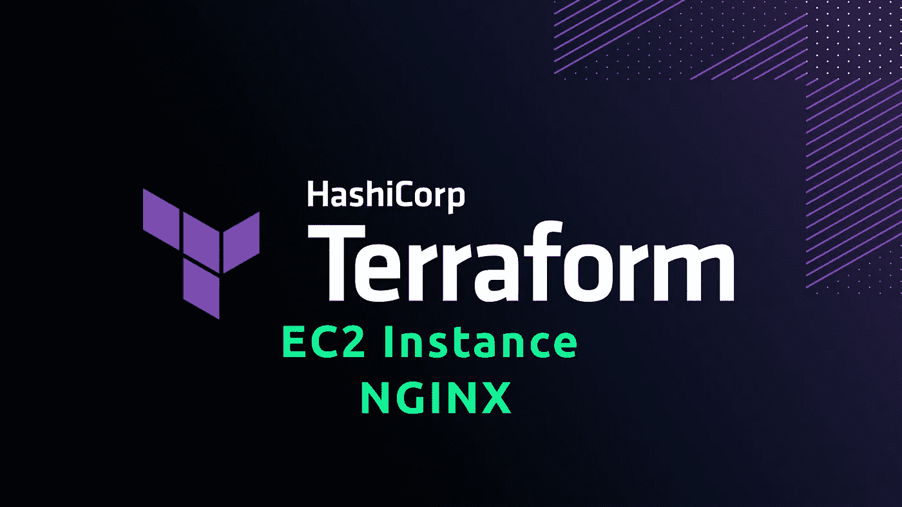
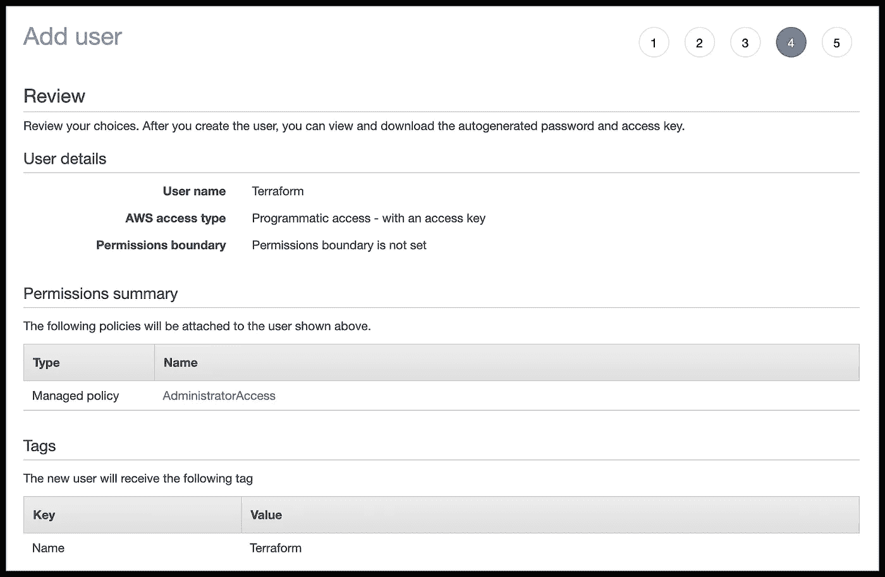
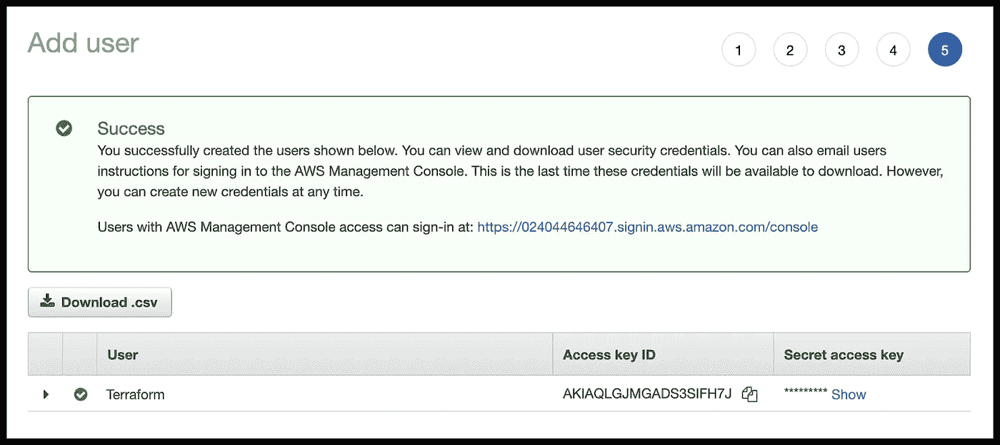
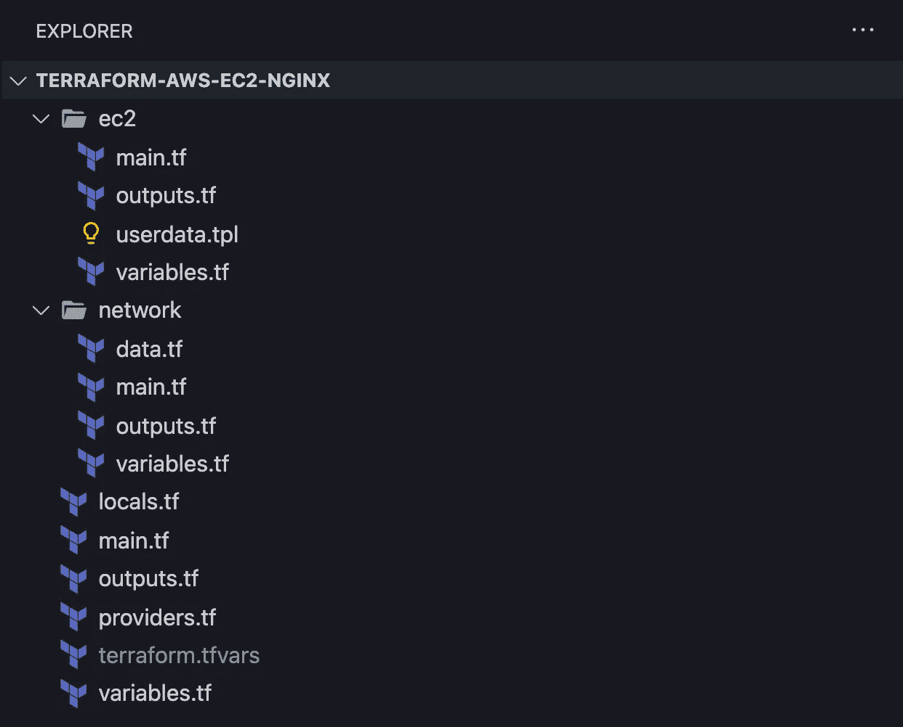
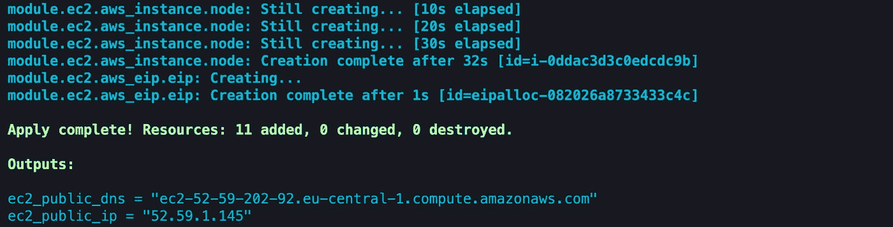
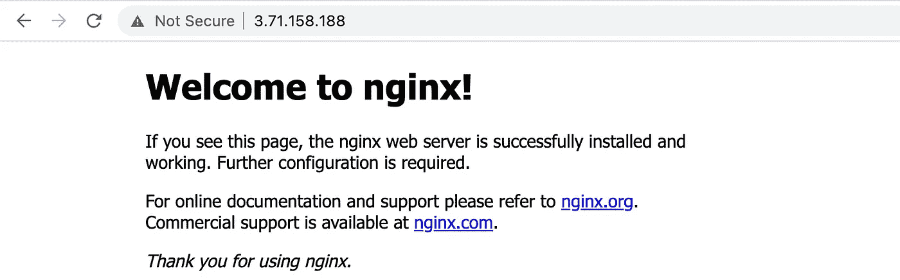
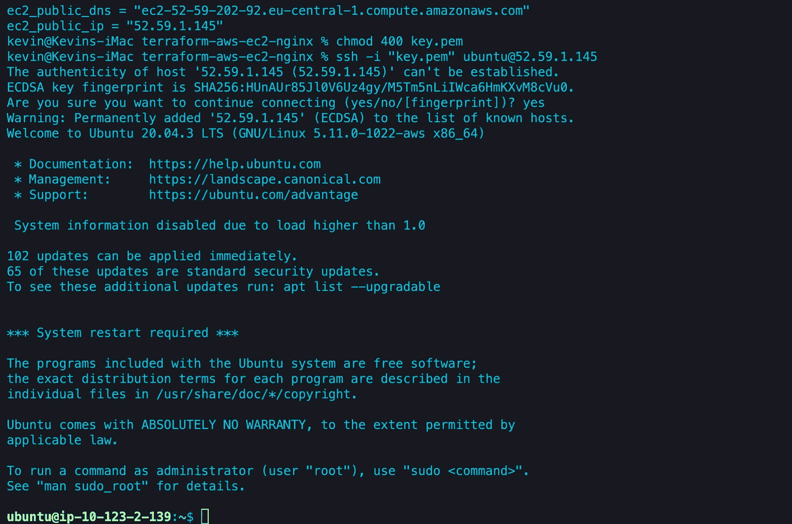

# 如何使用 Terraform 创建 EC2 实例

> 原文：<https://levelup.gitconnected.com/devops-how-to-create-an-ec2-instance-with-terraform-a1f8285ee5f7>

## 如何使用 Terraform 在 AWS 上创建 EC2 实例的分步指南



除了我的另一篇文章[为什么你应该使用 Terraform](/devops-why-you-should-use-terraform-667f0411e383) ，我将向你展示如何开始使用 Terraform。如果您没有阅读这篇文章，我建议您在继续阅读本文之前先阅读这篇文章。

在本指南中，我们将使用 Terraform 在 AWS 上启动一个 EC2 实例(Ubuntu Server 20.04 LTS)。此外，我们将设置一个 VPC，通过 Terraform 自动创建一个密钥对，通过 SSH 连接到您的 EC2 实例，我们将在我们的服务器上安装 NGINX。我们只是通过代码来实现这一切！听起来不错，对吧？

如果你还没有安装 Terraform，请按照官方的[安装指南](https://learn.hashicorp.com/tutorials/terraform/install-cli)操作。本文基于 Terraform 版本 1.1.7。

我已经把这个项目上传到了 [Github](https://github.com/hellokvn/terraform-aws-ec2-nginx) 。

# 创建 IAM 用户

但是，我们需要手动处理 AWS 上的一个小问题。我们需要**为 Terraform** 创建一个新的 IAM 用户，该用户有权限创建我们要用 Terraform 编码的所有这些很酷的东西。但是，别担心，很快就好了，跟我来。

登录 AWS 控制台，转到 IAM 仪表板，创建一个新用户。以下是重要的设置:

*   访问类型:`Programmatic`
*   权限:`AdminstratorAccess`

根本不建议选择`AdminstratorAccess`。你永远不应该那样做。但是为了简单起见，我们就这么走。请记住，以后只授予您的 Terraform 用户必要的权限，尤其是在生产 AWS 帐户上。

下面是我对创建新用户的总结。你这边看起来应该差不多。



继续，然后**保存/下载**访问密钥**和**秘密访问密钥**，我们很快就会需要它们。**



# 地形工程

就这样，现在我们可以开始用 Terraform 编码了。

## 创建项目

```
$ mkdir terraform-ec2-nginx
$ cd terraform-ec2-nginx
$ code .
```

## 项目结构

像往常一样，在我的指南中，我将继续使用最终的文件结构。

```
$ mkdir network ec2
$ touch main.tf providers.tf locals.tf terraform.tfvars
$ touch vpc/data.tf vpc/main.tf vpc/outputs.tf vpc/variables.tf
$ touch ec2/main.tf ec2/outputs.tf ec2/variables.tf ec2/userdata.json
```

你可能不知道这个文件名是什么意思，但是请听我说，我很快就会解释它们。

但是你应该知道的是，我们不需要在 Terraform 中导入/导出文件。Terraform 很聪明，可以帮我们处理这件事。

你的产品结构应该是这样的:



# 准备变量、局部变量和提供程序

首先，我们将编写 are(环境)变量、局部变量，并将 AWS 配置为根目录中的提供者。

## 环境变量

这里是我们存储刚刚在 IAM 仪表板上创建的用户的**访问密钥**和**秘密访问密钥**的地方。只要把它们插在引号之间。

Terraform 将自动使用该文件，将其输入作为 Terraform 代码中的变量进行处理。

> ***terra form . TF vars*** *这个文件处理通常* ***敏感值*** *。始终将此文件添加到您的。如果你使用 Git，忽略它。*

让我们给`terraform.tfvars`添加一些代码

`access_ip`稍后将指定我们可以从哪个 IP 连接/从 web 访问我们的服务器(HTTP/SSH)。`0.0.0.0/0`的意思是，每个人都可以连接并访问我们的服务器。

## 变量

正如我刚才所说的，环境变量将作为[变量](https://www.terraform.io/language/values/variables)来处理，所以我们必须再次声明它们，但是保留在我的，我们已经在`terraform.tfvars`文件中定义了最敏感的变量。

另外，我们在这里增加了一个叫做`aws_region`的变量

有些人会争辩说，这个变量也可能是敏感的，但是为了演示，我们在这个文件中用默认值`eu-central-1`定义它。用您的首选地区替换此值。你可以在这里找到所有地区的列表。根据你的位置选择最适合你的。

让我们给`variables.tf`添加代码

## 提供者

由于我们将使用 AWS，我们需要注册并配置 AWS 作为[提供者](https://www.terraform.io/language/providers)。正如你从**第 10 行到第 12 行**所看到的，我们已经开始使用我们的(环境)变量了。

让我们给`providers.tf`添加代码

## 当地人

局部变量类似于变量，但是我们有时使用的一种模式是使用局部变量作为基于(可能缺少或未耦合的)变量的编程派生值。

这里，我们将为 EC2 实例指定 VPC 的 CIDR 和安全组。我们允许每个人通过 SSH、HTTP 和 HTTPS 访问我们的服务器。出于安全原因，不建议让任何人访问 SSH。推荐的方法是只授予需要访问的 IP 地址访问权限，比如您自己和其他系统管理员。

但是你知道，为了简单起见…

让我们给`locals.tf`添加代码

# 创造一个 VPC

现在，我们将配置两个模块中的第一个。

## 变量

VPC 模块稍后将接收变量，因此我们需要通过定义这些给定的变量来为此做准备。

让我们给`network/variables.tf`添加代码

## 数据源

[数据源](https://www.terraform.io/language/data-sources)允许 Terraform 使用在 Terraform 之外定义的信息，例如，由 AWS 等注册提供商定义的信息。

在这个特定的例子中，我们将基于我们的 AWS 区域获得所有的 AWS 可用性区域，作为一个字符串列表。

就我的特殊情况:`eu-central-1a` `eu-central-1b` `eu-central-1c`

如果您定义了一个不同的 AWS 区域，那么这个数据源的返回将会不同。但是不要太在意这个，因为它是根据您定义的区域自动生成的。

让我们添加代码到`network/data.tf`

## 资源

文件`main.tf`通常是我们定义的任何模块的核心。这里是我们在这个特例中将 VPC 设置为[资源](https://www.terraform.io/language/resources)的地方。但是，除了配置 VPC，我们还需要做更多的工作。我们需要配置子网、路由表(它们必须相互关联)、配置安全组等等。我想你对这些很熟悉。

这个文件中的特性是最后一个资源`aws_security_group`。我们在这里使用了一个[动态块](https://www.terraform.io/language/expressions/dynamic-blocks)。我建议阅读文档来理解这个关键字是如何工作的。

让我们给`network/main.tf`添加代码

## 输出

在设置我们的 VPC、安全组等等之后，我们将返回一些数据作为[输出](https://www.terraform.io/language/values/outputs)。所以我们可以在其他模块中使用这些数据。因为我们要建立一个 EC2 实例，所以我们需要安全组 ID。

让我们给`network/outputs.tf`添加代码

## 将 VPC 添加为模块

现在，我们需要将整个 VPC 配置添加为一个模块。记住，我说过，我们需要给 VPC 构型一些变量，现在我们要这么做了。

当心，我们现在在根目录中！

让我们给`main.tf`添加代码

## 测试 VPC

如果您想测试 VPC 配置，那么您可以这样做。向下滚动到本文的**命令**部分。但这是很随意的。我将在设置 EC2 实例后解释这些命令。

# EC2 实例

现在，让我们继续配置我们的 EC2 实例。这里不会面对太多新的关键词，所以这个很快就搞定了。

## 变量

这个文件很有趣。因为我们稍后将从 VPC 模块接收输出变量，所以我们必须为 EC2 模块定义它们。

让我们给`ec2/variables.tf`添加代码

## 用户数据

在这个文件中，我们指定了在第一次启动 EC2 实例时运行的配置脚本。这是我们安装 NGINX 和其他所有我们想安装在 EC2 实例上的东西的地方。

让我们给`ec2/userdata.tpl`添加代码

## 资源

所以这个文件非常重要。在这里，我们配置我们的 EC2 实例。所以我们在这里做的是创建一个密钥对，我们也把它下载到我们的根目录。稍后我们需要这个密钥对来连接到我们的 EC2 实例。此外，我们设置了 EC2 实例，并将一个[弹性 IP](https://docs.aws.amazon.com/AWSEC2/latest/UserGuide/elastic-ip-addresses-eip.html) 关联到服务器。

让我们添加代码到`ec2/main.tf`

## 输出

同样，我们有一些想要返回的输出。

让我们给`ec2/outputs.tf`添加代码

## 将 EC2 添加为模块

现在，我们需要添加 EC2 配置作为一个模块。正如我所说的，我们要添加一些变量，因为它需要一些变量。

让我们把根目录下的文件`main.tf`从

到

## 一般输出

请记住，我们在 EC2 模块上定义了一些输出，我们希望这些输出在我们将更改提交并应用到 AWS 之后显示在我们的终端中。因此，我们很容易找到 EC2 实例的 IP，而不是查看整个 Terraform [State](https://www.terraform.io/language/state) 文件。这大大简化了事情。

好消息！我们完成了编码。

# 命令

现在，一切准备就绪。所以现在有几个命令可以使用。像往常一样，我强烈建议您阅读每个命令的官方文档，以了解一切。

## 何时使用每个命令？

完成更改后，运行`terraform init`、`terraform validate`、`terraform plan`和`terraform apply`来应用您所做的更改。

如果你想破坏你的整个配置，那么你需要运行`terraform destory`。

在您的终端中执行以下命令。

## 初始化

[init](https://www.terraform.io/cli/commands/init) 用于初始化包含 Terraform 配置文件的工作目录。每当您克隆一个 Terraform 存储库或添加一个新模块时，只需运行 init。

```
$ terraform init
```

## 使生效

[validate](https://www.terraform.io/cli/commands/validate) 命令验证您的配置。在应用更改之前，请运行此命令。

```
$ terraform validate
```

## 计划

[plan](https://www.terraform.io/cli/commands/plan) 命令创建一个执行计划，让您预览 Terraform 计划对您的基础设施进行的更改。小心，输出会很长。在应用更改之前，请运行此命令。

```
$ terraform plan
```

## 应用

[应用](https://www.terraform.io/cli/commands/apply)命令执行地形图中建议的动作。这意味着，我们将提交并应用我们对 AWS 的更改/更新，换句话说，这个命令创建了 VPC 和 EC2 实例。

```
$ terraform apply
or
$ terraform apply --auto-approve
```

[应用](https://www.terraform.io/cli/commands/apply)命令执行地形图中建议的动作。这意味着，我们将提交并应用我们对 AWS 的更改，换句话说，这个命令创建了 VPC 和 EC2 实例。执行该命令需要一段时间。

## 销毁(现在不运行！)

[destroy](https://www.terraform.io/cli/commands/destroy) 命令破坏了我们的整个配置。现在不要运行它。

```
$ terraform destory
 or
$ terraform destroy --auto-approve
```

如此重复，运行`terraform init`、`terraform validate`、`terraform plan`，如果一切正常，那么运行`terraform apply`。

暂时跳过`terraform destroy`！



太好了！您的 EC2 实例正在运行。在这个截图的底部，您可以看到我们刚刚定义的输出。给服务器 1-2 分钟时间完全启动，安装 NGINX 也需要几秒钟。然后就可以访问我们输出的 EC2 公有 IP 了。

在我的情况下，我可以在我的网络浏览器中访问`http://52.59.1.145`。这个链接对你不起作用，用你从终端得到的 IP 地址来代替它。

以下是我得到的回报:



我们的 NGINX 正在工作。此外，让我们通过 SSH 连接到我们的服务器。只有两个进一步的步骤。

记住，Terraform 创建了一个**密钥对**，我们也将它下载到我们的项目根目录中，但是首先我们需要使它可读。

```
$ chmod 400 key.pem
```

> ***重要:*** *使用 chmod 命令更改权限后，如果您在 Terraform 上销毁并重新应用您的配置，Terraform 可能很难覆盖此文件。因此，为了防止这种情况，请手动删除、移动或重命名该文件，如果您运行* `*terraform destory*` *！*

现在让我们连接到 EC2 实例，只需在终端内用输出的 IP 替换`YOUR_SERVER_IP`。

```
$ ssh -i "key.pem" ubuntu@YOUR_SERVER_IP
```



**恭喜恭喜！**一切按预期运行。感谢您阅读我关于如何用 Terraform 创建 EC2 实例的文章。我希望，你能学到新的东西。Terraform 是 DevOps 中一个很棒的工具，有比你刚才看到的更多的可能性。

我已经把这个项目上传到了 [Github](https://github.com/hellokvn/terraform-aws-ec2-nginx) 。

干杯！

我希望你喜欢读这篇文章。如果你愿意支持我成为一名作家，可以考虑注册[成为一名媒体会员](https://medium.com/@hellokevinvogel/membership)。每月只需 5 美元，你就可以无限制地使用 Medium。

想支持我？给我买杯咖啡。

# 接下来阅读

[](/nestjs-microservices-with-grpc-api-gateway-and-authentication-part-1-2-650009c03686) [## NestJS:具有 gRPC、API 网关和认证的微服务—第 1/2 部分

### 分步指南:带有 gRPC、API 网关、认证和验证的 NestJS 应用程序

levelup.gitconnected.com](/nestjs-microservices-with-grpc-api-gateway-and-authentication-part-1-2-650009c03686) [](https://javascript.plainenglish.io/3-reasons-why-typescript-is-better-than-javascript-76443330f248) [## TypeScript 优于 JavaScript 的 3 个原因

### 是时候停止在 TypeScript 上使用 JavaScript 了

javascript.plainenglish.io](https://javascript.plainenglish.io/3-reasons-why-typescript-is-better-than-javascript-76443330f248) [](https://blog.bitsrc.io/solid-principles-in-typescript-153e6923ffdb) [## 带打字稿的固体原理(2022)

### TypeScript 对用 JavaScript 编写干净的代码产生了巨大的影响。但是总有办法…

blog.bitsrc.io](https://blog.bitsrc.io/solid-principles-in-typescript-153e6923ffdb)