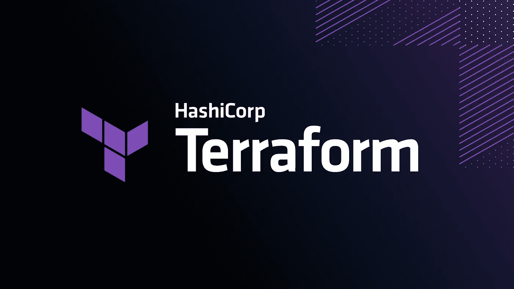
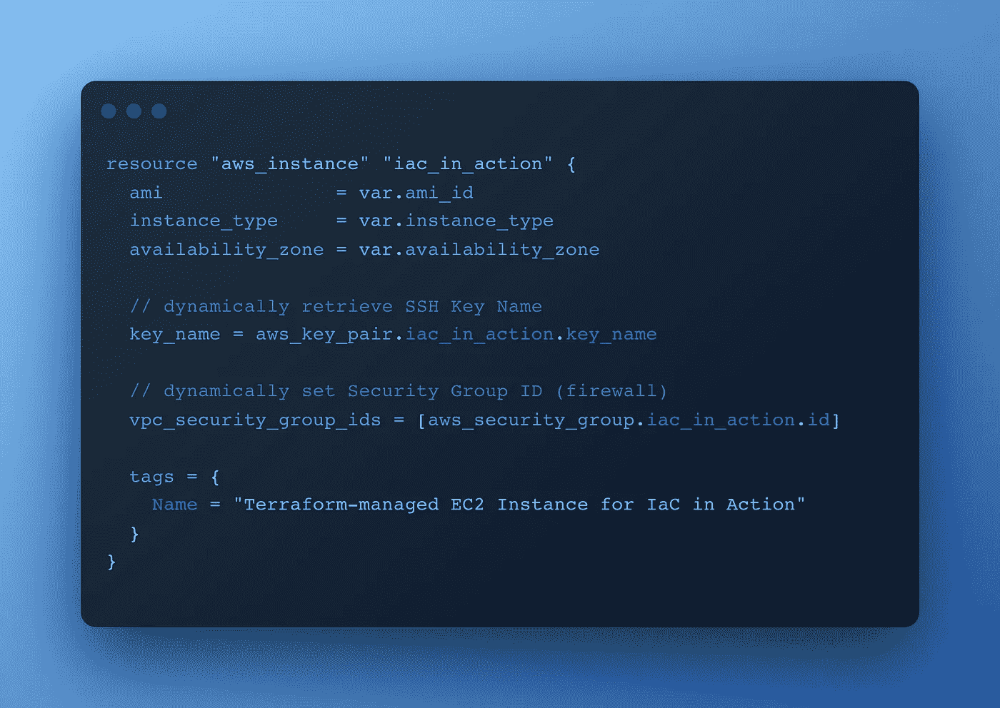
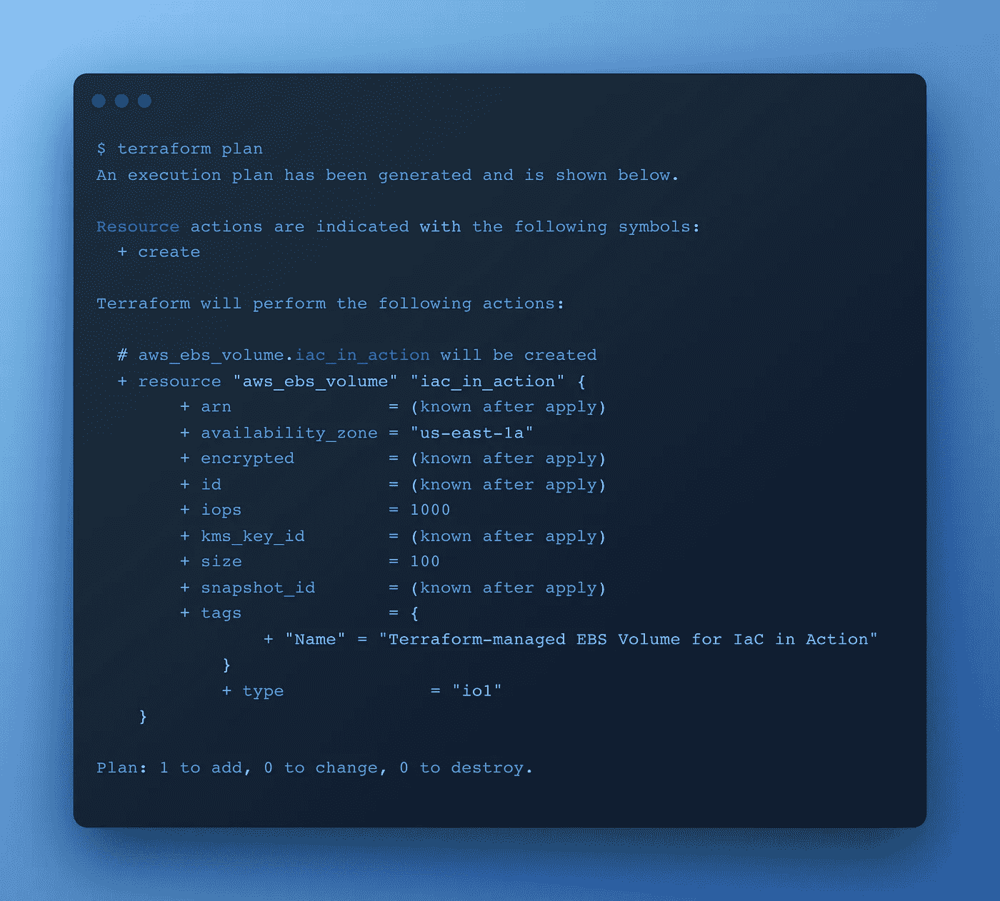

# 为什么您应该使用 Terraform

> 原文：<https://levelup.gitconnected.com/devops-why-you-should-use-terraform-667f0411e383>

## DevOps:什么是 Terraform，为什么它这么好

照片由 [Terraform](https://www.terraform.io/) 拍摄

如果您对应用程序的架构和开发以及在云中运行的应用程序感兴趣，那么您很可能听说过 Terraform。Terraform 是一种软件，通常在定义和配置基础设施时发挥作用。这意味着服务器、负载平衡器、存储和属于云环境的所有其他东西。

在我们开始之前，除了这篇文章，我还创建了一个实践指南:

 [## DevOps:如何用 Terraform 创建 EC2 实例

### 如何使用 Terraform 在 AWS 上创建 EC2 实例的分步指南

levelup.gitconnected.com](/devops-how-to-create-an-ec2-instance-with-terraform-a1f8285ee5f7) 

# 地形的历史

首先，Terraform 是由美国公司 [HashiCorp](https://www.hashicorp.com/) 开发的软件，而该公司又是由 [Mitchell Hashimoto](https://www.linkedin.com/in/mitchellh/) 于 2012 年创立的。你可能已经知道 HashiCorp 的其他产品有 Consul、Vault 或 Waypoint。

Terraform 的第一个版本于 2014 年 7 月发布，经过 7 年的开发，1.0 版本终于发布。与 HashiCorp 的其他几个产品类似，Terraform 的源代码可以在开源许可下免费获得。

# 基础设施即代码(IaC)

HashiCorp 本身将 Terraform 描述为一个免费的基础设施代码软件。基本思想是基础设施可以由软件定义和配置。

例如，假设您必须创建不同的服务器、负载平衡器、VPC 等。并可能一次又一次地更改它们。不需要通过登录 AWS 控制台来手动处理这个问题，只需用代码就可以了。如果您需要复制一个服务器，那么您只需在 Terraform 代码中增加服务器的数量。

创建 EC2 实例

# 自动和声明性配置

Terraform 允许开发人员通过代码定义您的基础架构的理想状态，这意味着您首先在一个或多个文件中描述理想的基础架构应该是什么样子，即您需要多少台服务器，应该使用哪个存储，应该如何配置负载平衡器等等，然后让 Terraform 独立决定应该如何以及在哪些步骤中构建该基础架构。

Terraform 通过首先将当前状态与期望状态进行比较，来确定如何实现基础设施的期望状态。

例如:图像您已经应用了一个 Terraform 配置，该配置在 AWS 上创建了一个 EC2 实例。稍后，您决定要更改实例类和卷大小。这个 EC2 实例的。然后你用代码来做这件事。然后，Terraform 不会设置新的 EC2 服务器，而只会更改受影响的 EC2 实例的实例类。

这使得基础设施的配置变得非常非常容易，因为这样您就不必再手动处理哪个系统当前处于哪个状态的问题，Terraform 知道所有这些，您已经通过 Terraform 设置了系统和基础设施。如我所说，在代码中定义期望的状态非常简单，Terraform 会处理好它，剩下的就交给它了。

# 云提供商

Terraform 当然必须能够与 AWS、微软 Azure 等相应云提供商的 API 进行通信。有各种各样的集成提供者，也有许多由社区提供的提供者。但 Github 或 Bitbucket 等服务也是与 Terraform 兼容的提供商之一。

因此，从理论上讲，Terraform 允许您配置为组织的 IT 提供基础设施的所有服务。

# 自动测试

但是关于 Terraform 最酷的事情是你也可以使用 Terraform 进行软件测试，因为 Terraform 是作为脚本执行的。Terraform 使得构建测试环境变得非常容易，一旦测试完成，测试环境就会被移除。

# 状态管理

为了使 Terraform 能够执行期望的动作，Terraform 当然必须知道当前状态。为此，Terraform 在内部保留了一个协议，在发生变化时，首先将该协议与基础设施的状态进行比较，然后知道必须做出哪些变化。但是，如果 Terraform 检测到协议和基础设施的当前状态之间存在差异，可能会出现错误，然后会向您指出错误。

此外，Terraform 需要将该协议存储在某个地方。由于 Terraform 既可以在本地运行，也可以在 Terraform 云中运行，因此将 Terraform 状态(即协议)保存在 Terraform 云中是有意义的。这比只在本地保存这个状态要好，因为这样你可以在团队中更好地工作。

# 结论

在管理 it 基础设施方面，Terraform 是一个很好的工具。你将节省大量的时间和工作，尤其是在更大更复杂的项目上。我必须指出现在 Terraform 提供的伟大的文档。如果你不使用 Terraform，那么是时候开始使用 Terraform 了。

感谢您阅读我关于 Terraform 的文章。我希望，我能给你一个简短的介绍，为什么它很重要。

干杯！

# 如何使用 Terraform 创建 EC2 实例

 [## DevOps:如何用 Terraform 创建 EC2 实例

### 如何使用 Terraform 在 AWS 上创建 EC2 实例的分步指南

levelup.gitconnected.com](/devops-how-to-create-an-ec2-instance-with-terraform-a1f8285ee5f7) 

我希望你喜欢读这篇文章。如果你愿意支持我成为一名作家，可以考虑注册[成为](https://medium.com/@hellokevinvogel/membership)的媒体成员。每月只需 5 美元，你就可以无限制地使用 Medium。

想支持我？给我买杯咖啡。

# 接下来阅读

 [## NestJS:具有 gRPC、API 网关和认证的微服务—第 1/2 部分

### 分步指南:带有类型脚本、gRPC、API 网关、身份验证和验证的 NestJS 应用程序

levelup.gitconnected.com](/nestjs-microservices-with-grpc-api-gateway-and-authentication-part-1-2-650009c03686)  [## 带打字稿的固体原理(2022)

### TypeScript 对用 JavaScript 编写干净的代码产生了巨大的影响。但是总有办法…

blog.bitsrc.io](https://blog.bitsrc.io/solid-principles-in-typescript-153e6923ffdb)