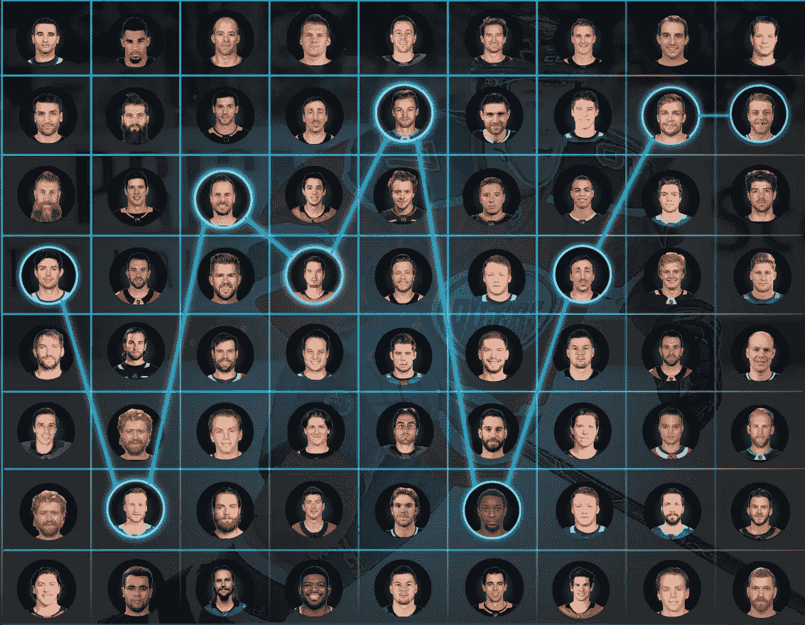
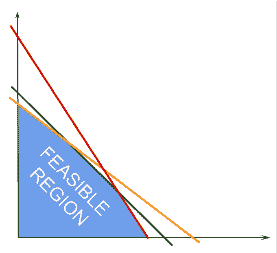
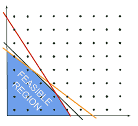
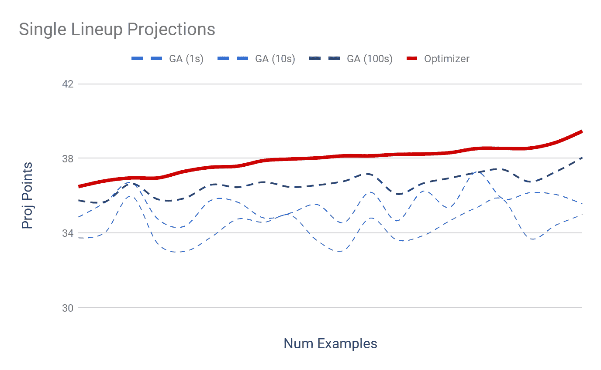
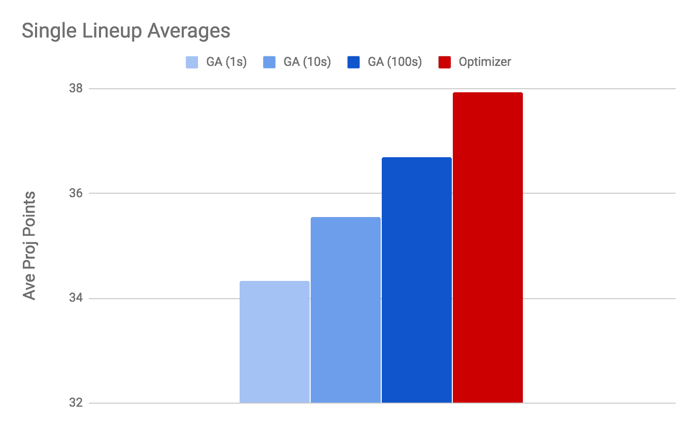
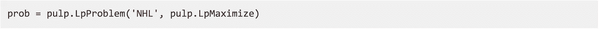
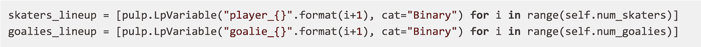
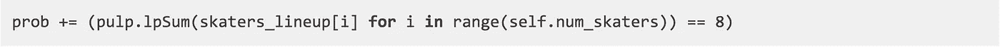
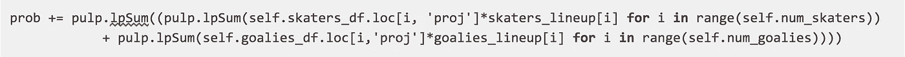
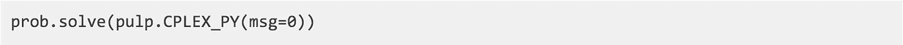

# 使用 Python 进行线性编程和优化，以创建日常梦幻运动阵容

> 原文：<https://levelup.gitconnected.com/dfs-lineup-optimizer-with-python-296e822a5309>

今天我将向您展示如何使用 python 和线性编程为日常幻想运动构建自己的阵容优化器。我将重点放在非霍奇金淋巴瘤的阵容，但概念都转移到其他主要运动，除了几个细节。我们构建的优化器基于[挑选优胜者](http://www.mit.edu/~jvielma/publications/Picking-Winners.pdf)的论文，你可以在我的 [Github](https://github.com/jnederlo/dfs_optimizers) 上找到我所有完成的代码。

在我的上一篇文章中，我展示了我们如何使用[遗传算法](https://medium.com/@jarvisnederlof/building-a-genetic-algorithm-in-python-for-daily-fantasy-sports-9f497d378e34)来构建阵容，当它完成工作时，我们可以使用优化器和线性编程进行许多重大改进。优化器让我们能够更好地控制如何构建产品系列，效率显著提高，并产生最佳结果。稍后我会证明这一点，但首先你可能会想什么是线性编程，为什么我们要使用它。

简而言之，线性规划是试图找到一个问题的最大或最小的解决方案的基础上，一些变量的组合受到一组给定的限制。根据定义，这些约束必须是线性的。以图 1 为例:

图 1

在图 1 中，我们希望根据某个函数找到两个变量(即 X 轴和 Y 轴)组合的最大值。每个约束都表示为一条直线，综合起来，这些约束就形成了我们的可行域。因此，我们只能选择两个变量的组合落在可行区域内的解。

将线性规划与生成 DFS 的队列相关联，我们可以如下设置问题:

*   首先，我们将我们的决策变量集定义为包含在阵容中的玩家。这些变量将包括一些定义特征，例如他们的职位、薪水和预测，等等。
*   接下来，我们添加约束。一些基本的限制包括确保阵容不超过总工资帽，以及一些位置要求。
*   我们定义了问题的目标:最大化阵容的投影点。
*   最后，我们根据我们的目标和约束来解决问题。

我们对玩家施加的约束将形成我们的可行区域，用于产生有效阵容的所有可用玩家组合。因为我们不能在一个阵容中包括一小部分球员，我们将进一步限制我们的球员为 0 和 1 的整数，0 代表不包括在一个阵容中，1 代表包括在内。这意味着我们的问题被细分为整数规划问题。以图 2 为例:

图 2

就像在图 1 中，我们有一些限制在某个可行区域内的解决方案，但是我们不能在这个区域内选择任何变量的组合，而是被进一步限制为选择由黑点表示的整数的组合。为了想象这一点，想想球员的组合——我们不能只包括帕特里克·凯恩灵巧的双手，我们必须包括整个球员。换句话说，我们不能只挑选球员的一部分来充实我们的阵容。

# 展示优化器的有效性

很好，现在我们对线性/整数规划有了一点了解，但它真的比使用遗传算法(g a)来生成阵容更好吗？答案是响亮的是。我通过运行一些测试来演示这一点，在这些测试中，我使用 GA 和优化器来产生单个队列的最佳表示。两个模型都使用相同的基本要求(工资帽、职位限制等)和相同的输入，目标是最大化阵容的投影点。我用不同的输入运行了大约 30 个这样的测试。

因为 GA 随着进化步骤的增加而改进，所以我为每个测试运行了三个不同的版本，分别运行了 1 秒、10 秒和 100 秒。另一方面，优化器会立即产生 1 个队列的结果。我的测试结果如图 3 所示。

图 3

从上面我们可以看到，无论 GA 运行多长时间，在每一个例子中，它都无法击败优化器产生的队列。优化器不仅产生了更好的队列，而且速度更快。我在图 4 中展示了测试中使用的每种方法的平均投影点。

图 4

从上面可以清楚地看出，我们让 GA 运行的时间越长，平均输出就越高。也许如果我们不阻止 GA 运行的话，*可能会接近优化器所达到的结果，但是无论如何，优化器是更有效率的。总的来说，对于所有 30 个测试，优化器运行时间不到 10 秒，而具有最佳平均值的 GA 方法运行时间为 3000 秒(100 秒* 30)，即大约 50 分钟。*

然而，优化器最重要的方面是，它总是会根据给定的约束集产生最优的队列。这意味着我们可以改变优化器的行为以适应新的策略，并且它仍然会产生最好的可能阵容。因此，我们决定添加的约束集将在很大程度上决定模型的有效性。

# 用 Python 编写优化器

在本文的最后一部分，我将简要介绍如何在 Python 中构建优化器。我不会在这里赘述，因为代码太多了，但是我鼓励你克隆我的 Github 库并亲自尝试一下。我也欢迎任何贡献，以增加更多的功能/约束和支持额外的运动。

为了构造线性/整数问题，我们将使用一个名为 PuLP 的 python 库。这将极大地降低我们的复杂性，并带来额外的好处，包括支持许多不同的解决方案；真正解决我们问题的东西。PuLP 使得使用像 Gurobi 和 CPLEX 这样的高性能解算器或者像 GLPK 这样的开源解算器变得容易，这可以大大减少优化器的运行时间。

我们首先将我们的问题定义为一个纸浆对象，我将它命名为“NHL ”,并指定我想要最大化一些值。

接下来，我们将把模型的决策变量定义为我们的运动员和守门员——每个运动员都被表示为一个决策变量，但是我们分别跟踪运动员和守门员。我给每个变量一个唯一的名字，并将类别指定为“二进制”。“二进制”的指定意味着求解器将根据球员是否将被包括在阵容中来设置该值为 1 或 0——这使得它成为一个整数规划问题。

现在，我们可以开始添加约束条件了——约束条件的正确组合会产生很大的不同。我展示了一个简单约束的例子，它设置了一个队列中包含的运动员总数。当求解程序运行时，我们强制要求溜冰者的决策变量之和必须等于 8，这意味着溜冰者的决策变量中的 8 个必须设置为 1，其余的设置为 0:

请注意，我们正在将约束添加到之前定义的纸浆问题对象中。你可以认为这就像在图 2 中添加了另一条对角线，进一步限制了我们玩家组合的可行空间。这是一个非常简单的添加约束，其他约束更复杂，需要我们对输入进行预处理并创建指标。这些指标随后被用于以某种方式对球员进行分类，例如，在特定球队的特定线上。你可以在“挑选优胜者”一文中了解更多关于这些指标和约束的信息，和/或查看我的知识库中的代码。

接下来，我们将指定问题的目标。也就是说，我们将告诉求解器，阵容的投影点是我们想要最大化的东西。我们通过将求解器设置为 1 的决策变量(即参与者)的投影点相加来实现这一点。因此，根据我们的约束，如果决策变量增加了阵容投影点，求解器将只把决策变量设置为 1。

现在我们已经设置好了一切，最后一步是调用求解器。我们必须指定我们想要使用的解算器，否则纸浆将使用默认的，这是缓慢的。正如我之前提到的，PuLP 可以与许多解算器一起工作——我使用 CPLEX，但是如果你能获得许可，Gurobi 将是一个不错的选择，或者你可以尝试 GLPK，因为它是开源的。无论哪种方式，无论您使用哪个规划求解，您都需要确保它安装在您的系统上。

如果一切运行顺利，并且您的约束是适当的，上述步骤的结果将产生一个单一的最佳阵容。实际上，所产生的阵容将由一堆关于决策变量的 0 和 1 组成。因此，您需要将每个决策变量映射到适当的玩家，以获得适当的输出，然后您可以用它来参加 Draftkings 或 Fanduel 竞赛。

就这样，就这样！现在您知道了什么是优化器，以及如何将它应用到 DFS 中。我将继续在我的 Github 上添加对优化器的更多支持，在以后的文章中，我将开始分解如何做出并正确测试您自己的预测。

贾维斯·内德洛夫

**line Cruncher | fantasy hacker**

 [## 学习 Python -最佳 Python 教程(2019) | gitconnected

### 50 大 Python 教程-免费学习 Python。课程由开发人员提交并投票，使您能够…

gitconnected.com](https://gitconnected.com/learn/python)