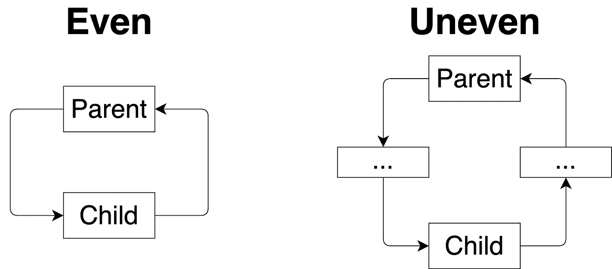

# 来自地狱的迪

> 原文：<https://levelup.gitconnected.com/di-from-hell-b1f43e122a4c>

> 这篇文章主要基于[停止使用 setter](/stop-using-setters-785670f4bf8?source=friends_link&sk=a020d40e49eb5ed450171c3b0cc8e780)和[停止在你的 Java 应用程序中使用@ post construct](/stop-using-postconstruct-in-your-java-applications-2a66fb202cb8)的故事。如果你还没有读过它们，最好在读这本书之前读一读。但是这对于理解故事的信息来说是不必要的。
> 
> 进一步的论证不仅适用于 Java 语言和 Spring 框架，也适用于所有类似的技术。

我们都喜欢 Spring 框架。或许不是我们所有人。但是至少大多数 Java 开发人员都熟悉它。春天是一个巨大的生态系统，为我们提供了几十种有用的工具。反正最根本的就是[依赖注入](https://en.wikipedia.org/wiki/Dependency_injection)和[反转控制](https://en.wikipedia.org/wiki/Inversion_of_control)。这些巨人已经交付，使我们的代码不那么脆弱，更易于维护。但是我认为，实施有一些问题，这些可能会导致完全相反的事情。所以，我们来讨论一下。

[这个 StackOverflow 问题](https://stackoverflow.com/questions/38068303/spring-autowiring-order-and-postconstruct)引发了我写这个故事。作者想了解 beans 的实例化和`@PostConstruct`调用的顺序。目标是预测控制台中应该打印的内容。我们将在文章的最后回到这个任务。首先，让我们检查代码。我对它做了一点点改动，只是为了让它更具可读性，但重点是一样的。

[来自 StackOverflow 的代码](https://gist.github.com/085cc8fc76cdfa7b00632d15ff6a2145.git)

人们对春豆的执行顺序留下了相当详细的评论。但我认为重点应该转移。我认为这段代码包含一些架构错误。如果我们解决了这些问题，初始化顺序的模糊性将会自行消失。那么，我们开始吧。

# 邪恶的起源

开头是字，字是`@Autowired`。这个注解告诉了春迪如何表演魔术。让我们看看它的声明。

[自动连线](https://gist.github.com/908567d4e360b4eb62b8e4be93d28dd3.git)

`@Target`定义了`@Autowired`用法的可能变化。我们今天不讨论`ElementType.ANNOTATION_TYPE`和`ElementType.PARAMETER`。因为第一个是用来实现 Spring 中棘手的注释继承的。第二种类型用于测试环境，尽管我个人从未见过这样的例子。

因此，我们对三种类型的注射感兴趣。

*   现场注射
*   定型剂注射
*   构造函数注入

让我们逐一讨论。

# 现场注射

在我个人看来，这是列表中最差的选项。没有构造函数或设置函数，但是依赖关系会凭空出现在一个对象中。Spring 使用`Reflection API`来执行 DI。所以，它不在乎可见性的范围。但是我们作为开发者确实关心它。

首先，没有办法为这样的案例编写一个好的单元测试。

[测试将失败](https://gist.github.com/b068a2ca8c8ceba4e61a90100af985a6.git)

如果我们运行这个测试，我们显然会得到`NullPointerException`，因为`child`依赖项丢失了。但是我们不会放弃。是时候叫上`Reflection API`了！

[恐怖的测试](https://gist.github.com/a63c553c7eb27702b8eefa3d3f8c03d4.git)

现在它像我们预期的那样工作了。这个测试有多脆弱？我会说 10 个中有 10 个水晶花瓶。如果有人改变了变量的名称或类型，测试将停止工作。但是我们要等到它发射后才能知道。这可能会更糟。想象一下，您的构建在等待 15 分钟后在 Jenkins 上失败了。而你所做的只是变量名的一个小改动。这可不是开发人员生活中最美好的一天。

> 有人可能会说，我们可以在测试中开始 [Spring 应用程序上下文](https://docs.spring.io/spring/docs/1.2.9/reference/beans.html)。因此，没有必要直接传递依赖关系。这真的很有效，我不否认。但是它不是一个单元，而是一个集成测试。我认为集成测试应该扩展现有的测试覆盖范围，而不是取代它。我认为不可能写出一个合适的单元是一个危险信号，表明你的代码应该被重构。

但是问题不仅仅在于测试(老实说，我们并不总是写测试)。假设我们需要用`BeanFactory`实例化我们的对象。

[不工作的豆制品厂](https://gist.github.com/46c0bdef18175292537fa1fa81e09f12.git)

可悲的是`child`仍然是`null`。因为没有合法的方式来传递`Parent`内部的依赖关系。技术上我们可以再次使用索伦之眼。但是如果有什么比测试中的反射更糟糕的话，那就是产品代码中不必要的反射。

正如我们所看到的，除了减少几行代码长度之外，使用字段注入没有任何好处。

# 定型剂注射

让我们用 setter 注入重写我们的代码。

[二传手注射](https://gist.github.com/f43f8bf89d5a4aa0f6a16ecce7e6bc7a.git)

现在已经变得好多了。不仅如此，我们可以很容易地添加适当的单元测试以及`BeanFactory`实例化。

[测试和 BeanFactory](https://gist.github.com/3e976ef68293b738864a4c89fd605f86.git)

问题解决了吗？不完全是。Public setter 的存在允许我们对业务逻辑进行一些棘手的操作。像这样。

[恶作剧](https://gist.github.com/c2df9a414de1ec2c17e7763e625b9b65.git)

我们很快就会面临不愉快的后果。也可能不是。实际上我们并没有意识到这一点。也许这个地雷会在 5 分钟或 5 年内爆炸。这取决于功能需求。

有人可能会说这个代码没有意义。从来没有人写过这个。目的是什么？我认为你是对的。如果我在代码审查中得到类似的东西，我不会批准它。但是这里有一个例子说明这种方法是有用的。

假设用`@Scope(SCOPE_PROTOTYPE)`注释声明了`Parent`。这意味着每次调用`applicationContext.getBean(Parent.class)`都返回一个新的`Parent`实例。我们面临着在一个地方改变`child`行为的需求。所以，我们用`parent.setChild`注入了另一个实现。效果非常好。我们更改了刚刚创建的对象中的一个字段。哪里出了问题？

时间已过，`@Scope`标注已离开`Parent`。这意味着`applicationContext.getBean(Parent.class)`每次都返回相同的实例(singleton)。这个设置者改变了整个应用程序中`Child`的行为。

此外，字段和 setter 注入打开了循环依赖的闸门。我会把它们分成两类。均匀和不均匀。

均匀和不均匀循环依赖

构造函数注入无法做到这一点。在 beans 实例化期间，我们会得到一个异常。我们的例子是一个完美的循环依赖的例子。

为什么不好？我认为它打破了抽象交互的流程。Bob 叔叔曾经说过，数据应该从最高的抽象层运行到最低的抽象层。最低层必须对最高层一无所知。我认为这是有道理的。想象一下，您的打印机驱动程序可以通过 Skype 给某人打电话。那会很奇怪。但是实现循环依赖的能力很容易打破这个规则。最令人不快的是，识别这种情况并不总是容易的。

我认为 setters 是绝对邪恶的吗？不完全是。我认为我们应该避免他们，但有时没有其他选择。例如，假设我们有一个服务，它有一个决定函数分析状态的标志。如果为真，那么所有的函数执行都被测量和记录。如果我们想在运行时改变这个标志呢？在我看来，除了添加一个改变标志值的 setter 之外，别无他法。

我在故事[中向 setters 描述了我的观点](/stop-using-setters-785670f4bf8?source=friends_link&sk=a020d40e49eb5ed450171c3b0cc8e780)停止使用 Setters。你可以去看看。

# 构造函数注入

让我们用构造函数代替 setters。

[构造函数注入](https://gist.github.com/df334bff4c30c76b32674e39a88ec6c6.git)

为了启动我们的应用程序，我们必须消除`Parent → Child → Parent`循环依赖。谢天谢地，在这种情况下很容易。

我认为这种方法是最好的。首先，所有的类都可以被测试。其次，我们可以更改 bean 实例化类型。第三，所有的依赖对于外部作用域是不可见的。最后，由于`final`关键字，它们甚至不能在类内部被更改。

但这还没有结束。有一件事不合时宜。`@PostConstruct`。我为此写了一篇相当大的文章([停止在 Java 应用程序中使用@ post construct](/stop-using-postconstruct-in-your-java-applications-2a66fb202cb8?source=friends_link&sk=5ee161f2cce91a824123d750c9331992))。但是现在我只想说`@PostConstruct`可以很容易的省略，用一个普通的构造函数代替。此外，还有一个不错的奖金。因为 Spring 4.3 `@Autowired`是多余的，如果一个类有一个接受所有必需依赖的构造函数。

让我们制作代码的最终版本。

[不带@PostConstruct 的构造函数注入](https://gist.github.com/cfaa43aa982a723729b2d9639027e1e3.git)

现在让我们回到 StackOverflow 的问题。bean 实例化的顺序是什么，消息打印的顺序是什么？解决方案现在很清楚了。`Parent`取决于`Child`。不能先创建它。所以，构造函数调用的顺序是`Child → Parent`。事实上，消息顺序是`"Child is called" → "Parent is called" → 9`。行为是确定的。我们想运行多少次就运行多少次。结果应该是一样的。

# 结论

虽然 Spring 允许我们使用 field 或 setter 注入，但我认为应该避免使用。我认为很多开发人员会同意我的观点，认为最后一段代码是最清晰的。不像使用`@PostConstruct`和`@Autowired`的复杂方法，它不会在你的代码中产生任何歧义或误解。如果您有任何问题或建议，请在下面留下您的评论。感谢阅读！