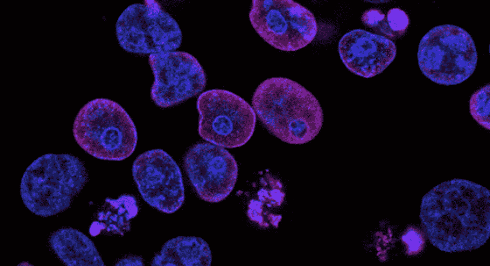
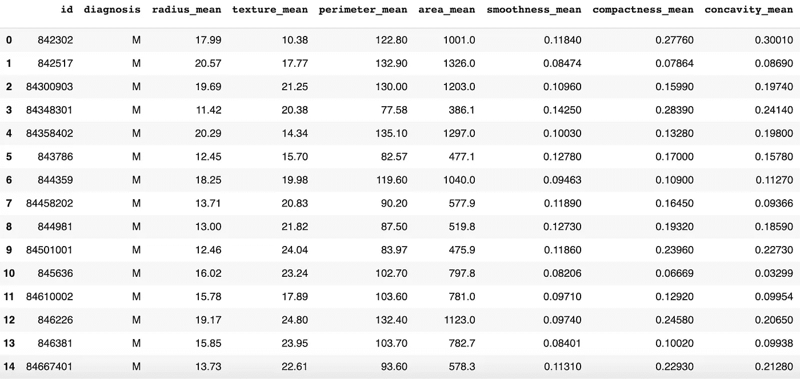
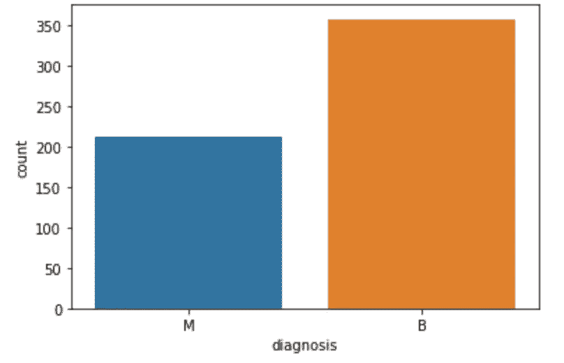
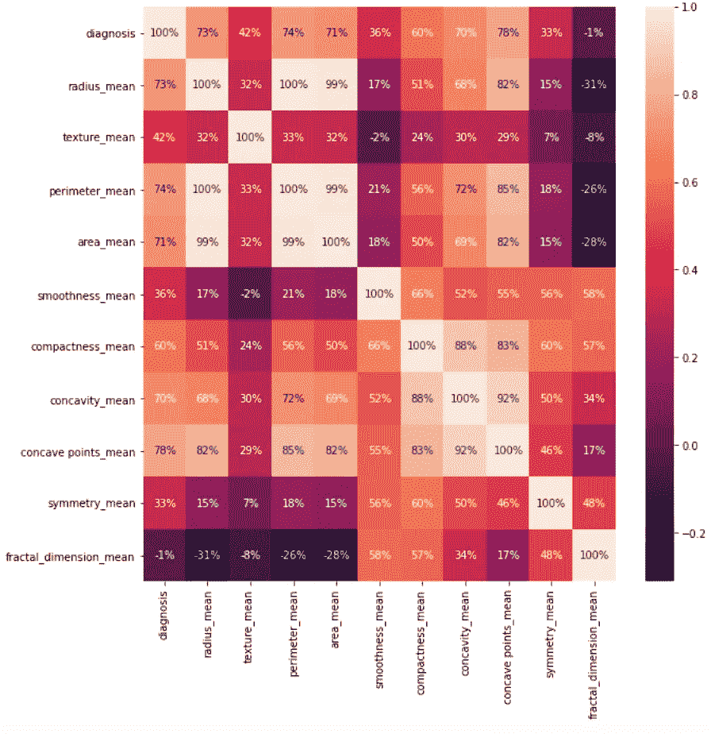
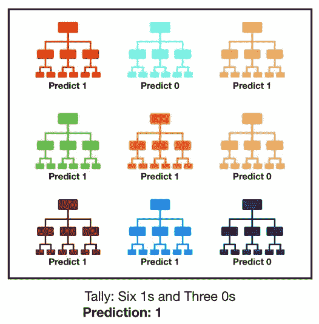
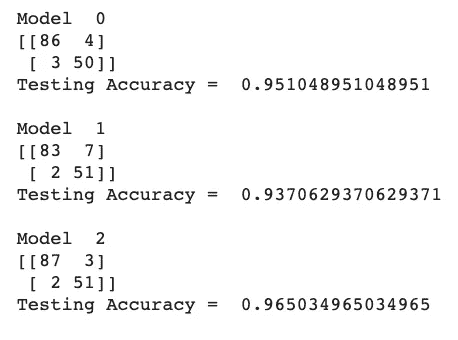
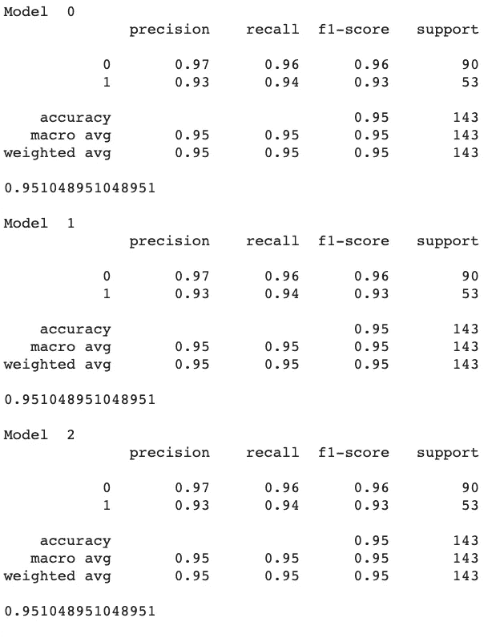

# 使用机器学习诊断乳腺癌

> 原文：<https://levelup.gitconnected.com/diagnosing-breast-cancer-using-machine-learning-d56e4b1d4364>

在本文中，我将描述我如何构建一个 ML 模型来确定乳腺癌数据中的肿瘤是恶性还是良性。



来自 https://unsplash.com/photos/L7en7Lb-Ovc[的癌细胞图像](https://unsplash.com/photos/L7en7Lb-Ovc)

在美国，八分之一的女性在她们的一生中将被诊断患有乳腺癌。

在所有被诊断的人中，**只有 87%** 被正确诊断*。乍一看，87%似乎是个不错的数字，对吗？这是站在大多数人一边的，但就医学而言，在世界上 200 万患有乳腺癌的女性中，**只有大约 174 万女性会得到正确的诊断**——剩下 60 万人没有关于她们病情的正确信息。*

*为了做出诊断，当放射科医生在乳房 x 光片上发现可疑的形成时，进行乳房活检。通过手术切除肿瘤，并在显微镜下进行研究。无数的研究论文，比如[这个](https://www.ncbi.nlm.nih.gov/pmc/articles/PMC5064832/)和[这个](https://www.ncbi.nlm.nih.gov/pmc/articles/PMC5857941/)都发现乳腺癌经常被误诊，而且诊断往往*不足*或者*过度治疗*患者。许多这些论文的主要作者，华盛顿大学的研究人员 Joan Elmore 博士描述了这个过程非常容易出错:*

> ***病理学家在大约一半的时间里正确诊断出异常的癌前细胞，这不比扔硬币好多少—** 主要作者 Joann Elmore 博士，华盛顿大学的研究人员。*

*许多患有乳腺癌的患者经常不得不求助于第二专家对其诊断的意见，以确保他们确实得到了所需的治疗。获得诊断的第二意见通常是昂贵的(T21)，这使得很大一部分人不可能去拜访另一位专家来验证他们的结果。*

*机器学习是解决这一问题的成本和时间有效的解决方案，因为它提供了:*

*   **诊断准确率高**
*   **不要求与专家相同薪酬的第二种意见**
*   **方便快捷**

*因此，ML 是一种可行的潜在解决方案，可以用于在为患者决定诊断和治疗时向医生提供第二意见，因此，消除了就诊断咨询第二专业人员的需要。这意味着更多的人将能够获得准确的治疗，而不必花费额外的时间和金钱寻找第二位专家。*

*因此，我制作了一个机器学习模型，使用定量数据来诊断乳腺癌患者是良性还是恶性肿瘤。使用监督学习和测试三种类型的模型:随机森林分类器、决策树分类器和逻辑回归分类器，我能够选择一个给出 96%准确性的模型。*

# *数据准备:*

*我使用的测量和数据来自 [Wisconsins 乳腺癌(诊断)数据集](https://www.kaggle.com/uciml/breast-cancer-wisconsin-data)。**测量描述了乳腺肿块细针抽吸(FNA)图像中细胞核的特征。***

*我使用 Numpy、Pandas、Matplotlib 和 Seaborn 库来操作数据和构建 ML 模型。*

## *理解数据:*

*下图显示了该数据的格式。第一列包含患者的 ID，用于代替姓名以保护机密性。第二列包含 M 或 B。**M 代表恶性**，这是一个用来描述能够迅速扩散到其他组织的癌性肿瘤的术语，而 **B 代表良性**，这是一种尚未癌变的肿瘤，具有更高的患者存活率。其余的列包含每个样品的定性和定量数据。*

**

*所有打印的数据巧合地只显示了恶性肿瘤的“M ”,但是，数据中也有“B”。*

*在总共 569 个患者行中，这是包含在数据集中的恶性和良性肿瘤数量的图。*

**

*显示数据集中恶性和良性肿瘤的数量。*

## *清理数据:*

*现在，我将使用下面的逻辑从我的模型*中删除不必要的数据:**

1.  *我计算了所有包含空值(NAN，NaN，na)的列。标题为“未命名”的列 32 包含该数据集中所有患者的空值。显然，它对预测肿瘤是恶性还是良性没有帮助，因此我可以删除这一列。*
2.  *包含患者 ID 的列 0 对我们的目的也没有帮助，因此从数据集中删除。*

## *查看变量相关性:*

*为了进一步研究数据，可以查看 32 个变量中的一个变量如何与另一个变量的值相关联。这将为我们提供进一步的见解，即哪些变量结合在一起导致肿瘤变得恶性，以及机器学习模型将如何做出预测。*

*使用下面的线条，我们构建一个热图来可视化变量之间的相关性。*

**

*热图图像，用于显示数据集中变量之间的相关性。*

## *拆分数据:*

*对于这个模型，我将数据分成 75%作为训练数据集，另外 25%作为测试数据集。我还将数据缩放到，以便将其测量值转换为 0-100 或 0-1 的比例，从而进行更精确的比较。*

# *机器学习模型:*

*我用下面几行代码创建了一个包含三个模型的函数，我们可以用它来确定病人的肿瘤类型。*

```
*def models(X_train, Y_train) from sklearn.linear_model import LogisticRegression log = LogisticRegression(random_state=0) log.fit(X_train, Y_train) from sklearn.tree import DecisionTreeClassifier tree = DecisionTreeClassifier(criterion = ‘entropy’,      random_state=0) tree.fit(X_train, Y_train) from sklearn.ensemble import RandomForestClassifier forest = RandomForestClassifier(n_estimators = 10, criterion = ‘entropy’, random_state = 0) forest.fit(X_train, Y_train)*
```

*所使用的每种类型的分类器对于不同类型的问题都是最佳的，因此在执行这项任务时会有不同的分类精度。我们将在文章中进一步研究每种方法的准确性。*

## *逻辑回归*

*   *用于对某一事件的概率进行建模，在这种情况下，该事件为恶性肿瘤，如转换数据中的“1”所示*
*   *通常用于基于多个属性的分类，因为输出介于 0 和 1 之间*

*这种类型的回归类似于线性回归，因为它们都涉及基于训练数据估计预测方程的参数值。然而，线性回归预测的是连续的因变量的值，而逻辑回归预测的是基于多个不同因素的结果的概率。*

## *决策树分类器*

*   *可以输出分类预测:植物是否属于某一种类*
*   *数字预测:房子的价格是多少*

*决策树包含用于将数据分成特定类别的节点和分支，它是通过递归评估特定特征对数据值的不同影响而构建的。每个节点都是不更新的，直到它能够最好地分割数据，用于分类或数值预测的目的。*

## ***随机森林分类器***

*   *由大量独立的决策树组成，因此称为“森林分类器”，它们一起工作来预测输出*
*   *每棵树都给出了它的答案预测，在这些树中最流行的答案就是模型输出*

*让多数获胜的树“投票”在输出准确预测方面是有效的，因为它确保结果已经由具有不同参数和设置的多个树预测，因此最小化了由我们的模型输出的预测中的可能性或机会和误差。*

**

*图片来自[https://towards data science . com/understanding-random-forest-58381 e 0602d 2](https://towardsdatascience.com/understanding-random-forest-58381e0602d2)*

# *测试模型:*

*现在，我将建立一个**混淆矩阵**，看看每个模型在测试数据上的表现有多准确。由于模型容易出错，矩阵将向我们展示*在测试数据的分类中有多少真阳性、假阳性、真阴性和假阴性。**

**

*每个模型的混淆矩阵。*

*模型 0 为逻辑回归模型，检验准确率为 95.1%。决策树分类器是模型 1，其准确率为 93.7%。最后，模型 2 是随机森林分类器，它在测试数据上是最准确的，给出了 96.5%的结果。*

*这是我们可以用来显示模型性能的额外指标的代码:*

```
*from sklearn.metrics import classification_reportfrom sklearn.metrics import accuracy_scorefor i in range(len(model)):print('Model ', i)print(classification_report(Y_test, model[0].predict(X_test)))print(accuracy_score(Y_test, model[0].predict(X_test)))*
```

*我们得到以下结果:*

**

*关于每个模型准确性的附加信息。*

*根据结果，**随机森林分类器在所有三个分类器中表现最好。**这意味着它在执行分类时犯的错误最少，并且是确定肿瘤是良性还是恶性时使用的最佳模型。*

## *感谢您的阅读！请务必留下掌声，并查看:*

1.  *我的网站:[linanayvelt.com](http://linanayvelt.com)*
2.  *[Colab 链接到项目！](https://colab.research.google.com/drive/1aRHPHtnDfEJA-1FjsAsKzOkErp0NWyyl)*
3.  *我的链接 https://www.linkedin.com/in/lina-nayvelt*

***参考文献:***

*坦纳大学(2015 年 3 月 18 日)。乳房组织被误诊的几率比你想象的要高。检索自[https://www . the globe and mail . com/life/health-and-fitness/health/乳腺组织-误诊率比你想象的要高/article23522980/](https://www.theglobeandmail.com/life/health-and-fitness/health/breast-tissue-misdiagnosed-more-often-than-you-think/article23522980/)*

*Uci。(2016 年 9 月 25 日)。乳腺癌威斯康星州(诊断)数据集。从 https://www.kaggle.com/uciml/breast-cancer-wisconsin-data[取回](https://www.kaggle.com/uciml/breast-cancer-wisconsin-data)*

*(2019 年 8 月 14 日)。了解随机森林。检索自[https://towardsdatascience . com/understanding-random-forest-58381 e 0602d 2？gi=855dafade1](https://towardsdatascience.com/understanding-random-forest-58381e0602d2?gi=855dafade1)*

*(未注明)。利用最大似然法检测乳腺癌。检索于 2020 年 4 月 28 日，来自[https://www.youtube.com/watch?v=NSSOyhJBmWY&feature = youtu . be](https://www.youtube.com/watch?v=NSSOyhJBmWY&feature=youtu.be)*

*Zornoza，J. (2020 年 2 月 8 日)。逻辑回归解释。检索自[https://towards data science . com/logistic-regression-explained-9ee 73 cede 081](https://towardsdatascience.com/logistic-regression-explained-9ee73cede081)*

*Zornoza，J. (2020 年 3 月 8 日)。决策树解释道。检索自[https://towards data science . com/decision-trees-explained-3ec 41632 CEB 6](https://towardsdatascience.com/decision-trees-explained-3ec41632ceb6)*