# C#中的字典

> 原文：<https://levelup.gitconnected.com/dictionaries-in-c-2c0ca6b05f70>

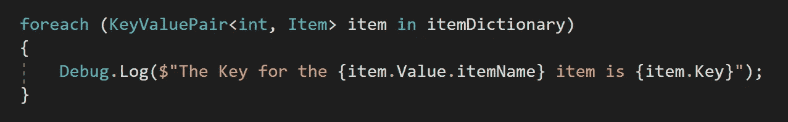

与列表相比，字典是独一无二的，因为它们使用所谓的*键值对*来引用字典中的元素。列表在查找元素时需要遍历列表中的所有内容，而字典可以使用*键*快速返回字典中所需的*值*。让我们分解一下，看一些例子。

**声明词典**

首先，让我们看看如何将*声明为*字典。我现在将在一个*物品数据库*类中工作。

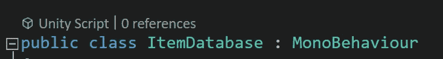

上面的例子展示了我们如何声明和初始化一个列表。下面的例子展示了如何*声明*和*初始化*一个*字典*。这里的 *int* 代表 *Key* ，它总是第一个被声明。*键*将用于从字典中快速返回一个*值*。这里的*项*类是*值，*总是第二个被声明的。*键*将总是与*值*相关联，这就是术语*键值对*的来源。还有一点需要注意的是，一个*公共*字典将*而不是*默认显示在*检查器*中。

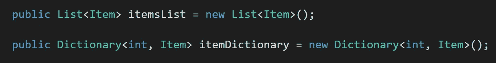

**添加到字典中**

让我们看看如何将一个*条目*添加到字典中。在顶部，*黄油刀*项目是*初始化*，然后分配一个*名称*和数字 *ID* 。列表和字典都使用*添加*功能来添加新项目。这里的主要区别在于，字典不仅要求添加*项**(值)*，还要求添加*键*。这里我给 butterknife 分配了一个*键 *50* 的*。在这个清单中我已经有了一些其他的物品，所以我也把它们添加到字典中*(剑、匕首、盾)。*这里的 *int 键*绝对可以从 0、1、2 等开始递增。，但我想表明他们不必。

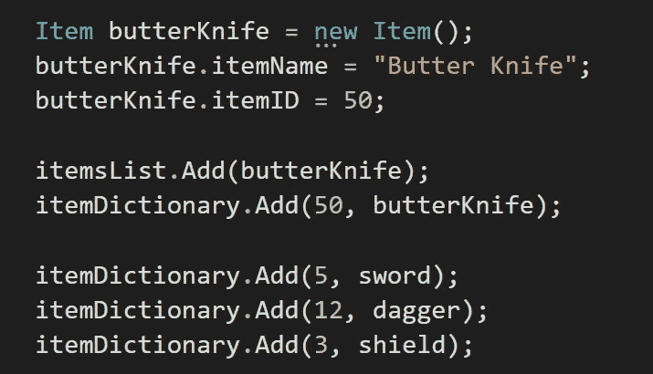

**访问字典元素**

通过使用*元素*值，字典中的元素以与列表或数组相同的方式被访问。这里我访问字典*变量*，然后传入*键*值，后面是项目的*名称*。 *(itemName 通过自定义项目类继承。)*

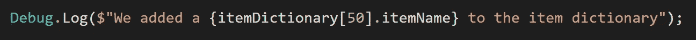

这里是*控制台*中的*调试*信息，打印出*项目字典*中*黄油刀*项目的*名称*。

**循环浏览字典**

为了遍历字典，需要遍历*键值对*，并传入字典的*键*和*值类型*。项目的*名称*是它的*值*，涉及*键值对*，所以你需要先访问项目的*值*才能访问*名称*。该信息将首先打印字典中每个*项目*的*名称*，然后打印*键*。

以下是控制台中的消息。

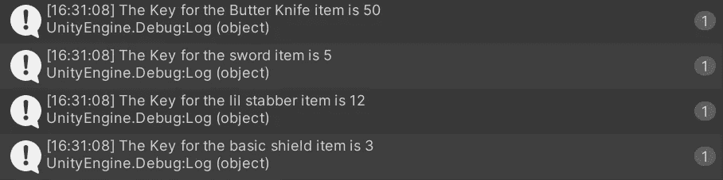

除了遍历字典之外，你可以只遍历*键*，或者只遍历*值*。因为 *int* 是*条目字典*中所有*键*的*值类型*，所以可以循环遍历 *int 值*。然而，您确实需要访问带有*点符号*的条目字典中的*键*，而不是字典本身。该消息将返回字典中的所有键。

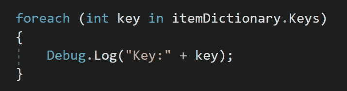

这是 foreach 循环的打印输出。

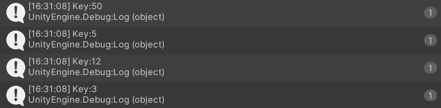

为了循环通过*值*，你需要使用与字典相同的*值类型*。在这种情况下，它是自定义的*项目*类。就像遍历键一样，您需要遍历*值*而不是主字典。

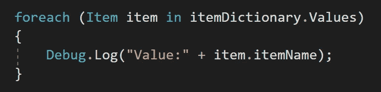

这里是*名称*的打印输出。

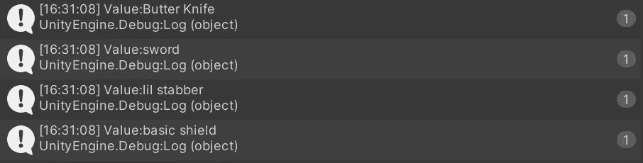

**按键规则**

密钥必须是*唯一的*，因为您不希望*重复*密钥。一个键还必须*存在*，否则会抛出一个程序中断*错误*。这里我试图给一个*键*分配一个变量，而这个键*并不存在*。 *82* 没有钥匙。

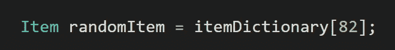

其结果是一个*键未找到异常*错误。

相反，使用一个 *if* 语句，通过*包含键*函数来检查该键是否存在。

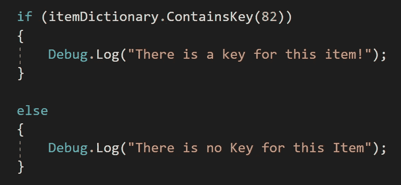

现在没有错误，只是这条消息告诉我这个键不存在。

什么时候应该使用字典？

当你有*个大列表*时，使用字典。在字典中搜索你想要的特定条目比遍历列表中的所有条目来寻找你想要的条目更快*。*库存*系统是一个完美的例子，任何你经常使用的清单*也是如此。想象一下，你有几千甚至几十万件商品在库存中。使用 foreach 循环遍历列表将会非常耗时，而且会加重 CPU 的负担。具有唯一的*键值对*的字典，使您能够快速*返回*您正在寻找的项目，而不管字典有多大。**

****播放器连接示例****

**从一个自定义的*玩家*职业开始，高于一个*游戏*职业。这里通过*构造器*添加玩家，需要通过方法*参数*传递一个*名字*和 *id* 。**

**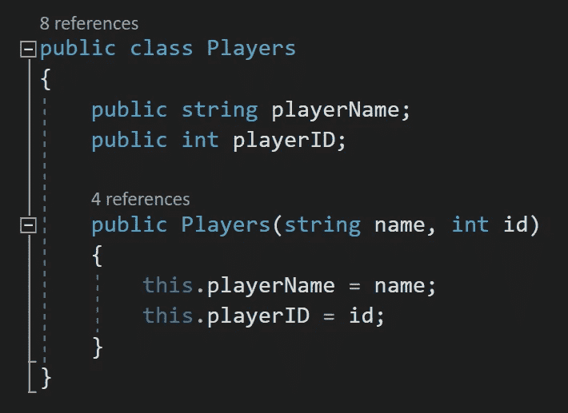**

**在游戏类的顶部，添加了 4 名玩家，他们的*名*和各自的 *id* 。一个新的*玩家字典*被声明并且*被初始化*来存储我们的玩家。 *int* 就是这里的 *key* ，会引用玩家 *id* 。*名称*是*键值对*的*值*。**

**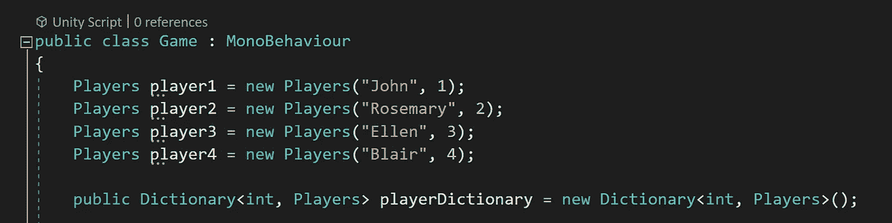**

**在 void start 中， *Add* 功能用于将玩家添加到字典中。第一个*调试*消息显示了如何访问和打印单个*玩家的*名称*，而 *foreach* 循环显示了如何打印字典中所有*玩家的*名称。***

*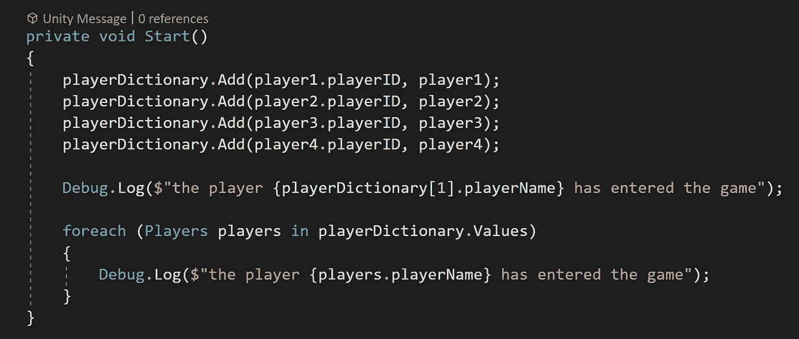*

***具有原始类型的字典***

*我们给人做个字典，用*字符串*作为*键*，用 *int* 作为*值*。*键*将是这个人的*名字*，而 *int* 将是他们的*年龄*。*

*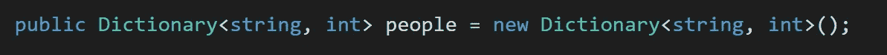*

*现在可以将人添加到列表中，将*字符串名称*作为*键*，将 *int* 值作为*值*。*

*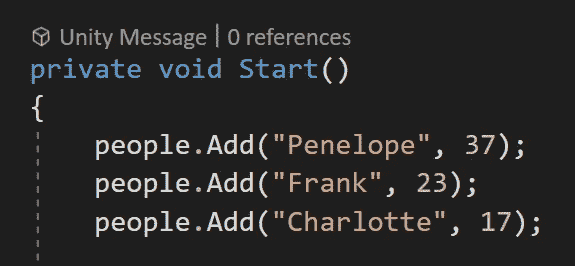*

*要打印字典中某个元素的值，我们仍然需要访问它的*键*，它现在将是一个*字符串*值。这里 Frank 的年龄被存储到一个*本地 int 值*中，然后用来将他的名字打印到控制台上。*

*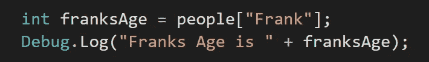***

*在这里，我*在字典中循环*并通过打印*键*打印出每个人的名字。我也可以在这里打印出年龄，因为当只打印名字时，我可以只循环通过*键*，而不是整个字典。*

*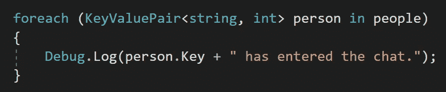**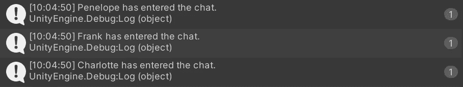*

*让我们将*键值对*分别翻转为 *int* 和 *string* 。*

*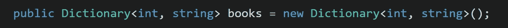*

*然后让我们*把*本书加入字典。*

*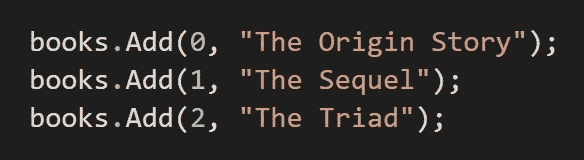*

*现在我们可以通过访问字典的*值*来打印所有的图书*名称*。我也可以在这里循环遍历*值*。*

*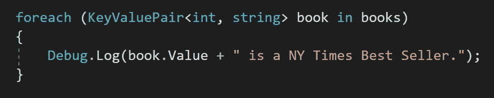**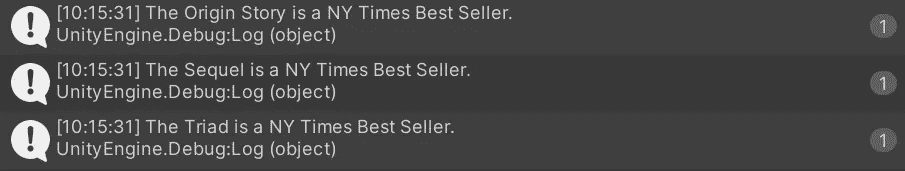*

*我希望你浏览字典，感谢阅读！*