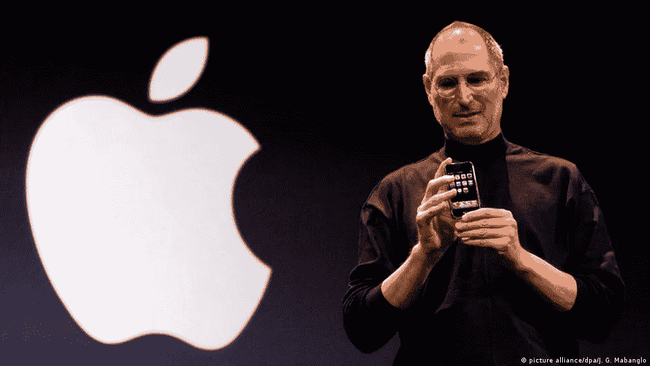
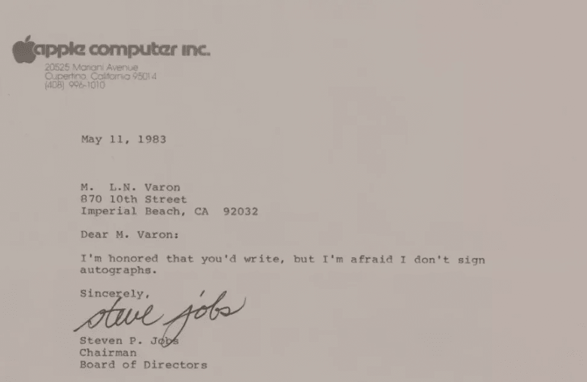

# 一个粉丝刚刚从史蒂夫·乔布斯身上发财了吗？

> 原文：<https://levelup.gitconnected.com/did-a-fan-just-get-rich-off-of-steve-jobs-679166245931>

这就是为什么我对 NFTs 深信不疑

[DW.com](https://www.dw.com/en/steve-jobs-left-us-five-years-ago-and-one-more-thing/a-35934401)

当 NFTs 第一次进入我的视野时，我的顿悟时刻是理解数字所有权和出处。

证明某样东西的起源最终会让我们赋予那件“东西”价值。

炫耀你有雷朋，而它们实际上是雷朋的区别在于你从商店得到的收据。

我可以证明我的雷朋不是被伊比沙岛的“幸运儿”买走的。但是我没有把收据印在我的额头上。

> 幸运的人卖假冒或偷来的商品，当有人从他们那里买东西时，他们就走运了。

最终，我们都将拥有数字化的东西，就像我们拥有实物一样。这是因为这项名为“区块链”的技术可以让我们证明这一点。

不出所料，当硬币掉了下来，我得到了它，这让我大吃一惊。

与用你刚买的枪在元宇宙射杀僵尸相比，数字所有权没那么神秘。

它更像是你手机上东西的延伸，非功能性文件是证明你拥有不可复制、不可复制或不可伪造的东西的永久方法。

如果你是第一次听到这个，这可能听起来很奇怪。你认为你碰不到的东西也有价值，这是对的。

作为人类，我们会做很多奇怪的事情。

一名男子 1983 年的签名在拍卖会上以 479，939 美元售出。

一些墨水和一张不到一便士的纸卖到了一个家庭住宅的价格。

真他妈的奇怪。

值得一提的是，史蒂夫·乔布斯，可以说是有史以来最杰出的企业家，也是出了名的狡猾的签名者，是这封信的签名人。

[信用 RR 拍卖](https://www.newsweek.com/steve-jobs-letter-saying-he-doesnt-sign-autographs-sells-almost-500k-1621951)

引人入胜的故事和信件背后的人的出处是推动价值的因素。两者都是你无法触及的附加值。

有点讽刺。

史蒂夫·乔布斯通常会拒绝大多数签名请求，无论是亲自签名还是通过邮件签名。他很少满足索要签名者的要求。

在我看来。有点麻烦。

读了他在苹果的故事，很明显他对人很刻薄。我很可能会在我的 iPhone 上编辑他创建的这个博客，所以我愿意让这个博客就此打住。

非功能性测试之所以有价值，是因为这项技术着重证明了某样东西的来源。

随着我们进入一个更加数字化的沉浸式世界，我们将不会知道物理资产和数字资产之间的区别。

这个故事中令人着迷的部分是，有多少这种签名的信确实存在。

我们永远不会知道。永远不会。

如果 1983 年的签名发生在 2030 年史蒂夫·乔布斯职业生涯的巅峰，他很可能会以 NFT 的身份发送签名版本。

如果是这样的话，我们可以:

*   证明哪个字母是第一个，确定出处。
*   更好地理解确切的供应动态。如果有 10，000 个这样的，那就没什么价值了。
*   史蒂夫·乔布斯本可以每卖出一件签名作品，就向他最喜欢的慈善机构捐赠一笔版税。永远。
*   所有者不需要通过昂贵的拍卖行出售数字物品，省去了中间商。
*   潜在的买家不会被要求对其进行鉴定。

技术不在乎大众当下的情绪。

就像互联网在过去 20 年里一样，如果它改善了你的生活，它不会为任何人减慢速度。

> 以上都不是理财建议。我不是一个合格的财务顾问，尽管我尽了最大努力，我也无法预测未来。
> 
> **NFT 空间是有风险的。**
> 
> **专家称目前 99%的项目都将走向 0。**