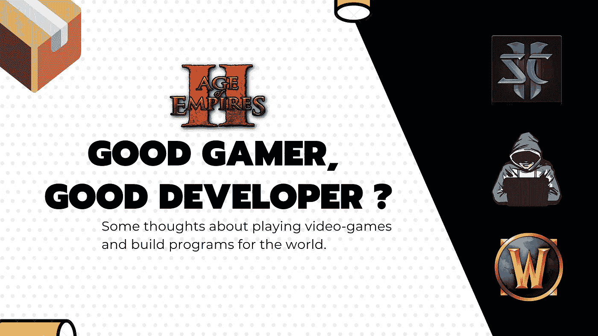
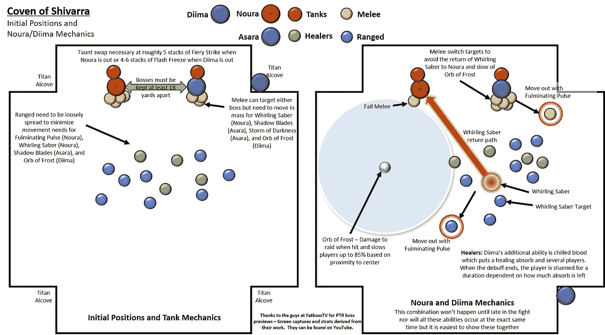
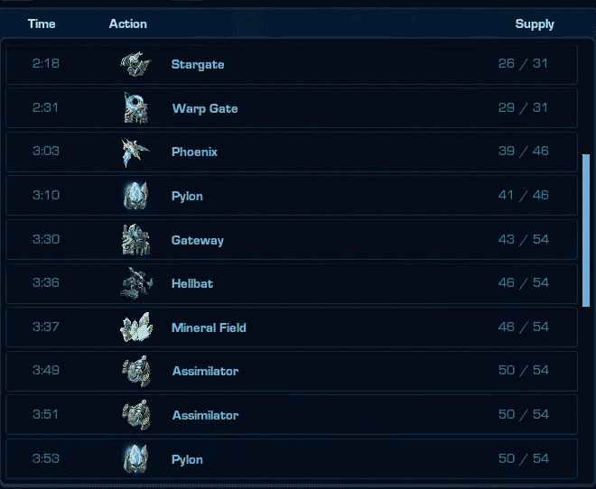

# 作为一名游戏玩家有助于我成为一名优秀的开发人员吗？

> 原文：<https://levelup.gitconnected.com/did-being-a-gamer-help-me-become-a-good-developer-7f05575eb28a>

## 生活经验

## 关于玩电子游戏和为世界构建程序的一些想法。

# 介绍

最近，在玩了 20 年游戏后，我问了自己以下问题:

> “这么多年玩电子游戏，你学到了什么？你学到了什么相关的知识？”

我玩过 MMORPG、FPS 等多种游戏，不过说实话:我最喜欢的游戏流派是**RTS***(***R***eal-****T****ime****S****trate gy)*。我在这里学到了我将要谈到的大部分东西。

## **什么是 RTS 游戏？**

对于那些不知道的人来说，大多数时候这是关于建立一个基地，一个经济，并摧毁其他试图做同样事情的玩家。

那种你需要混合宏观管理(资源聚集，基地管理，单位生产)和微观管理(战斗中的单位管理)的游戏。

你可能听说过:**帝国时代**，**魔兽**，**星际争霸**等等。

我今天在这里写给你的原因，有点是因为我大约在 15 年前开始学习英语以在**魔兽争霸 3** 上玩 **DOTA** 。这可能是我作为游戏玩家获得的第一个技能。

在此期间，我还尝试为我最喜欢的游戏:魔兽争霸 3 编程，我的第一个程序是魔兽争霸 3 地图的 mod，使用触发器，和动作。这是编程的基础。

我在那个游戏里有个“战队”(team)，给聊天频道上的战队聊天机器人写了 [**视觉基础脚本**](https://fr.wikipedia.org/wiki/VBScript) 。这样我学会了基于事件的编程。

在本文中，我将尝试展示编程和游戏之间的共同点，这些共同点帮助我成为今天的开发人员。

# 哪些技能可以让一个开发人员成为优秀的开发人员？

**✋🏻免责声明** : *这完全是自以为是，虽然我已经尽力回答了这个问题。我可能遗漏了很多东西。随意评论:)*

## **团队合作、团队游戏、管理和沟通**

作为一名开发人员，尤其是首席开发人员，你需要有很好的沟通和团队合作技能。将您的团队置于正确的方向，交换和解锁情况。

作为游戏玩家，要实现同样的目标，你需要协调和团队合作。这在一个 **MMORPG** 像**魔兽世界**中是最突出的，在那里你需要一起工作来杀死一个 boss。

魔兽世界中一个人打一个 Boss 的定位方案

通过在玩的时候做这些事情，你会自动提高这些技能，使你成为一个更好的开发者。你也可能提高你的领导能力。

如果事情失败了，如果你是负责人，**不要责怪团队，要责怪你自己**，尤其是在客户面前。因为你有责任把东西摆放整齐。

## **规划、构思(建造顺序和代码的构思)**

著名的星际争霸 2 游戏中的建造顺序

要成为一名有竞争力的游戏玩家，你需要了解你正在做的事情，并找到实现一个目标的最佳方式。通过玩 RTS 游戏，我了解到。你需要在游戏中特定的时刻，在你的对手处于最糟糕的情况下，进行**的“定时攻击”来反击。**

**为此，人们使用一种叫做**“构建顺序”**的东西，这可以比作编程中的**“设计模式”**或**“最佳实践”**。这是某种解决问题的方法，以最佳的方式。**

> **构建订单是生产、研究和资源管理的线性模式，旨在实现特定的专业化目标。它们类似于[国际象棋开局](https://en.wikipedia.org/wiki/Chess_opening)，因为玩家心中会有一个特定的游戏顺序，然而构建顺序的数量、构建顺序所围绕的策略，甚至是随后使用的构建顺序都因技能、能力和其他因素而异，例如每个玩家的攻击性或防御性。**

**玩游戏帮助我理解了事情被安排和联系起来以符合目标的必要性。**

## ****分析演绎****

**不幸的是，“最好的”计划并不是每次都有效，你必须意识到这一点，并相应地做出调整。再一次，这是视频游戏世界的一个基本概念。**

**除了游戏命令的执行速度，一个好的玩家最突出的是他或她的适应性。总的来说，**这真的很重要。****

**在 RTS 游戏中，玩家会做一些叫做**“侦察”**的事情，这是一个收集敌人行动信息的过程。利用这种智力，他们可以对情况做出适当的反应，并反击敌人的策略，这使他们成为优秀和成功的玩家。**

****在计算机科学中，也是一样的**。使用最好的工具是不够的，还需要分析需求，有时使用启发式方法找到解决方案。**

**当遇到问题时，作为开发人员，您需要收集关于崩溃或问题的信息，并尝试推断问题的原因。为此，你使用日志、统计和用户反馈等工具，这是一种“侦察”和数据收集。**

## ****权衡与比例答案****

**作为开发人员，我们需要考虑最终用户的需求，并找到实现目标的最佳工具**尊重预算、周长、质量和期限。**通过在我们的发展中做出一些选择，我们需要考虑权衡，我们需要知道能源交换是否有利可图，从而做出好的或坏的决定。**

**正如游戏玩家知道何时何地进行战斗或后退一样，开发人员也知道在某些开发上花时间是值得的**

**还有，不值得用火箭筒打死一只苍蝇。**

# **游戏和软件开发之间有很多共同的技能**

**我很高兴成为一名游戏玩家和程序员，它给了我一些好的概念和心态，这对我的职业生涯很有帮助。虽然你完全可以不玩任何视频游戏而成为一名优秀的开发人员，但是如果你的孩子在童年时玩一会儿，也不要害怕:)**

**在现实生活中玩电子游戏有很多有用的东西需要学习，你可能会对 commons 的观点感到惊讶。**