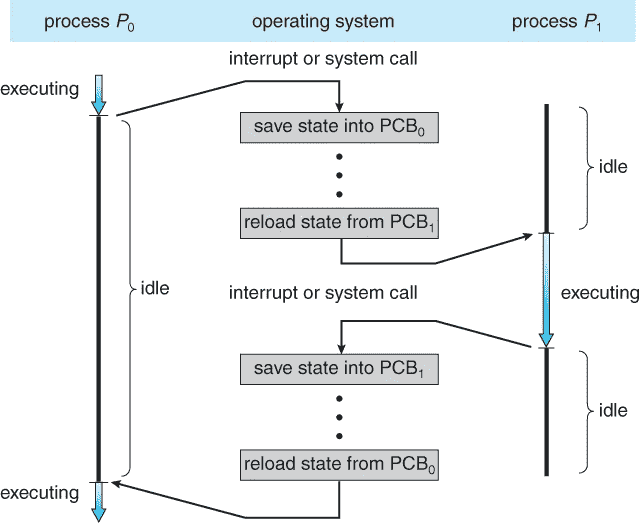

# 进程和线程的区别

> 原文：<https://levelup.gitconnected.com/difference-between-process-and-thread-479986d15bb6>

## 在这篇文章中，让我们回顾一个非常流行的面试问题:线程和过程之间的区别是什么，以及背后的原因。

蒂姆·莫斯霍尔德在 [Unsplash](https://unsplash.com?utm_source=medium&utm_medium=referral) 上的照片

# 什么是程序、进程和线程？

为了更好地理解，首先让我们看看这些是什么。

## 程序

程序是计算机可以执行或解释的一系列指令。人类可读形式的计算机程序称为源代码。通常，源代码需要使用其语言的编译器翻译成机器指令。生成的文件称为可执行文件。

或者，源代码可以在语言的解释器中执行。Java 编译成中间形式，然后由 Java 解释器执行。

Google Chrome 可执行文件(。exe)文件。

## 过程

虽然程序是通常存储在**磁盘**上的文件中的指令的被动集合，但是进程是那些指令从磁盘加载到**内存**后的执行。进程是一个计算机程序的实例，一个正在执行的程序。每个进程由一个单独的线程启动，通常称为主线程，但是可以从它的任何线程创建额外的线程。

几个进程可能与同一个程序相关联，一个进程可以创建另一个进程(子进程)。

谷歌 Chrome 的流程。

## 线

线程是进程中最小的执行单位。一个进程中可以有多个线程。

程序 vs .进程 vs .线程(图片由 [Hooman Mallahzadeh](https://commons.wikimedia.org/wiki/User:Hooman_Mallahzadeh) 提供)

让我们快速回顾一下。

**程序**是一个包含一组指令的可执行文件，被动存储在磁盘上。

一个**进程**是那些指令从磁盘载入内存后的执行。它是一个计算机程序的实例，一个正在执行的程序。一个程序可以有多个进程。例如，谷歌 Chrome 浏览器为你使用的每个标签或额外扩展创建了一个完全独立的进程。

一个**线程**是一个进程中最小的执行单元。一个进程可以有多个线程。

# 线程和进程的区别

## 定义

我们已经在上面的“什么”一节中讨论过了。

## 创建/终止时间

进程比线程花费更多的时间来创建/终止。
创建一个过程需要分配一个过程控制块(PCB)。PCB 是操作系统用来存储有关进程的所有信息的数据结构。它包括内存映射、打开文件列表……分配和管理内存意味着操作系统将从进程内存中的虚拟内存映射到物理地址，这是最耗时的部分。因此，创建或销毁一个进程是相对昂贵的，因为必须获取或释放资源。

过程控制模块(PCB)可能因系统而异。

创建一个线程不需要这种内存初始化，它需要分配一个小的数据结构来保存一个寄存器集和堆栈。线程使用其进程的相同内存地址空间，因此创建和销毁成本相对较低。

进程中的单线程。

**跟进问题:**
*有没有进程创建时间和线程创建时间相同的情况？*

Unix 有一个`fork`系统调用从正在运行的进程中克隆一个子进程。有一种优化的克隆方法，这样就不会将父内存复制到子内存中，即写入时复制。当执行`fork`时，父和子共享的页面被标记为只读。

如果在只读页上执行写操作，那么它将被复制，因为两个进程之间的内存不再相同。因此，如果只执行读操作，则根本不会复制页面。

有了`fork`和写时复制，创建一个*子进程*的开销更少，并且它的创建时间几乎与线程创建时间相同。注意，这是在 Unix 上，当我们创建一个*子进程*时，如果我们创建一个新进程，在 Unix 上我们仍然有原来的开销。

**为您跟进问题# 2:**
*在 Windows 上创建一个进程真的比在 Linux 上更昂贵吗？*

## 通信和数据共享

线程和进程的下一个区别是通信和数据共享。

流程是一个独立的执行实体，不共享数据和信息。进程使用 IPC(进程间通信)机制进行通信，这大大增加了系统调用的数量。

属于同一个进程的线程可以通过它们已经共享的数据、代码和文件进行通信(参考上图)，很少或者没有系统调用。线程间通信对于线程来说更快。

但是，由于线程共享相同的地址空间，线程执行的非法操作可能会导致整个进程崩溃。因此，一个行为不当的线程可能会中断所有其他线程的处理。所以现在我们可以理解为什么谷歌 Chrome 浏览器对每个标签页使用单独的进程，而不是线程。如果我们为每个标签使用一个线程，当一个坏的站点欺骗浏览器分配无限的内存或者更糟时，整个浏览器和所有标签都会崩溃。

## 上下文开关程序

进程需要更多的时间进行上下文切换，而线程则需要更少的时间。

当进程被换出内存并在以后恢复时，它们的状态也必须被存储和恢复(见下图)。

同一进程中线程之间的上下文切换非常高效，因为它根本不需要与操作系统进行任何交互。

显示 CPU 从一个进程切换到另一个进程的图表。

让我们回顾一下线程和流程之间的区别:

*   进程意味着一个程序正在执行，线程是进程中最小的执行单位。
*   进程通常是独立的，而线程是进程的子集。
*   进程比线程花费更多的时间来创建和终止。
*   与需要消息传递或共享内存机制来执行进程间通信(IPC)的进程不同，线程可以通过它们已经共享的数据、代码和文件进行通信。
*   每个进程都有自己的内存空间。属于同一个进程的线程共享相同的内存。
*   同一进程中线程之间的上下文切换通常比进程之间的上下文切换更快。

# Goroutine vs. Thread？

*Go 编程语言支持 Goroutine。goroutine 和 thread 有什么区别？*

线程有一个很大的堆栈大小(> 1MB)，如果我们计划有数千个线程，堆栈大小的开销将消耗大量内存。

Goroutines 被称为轻量级线程，由 Go Runtime Scheduler 管理，它们存在于 Go Runtime 的虚拟空间中，而不是操作系统中。为了使堆栈更小，Go 的运行时使用可调整大小的有界堆栈，最初只需要 2KB/goroutine。多个 goroutines 可以在一个线程中运行。

与线程相比，创建一个 Goroutine 的成本很小。一个 Go 应用程序同时运行数千个 Goroutines 是很常见的。

**给你跟进问题:** *有些编程语言支持协程。协同例程、goroutine 和线程有什么区别？*

# 结论

在本文中，我们一起回顾了计算中一个非常基本的术语，即进程和线程。我们已经了解了这些是什么，流程和线程之间有什么区别以及为什么有区别。然后我们更进一步，谈到了 go 编程语言的 Goroutine。

在下一篇文章中，我们将探讨并发性和并行性之间的区别，什么是多线程及其优缺点，敬请关注！:D

# 参考

*   [线程(计算)](https://en.wikipedia.org/wiki/Thread_(computing))(en.wikipedia.org)
*   【cs.uic.edu】线程
*   [进程 vs 线程:有什么区别？](https://www.guru99.com/difference-between-process-and-thread.html)(guru99.com)
*   [进程 vs 线程](https://blog.bytebytego.com/p/interview-question-design-twitter)(blog.bytebytego.com)

*感谢阅读本文！如果您有任何问题或反馈，请留下您的评论。如果你觉得这篇文章有帮助，请按住鼓掌按钮，让其他人也能发现。请务必在下面注册我的时事通讯，或者在 Medium 上关注我，以获得更多类似的文章。* ☝️👏 🤗