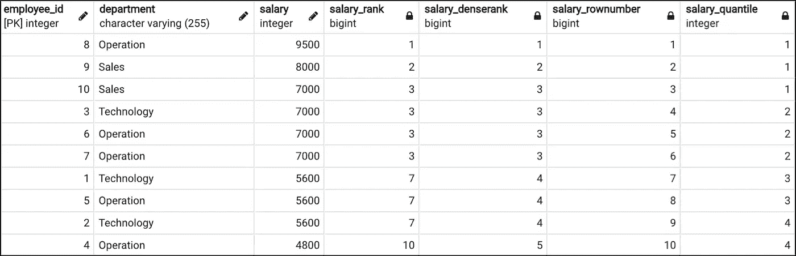
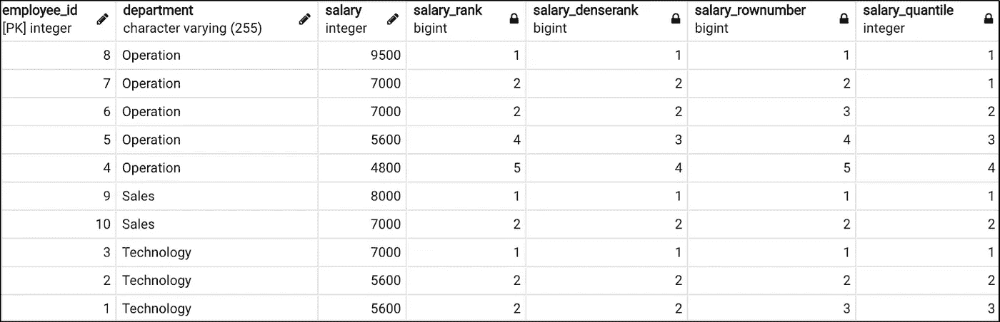

# SQL 中不同的排名函数

> 原文：<https://levelup.gitconnected.com/difference-between-ranking-functions-in-sql-71d00a5fe11c>

## 等级，密集等级，行数，整数


来源:via [Pxhere](https://pxhere.com/en/photo/997112) (CC0)

排名函数用于根据每行数据相对于所分配的部分或整个数据表的位置对每行数据进行排名。SQL 支持如下所示的 4 种不同类型的排名函数，所有排名函数输出都是从 1 开始的正整数:

**排名:**最常用的排名功能。它根据用户指定的列和顺序为每行数据分配一个排名号。如果列中的多个值相同，它们将收到相同的等级输出，并且顺序中的下一个值将跳过接下来的几个值来填充列中的真实等级。例如，如果两个值相同，并且在组中排名为 3，则顺序中的下一个值将被赋值为 5。

**密集等级:**密集等级的想法和之前的等级一样。唯一的区别是，即使前几个值相同，顺序中的下一个值也不会跳过。例如，如果两个值相同，并且它们的等级为 3，则顺序中的下一个值将被赋值为 4。

**Row_Number:** 从 1 开始到指定组中每一行的顺序号

**Ntile:** 用户需要指定 N，即他们想要划分数据组的组数。数据将被平均分割，并根据其所属的数值范围分配输出编号。

所有 4 个不同排名函数的语法非常相似:

> *<秩函数>(*分区按<列名> *排序按<列名> )*

<rank function="">这里指的是如上图所示的 4 个不同的秩函数。“Over”后面的括号定义了您想要对其进行排序的方式。括号中的“Order by”子句是**必需的**，它定义了您想要对数据进行排序的列。您可以在<列名>后加上 ASC 或 DESC，表示升序或降序(默认为降序)。“Partition by”子句是**可选的**，它定义了您想要对数据进行排序的子类别。例如，您希望根据员工各自的部门对其工资进行排名，因此您应该按部门进行分区。Order by 和 Partition by 也可以在其他 SQL 窗口函数中使用。</rank>

4 个排名函数之间唯一的语法差异是 Ntile 需要在<rank function="">之后的括号中指定组的数量，而其他 3 个需要将其留空。例如，Ntile(4)Over(Partition by department Order by salary)根据薪金在每个部门中创建 4 个不同的组，并为每一行分配一个从 1 到 4 的整数。</rank>

我们来看一个真实的数据例子。表“公司”包含 3 个不同部门 10 名员工的工资信息。我在关于 salary 的 select 语句中应用了所有 4 个排名函数，以显示 4 个函数之间的差异。

```
SELECT employee_id, department, salary, 
rank() over (order by salary desc) as salary_rank,
dense_rank() over (order by salary desc) as salary_denseRank, 
row_number() over (order by salary desc) as salary_rowNumber, 
ntile(4) over(order by salary desc) as salary_quantile
FROM company;
```



按查询结果排序函数

对于 Rank 和 Dense_Rank 函数，如果多个值相同，它们会给**相同的排名号。它们之间唯一的区别是**秩函数将跳过相同值的空格，而 dense_rank 将只是+1** ，不会跳过空格。例如，我们可以看到有 4 名员工的薪金为 7000，排名为 3，因此下一个薪金人员将跳到排名 7，而 dense_rank 将跳到 4。Rank 函数输出表示将 row 视为一个实体的公司中的真实薪金位置，而 dense_rank 表示将每个唯一值视为一个实体的薪金值的等级。**

Row_number 函数不会考虑相同值的情况，只会给出该行在整个表中位置的真实表示。Ntile 函数在这里，我将 N 指定为 4，这样我们就可以看到每个雇员的工资处于哪个分位数之下。

> 如果我们希望看到他们在自己部门内的薪资排名，该怎么办？
> 
> *对于每个等级列，我们只需要在上方括号中添加“按部门划分”。*

```
SELECT employee_id, department, salary, 
rank() over (partition by department order by salary desc) as salary_rank,
dense_rank() over (partition by department order by salary desc) as salary_denseRank, 
row_number() over (partition by department order by salary desc) as salary_rowNumber, 
ntile(4) over(partition by department order by salary desc) as salary_quantile
FROM company;
```



按部门排序功能查询结果分区

现在，所有 4 个排名输出都基于他们部门内的排名，而不是整个数据表