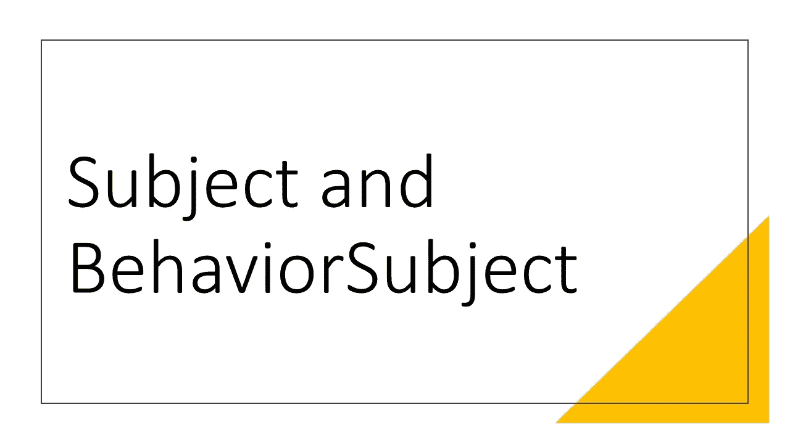
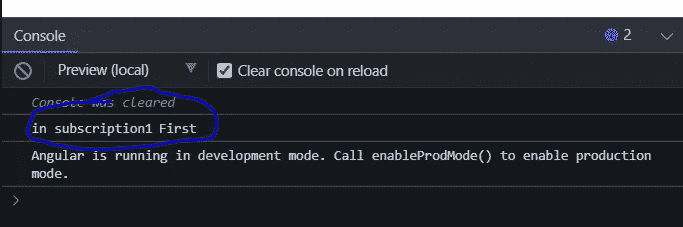
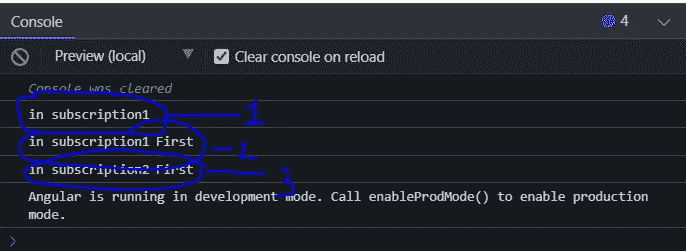

# 主体和行为主体的区别

> 原文：<https://levelup.gitconnected.com/difference-between-subject-and-behaviorsubject-6283dde86b2>

## 许多人在面试中被问及主体和行为主体时，无法解释二者之间的区别。

主体和行为主体的区别

对于角度发展来说，主体和行为主体之间的区别是面试官最喜欢问的另一个问题，我们经常无法回答主要的区别。

我们说它们是相同的，除了行为主体可以发出一些初始值，而主体不能。我们以为我们完成了，但事实上我们通过面试的机会变得渺茫了。那么让我们来揭开谜底吧！

## 什么是主体？

> 它的特殊类型的对象表现为观察者和可观察对象，后期订阅者不会收到发出的值。

## 什么是行为主体？

> 其特殊类型的主题发出初始值，其中早期和晚期订户将接收最后发出的值。

现在区别很明显了。让我们看一看。

主体和行为主体的区别

*   创造了一个主题。
*   暴露了一个来自主体的可观察对象。
*   subscription1 是早期订户，因为 subject 在它之后发出值。
*   subscription2 是晚期订户，因为 subject 在它之前发出值。

让我们看看输出。

主体和行为主体的区别

## 学问

在主题的情况下，早期订户收到值，而晚期订户没有收到值。

现在让我们将 Subject 改为 BehaviorSubject，初始值为空白 emit。

主体和行为主体的区别

主体和行为主体的区别

我们可以看到三个控制台输出。我们来了解一下是怎么回事。

*   BehaviorSubject 发出的值为空。
*   第一个(早期)订阅接收到的持续值由主题作为空白发出并输出到控制台。
*   主题将下一个值作为“第一个”发出，我们引入了后期订阅者 subscriptrion2
*   早期和晚期订阅者都接收 subject 发出的值，并将其输出到控制台。

## 学问

> 在 BehaviorSubject 的情况下，它是通过提供一个初始值来创建的，所有的订阅者(早的或晚的)都将收到最后发出的值。

我希望这很清楚。

我在 Udemy 上创建了一个 Angular 课程，涵盖了 Angular 中的许多实际问题和解决方案，包括这个。这可能是你职业生涯的垫脚石。 [***请看一看。***](https://www.udemy.com/course/angular-practicals/?couponCode=F48E50E6ECF6D99AD500)

角实践

也可以观看/订阅我的免费 [**YouTube 频道**](https://www.youtube.com/channel/UC30-Z9Lz8DWe_Vq93dOs-Gw) **。**

请订阅/关注/喜欢/鼓掌。