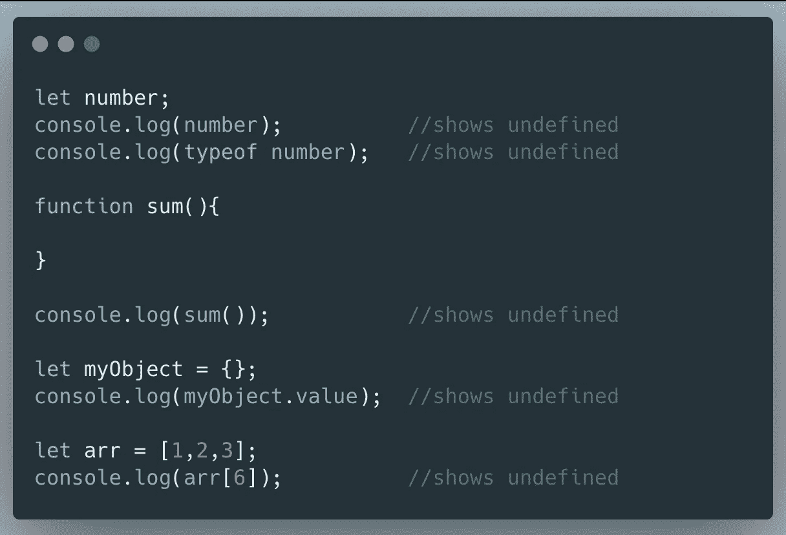
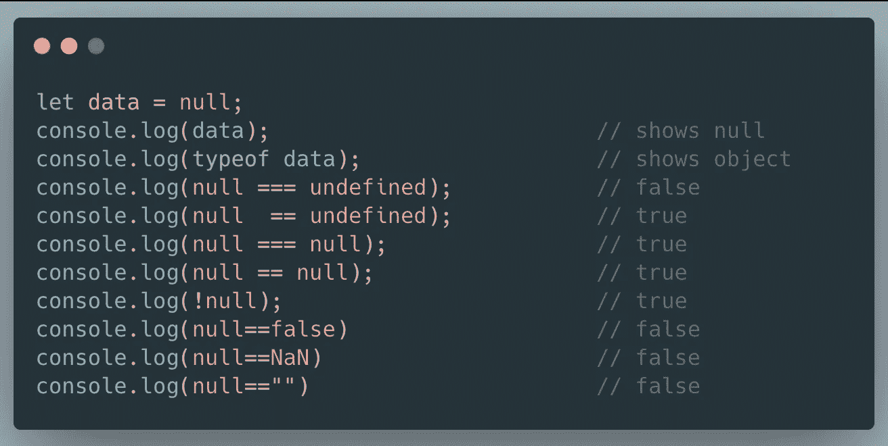
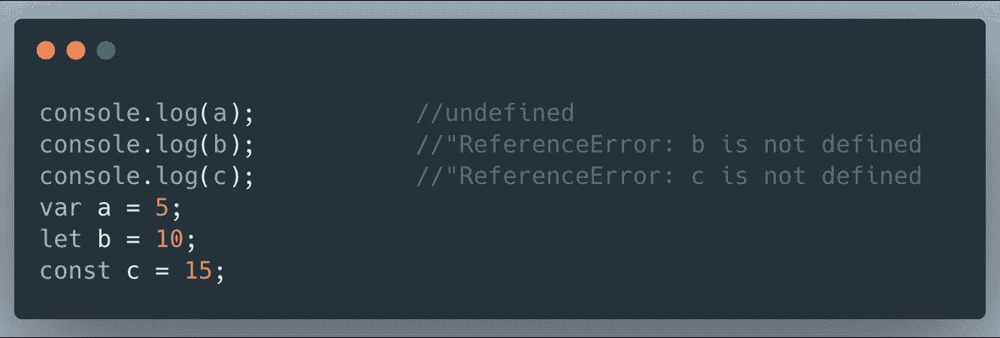

# JavaScript 中未定义、未定义和空之间的区别

> 原文：<https://levelup.gitconnected.com/difference-between-undefined-and-not-defined-and-null-in-javascript-adfe38b3d2d>

[张家瑜](https://unsplash.com/@danielkcheung?utm_source=unsplash&utm_medium=referral&utm_content=creditCopyText)在 [Unsplash](https://unsplash.com/?utm_source=unsplash&utm_medium=referral&utm_content=creditCopyText) 上的照片

JavaScript 有两种类型的值， **null** 和 **undefined** ，表示空变量。两者都是原始数据类型，并且都是假值。这也是 JavaScript 面试中经常被问到的问题。

本文将探讨 JavaScript 中`null`和`undefined`的异同。

## 不明确的

`undefined`是 JavaScript 在运行时创建的一个全局变量。JavaScript 将`undefined`赋给任何已声明但未初始化或定义的变量。换句话说，在没有明确给变量赋值的情况下，JavaScript 称之为`undefined`。

让我们看一些我们得到值`undefined`的场景。

## 空

它是 JavaScript 的原始值之一，在布尔运算中被视为 falsy。`null`为空或不存在的值，必须分配`null`。当我们想要*显式声明*一个变量为空时，我们使用`null`。

不幸的是，`typeof`在调用`null`值时返回`object`，因为[JavaScript](https://alexanderell.is/posts/typeof-null/)中的一个历史错误可能永远无法修复。

## 未定义

未定义的是在给定的时间点没有用声明关键字如`var`、`let`或`const`声明的变量。

变量`a`被打印为上面的`undefined`值，而`b`被声明为未定义的原因是因为变量`hoisting`在 JavaScript 中的工作方式，即变量声明在代码执行之前在 JavaScript 中被处理。

`let`和`const`没有吊装，会抛出参考误差。

## 结论

值`null`是假的，但是空对象是真的，所以`typeof value === "object" && !value`是检查值不是`null`的简单方法。也可以简单的查一下`variable === null`。

我希望这篇文章能帮助你理解`undefined`、`null`和`not defined`的区别。感谢阅读。