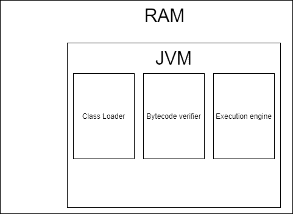
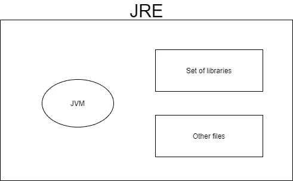
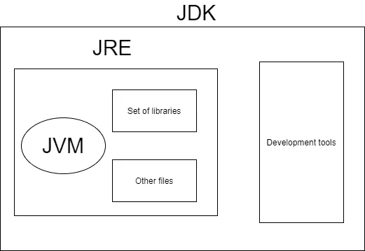
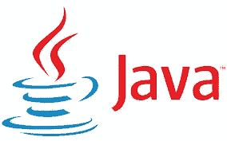

# JVM、JRE 和 JDK 之间的区别

> 原文：<https://levelup.gitconnected.com/differences-between-jvm-jre-and-jdk-25fa4ea6aff4>

布莱克·康纳利在 [Unsplash](https://unsplash.com/) 上的照片

# Java 虚拟机

这是一个为 Java 字节码提供运行时环境的抽象机器(因为它实际上并不存在)。

这将加载代码、验证并执行代码。

这也可以运行用不同语言编写的用 Java 字节码编译的其他程序。

**JVM、JRE 和 JDK 都依赖于平台**，因为不同的操作系统需要不同的配置。然而，需要注意的是 **Java 是独立于平台的。**

Java 虚拟机

JIT(实时)编译器将 Java 字节码转换成机器码。

你可以在这里参考我关于 Java 虚拟机及其架构的文章来更好更详细的了解这个[。在那篇文章中，我已经深入讨论了类加载器、执行引擎以及更多的内容。](https://dandiasabeyesinghe.medium.com/java-virtual-machine-and-its-architecture-2d8de5599500)

# Java 运行时环境

JRE(Java 运行时环境)是用于开发 Java 应用程序的软件。

这用于提供运行时环境，是 Java 虚拟机的一个实现。

然而，与 Java 虚拟机不同，这在物理上是存在的。

Java 运行时环境

# Java 开发工具包

JDK (Java 开发工具包)是一个开发 Java 应用程序的软件开发环境。

这包含了 JRE +开发工具

这在物理上也存在。

Oracle 还发布了几种不同类型的平台。

JDK 就像开发一个 Java 应用程序所必需的完整包，因为它有自己的私有 Java 虚拟机、解释器、编译器、归档器等。

Java 开发工具包

我希望这篇文章能帮助你更好地理解 JVM、JRE 和 JDK 之间的区别，因为大多数人都对此感到困惑。如果你想获得更多关于 JVM 的知识，你也可以查看我写的另一篇关于 Java 虚拟机及其架构的文章。

请随时对以上内容提供反馈，并关注与此相关的更多文章。

