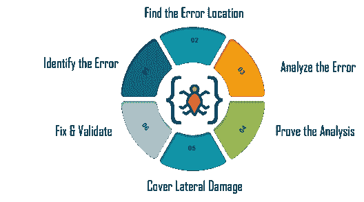
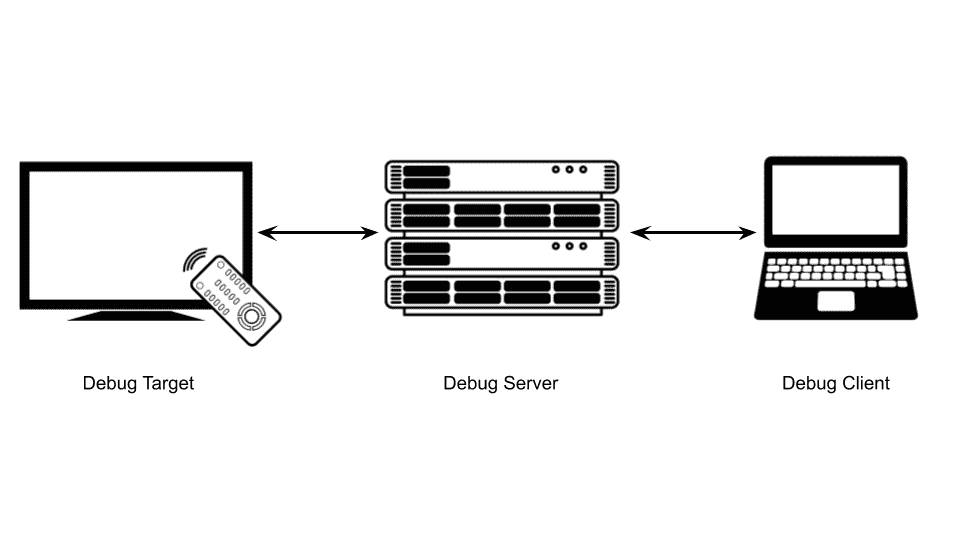

# 面向 Java 开发人员的不同 Java 调试方法

> 原文：<https://levelup.gitconnected.com/different-java-debugging-methods-for-java-developers-ed5a6bd1af86>

## 五种简单而有效的调试方法

Nubelson Fernandes 在 [Unsplash](https://unsplash.com?utm_source=medium&utm_medium=referral) 上的照片

调试是软件工程中的一个广泛话题；无论我们使用什么技术来开发软件，我们都需要了解调试。一些调试技术是通用的，可以在任何地方应用，但是也有专门的调试技术来支持特定的技术。本文将讲述一些 **Java 调试方法**，作为 Java 开发人员，为了构建优秀的系统，我们应该了解这些方法。

# 如何进行调试？

调试不是特定的任务；它由一系列任务组成。所有的 bug 都来自一个基本命题:有些东西曾经是正确的，但现在它不能完美地工作。开发人员应该遵循有助于缩小搜索范围和调试问题的流程。没有它，解决 bug 似乎是一个难题。

调试过程可以分为四个主要步骤:定位、分类、理解，最后修复 bug。本地化意味着识别代码中的错误。某个特定的服务或功能可能会导致 bug 的产生。

使用版本控制管理系统是从提交中识别或缩小 bug 的另一个好方法；git-平分是实现这一点的有用工具。在此之后，我们必须对 bug 进行分类，即，它是一个语法、语义错误，它依赖于一些外部值，还是与构建错误有关？

# 不同的调试方法

当谈到调试时，我们使用的工具和技术是必不可少的，并且可以决定修复代码中的问题有多容易。下面说几个比较流行的方法。

## 1.使用断点

断点是一种有意的方法，用于在程序中为调试目的而设置的特定行处停止或暂停。调试器将一段代码放在那一行，在执行过程中，它可以调用调试器或在 CPU 级别创建一个中断，该中断传递给调试器的异常处理程序。

在 Java 中，我们可以使用条件断点或异常断点。条件断点最适合 Eclipse IDE，因为它们可以用于通过指定的条件来删除程序中的 bug，在指定的条件下，当目标行为真时，线程将停止。异常断点可以在 Eclipse 和 Netbeans 中使用；它们也不与单个代码行相关联，因此适用于所有代码行。

不同的调试器具有不同的调试控制算法实现，这些算法可以向断点添加条件，这有助于有条件地在特定阶段停止或暂停代码。有些可以选择在再次继续执行之前操作一段数据。

## 2.打印调试

打印调试是每个开发人员在其开发生涯的某个阶段最常用的技术，在应用程序运行时将值转储到应用程序控制台或用户界面。这也可以用于 Java 和其他编程语言。

我们开发人员这样做是为了理解函数或服务内部的流程，有时是为了理解获取或操作的数据的形状。根据我们*假设*bug 所在的位置，将打印语句添加到代码中——没有固定的约定。

尽管这不是一种非常可靠的调试方法，但在出现愚蠢的错误、开发人员无法理解应用程序的流程或者导致错误的代码块是可识别的情况下，这种方法非常方便。

## 3.远程调试

这是一种广泛使用的技术，当调试器和应用程序不在同一个平台/服务器上运行时，它涉及远程调试进程。远程调试有时与生产调试同时进行。

当我们用最少的资源为小型设备开发软件时，这些设备不能同时包含运行应用程序的代码和进行调试的应用程序，远程调试是首选方法。此外，当我们试图调试连接了多个组件的大型应用程序并相互通信以满足客户请求时，例如微服务，这也很有用。

众所周知，调试器需要通过基本的钩子连接到操作系统和应用程序，这样它才能触发调试过程。当我们在应用服务器中安装远程调试代码时，它本身不是一个调试器，它只是连接到运行服务器的应用程序。它还通过网络连接到远程调试器，并向远程调试器发送或接收命令。

有许多远程调试工具。一个例子是 Lightrun 他们提供了 [Lightrun Cloud](https://lightrun.com/cloud/) ，这是一个免费使用的产品调试器，具有日志记录功能和暂存环境。它运行在 IntelliJ IDE for Java 应用程序上，非常适合 Monolith、微服务、Kubernetes、Docker Swarm、ECS、大数据工作者、无服务器以及更多类似的应用程序。

另一个很好的例子是[月食](https://www.eclipse.org/ide/)。虽然 Eclipse 也是一个 IDE，但它有许多高级调试特性，这使它成为一个全面的工具。它适用于 Java、Python、Ruby、C#和 PHP。Eclipse 的一个常见用途是管理远程调试配置，它非常容易实现这一点，这使得它在 Java 开发社区中非常流行。

## 4.内存转储调试

当一个程序崩溃时，系统会创建一个内存快照和它在那个特定时间保存的数据。这被称为[内存转储](https://whatis.techtarget.com/definition/memory-dump)。因此，这很有用，因为开发人员可以很容易地找到进程崩溃的确切位置，并获取内存转储以查看在该点调用的函数的*“堆栈跟踪”*，以及可访问的局部或全局变量的值。

但这里的关键事实是，我们可以在不崩溃的情况下获得内存转储，因为有不同类型的错误，而进程从不崩溃。我们讨论的是进程的内存转储，但是我们也可以得到整个系统的内存转储，其中多个进程从不同的应用程序运行。

当一个 Java 应用程序的多个部分相互通信时，这是很有帮助的，并且您不能准确地确定是谁造成了这个 bug。但是，如果内核崩溃不同于进程或系统崩溃，有时获取内存转储会很有挑战性，因为它会在进行转储之前释放内存。

## 5.重放调试

重放调试是另一种有用的技术。这个想法来自于逆向工程，在逆向工程中，我们有一个定义良好的实际流程，从那里，我们可以追溯到问题。重放调试的第一步是记录其执行过程，其中所有事件调用、内存管理、硬盘中的数据更改、用户输入和其他连接的设备输出都被添加到快照中。

这段记录是通过执行流程，然后监视触发的不同事件而生成的。最后，当流程结束时(它可以成功完成，或者出现系统中断，或者流程可能崩溃)，它包含执行周期中的所有相关信息。

开发人员或质量保证工程师可以使用该记录来遍历流程的执行路径，或者连接到调试器并尝试确定哪里出错了。当我们试图重新生成一个 bug 时，这可能会派上用场，因为它给了我们整个过程的整体视图。

# 结论

拥有良好的调试技能对每个 Java 开发人员来说都是必要的，但这不可能一蹴而就。它需要经验，因为调试没有任何防弹技术或工具足以调试所有其他错误。因此，深入试验和调查错误的原因，并使用上面的技术，将有助于我们挖掘错误并最终解决它。