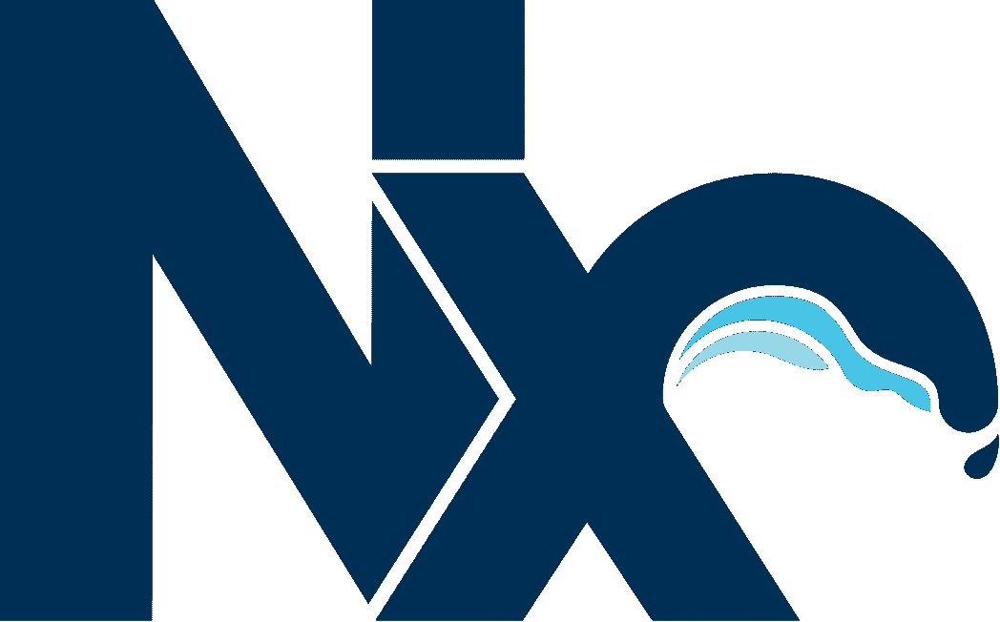

# 2021 年的 Monorepo 解决方案

> 原文：<https://levelup.gitconnected.com/different-monorepo-solutions-in-2021-1d6f5e5fb95b>

## 使用这些工具轻松管理您的 Monorepo


Monorepo 是一个单一的存储库，其中存储了属于一个项目的所有代码。例如，Monorepo 会将网站代码和移动应用程序代码放在一个地方。然而，它不同于单一的应用程序，因为模块在存储库中有清晰的边界。

而且，对于任何开始使用 Monorepos 的人来说，适当的工具是避免已知陷阱的关键。因此，让我们来看看其中的一些工具，以找到最适合您的使用情形的工具。

# 1.少量


Bit 是 Monorepos 可用的最佳工具之一。它试图通过对构建代码的方式进行一些根本性的改变来避免 Monorepos 出现的大多数挑战。其中一个变化是:

> Bit 自动将组件从项目中分离出来，包括它们的依赖关系。

你可能会想，它有什么特别的，对吧？想一想，如果你能把你的 Monorepo 安排成一个组件的集合，

*   根据您的选择分组为多个集合。
*   在这些组之间共享(具有完全管理的依赖版本)。
*   能够跟踪依赖关系，并在整个依赖关系树发生变化时自动测试它们。
*   团队可以在这些组件上并行协作，以提高生产率。
*   甚至能够共享 Monorepo 之外的组件。

这就是比特的力量。你也可以用它来构建模块化的应用，设计系统，创作和交付微前端，甚至在应用之间共享组件。

但是，如果您不熟悉 Bit，可能需要一些时间来熟悉这些概念。所以快速入门的最好方法就是尝试一下。您可以使用以下指南逐步开始。

[](https://harmony-docs.bit.dev/getting-started/installing-bit/) [## 正在安装位|位文档

### 要使用 Bit，需要全局安装。你可以首先安装 BVM，一个用于 Bit 和…

和谐-docs.bit.dev](https://harmony-docs.bit.dev/getting-started/installing-bit/) 

如果您想更深入地了解它的全部功能，请参考下面的文章。

[](https://blog.bitsrc.io/monorepo-architecture-simplified-with-bit-and-npm-b1354be62870) [## 用 Bit 简化 Monorepos

### 如何利用位+ NPM 简化 monorepo 架构，有和没有 Lerna 和朋友。

blog.bitsrc.io](https://blog.bitsrc.io/monorepo-architecture-simplified-with-bit-and-npm-b1354be62870) 

# 2.巴泽尔


谷歌是早期采用 Monorepos 的众多大公司之一。 [Bazel](https://bazel.build/) 是谷歌面向单一回购的构建系统。大多数 Monorepo 工具只支持 JavaScript，然而，Bazel 超越了这一点。

Bazel 使用标语“{快速，正确} —选择两个”来展示自己，我认为这非常准确。Bazel 的构建速度极快，只需花费很少的时间就可以处理非常大的构建。这是通过运行**分布式构建**实现的。这是 Bazel 的一个关键特征。

## 巴泽尔的一些特点

*   快速准确——就像他们的标语所说的那样！
*   高级构建语言—提供人类可读的定义语言
*   支持 JavaScript、Java、Go、C+等多种语言。(大多数构建工具都没有提供)
*   可以在并行机上运行
*   可扩展—能够大规模构建和测试，并支持大型代码库
*   确定性增量构建
*   构建是沙箱化的—提供密封(如果构建规则未声明为依赖于特定文件，它将无法打开该文件)
*   为多个平台生成输出

Bazel 利用本地和分布式缓存以及依赖关系分析，只重建由于新的更改而受到影响的构建部分。我发现这比大多数其他工具使用的机制更有效。此外，Bazel 在创建依赖关系图时，通过使用内容摘要而不是时间戳来确定过时的工件，从而继续提高效率。这实现了什么？

它有助于避免不必要的目标重建，即使分布在多个主机上，也能实现可预测的构建。由于 Bazel 使用内容摘要，它能够缓存中间构建步骤的输出，并在必要时重用它们。

Bazel 中用来定义新规则的语言叫做 [Starlark](https://docs.bazel.build/versions/1.0.0/skylark/language.html) 。它受 Python 3 语法的启发，但不包括所有 Python 特性。Bazel 可用于 macOS、Ubuntu、Fedora/CentOS 和 Windows。

## 巴泽尔是如何工作的？

1.  加载与定义的目标相关的构建文件
2.  然后，它分析输入及其依赖关系，应用指定的构建规则，并生成一个动作图
3.  最后，通过对输入执行构建操作来生成构建输出。

## 谁用巴泽尔？

像 Google，Dropbox，华为，Stripe，Braintree 等大公司。利用巴泽尔。随着公司的成长，谷歌扩大了其单一回购的规模。到 2015 年，谷歌 Monorepo 拥有 86tb 的数据和 20 亿行代码。优步使用 Bazel 构建了他们的 Go Monorepo。关于他们是如何做到的详细信息可以在[这里](https://eng.uber.com/go-monorepo-bazel/)找到。

# 3.莱尔纳


[Lerna](https://github.com/lerna/lerna) 是一个使用 Git 和 NPM 优化基于 JavaScript 的 Monorepo 中多个包之间工作流的工具。Lerna 集成了流行的框架和语言，如 TypeScript、React、Angular、Babel 等。

## Lerna 能达到什么目的？

*   有助于处理语义版本——假设您的 Monorepo 中有许多模块使用相同的包。增加这个版本将需要您在所有模块上运行相同的命令。使用 Lerna，这可以简化，因为您可以一次在所有模块上更新同一个包的版本。
*   帮助设置构建工作流
*   能够轻松推动包装
*   允许链接项目之间的依赖关系—如果项目 A 依赖于项目 B，则可以共享依赖关系并一起测试两个项目。这不会影响 Monorepo 中没有直接依赖关系的其他项目

## 使用 Lerna 命令

*   `lerna init` —创建新的 Lerna repo 或将现有的 repo 升级到 Lerna 的当前版本。这可以在固定/锁定模式或独立模式下完成。要在独立模式下启动 Lerna，必须使用标志`--independent`
*   `lerna bootstrap` —通过安装软件包的依赖项并链接交叉依赖项(如果有)，将当前 Lerna repo 中的软件包捆绑在一起。
*   `lerna publish` —创建已更新软件包的新版本。
*   `lerna changed` —检查自上次发布以来哪些软件包发生了变化
*   `lerna run <script>` —在每个包含脚本的包中运行指定的脚本
*   `lerna ls` —列出当前 Lerna repo 中的所有公共包

您可以在`lerna.json`文件中定义所有的 Lerna 配置。示例文件如下所示。

```
{
   "packages": ["packages/*"],
   "npmClientArgs": ["--no-lockfile"],
   "version": "independent",
   "command": {
      "version": {
         "ignoreChanges": ["*.md"],
         "npmClient": "npm",
         "message": "chore(release): publish"
      },
      "publish": {
         "npmClient": "npm"
      }
   }
}
```

通常，我们在应用程序中使用`yarn build`或`yarn lint`来构建或运行 lint 命令。由于 Monorepo 有多个应用程序，我们可以使用 Lerna 来代替`yarn`。在 Monorepo 中构建每个模块的示例构建脚本是`lerna run build --stream`。`--stream`标志将在终端显示构建输出。

Lerna 还有一个 GUI，它会带您完成设置 Lerna Monorepo 和相关活动所需的步骤。这被称为 [lerna 向导](https://github.com/szarouski/lerna-wizard)。根据 synk.io 趋势统计，Lerna 在很多开发者中非常受欢迎。


来源: [synk.io](https://snyk.io/advisor/npm-package/lerna)

# 4.（同 nonexpendable）非消耗品



[NX](https://nx.dev/) 为 Monorepos 提供了一套开发工具。它强调现代全栈网络技术。这是一个基于类型脚本的 Monorepo 工具。它提供了，

*   工作区
*   命令行界面
*   基于云的计算缓存
*   强大的语言级 IDE 支持

Nx 帮助建立 Monorepo 的构建管道，并提供其他工具来帮助开发过程。它提供了在模块之间共享代码的指南，使代码共享变得更加容易。

与 Bazel 类似，Nx 也分析 repo 来识别哪些模块受到某个变更的影响，并只构建、运行和测试受影响的模块。使用`affected`命令完成该识别。这是运行构建的有效方式，尤其是当您的模块中有大量共享库时。Nx 的分享代码指南相当固执己见。然而，如果大量开发人员参与开发过程，这就很方便了。虽然有些人可能不喜欢固执己见的指南，但在某些情况下，这可能是有效和有用的。

将 Nx 添加到现有的 Monorepo 非常容易。只需使用一个命令`npx add-nx-to-monorepo`就可以完成。如果你有兴趣学习这个过程，参考[这篇文章](https://blog.nrwl.io/adding-nx-to-an-existing-monorepo-by-running-one-command-426fa519d943)。

# 5.纱线工作空间


`yarn`众所周知是一个 JavaScript 依赖管理工具。它通过工作区支持 Monorepos。Workspace 也是一个包含一组构建规则的包，有自己的`package.json`。

Yarn 工作空间具有以下特征。

*   在 Monorepo 中为您的所有软件包共享`node_modules`。
*   一个单独的锁文件(例如:`yarn.lock`)适用于所有包
*   提供依赖符号链接以允许包的本地开发
*   如果您只需要更新一个包的依赖关系，您可以通过使用`-focus`标志来实现。这被称为集中依赖关系更新。
*   可以轻松地与 Lerna 集成——在这种情况下，Yarn 工作区将处理安装/符号链接，而 Lerna 将处理发布和版本控制。

> Yarn Workspaces 可以用一个命令安装和更新 Monorepo 中所有包的依赖项。

关于如何使用 Yarn 工作空间的更多信息，可以参考他们的[官方文档](https://classic.yarnpkg.com/en/docs/workspaces/)。

使用 yarn 工作区，创建新的包是非常容易的。代码变得更加模块化和优雅。我们节省了大量的磁盘空间，也加快了软件包的安装过程。

# TL；速度三角形定位法(dead reckoning)

在本文中，我们讨论了不同的 Monorepo 解决方案。我们上面探讨的解决方案可以帮助您以各种方式轻松管理 Monorepo。这些解决方案中的大多数主要有助于跨多个模块的依赖性管理，而不必经历很多麻烦。

*   Bazel —在 Monorepos 中实现快速、正确的分布式构建
*   Lerna —优化 Monorepo 中多个包之间的工作流
*   bit—mono repo 模块间可共享的组件库
*   Nx —为 Monorepos 提供开发工具
*   Yarn 工作区—通过一个命令即可跨 Monorepo 模块安装和符号链接软件包

让我们来看一下这些工具的对比。


此外，这些工具中的大多数也具有相互集成的能力。比如 Bit + Yarn 工作空间，Lerna + Yarn 工作空间等。

感谢阅读！