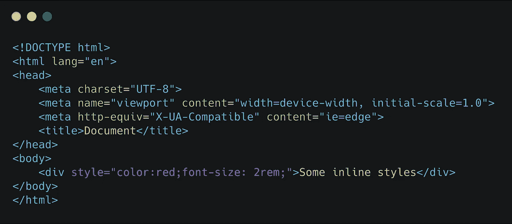
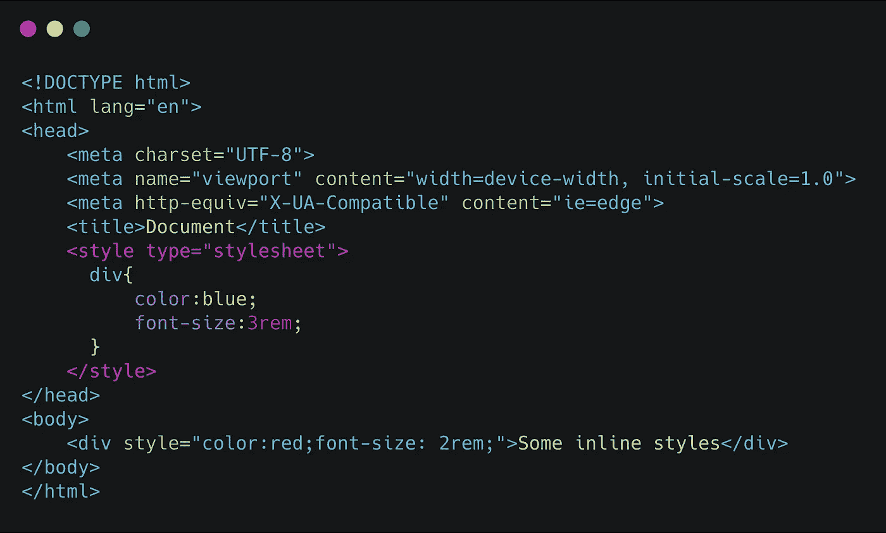
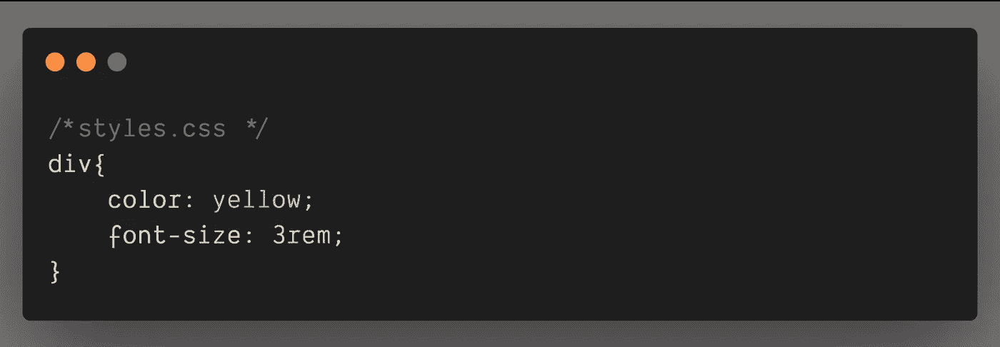
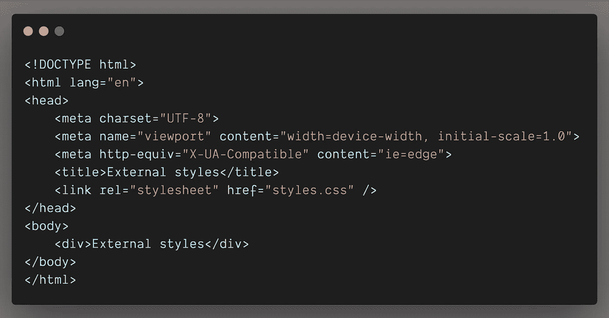

# CSS 中不同的写作风格

> 原文：<https://levelup.gitconnected.com/different-ways-of-writing-styles-in-css-2f8182eab4f5>

由 [Kobu 机构](https://unsplash.com/@kobuagency?utm_source=medium&utm_medium=referral)在 [Unsplash](https://unsplash.com?utm_source=medium&utm_medium=referral) 上拍摄的照片

在这篇文章中，我想分享编写 CSS 的不同方法，并讨论最佳实践。

级联样式表(CSS)的引入是为了定制 HTML 的样式和结构布局。

有 3 种不同的方式来编写 HTML 元素的样式。

1.  内嵌样式
2.  内部样式
3.  外部样式

## **内嵌样式**

内联样式是通过使用`style`属性写在 HTML 标签中的。每个属性由分号`;`符号分隔。

## **内部风格**

内部样式总是用不同的选择器写在同一个 HTML 页面中。内部样式在``标签之间，并且总是倾向于将`style`标签放在`head`标签中。

## **外部风格**

这是在实际项目中对 HTML 元素进行样式化的最首选和最常见的方式。这里我们需要在一个单独的 CSS 文件中编写样式，并且需要通过使用一个`<link>`将 CSS 文件包含在`head`标签中。

创建一个名为 **styles.css** 的文件，并将其包含在 HTML 文件中，如下所示:

> 这里`rel="stylesheet"`是 link 标签的强制属性，否则你的外部样式将无法工作。

外部风格是 CSS 的首选和最干净的写作方式。它有更好的关注点分离，是最容易调试的，并允许我们缓存文件以缩短加载时间。

我希望这篇文章对 CSS 初学者指南有所帮助。如果你有任何问题，不要犹豫，在下面评论。