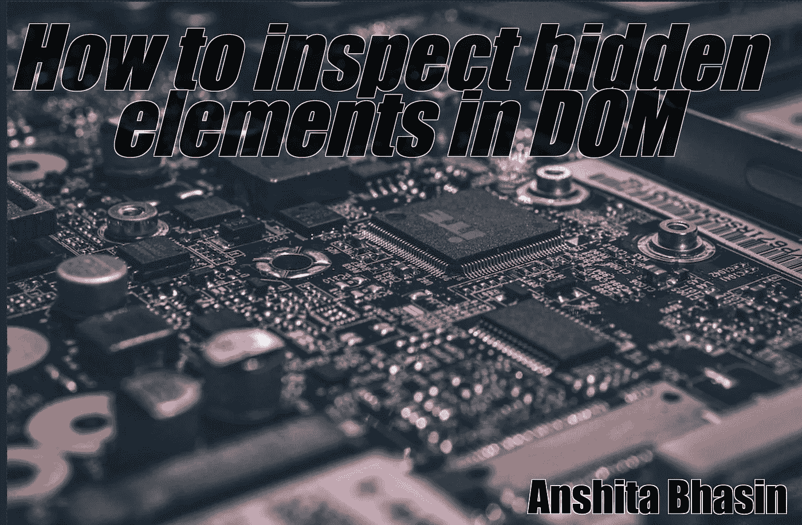
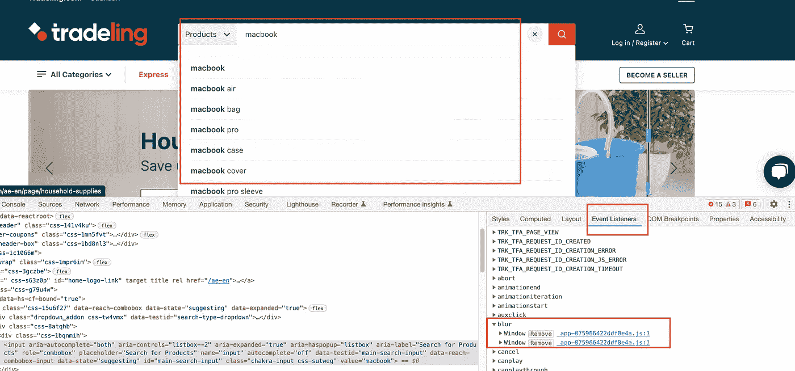
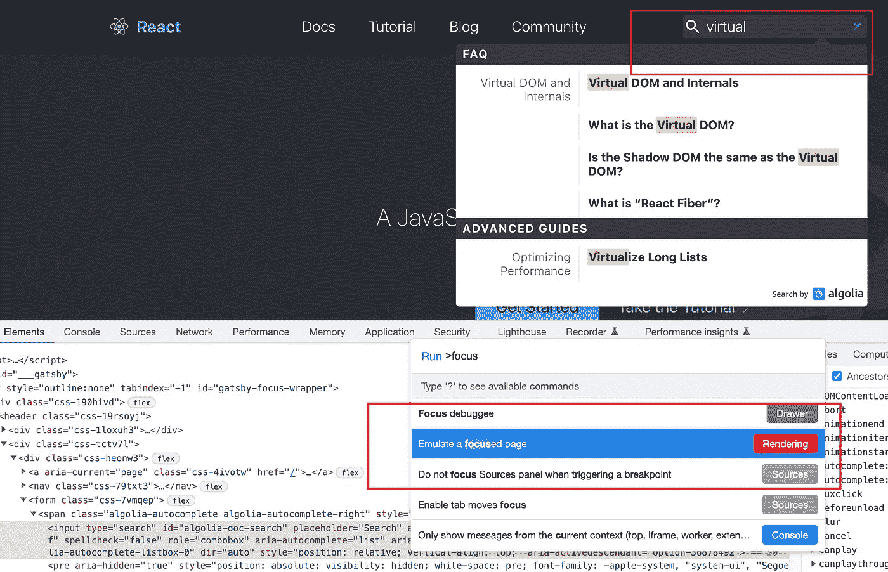
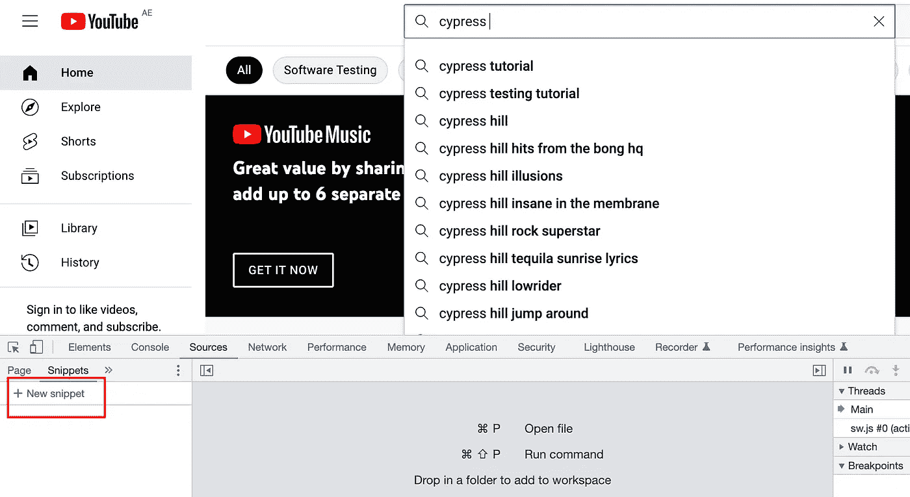
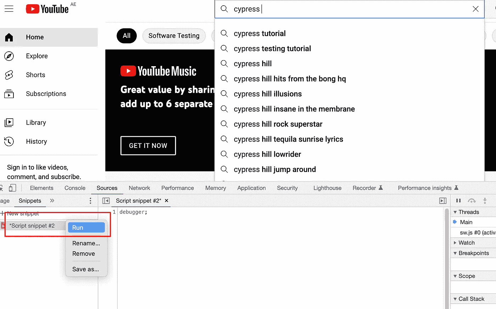
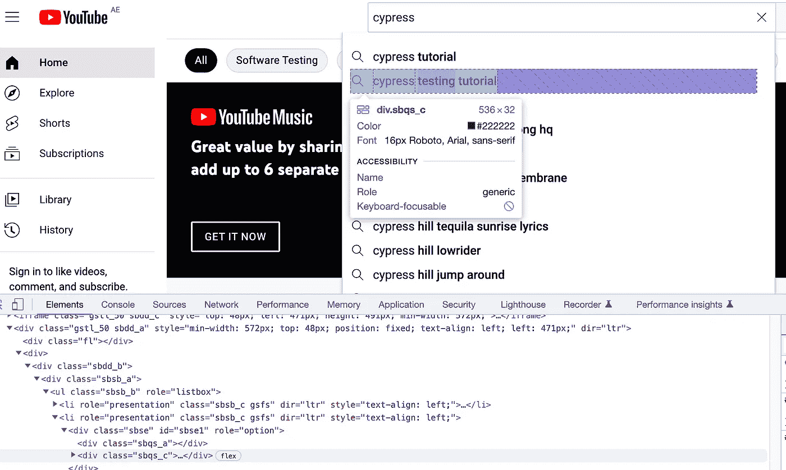
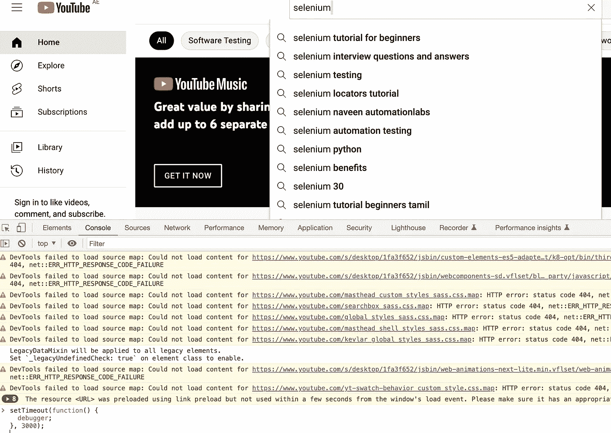
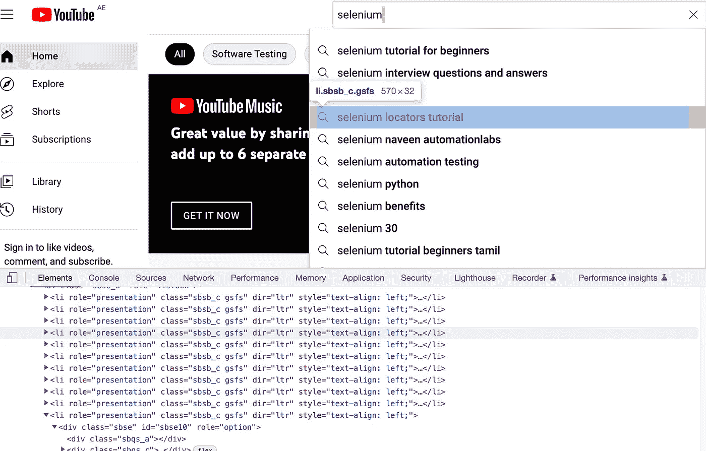
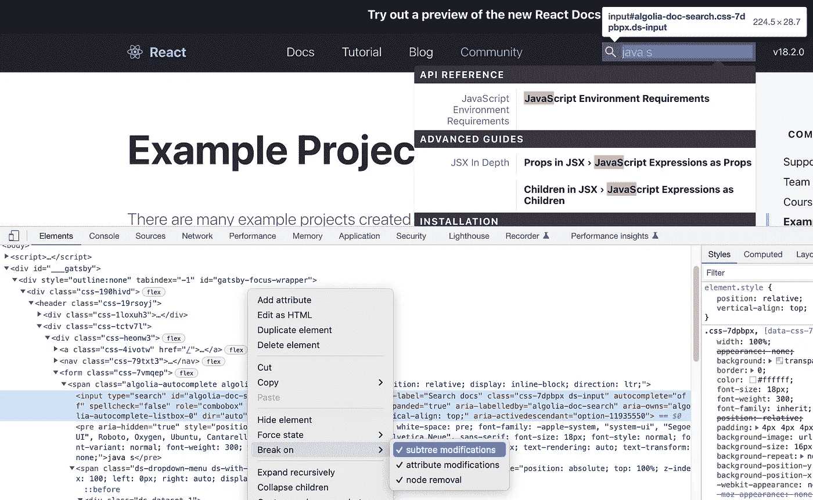

# 检查浏览器中消失元素的不同方法

> 原文：<https://levelup.gitconnected.com/different-ways-to-inspect-disappearing-elements-on-a-browser-5df42888b7cf>

有时你会遇到这样的网站，由于多种原因，你无法检查这些元素。选择该元素时，它会消失，并且您无法找到定位器。

然而，当您需要调试 JavaScript 时，Chrome Developer 允许您在 DOM 元素发生变化时暂停，甚至允许您监控其属性。

在这篇博客中，我们将看到多种检查 DOM 中消失元素的方法。

## **1。事件监听器:移除模糊属性**

a.选择 Chrome 开发工具，转到元素

b.选择事件监听器选项卡(从右侧)

c.选择**模糊**。展开模糊选项

d.点击**移除**所有可用属性。

现在，元素不会从下拉列表中消失，您将能够检查它们。

## 2.**模拟聚焦页面**

在一些应用中，我们没有模糊特性。因此，通过下面的方法，你可以检查隐藏的元素。

a.打开 chrome dev tools，点击***command+shift+p***然后输入 focus。

b.点击“**模拟聚焦页面**”。

现在，隐藏的元素不会在页面上消失，您将能够在 web 应用程序上检查这些元素。

## 3.命令:Fn+F8 或 cmd+\

您也可以使用键→ **fn+F8** (或 Ctrl+/)来暂停 DOM 元素。

它冻结 DOM，然后您可以检查页面上的元素。

## 4.**来源:片段**

这也是定位自动建议/隐藏下拉列表值的方法之一。

a.转到开发工具，并选择“**源**”选项卡。

b.选择代码片段

*提示:点击****>>****如果在屏幕上没有看到片段，可以向右移动*

c.单击新片段

d.转到脚本片段(右侧部分)并输入“调试器；”

c.现在，右键单击脚本片段并选择 Run(如下图所示)。

它还将帮助您检查页面上的元素

## 5.控制台:脚本

a.在开发人员工具中打开控制台选项卡

b.输入下面的命令，它将冻结执行并显示“在调试器中暂停”

> ***setTimeout(function(){
> 调试器；
> }，3000)；***

## **6** 。**中断于:**

可以通过修改子树来暂停 DOM 元素。

a.转到开发工具

b.转到要在其上设置断点的元素。

c.右键单击该元素

b.在 Dom 中，右键点击元素，选择 [**Break**](https://developer.chrome.com/docs/devtools/javascript/breakpoints/) **on，**，选择所有属性**(如下图所示)。**

现在，您将能够检查页面上的元素

# **结论:**

在这篇博客中，我们看到了检查 DOM 中自动建议/隐藏下拉列表值的多种方法。共有 6 种不同的方法。有时，暂停调试器不工作，但删除模糊选项的工作。我希望，它能帮助你检查 web 应用程序中消失的元素。

感谢阅读。快乐学习！— AB

Ref : [纳文自动化实验室](https://medium.com/u/63406024ff34?source=post_page-----5df42888b7cf--------------------------------)([https://youtu.be/SS3dfwygKig](https://youtu.be/SS3dfwygKig)，[https://youtu.be/zw99PZalGqA](https://youtu.be/zw99PZalGqA))

感谢 Naveen AutomationLabs 的指导和激励。

高级自动化工程师

[GitHub](https://github.com/Anshita-Bhasin) | [领英](https://www.linkedin.com/in/anshita-bhasin/) | [推特](https://twitter.com/anshita__bhasin)