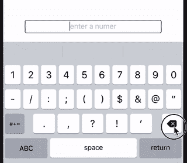
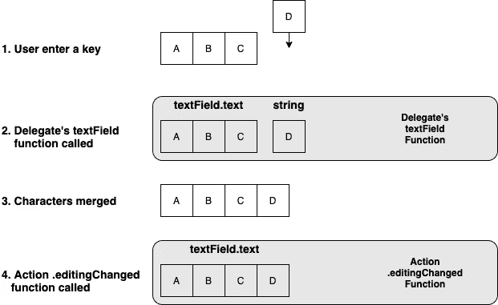
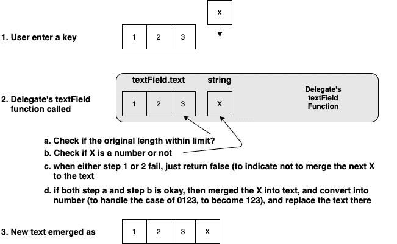
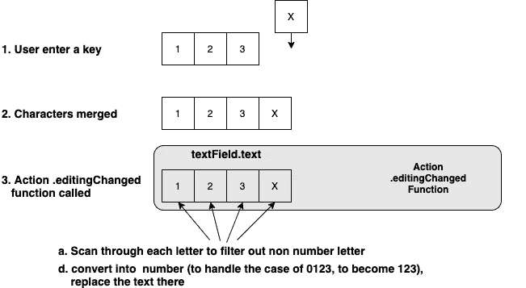
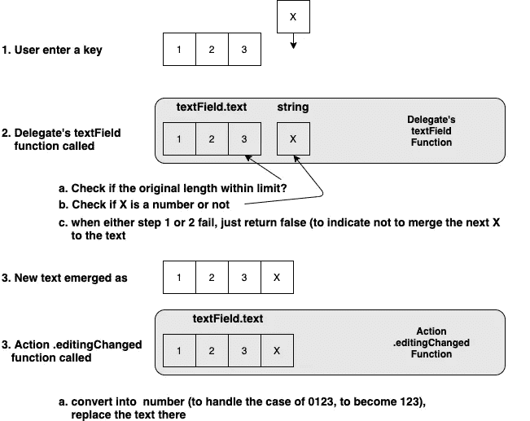

# 区分 UITextField 委托和。编辑更改用法

> 原文：<https://levelup.gitconnected.com/differentiate-uitextfield-delegate-and-editingchange-usage-c7abe7439faa>


图片由 [Franck V.](https://unsplash.com/@franckinjapan) 在 [Unsplash](https://unsplash.com/photos/miWGZ02CLKI) 上拍摄

在一个 iOS `UITextField`中，如果我们想要控制和修改输入到其中的文本——使其成为数字文本字段(如下所示，例如没有双 0，如下所示),我们有两种方法。



我们不仅仅使用数字键盘来演示控制输入

正如下面的博客所分享的，有两种可能的方法

[](https://medium.com/@elye.project/making-ios-uitextfield-accept-number-only-4e9f569ae0c6) [## 使 iOS UITextField 仅接受数字

### 并通过探索一种将输入限制为实际数字的方法来了解 UITextField 处理的许多方式

medium.com](https://medium.com/@elye.project/making-ios-uitextfield-accept-number-only-4e9f569ae0c6) 

1.  指派代表`textField.delegate = self`
2.  添加一个目标`.editingChange`

```
textField.addTarget(***self***, action: **#selector**(**self**.joinChange), for: .editingChanged)
```

## 我应该在什么时候使用这些方法？

为了理解这一点，让我们看看下面的图表，说明每个调用的时间。



当一个字母被键入时，在它与文本字段中前面的字母合并之前，它将被发送到`delegate`函数。合并之后，然后调用`.editingChanged`目标函数。

有了上面显示的图表，我们现在对每个函数何时被调用有了一些了解。

# 应用程序

为了更好地理解每个用户，让我们举一个例子，用下面的规则来制作我们的 textField:

*   仅接受数字，即仅 0-9
*   可以是 18 位数以内的任意数字组合。
*   对于 0，可以有一个单独的数字 0，但后面不能有其他数字(例如，不接受 0123)。

## 使用委托方法

当我们使用`delegate`方法时，我们的代码如下所示。

```
textField.delegate = self
```

委托函数如下所示。

```
func textField(_ textField: UITextField, 
               shouldChangeCharactersIn range: NSRange, 
               replacementString string: String) -> Bool { if (**textField.text!.count >= ViewController.maxDigit 
        && !string.isEmpty**) {
        return false
    }
    let invalidCharacters 
        = CharacterSet(charactersIn: "0123456789").inverted
    if (**string.rangeOfCharacter(from: invalidCharacters) == nil**) {
        let **mergedString = (textField.text! as NSString)
            .replacingCharacters(in: range, with: string)**
        if let number = Decimal(string: mergedString) {
            textField.text = "\(number)"
            return false
        }
        return true
    }
    return false
}
```

使用这种方法，它将:

1.  首先检查以确保它在允许的位数范围内。否则返回 false 表示我们不接受输入。在这里，它还检查新的输入字符串是否为空，因为我们希望它在 enter 键被退格删除的情况下继续。
2.  然后，它检查以确保输入的字母是 0–9。否则返回 false 表示不接受输入。
3.  然后，它将最新的输入与字符串合并在一起，并使其成为一个数字(这确保了`0`键与任何数字合并，然后它自己产生数字，即`2`而不是`02`)。之后，它会更改文本字段。



## **这种方法的问题**

它自己执行最新字母的合并，如果系统不合并字母，则返回 false。这可能被认为是对`UITextField`流程不必要的入侵。

让我们看看另一种方法…

## 使用添加目标`.editingChange`的方法

当我们使用`.editingChange`方法时，我们的代码如下所示。

```
textField.addTarget(**self**, action: **#selector**(**self**.editingChanged), for: .editingChanged)
```

和委托函数，我们写如下

```
private var lastValue = ""
[@objc](http://twitter.com/objc) private func editingChanged(_ textField: UITextField) {
    if let number = 
      **Decimal(string: textField.text!.filter { $0.isWholeNumber }**) {
        if (**number <= Decimal(ViewController.maxValue)**) {
            lastValue = "\(number)"
        }
        textField.text = lastValue
    } else {
        testField.text = ""
    }
}
```

在这个阶段，它已经接收了整个合并的文本输入。输入可以由字母或数字组成。因此，它执行以下操作

1.  为了删除字母，它使用`Decimal(string: text.filter { $0.isWholeNumber })`来过滤并保留那些数字。在这个过程中，它还试图将其转换成一个数字(例如，`02`将是`2`)
2.  之后，进行比较以确保其不超过`maxValue`。如果它超过了最大值，那么它必须检索以前的值并设置为文本，因为在这个阶段文本已经被更改。



## **这种方法的问题**

1.  它必须重新查找文本中的每个字母，并逐个过滤
2.  它必须记住以前存储的数字，如果新的数字超过限制，就将其重置。

上述问题的原因是他们每个人都做了他们应该做的事情。`delegate`应该只是合并前的滤波，`.editingChange`应该是合并后的变换。

为了正确使用它们，让我们看看下面的内容。

# 使用委托和`.editingChange`方法

为此，我们需要分配委托和。editing 将函数更改为文本字段，如下所示

```
textField.delegate = self
textField.addTarget(**self**, action: **#selector**(**self**.editingChanged), for: .editingChanged)
```

然后在`delegate`代码中:

```
func textField(_ textField: UITextField, 
               shouldChangeCharactersIn range: NSRange, 
               replacementString string: String) -> Bool {if (**textField.text!.count >= ViewController.maxDigit 
        && !string.isEmpty**) {
        return false
    }
    let invalidCharacters 
        = CharacterSet(charactersIn: "0123456789").inverted
    return (**string.rangeOfCharacter(from: invalidCharacters) == nil**) }
```

在这里，它只是做预合并所需的过程，即过滤掉不需要的字符或当它已经达到最大位数时阻止继续

然后在`.editingChange`代码中:

```
private var lastValue = ""
[@objc](http://twitter.com/objc) private func editingChanged(_ textField: UITextField) {
    **if** **let** num = Int(textField.text!) {
        textField.text = "\(num)"
    } **else** {
        textField.text = ""
    }
}
```

只需将合并后的字母转换成数字，即处理例如`02`将成为`2`的情况

注意，它不需要像在`delegate`中那样检查合法性。它也不需要担心存储要恢复的最后一个值。



您可以在以下位置获得上述 3 种方法的代码演示:

[](https://github.com/elye/demo_ios_uitextfiled_number_delegate_editingchange) [## elye/demo _ IOs _ ui text filed _ number _ delegate _ editing change

### 显示对 UITextField 的数值条目正确使用委托和编辑更改…

github.com](https://github.com/elye/demo_ios_uitextfiled_number_delegate_editingchange) 

感谢阅读。你可以在这里查看我的其他话题[。](https://medium.com/@elye.project/)

关注我的[](https://medium.com/@elye.project)**[*Twitter*](https://twitter.com/elye_project)*[*脸书*](https://www.facebook.com/elyeproj/) 或 [*Reddit*](https://www.reddit.com/user/elyeproj/) 获取移动开发等相关话题的小技巧和学习。~Elye~***