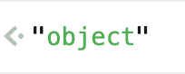

# 如何成为一名优秀的 JavaScript 开发人员

> 原文：<https://levelup.gitconnected.com/differentiate-yourself-as-a-javascript-dev-1791793da7ee>


[国家癌症研究所](https://unsplash.com/@nci?utm_source=unsplash&utm_medium=referral&utm_content=creditCopyText)在 [Unsplash](https://unsplash.com/s/photos/student-hand-raised?utm_source=unsplash&utm_medium=referral&utm_content=creditCopyText) 上拍摄的照片

任何人都可以使用 JavaScript 进行开发。它是世界上最容易使用和广泛出版的编程语言之一，这也意味着就业市场上那些声称懂 JavaScript 的人已经饱和了。越来越多的，你会看到一些人以一种随意的方式在简历上写 JavaScript，说“哦，是的，我会写 JavaScript”。然而，仅仅因为你能用一种语言做一些事情并不意味着你能胜任。

由于 JavaScript 在就业市场上的饱和，作为一名 JavaScript 开发人员，你有很大的机会脱颖而出。在本文中，我将概述一些我认为在 JavaScript 中有用的核心编程能力，它们帮助我更快更有效地浏览代码库。

真正擅长这些事情，你会发现自己在任何 JavaScript 环境中都更加得心应手，包括当你使用:

*   结节
*   反应
*   有角的
*   某视频剪辑软件
*   表达
*   苗条的
*   NextJS
*   jQuery…？！？！

我将介绍 JavaScript 的一些领域，我在和我一起工作的所有团队成员身上看到了这些领域的与众不同之处。我不会试图解释我指出的所有细微差别，但我希望如果你不理解某些东西，你可以抓住机会学习新的东西，提高自己的技能！

有了那个…

# 非常擅长循环

如果这让你不寒而栗，因为你马上想起了 CS101，不应该。循环是任何编程语言的核心，但特别是在 JavaScript 中，你会发现大量的场景，在这些场景中，理解如何循环数据会让你在不熟悉的人看来像个大师。

您是使用“ngFor”遍历 Angular 模板中的项目，还是遍历数据库响应，然后以 JSON 的形式发送给客户端？无论哪种方式，您都希望了解高效处理这些数据的最佳方式。至少，您需要知道何时应该使用以下任何一种方法:

```
for (let i = 0; i < myArray.length; i++)
for (let arrayItem of myArray)
myArray.forEach()
myArray.map()
myArray.filter()
```

您会发现每种方法都有不同的用例，知道使用哪种方法将极大地提高代码的可读性。

此外，理解哪些数组方法会改变原始数组而不是返回新数组是正确使用它们的关键，所以花些时间了解一下循环吧！

# 理解物体

这似乎是显而易见的，但即使如此，我还是要把它开回家。

帮我一个忙，打开 https://jsconsole.com/的，输入“typeof {}”。

您将看到一个响应:



现在输入“typeof []”,你知道会发生什么吗？是的，


让我们再做一次。取一个简单的构造函数:

```
function getObject (name) {
    this.name = name
}
```

将它粘贴到您控制台中，并新建一个构造函数的实例:

```
let myObj = new getObject(‘Chris’);
```

现在……让我们回到开始的地方，键入“typeof myObj”来查看您的结果:


在 JavaScript 中工作，你几乎总是在和一个对象打交道。要做好这一点，您需要确保至少理解:

*   原型
*   键
*   对象方法包括 *Object.assign()* ， *Object.entries()* ， *Object.freeze()*

你越了解 JavaScript 对象的不同方面是如何工作的，你就越能导航代码，越能理解框架在幕后做什么。

# 理解承诺

“但是等等！”你说。“这是 2021 年，我们使用`async/await`，没有承诺的东西。”

让我提醒你，在 Mozilla 文档中关于异步函数的部分:

> 异步函数总是返回一个承诺。如果异步函数的返回值不是显式的承诺，它将被隐式地包装在承诺中。

所以，如果你在做你的`async/await`事情的时候不知道你在做承诺，你已经证明了我的观点。

回到我们手边的[https://jsconsole.com/](https://jsconsole.com/)。

定义一个异步函数，该函数返回传递给它的值:

```
async function myAsyncFunc(value) { return value; }
```

如果我调用那个函数并给它赋值，如果我不“等待”那个函数，你不会得到预期的结果。例如，接下来运行以下命令:

```
let myResult = myAsyncFunc(1);console.log(myResult); // You’ll see this is a Promise
```

你会发现你只是还了一个承诺，只是你不知道而已。

让我们搞清楚，`async/await`关键词是围绕承诺的语法糖，让我们更加理智，因为我们不必再写这样的东西了:

```
myPromise.then(() => {
   return mySecondPromise;
}).then(() => {
   return myThirdPromise.then(() => {
     return aNormalValueHere;
   });
}).then(() => { /// WHAA?????});
```

# 理解单元测试中的模拟

如果有一件事是我看到 JavaScript 开发人员浪费最多时间的，那就是忘记“等待”一个异步函数或者不知道如何在单元测试中模拟一切。

有两种类型的开发人员编写单元测试。那些可以嘲笑任何东西的人，以及那些会花费数小时讨厌单元测试直到他们向第一类人寻求帮助的人。做第一种。

在 JavaScript 单元测试中，您会发现组成 JavaScript 对象的引用非常灵活。利用这一点，理解如何使用不同的 JavaScript 测试框架来帮助自己进行单元测试。例如，如果我想测试一个有一个或多个依赖项的函数:

```
const myReferencedFunction = require(‘./myReferencedFunction’);myFunction (myReferencedFunction) {
  this.computation = function (value) {
    return myReferencedFunction.computeThisThing(value);
  }
}
```

对于这个人为的例子，假设我们使用 Jest 作为我们的测试框架。我可以导入实际的依赖项，在其上模拟一个方法，然后将它原样传递给我要测试的函数。类似于:

```
const myReferencedFunction = require(‘./myReferencedFunction’);jest.spyOn(myReferencedFunction, ‘computeThisThing’).mockReturnValueOnce(‘myValue’);const functionToTest = new myFunction(myReferencedFunction);
```

或者…我可以通过将一个完整的模仿对象传递给函数来绕过存根或导入它:

```
const myMockedReferencedFunction = {
  computeThisThing: () => { return ‘myValue’; }
}const functionToTest = new myFunction(myReferencedFunction);
```

我不关心哪种模式更好。相反，我想指出的是，在 JavaScript 单元测试中，围绕如何模仿对象、类、函数、数组等有很大的灵活性。了解这些选项可以让你更快地浏览这些场景。

# 奖金部分

**了解变量范围**

你知道“var”、“let”和“const”的区别吗？你知道哪些会被引用，它们在循环和方法中的作用域是什么吗？一定要做到。

**跟上新的便捷方法**

[传播算子](https://developer.mozilla.org/en-US/docs/Web/JavaScript/Reference/Operators/Spread_syntax)

```
let myFirstObject = {
  one: 1,
  two: 2
};let mySecondObject = {
  three: 3,
  four: 4
};let myMergedObject = { …myFirstObject, …mySecondObject };// Results in {one: 1, two: 2, three: 3, four: 4}
```

[数组条目](https://developer.mozilla.org/en-US/docs/Web/JavaScript/Reference/Global_Objects/Array/entries)

```
const myArray = [‘a’, ‘b’, ‘c’];for (const [index, element] of myArray.entries())console.log(index, element);// 0 ‘a’
// 1 ‘b’
// 2 ‘c’
```

[可选链接](https://developer.mozilla.org/en-US/docs/Web/JavaScript/Reference/Operators/Optional_chaining)

而不是这个:

```
if (myObject && myObject.prop1 && myObject.prop1.prop2) { /// }
```

执行以下操作:

```
if (myObject?.prop1?.prop2) { /// }
```

# 摘要

这是一个高层次的概述，并不涵盖将帮助您成为优秀 JavaScript 开发人员的广泛领域。请确保您始终与社区中的最新计划保持同步，包括 ECMAScript 标准化过程。不要成为“也”做 JavaScript 的人。做一个不断学习提升自己和团队成员的人。

认为我错过了 JavaScript 中的一些关键内容？在下面留下评论让我知道！