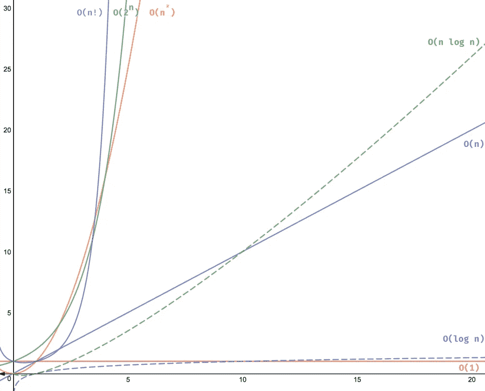

# 区分对数和线性时间复杂度

> 原文：<https://levelup.gitconnected.com/differentiating-logarithmic-and-linearithmic-time-complexity-976cd49c351b>


是木头，是木头！总比不好，好！

我最近想知道时间复杂度低的算法的用例。什么时候使用具有二次时间:`O(n^2)`、多项式时间:`O(n^c)`、指数时间:`O(2^n)`或阶乘时间:`O(n!)`的算法才是合适的、更有利的？我需要做更多的研究，但是从目前我所能告诉你的来看，这些时间复杂度根本就不是*有利的。最好避免使用它们，尤其是如果开发软件或编写程序是为了扩展，并且是出于需要或天真而使用。*

在我研究这个课题的过程中，我确实有所领悟:我澄清了我对对数时间:`O(log n)`和线性时间:`O(n log n)`的理解和区别。

两种时间复杂度都与对数有关。在数学中，对数是一个表示某个固定数(底数)的幂的量，它必须被提升以产生一个给定的数，*即*对数是某个固定数(底数)需要被相乘以产生结果的次数。

```
log2(8) = 3 -> "log base 2 of 8 is 3"which is the inverse of:2^3 = 8 -> "2 to the 3rd power is 8"
```

对数本质上决定了指数相乘时应用于底数的指数，因此执行逆运算:*除法*。具有对数和线性时间复杂度的算法都利用除法来计算数据并产生输出，但有一个关键的区别。让我们先来看看每个时间复杂度的常见实现，然后突出它们的区别。

对数时间复杂度的普通算法是用于二分搜索法的。想象一个程序接收一个**排序的**整数数组和一个目标整数。程序必须搜索数组以确定是否包含目标整数，并相应地输出`true`或`false`。

```
*(JavaScript)*const arr = [1, 3, 4, 6, 12, 32, 43, 45, 78, 98]function binarySearch(arr, num) {
  let begin = 0
  let end = arr.length - 1 while (begin <= end) {
    let mid = Math.floor((begin + end) / 2)
    let aNum = arr[mid] if (num === aNum) return true
    if (num > aNum) begin = mid + 1
    if (num < aNum) end = mid - 1
  }
  return false
}////////////////////////////////////////////////////////////////////binarySearch(arr, 100)
//=> false////////////////////////////////////////////////////////////////////binarySearch(arr, 12)
//=> true
```

与连续评估每个元素的线性时间(`O(n)`)方法相反，这种对数时间(`O(log n)`)方法通过建立数组的开始、中间和结束索引，然后*在中间索引处将数组分成两半*，更有效地确定目标整数是否包括在数组中；如果中间索引处的元素等于目标整数，则返回`true`，或者确定目标整数是小于还是大于中间索引处的元素。根据评估结果，可能包含目标整数的数组的一半被回收，另一半被丢弃(放入一个大头针！).`while loop`重复这种模式，开始、中间和结束索引被重新分配给回收的那一半。循环继续进行，直到找到目标整数，或者终止并前进到函数的默认返回值:`false`，这意味着目标整数不包含在数组中。

线性时间复杂度的常见算法是用于合并排序。假设一个程序接收一个整数数组，并返回排序后的数组。当然也有类似`Array.sort()`的内置，但是不同的浏览器或者程序在不同的情况下，出于不同的原因，可以使用不同的算法。像合并排序这样的算法是高效的，并且在规模上更有性能。

```
*(JavaScript)*const arr = [9, 56, 3, 47, 8, 23, 1, 5, 20]// auxiliary functionfunction merge(arr1, arr2) {
  const mergedArr = [] while (arr1.length > 0 && arr2.length > 0) {
    arr1[0] < arr2[0] ?
      mergedArr.push(arr1.shift()) :
        mergedArr.push(arr2.shift())
  }
  return [...mergedArr, ...arr1, ...arr2]
}// primary functionfunction mergeSort(arr) {
  const midIdx = arr.length / 2
  const spanA = arr.slice(0, midIdx)
  const spanB = arr.slice(midIdx, arr.length) if (arr.length === 1) return arr const sortedArr = merge(mergeSort(spanA), mergeSort(spanB)) return sortedArr
}////////////////////////////////////////////////////////////////////mergeSort(arr)
//=> [1, 3, 5, 8, 9, 20, 23, 47, 56]
```

**注 8/11/20:我注意到在辅助* `merge()` *函数的 while 循环中使用* `Array.prototype.shift()` *表示二次运算，暗示这个具体归并排序例子的实际时间复杂度是* `O(n² log n)` *。我不确定使用 shift 方法的影响——有一些有趣的细节需要考虑——但是我添加了一个替代代码示例作为本文的附录，它使用索引计数器代替 shift 方法，以提供一个具有线性时间复杂度的明确示例。*

这种线性时间(`O(n log n)`)方法是线性时间(`O(n)`)和对数时间(`O(log n)`)的组合。`mergeSort`函数利用指示对数时间复杂度的除法。注意与二分搜索法算法的相似之处，其中输入被重复地分成两半，*，例如* `spanA`和`spanB`。递归被用来进一步划分每一半，在每一步，辅助函数`merge`被用来将结果`sub-Array`按排序顺序重新组合。`merge`函数和递归的时间复杂度是线性的:`O(n)`。与`mergeSort`函数中的对数时间配对，合并排序算法的最终评估是线性时间:`O(n log n)`。我见过这种描述的一种简化方式是`O(n * log(n))`、*即*“做`log(n)`工作`n`次”。

对数时间复杂度和线性时间复杂度都使用对数并划分数据，但是请注意上面解释的两种算法之间的关键区别。当二分搜索法算法继续划分输入时，每次运算都有一半的输入被丢弃，重复地将待评估的数据量减半。合并排序算法重复地将输入减半，但是*保留了*的两半并合并了排序后的`sub-Array`。保留并返回输入的完整长度的数据是必要的。

这些时间复杂度的性能如何比较？



阿德里安·梅希亚[的一篇文章中的大 O 时间复杂性的图形表示](https://adrianmejia.com/most-popular-algorithms-time-complexity-every-programmer-should-know-free-online-tutorial-course/)

对数时间(`O(log n)`)是时间复杂性的*粉吐司人*。它是高性能和高度赞扬。它偏离恒定时间不远(`O(1)`)。它比线性时间快。

线性时间(`O(n log n)`)是时间复杂性的*泥巴弹涂鱼*——最好的中的最坏的(尽管，没那么灰暗和表里不一)。这是一个中等的复杂度，在线性时间(`O(n)`)左右浮动，直到输入达到高级大小。它比对数时间慢，但比不太有利的、低性能的时间复杂性快。

这篇文章是关于来自 BLAMMO 的满载日志的时间复杂性的！

【github.com/dangrammer
[linked.com/in/danieljromans](https://www.linkedin.com/in/danieljromans/)
[danromans.com](http://danromans.com/)

## 附录:

不使用 shift 方法的替代合并排序示例:

```
// auxiliary functionfunction merge(arr1, arr2) {
  const mergedArr = []
  let i = 0
  let j = 0 while (i < arr1.length && j < arr2.length) {
    if (arr1[i] < arr2[j]) {
      mergedArr.push(arr1[i])
      i++
    } else {
      mergedArr.push(arr2[j])
      j++
    }
  } return arr1[i] ?
    mergedArr.concat(arr1.slice(i)) :
      mergedArr.concat(arr2.slice(j))
}// primary functionfunction mergeSort(arr) {
  const midIdx = arr.length / 2
  const spanA = arr.slice(0, midIdx)
  const spanB = arr.slice(midIdx, arr.length) if (arr.length === 1) return arr
  const sortedArr = merge(mergeSort(spanA), mergeSort(spanB)) return sortedArr
}
```