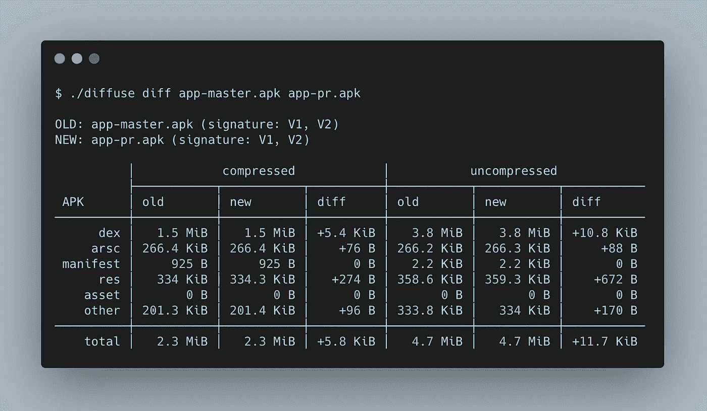
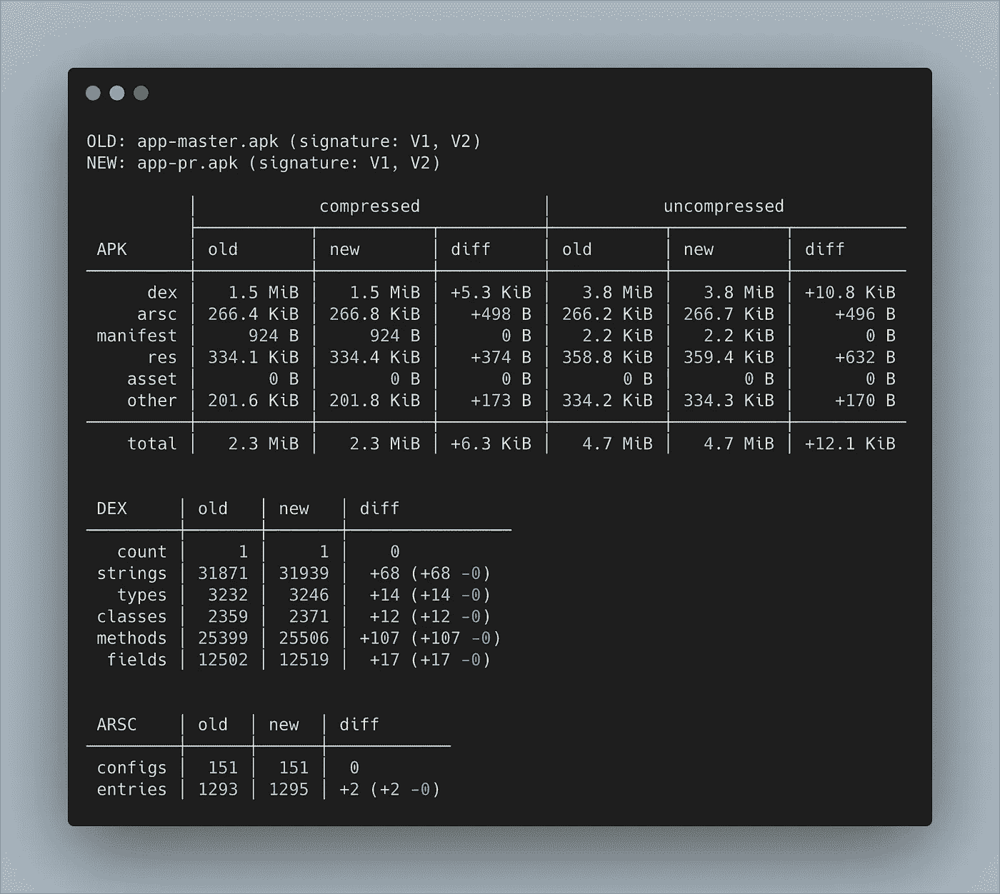
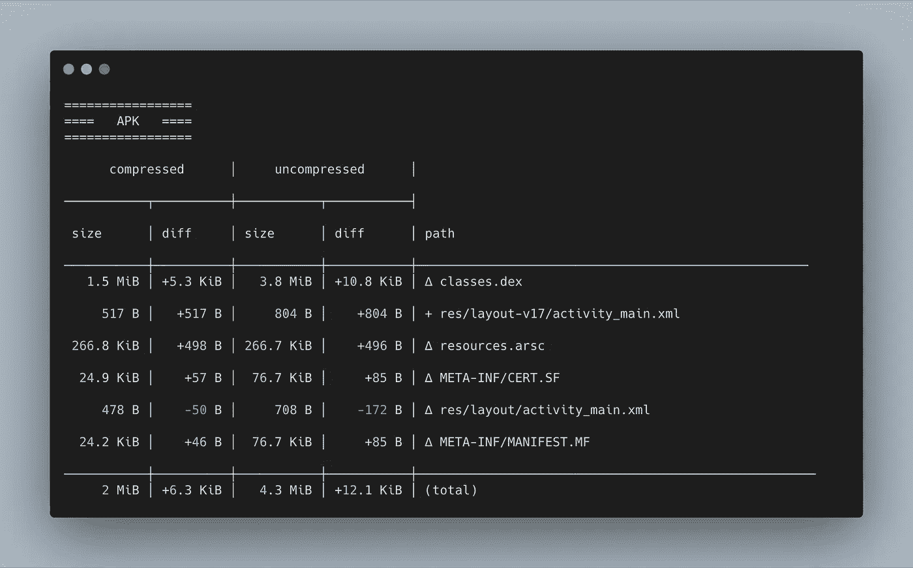
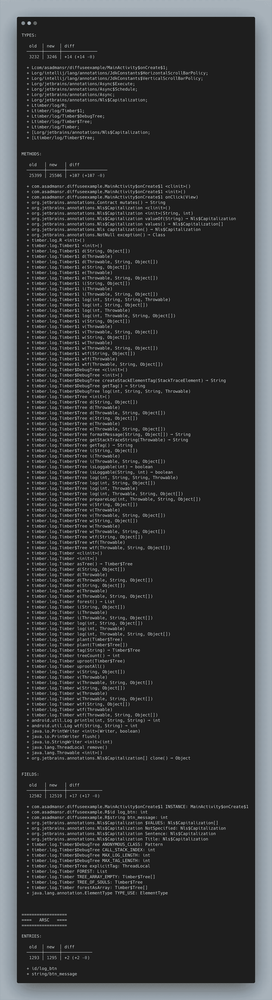
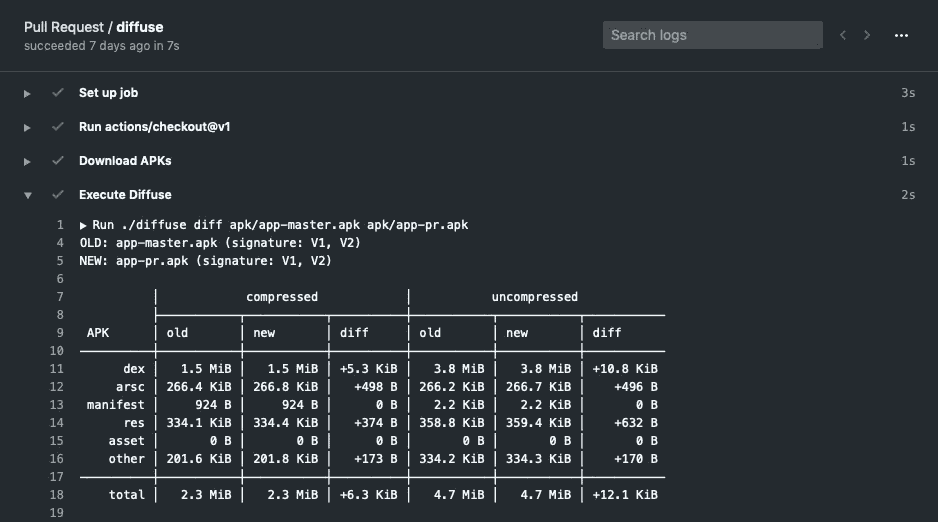

# 使用 GitHub 动作和扩散分析 APK 变化的指南

> 原文：<https://levelup.gitconnected.com/diffusing-your-apk-ea9d044d4c0d>



# 例子

Diffuse 是分析两个 apk 之间变化的工具。随着新代码不断地被合并到主线中，对 APK 的更改可能会被忽略。为了对我们所构建的东西产生信心，Diffuse 输出了一系列有用的度量，这些度量是两个 apk 在大小和数量方面的变化。将这种检查集成到开发周期中可以提高 APK 状态的可见性，并提供早期反馈以避免以后出现不必要的问题。

在这个例子中，我在主分支上创建了一个空的 Android 项目。在 GitHub Actions 的帮助下，我可以在持续集成服务器上执行 Diffuse 工具，作为开发工作流的一部分。发出拉请求后，GitHub Actions 会将拉请求的 APK 与主分支上的 APK 进行比较。因此，它将输出一系列信息，这些信息可用于验证对 APK 的更改以及其他代码验证，如代码审查和自动化测试。

在本例中，我添加了一个名为 [Timber](https://github.com/JakeWharton/timber) 的新日志库。Timber 是一个库，它在 Android 的日志实现之上提供了额外的工具。至于我的 pull 请求，更改包括库的集成以及活动中的初始化。本练习的目标是在应用此更改后观察 apk 之间的差异。

## 参考

*   主科(【https://github.com/asadmansr/diffuse-example】T2)
*   拉请求(【https://github.com/asadmansr/diffuse-example/pulls】T4)
*   GitHub 动作作业([GitHub 动作上的扩散作业](https://github.com/asadmansr/diffuse-example/runs/318149061)

## 结果

一旦这项工作完成，漫反射将提供一个高层次的视图，比较新旧 APK 的压缩和未压缩状态。也更容易看到 APK 的哪个部分发生了显著变化。



漫射工具的输出

此外，还详细显示了有关 APK、类型、方法和字段的信息。



关于 APK 尺寸的信息



类型、方法和字段的计数

# 附加漫射细节

扩散是一种在开发周期中跟踪 APK 变更的工具。当新的变更被合并时，Diffuse 可以提供关于 APK 状态的附加度量，并在持续集成流水线流程中的代码验证过程中提示警告。

Diffuse 提供了以下方面的见解:

*   组成 APK 的尺寸(dex、arsc、manifest、res、asset、other)
*   字符串、类型、类、方法和字段的计数
*   类型、类、方法和字段的详细信息
*   资产规模
*   可能的 APK 棉绒警告

Diffuse diff 命令的完整用法:

要了解更多关于 Diffuse 的信息，请访问 GitHub 上的[Diffuse](https://github.com/JakeWharton/diffuse)

# GitHub 操作

工作流是通过 GitHub 动作执行的一系列步骤。在本例中，已经创建了一个工作流，该工作流只在为主请求分支和拉请求分支生成 apk 的拉请求上运行。一旦执行完成，Diffuse 命令就与那些 apk 一起使用。输出将显示在 GitHub Action 提供的实时日志中。



GitHub 操作的输出日志

通过一点配置，工作流还可以生成一个文本或 HTML 文件，该文件可以存储在 GitHub Actions 工件中以供将来参考。

**。github/workflows/pull _ request . yml**

```
name: Pull Request
on: [pull_request]jobs:
  # Checkout master branch and build the APK
  build-master:
    runs-on: ubuntu-latest
    steps:
      - uses: actions/checkout@v1
        with:
          ref: master
      - name: Build Master APK
        run: ./gradlew assembleDebug && mv app/build/outputs/apk/debug/app-debug.apk app/build/outputs/apk/debug/app-master.apk
      - name: Upload APK
        uses: actions/upload-artifact@v1
        with:
          name: apk
          path: app/build/outputs/apk/debug/app-master.apk
  # Checkout PR branch and build the APK
  build-pr:
    runs-on: ubuntu-latest
    steps:
    - uses: actions/checkout@v1
    - name: Build PR APK
      run: ./gradlew assembleDebug && mv app/build/outputs/apk/debug/app-debug.apk app/build/outputs/apk/debug/app-pr.apk
    - name: Upload APK
      uses: actions/upload-artifact@v1
      with:
        name: apk
        path: app/build/outputs/apk/debug/app-pr.apk # Execute Diffuse only when the two APKs are built successfully
  diffuse:
    needs: [build-master, build-pr]
    runs-on: ubuntu-latest
    steps:
      - uses: actions/checkout@v1
      - name: Download APKs
        uses: actions/download-artifact@v1
        with:
          name: apk
      - name: Execute Diffuse
        run: ./diffuse diff apk/app-master.apk apk/app-pr.apk
```

目前就这些。要查看示例，请查看下面的 GitHub 链接。一如既往，黑客快乐！🎉

[](https://github.com/asadmansr/diffuse-example) [## asadmansr/扩散-示例

### 在比较两个 apk 时，漫射提供了更改内容的高级视图。这个存储库是使用…

github.com](https://github.com/asadmansr/diffuse-example)