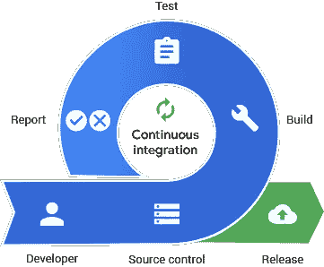
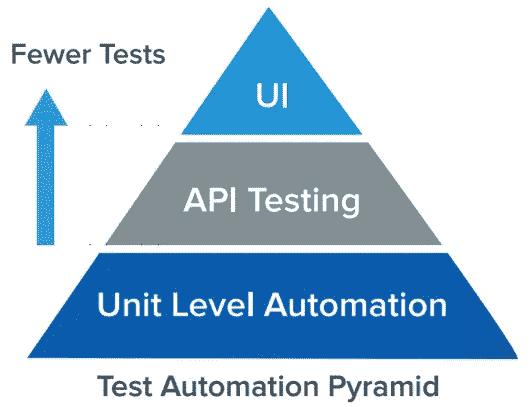
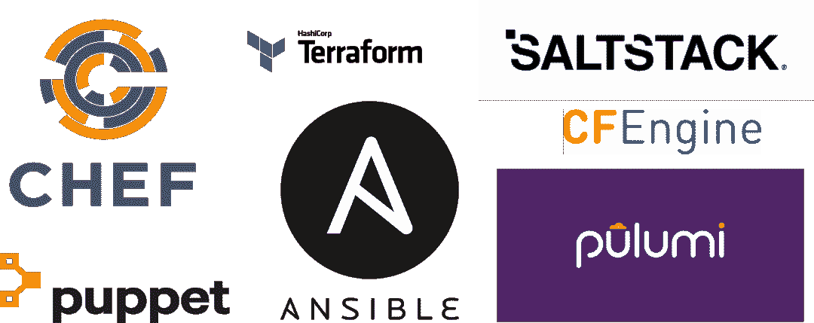
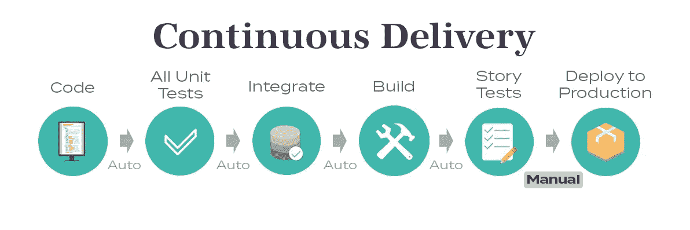
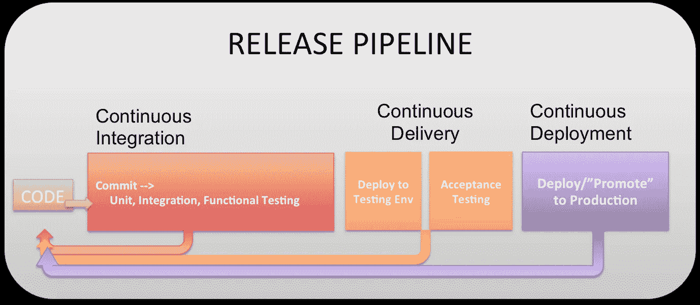

# 易理解的 DevOps:7 个 devo PS 实践

> 原文：<https://levelup.gitconnected.com/digestible-devops-the-7-devops-practices-8bd8b34e1418>

## 将 DevOps 分解成实用的块，以便在现实世界中实现

费尔南多·埃尔南德斯在 [Unsplash](https://unsplash.com?utm_source=medium&utm_medium=referral) 上的照片

当人们谈论 DevOps 时，如果有一件事我听得太多，那就是这个术语本身太宽泛，没有任何实际含义。我同意你的观点，我们需要将开发分成小块，一步一步地处理软件开发生命周期。

如果您正在努力在您的组织中传达 DevOps，可以考虑这种方法。想出一个策略来逐步实施这 7 个阶段中的每一个。你会发现它们是相互依存的。在其他实践之前采用和成熟一个实践将帮助您的团队关注什么可以最快地提供最大价值，同时与长期战略保持一致。

**devo PS 的 7 个关键实践是:**

1.  结构管理
2.  连续累计
3.  自动化测试
4.  基础设施作为代码
5.  连续交货
6.  持续部署
7.  连续监视

## 结构管理

来源:[https://open source . com/sites/default/files/styles/image-full-size/public/lead-images/innovation _ light bulb _ gears _ devo PS _ ansi ble . png？itok=TSbmp3_M](https://opensource.com/sites/default/files/styles/image-full-size/public/lead-images/innovation_lightbulb_gears_devops_ansible.png?itok=TSbmp3_M)

**配置管理(CM)是以标准且可重复的方式使用版本控制来控制和管理软件变更的实践。实践有两个组成部分:使用版本控制软件和标准代码库管理策略(定义分支、合并等的过程)。).**

*   版本控制工具的当前目标是 Git
*   代码库管理策略的当前目标是两个工作流之一，这取决于团队的需求:特性分支工作流或 Gitflow 工作流

## 连续累计

来源:[https://www . page duty . com/WP-content/uploads/2020/01/image1-1 . png](https://www.pagerduty.com/wp-content/uploads/2020/01/image1-1.png)

持续集成(CI)是一种实践，它要求开发人员经常将代码集成到一个共享的存储库中，并在积极开发期间获得关于其成功的快速反馈。这是在开发人员完成一段特定代码并成功通过单元测试时完成的。CI 还意味着在 Bamboo/Jenkins/Gitlab 这样的工具中创建一个构建，在开发人员签入后运行，运行任何可以在这个构建上运行的测试(例如 unit & integration ),并向开发团队提供工作或失败的反馈。最终目标是创建小的可工作的代码块，这些代码块经过验证并尽可能频繁地集成到集中的代码库中。因此，CI 是持续交付和持续部署开发运维实践的基础。

## 自动化测试

来源:[https://static 1 . smart bear . co/smart bear/media/images/resources/articles/content/test-automation-pyramid . png](https://static1.smartbear.co/smartbear/media/images/resources/articles/content/test-automation-pyramid.png)

**使用专门的软件来控制软件测试的执行和结果比较的实践。**依靠自动化来减少手动运行重复测试的负担，加速测试过程的执行，并允许执行复杂或困难的测试。这些自动化测试通常在 CI 构建期间运行；以及在需要时以特别的方式进行。要自动化的测试对于每个程序的成熟度和需求是独特的，应该根据具体情况来决定。这些测试可以包括:

*   单位
*   成分
*   综合
*   首尾相连
*   表演
*   安全性
*   508 合规性

## 基础设施作为代码

**IaC 用于定义代码，当执行时，可以支持整个物理或虚拟环境，包括计算和网络基础设施**。它是一种 It 基础架构，运营团队可以通过代码自动管理和调配，而不是使用手动流程。使用 IaC 的一个例子是使用 Terraform 在云环境中快速建立节点，然后每次都能一致地破坏和重建环境。这样做使用户能够对其基础设施进行版本控制，并且在从基础设施故障中恢复时更加灵活。

## 连续交货

来源:[https://dzone . com/storage/temp/11914589-what-is-continuous-delivery . jpg](https://dzone.com/storage/temp/11914589-what-is-continuous-delivery.jpg)

一旦自动化测试验证了源代码的每一处变更，就为产品发布做好准备的实践。 **这包括自动构建、测试和部署。**需要一种代码批准和交付批准的方法，以确保代码能够以自动化的方式部署，并根据项目的特定需求适当暂停批准。这也意味着同样的过程适用于较低的环境，如 QA、UA 等。

## 持续部署

来源:[https://3 ovyg 21t 17 l11k 49 tk 1 oma 21-WP engine . net DNA-SSL . com/WP-content/uploads/2015/03/CIC DCD . png](https://3ovyg21t17l11k49tk1oma21-wpengine.netdna-ssl.com/wp-content/uploads/2015/03/cicdcd.png)

**持续部署是努力实现端到端自动化生产部署的实践**。为了实现这一实践，团队需要对他们的自动化测试有极高的信心。最终的目标是，只要构建通过了所有的自动化测试，代码就会被部署。但是，如果需要，可以保留部署过程中的手动步骤。例如，一个团队可以确定什么类型的变更可以以完全自动化的方式部署到生产环境中，而其他类型的变更可能需要手工批准步骤。这种混合方法是开始采用这种实践的好方法。

## 连续监视

来源:[https://gcn.com/-/media/GIG/EDIT_SHARED/Cloud/security.png](https://gcn.com/-/media/GIG/EDIT_SHARED/Cloud/security.png)

**持续监控是在关键领域主动监控、报警并采取行动的实践，以使团队能够了解生产环境中应用程序的运行状况。**为了了解每次部署的影响并缩短问题识别和解决之间的时间，包含了以下方面: