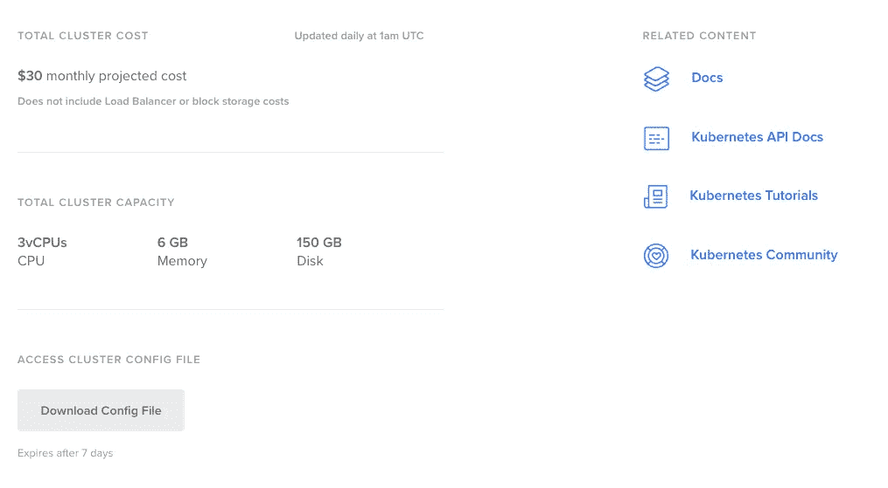
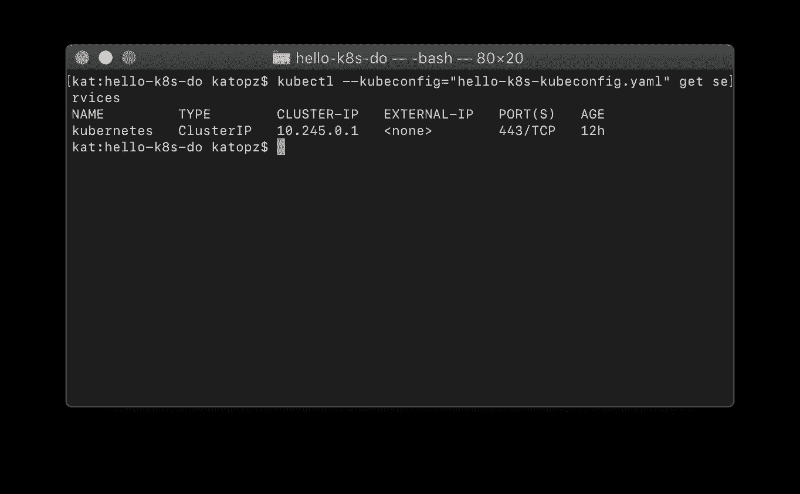

# 数字海洋❤ K8S

> 原文：<https://levelup.gitconnected.com/digitalocean-k8s-479c202ac979>

看，妈妈！只需在 [**数字海洋**](https://www.digitalocean.com/?refcode=6dcfcc2a3392) 上点击并使用 **Kubernetes**

> 极客警报！Kubernetes 目前供货有限

## 1.登录 **DigitalOcean** 仪表盘，点击“创建 Kubernetes 集群”开始


## 2.选择一个 **Kubernetes** 版本


## 3.添加节点(我使用默认的名称 hello-k8s)


## 4.设置大约需要 4 分钟…


## 5.搞定了。


## 6.安装 kubectl 以连接到您的 k8s 集群

[](https://www.digitalocean.com/docs/kubernetes/how-to/connect-with-kubectl/) [## 如何使用 kubectl | DigitalOcean 产品连接到 DigitalOcean Kubernetes 集群…

### 2018 年 10 月 1 日验证&bullet;发布于 2018 年 10 月 1 日 Kubernetes 目前限量发售。学习…

www.digitalocean.com](https://www.digitalocean.com/docs/kubernetes/how-to/connect-with-kubectl/) 

```
# Install Homebrew
/usr/bin/ruby -e "$(curl -fsSL https://raw.githubusercontent.com/Homebrew/install/master/install)"# Install kubectl
brew install kubernetes-cli
kubectl version
```


## 7.点击进入下一步


## 8.设置配置

*   向下滚动到“下载配置文件”并单击



*   将下载的文件放在任何地方，只要确保在下一步之前可以在**终端**中找到该文件夹


*   测试连接

```
kubectl --kubeconfig="hello-k8s-kubeconfig.yaml" get nodes
```


*   是的，起作用了！


## 9.部署工作负载

```
kubectl --kubeconfig="hello-k8s-kubeconfig.yaml" apply -f ./my-manifest.yaml
```

你应该看看…

```
deployment.apps/nginx-deployment-example created
```

和

```
kubectl --kubeconfig="hello-k8s-kubeconfig.yaml" get services
```

你应该看看



## **10。附加材料**

您现在可以将 **CronJob** 、 **Pod** 、 **ReplicaSet** 、**块存储卷**、**负载平衡器**添加到您的集群中，但我现在不会这么做，因为我懒得做，所以我将把这部分留给您！；D

# 注意(参考)

可以免费获得 10 美元 [**数字海洋**](https://www.digitalocean.com/?refcode=6dcfcc2a3392) (即 2 个月免费托管)。
可以拿到最便宜的 ***。io*** 域和优秀的 UI/UX 在 [**NameCheap**](https://www.namecheap.com/?aff=99054) 。

# 快乐酷冰！

[](https://levelup.gitconnected.com)[](https://gitconnected.com/learn) [## 了解如何编码-查找编码教程| gitconnected

### 使用我们完整的编码资源列表学习任何编程语言或框架。我们分享、汇总和排名…

gitconnected.com](https://gitconnected.com/learn)