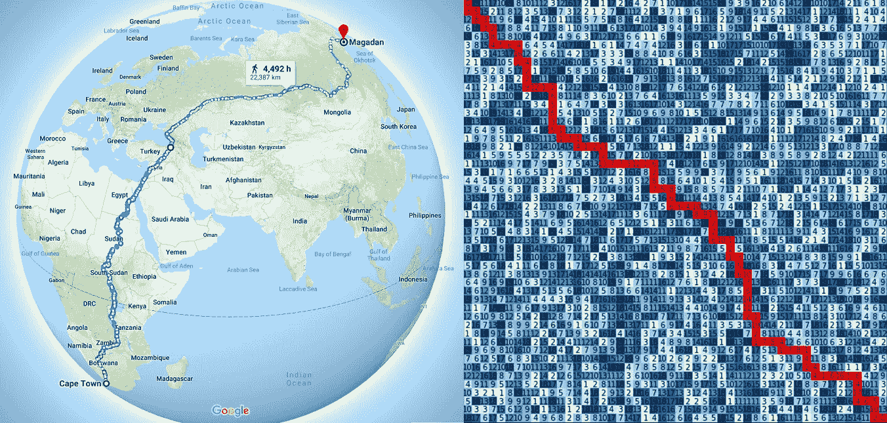
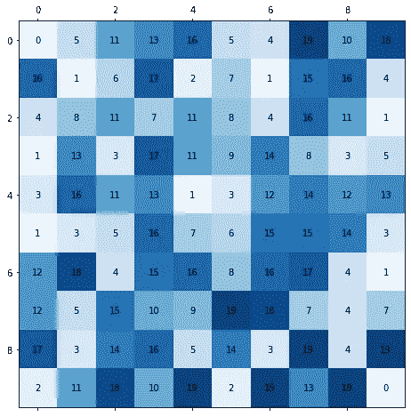
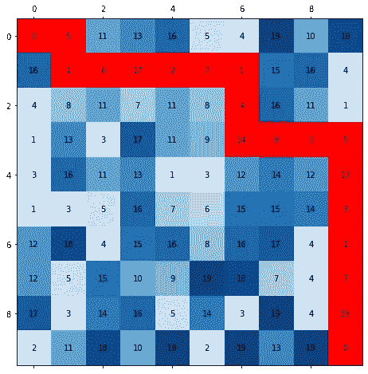
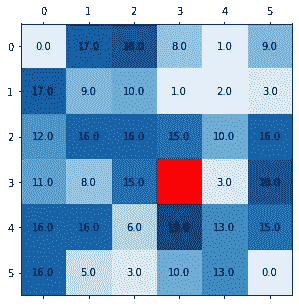
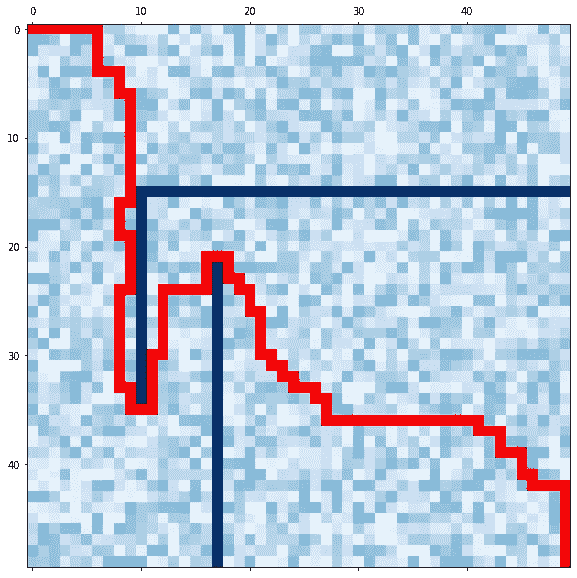

# 网格中的 Dijkstra 最短路径算法

> 原文：<https://levelup.gitconnected.com/dijkstras-shortest-path-algorithm-in-a-grid-eb505eb3a290>

或者如何从开普敦到马加丹

# 我是怎么卷进来的

不久前，我看到脸书一家大型科技公司贴出了一个编程挑战，让人们发送简历。挑战是在一个 1000x1000 的棋盘上找出短路。棋盘上的每个格子都有一个编号。最短“路径”是组成从一个顶点(比如左上)到另一端(右下)的连续路径的像元值的最低总和。

你所要做的就是提交路径的长度(作为一个单一的数字)，并有很大的机会赢得一个新的 XBox 或类似的东西(我不记得确切的奖励)。

阅读挑战让我好奇。一方面，这是一个简单的问题，任何具有基本编码技能的人都应该能够解决。但另一方面，我也明白，有大量的可能路径，一个蛮力的方法不会削减它。

所以这个问题我想了一个小时左右就不了了之了。我真的希望赢得 XBox 的人还在享受它。

几个月过去了，我看到了一个流传了一段时间的帖子，是关于基于谷歌地图的最长路径的。这让我想起了我在那个编码挑战中看到的问题，我决定回去解决它。

现在请把那个 XBox 给我。

## 问题定义

我们有一个矩阵/网格/数组，大小为 X 除以 X(或者 XxX，如果可以的话)。每个单元格由一个数字填充(让我们假设它是一个正整数，但它可以是任何数字)。起始单元格和结束单元格的值为零。你从左上角开始，需要到右下角。通过向右、向左、向上或向下滑动(不离开数组)，您只能移动到相邻的单元格。目标是找到使你传递的值的总和最小的路径。下图显示了这种 10x10 网格的示例。

以及生成该数组的 Python 代码(我使用了一个随机数生成器，所以您将得到相似但不完全相同的数组):

该特定网格的解决方案是 **116** ，路径标记在下图中:

在这一点上，你可以停止阅读，并试图找出一个解决方案。不，XBox 不是承诺，但让我知道你做了什么。

# **迪杰斯特拉算法**

在地图中寻找两个节点之间的最短路径的问题(一般意义上)到目前为止并不是一个新问题。第一个，也可能是最著名的路径查找算法之一是 [Dijkstra 算法](https://en.wikipedia.org/wiki/Dijkstra%27s_algorithm)，以其发明者荷兰计算机科学家 [**【艾兹格·迪科斯彻】**](https://en.wikipedia.org/wiki/Edsger_W._Dijkstra) **命名。互联网上有许多关于这种算法的资源，但是当我试图找出它的时候，很难找到好的参考资料。我找到的最好的资源是 YouTube 上的一个由[*computer phile*](https://www.youtube.com/watch?v=GazC3A4OQTE)*制作的视频。我会尽力解释“Dijkstra”背后的基本概念。我将坚持矩阵问题，而不是更经典的“连通图”案例，所以请确保您观看了上述剪辑。***

## *100 字以内的 Dijkstra*

*让我们假设我们在地图/矩阵上的给定单元。从这里，我们可以去任何相邻的细胞，只要它没有被访问过。我们检查所有相邻的单元格，并将这些单元格中的数字按降序放入“堆栈”中。*

**

*在左边的矩阵中，从红色单元格开始，我们将堆栈排序为 3，15，15，19。我将把观察周围细胞的步骤称为“探索阶段”。*

*现在我们移动栈顶的单元格。我们向右移动，站在值为 3 的单元格上。我们重复探索阶段，但现在我们将值 10、13 和 18(这些是“3”周围的值)添加到已经获得的 3 中。现在我们的筹码是:13，15，15，16，19，21 因为 3+10，15，15，3+13，19，3+18。现在，我们再次根据堆栈顶部的值移动到值为 10 的 3 以上的单元格(位置[2，4])，因为到达那里只“花费”了 13。我们将保持这种“探索”——“移动”，再一次向上一步[1，4]，再一次向上一步[0，4]。此时，我们的路径开销为 3+10+2+1=16。但是我们栈中最低的数是 15(看上面的栈)。因此，我们将“跳转”到值为 15 的单元格，并从那里继续执行“探索”阶段。*

*主要思想是，我们保留路径堆栈，并不断探索最短路径，直到它不再是最短路径(在任何给定的“时间点”)，因此我们“跳转”到当前最短路径。我们保持这种探索，直到达到我们的目标，在这一点上，算法停止。*

*我们走的每一步都“记住”我们来自的细胞。这样，在最后我们可以原路返回，直到再次到达原点。例如，我们将“记下”我们从[3，3]移到了[3，4]，从[3，4]移到了[2，4]。*

*总的来说，我们有了原始的“地图”,我们还需要保存一个值的矩阵，其中包含我们到达特定单元格所用的“长度”。最后，我们需要保存一个带有“back step”的数组，它告诉我们从那个单元格移动到了一个特定的单元格。*

# *让我们编码*

*所以下面是一个非常“非 Python”的代码，它是这样写的，所以一切都尽可能清楚。*

## *我们来分解一下*

*我们首先制作“距离图”矩阵、“回溯”*【origin map】*数组(为了简单起见，我们将用单个值保存单元的索引)，以及标记我们已经访问过的单元的布尔矩阵。*

*接下来，我们来看看算法的探索部分。我们观察相邻的细胞。如果“距离图”中的值高于我们当前所在的路径，我们将更新距离图。在探索迭代的末尾，我们更新我们的位置(x，y)。*

*一旦我们到达目的地，我们可以基于“originmap”数组开始回溯我们的步骤。*

*最后，我们再次绘制我们的地图和我们找到的路径。*

# *好了*

*我(凭经验)知道，只看这个帖子你不会理解 Dijkstra 的算法。最好的解决方法就是自己编码。我就是这么得来的。*

*现在我们可以生成有趣的地图并找到路径。这和从西伯利亚到南非醒来不一样，但这是一件事。*

**