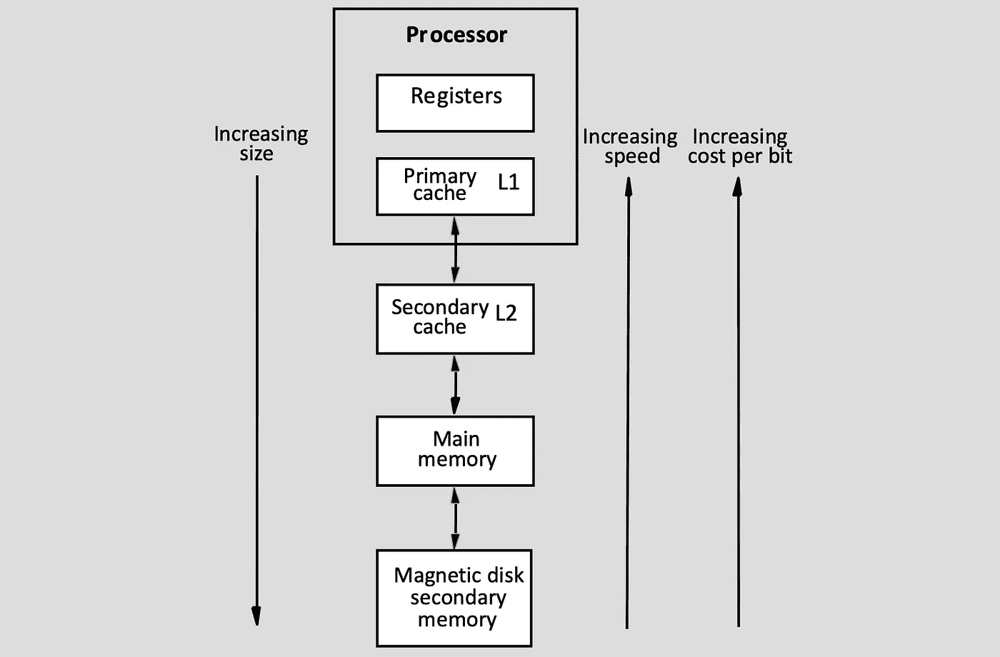
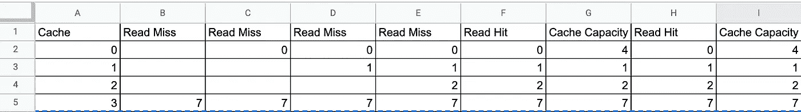

# 直接缓存映射和内存访问时间

> 原文：<https://levelup.gitconnected.com/direct-cache-mapping-and-memory-access-time-d06f5e5ece02>

> 是什么让一个软件开发者觉得自己很有钱？
> 他们的缓存。


图片来自 [Imgur](https://imgur.com/r/gif/KydfV1H) :“如果有疑问，清空你的缓存和 cookies”

一句话，缓存是来自网站或应用程序的数据信息，存储在您的设备上以加快浏览过程。缓存数据使得用户经常浏览的网站以更快的速度加载。

最快的数据存取保存在处理器中。通常，有两级缓存。一级高速缓存位于处理器芯片上。第二层位于主存储器和处理器之间。离处理器的数据越远，计算机检索所需数据的时间就越长。信息在处理器中存储得越近，检索数据的速度就越快。

在下图中，很容易看出处理器、高速缓存和内存是如何相互连接的。一级高速缓存位于处理器内部。在处理器之外，有一个二级高速缓存，主存储器，然后是磁盘二级存储器。



计算机体系结构图

高速缓冲存储器的结构使主存储器在处理器看来比实际速度更快。

当处理器寻找数据时，它首先查看缓存，看它是否在那里。

如果找到了，我们会得到“读取命中”，并从缓存中获取数据。如果信息不在高速缓存中，那么我们得到一个“读未命中”，处理器继续从主存储器中寻找信息，稍后将内容保存到高速缓存中。


缓存图

# 三种类型的缓存未命中

缓存未命中有 3 个原因。

1.  **强制**:第一次进入街区；必须将该块放入缓存中；也称为冷启动未命中或第一参考未命中。
2.  **容量**:由于高速缓存包含程序执行所需的所有块(程序工作集远大于高速缓存容量)，块被从高速缓存中丢弃而发生。
3.  **冲突**:在集合关联或直接映射块放置策略的情况下，当几个块被映射到同一个集合或块帧时，发生冲突未命中；也称为碰撞失误或干扰失误。

> 为什么开发商破产了？因为他用完了所有的缓存。

# 直接缓存映射

在直接映射缓存中，每个内存块在缓存中所占的位置是固定的。例如，假设我们的高速缓存大小为 4，内存访问字符串为“7，0，1，2，1，4，1，7”。

在直接映射缓存中，每个元素都有一个固定的存储位置。因为我们的缓存大小为 4，所以我们只能将元素放在 4 缓存块中。缓存不能一次扩展 4 个元素。当内存访问字符串除以缓存大小时，我们可以通过取模来确定元素应该在的位置。

我们的第一个字符串是 7。7 模 4 是 3。字符串 7 只能存储在缓存中的第三个位置(实际上是第四个位置，因为缓存是基于 0 的索引)



直接缓存过程的示例

在上面的例子中，我们第一次尝试访问字符串时，会查看缓存。我们意识到 7 不在缓存中，因此我们有一个读取未命中。由于 7 mod 4 是 3，我们现在将字符串 7 放入缓存 3 位置。

接下来，我们看字符串 0。0 只能位于缓存位置 0。因为 0 不在那里，所以我们从主内存中取出数据，但是我们将 0 放在缓存中，以便将来更容易定位。在此阶段，0 位于高速缓存位置 0，而 7 仍位于高速缓存位置 3。

接下来，我们看看字符串 1。1 不在缓存中，所以我们从主内存中取出数据，并将其放在缓存位置 1。我们对字符串 2 执行类似的步骤。现在，缓存 0 位置有 0，缓存 1 位置有 1，缓存 2 位置有 2，缓存 3 位置有 7。我们的缓存已满。

我们要访问的下一个字符串是 1。这一次，1 位于缓存位置 1。我们得到一个阅读命中。提取 1 比前一次快，因为它在缓存中。

接下来，我们要拉进 4。4 不在我们的缓存中。如果我们的缓存程序是直接映射的，则 4 只能位于位置 0。我们的缓存容量已满，存在缓存冲突。这一次，我们从 0 缓存位置替换 0，并用 4 替换它。现在我们的缓存有 4、1、2 和 7。

接下来，我们想要获取 1 和 7，在那里我们已经读取了命中，并且我们能够更快地检索数据。

# 存储器存取时间

根据定义，内存访问时间是 RAM 中的一个字符传输到 CPU 或从 CPU 传输出来所需要的时间。快速 RAM 芯片的存取时间为 10 纳秒(ns)或更短。

在上面的例子中，我们可以通过直接缓存映射来计算内存访问时间。


直接缓存过程的示例

存储器访问时间可通过以下公式计算。

```
(# of Hits X time to fetch data from cache) + (# of Misses X time to fetch data from main memory)
```

命中的数目可以从“读取命中”中找到，未命中的数目是“读取未命中”。从高速缓存或主存储器获取数据的时间长度可能不同。

如果从缓存中获取数据的时间是 6 纳秒，从主内存中获取数据的时间是 35 纳秒，那么我们的示例为:

```
(2 X 6ns) + (6 X 30ns) = 192
```

由于高速缓存比主内存更靠近处理器，因此获取数据的速度更快。我们可以看到，处理器从主存中取数据需要的时间越多，内存访问时间就越长。