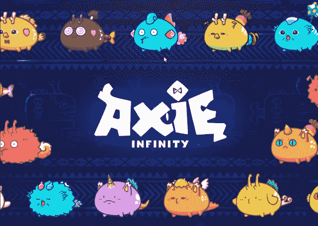

# 不和谐机器人 Axie Infinity 被黑

> 原文：<https://levelup.gitconnected.com/discord-bot-axie-infinity-hacked-3c921f0716d4>

Discord 服务器上的 Axie Infinity 游戏机器人已经成为欺诈操纵的受害者。该项目的代表在推特上宣布了这一消息。

2/公告已被删除，但一些用户可能仍然会看到该消息，直到他们重新开始他们的不和谐。我们已经从服务器上移除了 Mee6 机器人，并且再也不会制造惊喜了。

—轴无穷大🦇🔊(@ axie finity)[2022 年 5 月 18 日](https://twitter.com/AxieInfinity/status/1526760613732564992?ref_src=twsrc%5Etfw)

根据公告，攻击者使用一个被黑的机器人改变了一个假账户的访问权限，随后的目的是发布未经授权的消息。在撰写本文时，该机器人与主 Axie Infinity Discord 服务器离线。

与此同时，Discord 项目的技术支持代表否认了黑客入侵的事实。他们说，没有发现“异常活动”。攻击者发布了什么信息尚不清楚。袭击的规模也不得而知。

3 月底，为 Axie Infinity 供电的区块链浪人网络(Ronin Network ),价值超过 6 亿美元的加密货币被盗。作为攻击的一部分，攻击者设法在 USDC 马厩中取走了 173，600 埃特和 2，550 万埃特。后来，Axie Infinity 的开发商 Sky Mavis 筹集了 1.5 亿美元来支付受影响的各方，并推出了 Axie 的新版本。据美国当局称，与政府政权关系密切的朝鲜黑客参与了此次攻击。

不和谐机器人黑客在 NFT 市场并不少见。例如，5 月，不可替代的 OpenSea 令牌市场的服务器也成为黑客攻击的受害者。然后，通过一个被黑的机器人，攻击者能够代表 OpenSea 与 YouTube 发布虚假的合作伙伴关系，并附上一个欺诈网站的链接。

📰 ***订阅*** [***斐波那契***](https://medium.com/@unclefibonacci) ***保持最新***