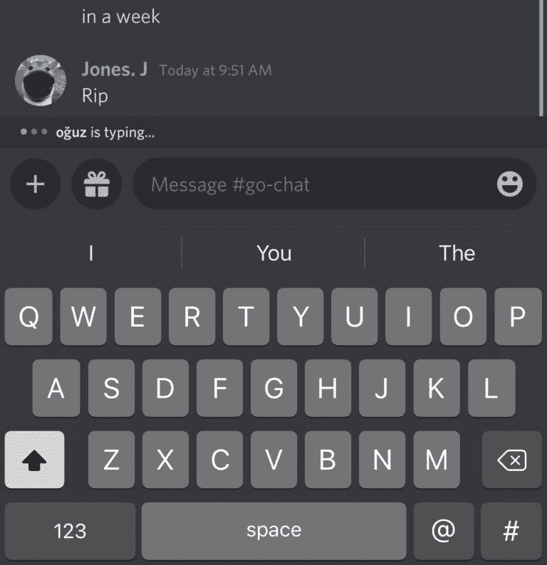

# 隐形打字的不和谐调整

> 原文：<https://levelup.gitconnected.com/discord-tweak-for-invisible-typing-8a44889e5766>


新的越狱隐形打字不和谐调整

包括 Telegram、微信、Facebook Messenger、Discord 在内的许多聊天应用都是用于与朋友交流的实时聊天应用。然而，它们都通过包括打字指示器特征而忽视了隐私。

# 新的调整保护隐私作为奖金

打字指示器是一个隐私问题，应该是 Discord 和其他聊天应用程序上的一个退出功能，因为有些人会认为你只是因为回复了一条消息就有空。他们还会认为你不忙，因为你在花时间打出一条长消息。



不幸的是，不和谐并没有给人们选择退出的能力，这对一些人来说是一个巨大的隐私问题。幸运的是，像 Donator Fiore 这样的天才开发者刚刚发布了一个针对越狱的史诗般的不和谐调整。他将这个项目命名为“隐形打字”,因为国防部就是这么做的。

这一调整允许人们选择退出不一致的打字指示器，这意味着你的朋友不会看到你在打字。当你想放松时，这是保持低调的完美选择，也是钓鱼的绝佳选择。

# 简单易用

这个调整真正令人敬畏的是它是多么容易使用。不需要配置任何设置，也不需要遵循任何特殊规则。一切从一开始就完美无缺。这意味着您可以快速轻松地隐藏您的输入。

我们预计随着这一调整越来越受欢迎，将会有更多的选项，如改变“输入”消息的颜色或切换为总是显示输入指示器。想象一下，如果你的朋友总是认为你在打字，那该有多有趣。史诗巨魔。

目前，这一调整仅适用于 Discord，但如果有足够多的人下载，开发者可能会更新它，使其适用于微信、Facebook Messenger 和 iMessage 等其他平台。

# 访问资源库以下载 Tweak

下载这款越狱软件的最佳地方是多纳托的个人仓库。你所要做的就是访问你的越狱 iPhone 上的库，并使用你最喜欢的包管理器。[回购托管在 GitHub 上。](https://donato-fiore.github.io/repo/)

隐形打字支持所有能够运行 Discord 应用程序的越狱设备。那些尚未使用多纳托个人存储库的用户可以使用下面提供的 URL 将其添加到他们选择的软件包管理器应用程序中:

```
[https://donato-fiore.github.io/repo/](https://donato-fiore.github.io/repo/)
```

**如果这对你有用，请在下面留下评论。你做了什么有趣的事吗？如果它不起作用，请寻求帮助，因为许多像多纳托这样的天才开发人员阅读这个博客。**