# 使用命令行收音机更新您的音乐收藏

> 原文：<https://levelup.gitconnected.com/discover-rejuvenate-your-music-library-with-command-line-f3268db67bba>

## 发现和更新音乐库的指南

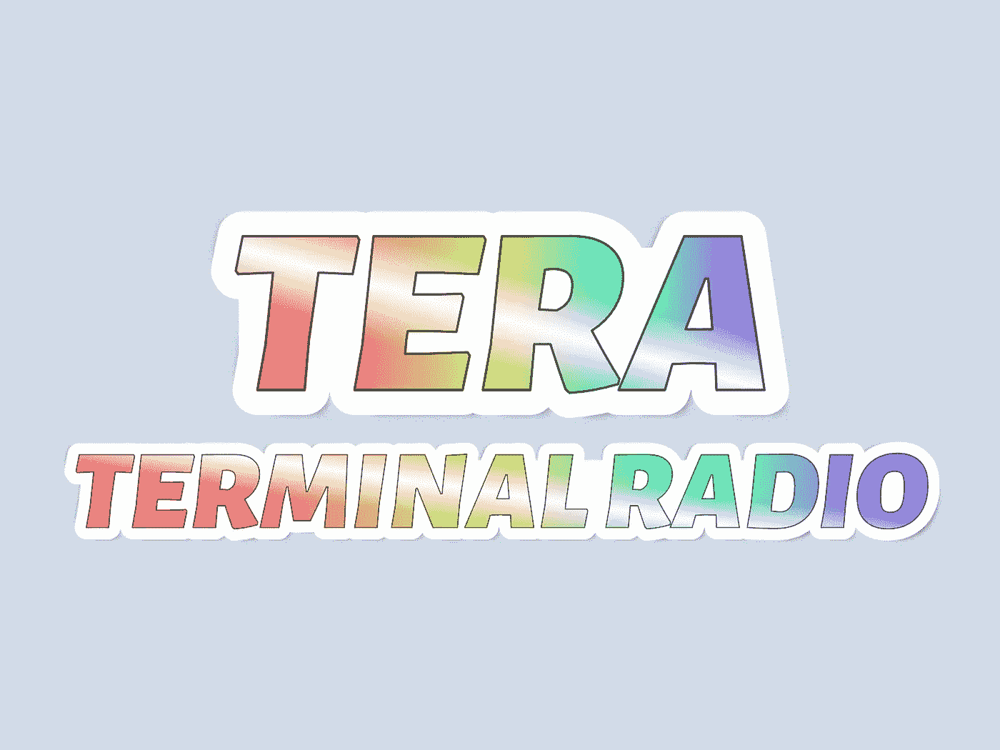

作者使用特效制作的图片。

# 介绍

你是否厌倦了在亚马逊 Prime Music 或 YouTube 上向你推荐相同的老歌而陷入音乐的窠臼？你是否厌倦了 Spotify 等流媒体服务附带的广告？如果你正在寻找一种新的令人兴奋的方式，在工作的时候发现新的音乐，这篇文章就是为你准备的！

在这篇文章中，我们将探讨如何将您的终端改造成一台可以接收 35，000 多个不同电台的收音机。使用 Bash 脚本，我们将向您介绍一个名为 Tera 的交互式终端音乐收音机，它已经在 macOS 和 Ubuntu 上测试过。无论你是一个经验丰富的程序员还是刚刚起步，这都是一个有趣而简单的方法来为你的音乐收藏增加一些多样性。所以，让我们开始修改你的音乐曲目吧！

```
**Table of Contents**
· [Introduction](#db41)
· [Features](#6d54)
· [Requirement](#1ef2)
· [Installation](#20cd)
· [Usage](#140b)
· [Music player keyboard bindings](#5274)
· [Searching stations](#38e8)
· [fuzzy search](#41e0)
· [Saving a radio station](#a0b6)
· [Lists](#1dd7)
· [Delete a radio station](#20d7)
· [“I feel lucky” function to discover hidden gems](#4e6e)
· [Creating a Gist to save all your favorite lists](#0d72)
· [Uninstallation](#e887)
· [Conclusion](#bec0)
```

# 特征

Tera 由免费开源的[无线浏览器 API](https://de1.api.radio-browser.info/) 和 [MPV](https://mpv.io/) 媒体播放器提供支持。使用 Tera，您可以根据标签、名称、语言、国家代码和州等各种标准搜索电台。您可以将喜爱的电台保存到列表中，以便随时快速访问。此外，甚至还有一个“我觉得幸运”菜单，允许你心血来潮发现新的电台。如果你想让你的电台列表有条理，你甚至可以把它们保存到 Gist。

使用 Tera 的好处之一是它不会在你听音乐的时候耗尽你的电脑资源。事实上，它只使用大约 11-13%的 CPU，所以你可以享受你的音乐，而不用担心过热或长时间高速运行你的 CPU。

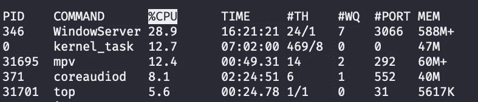

你感兴趣吗？请继续阅读！

# 要求

Tera 使用`wget`命令访问无线电浏览器 API。大多数类 UNIX 操作系统都应该有它。但如果没有，请安装。对于 Mac 用户:

```
brew install wget
```

Tera 要求 [MPV](https://mpv.io/) 。安装 MPV 后，尝试以下代码收听音乐广播。

```
mpv https://live.musopen.org:8085/streamvbr0
```

你也可以观看 Youtube 视频。尝试:

```
mpv [https://www.youtube.com/watch?v=SmHrlKaOBYc&list=RDSmHrlKaOBYc&index=1](https://www.youtube.com/watch?v=SmHrlKaOBYc&list=RDSmHrlKaOBYc&index=1)
```

无线电浏览器 API 返回 JSON 或 XML。Tera 处理 JSON 格式。jq 是一个轻量级的、灵活的命令行 JSON 处理器。

万亿搜索使用 [fzf](https://github.com/junegunn/fzf) 。fzf 是一个通用的命令行模糊查找器。

最后，要将您的列表上传到 Gist，Tera 需要 GitHub CLI [gh](https://cli.github.com/) 。

Mac 用户可以使用自制软件安装它:

```
brew install gh
```

对于 Ubuntu 用户，从[发布页面](https://github.com/cli/cli/releases)下载一个 Debian 包。然后使用`apt`命令安装它:

```
sudo apt install ./[gh_1.13.1_linux_386.deb](https://github.com/cli/cli/releases/download/v1.13.1/gh_1.13.1_linux_386.deb)
```

# 装置

让我们安装 Tera。

您可以在类似 UNIX 的环境中使用 [Awesome 软件包管理器](https://github.com/shinokada/awesome):

```
awesome install shinokada/tera
```

或者家酿/LinuxBrew:

```
brew tap shinokada/tera
brew install tera
```

对于 Debian/Ubuntu，你可以从[发布页面](https://github.com/shinokada/tera/releases)下载一个 Debian 包。

```
sudo apt install ./tera_0.3.13_all.deb
rm -rf ./tera_0.3.13_all.deb
```

Tera 将最喜欢的 JSON 文件存储在`~/.config/tera/favorite`目录中，并使用`~/.cache/tera`目录来保存搜索相关的结果。

安装后，请运行以下程序，检查`mpv`是否安装正确。

```
mpv [https://live.musopen.org:8085/streamvbr0](https://live.musopen.org:8085/streamvbr0)
```

如果它播放音乐，你就可以开始了。

# 使用

运行`tera`命令，你会看到主菜单。Tera 在整个应用程序中使用交互式菜单系统。

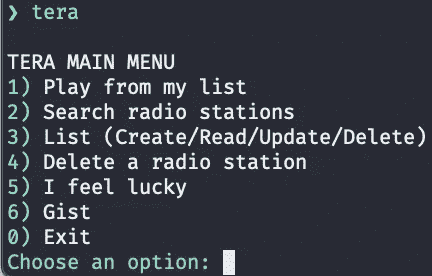

Tera 附带了一个示例播放列表。因此，请继续选择*“1)从我的列表中播放”*。它将向您显示一个样本列表。稍后，我们将创建新的列表。输入 1 选择样本列表，输入 1 或 2 收听广播电台。

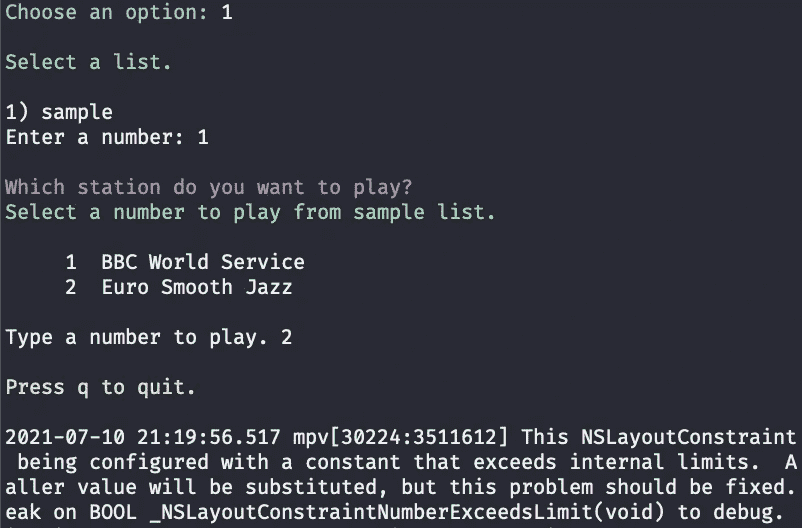

# 音乐播放器键盘绑定

要暂停音乐，请按`q`或`space`。要向前/向后播放音乐，请按右/左箭头。下图显示了更多的键盘绑定。

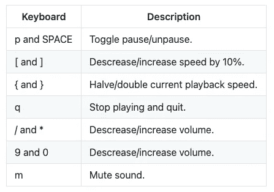

# 搜索电台

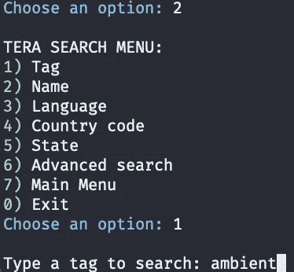

要跳转到搜索菜单，请按主菜单中的*“2)搜索电台】*。在这里，您可以使用标签、名称、语言、国家代码或州进行高级搜索。

“标签”搜索电台的标签字段。“名称”搜索电台名称。“语言”搜索语言字段等。

使用[ISO 3166–1 alpha-2](https://en.wikipedia.org/wiki/ISO_3166-1_alpha-2)作为国家代码。它们是两个字母的国家代码。例如，美国用 us，英国用 gb，德国用 de，法国用 fr，等等。

高级搜索允许您使用多个字段进行搜索。

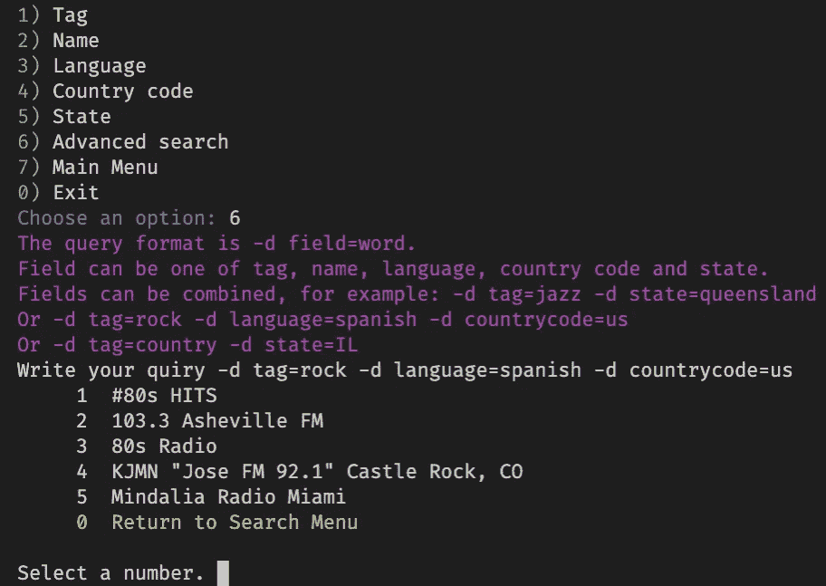

上图展示了一些如何为高级搜索编写查询的例子。每次`field=query`搜索都需要`-d`。

```
-d tag=jazz -d state=queensland
-d tag=rock -d language=spanish -d countrycode=us
-d tag=country -d state=IL
```

# 模糊搜索

搜索会返回许多电台，您可以使用模糊搜索不断微调您的搜索，如下图 gif 所示。

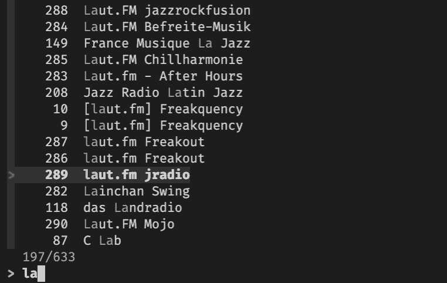

从模糊搜索中选择一个电台后，您需要输入电台编号。您将看到搜索子菜单，在这里您可以播放或保存电台或返回到菜单。

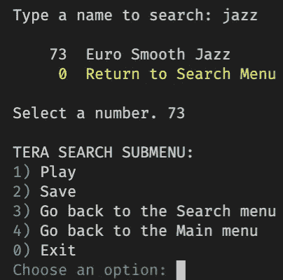

# 拯救广播电台

选择*“2)保存”*将电台保存到列表中，并输入列表编号。

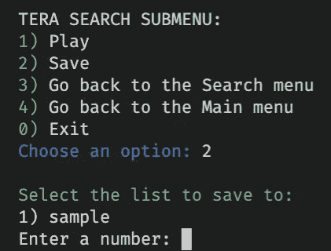

播放完一个电台后，Tera 会询问你是否要将该电台保存到列表中。

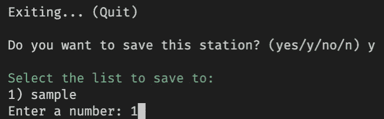

输入您要保存的列表编号。

# 列表

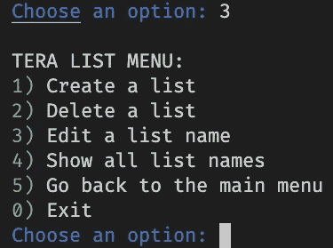

从主菜单中选择*“3)列表(创建/读取/更新/删除)】*跳转到列表菜单，在此可以创建、读取、更新和删除列表。

在这里，我创建了一个名为 80 后的新列表。Tera 自动用破折号替换空格。

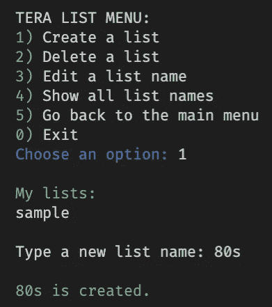

我可以编辑列表名称。

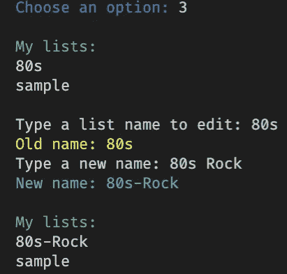

# 删除电台

如果您想删除电台，请从主菜单中选择 *"4)删除电台"*。Tera 会列出所有你喜欢的列表。输入您要删除的列表号码和电台号码。

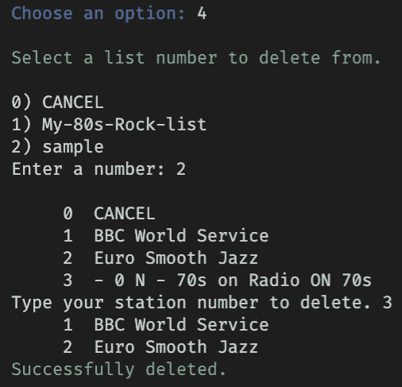

# “我觉得幸运”功能发现隐藏的宝石

*“5)我觉得幸运”*使用你的关键词，随机为你选择一个电台。你可能会发现意想不到的结果。

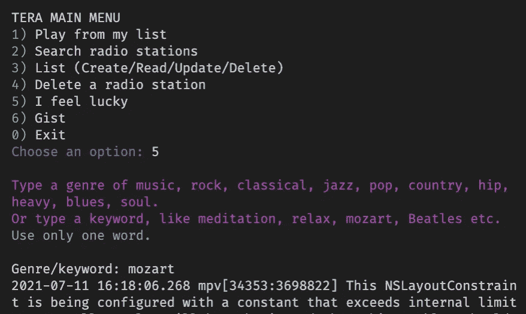

# 创建一个要点来保存所有你喜欢的列表

选择 *"6)要点"*从您所有的收藏夹列表中创建要点。它会打开你的默认浏览器来显示你的要点。

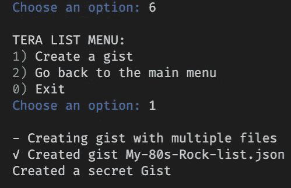

# 卸载

要卸载 Tera，您需要删除`tera`、`~/.config/tera`和`~/.cache/tera`目录。

# 结论

总之，35 K+音乐电台的可用性为发现新音乐和建立个性化的喜爱列表提供了无尽的选择。由于能够创建备份列表，您可以随时轻松地与任何人共享您的列表。此外，该系统可以应用于播客站和 YouTube 播放列表，使其成为满足您所有收听需求的多功能便捷工具。

我们希望您喜欢使用 Tera，并希望听到您的反馈。

编码快乐！

**通过** [**成为**](https://blog.codewithshin.com/membership) **会员，可以完全访问媒体上的每个故事。**


【https://blog.codewithshin.com/subscribe】