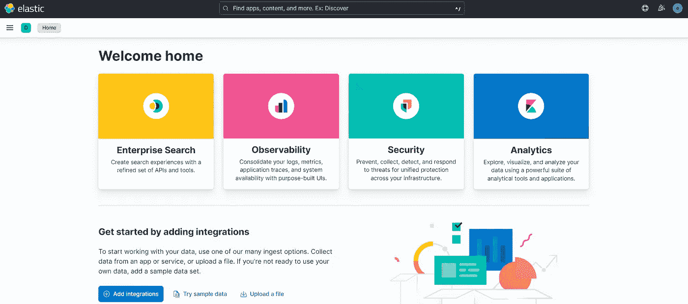
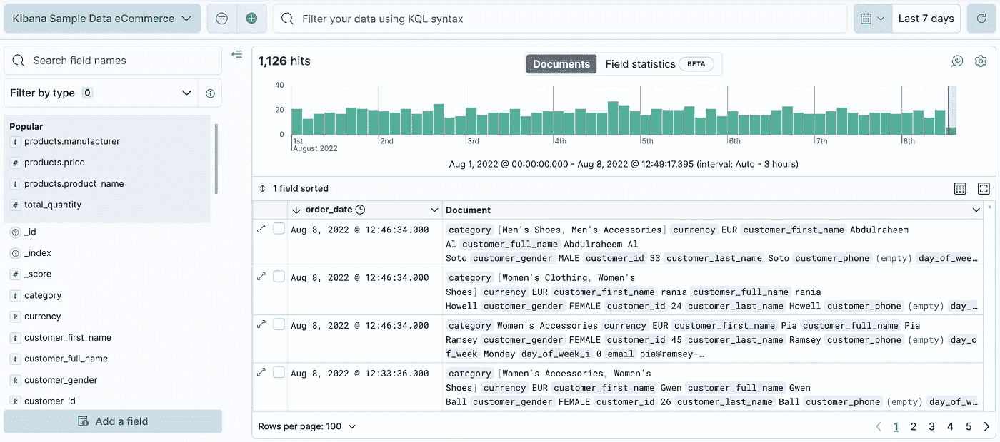
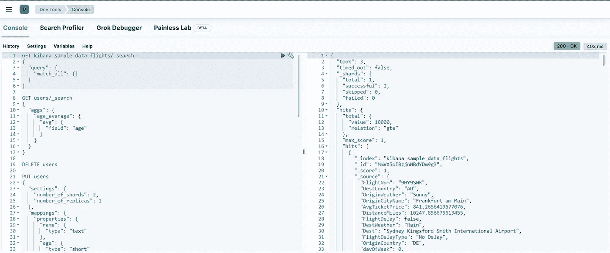
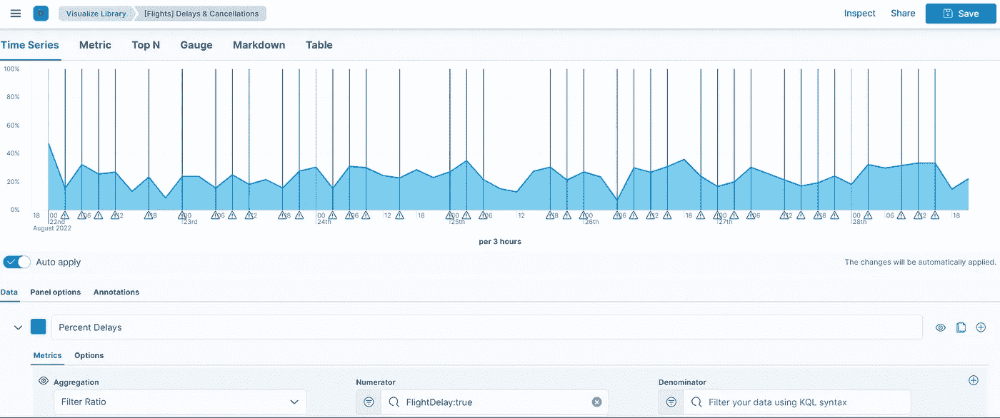
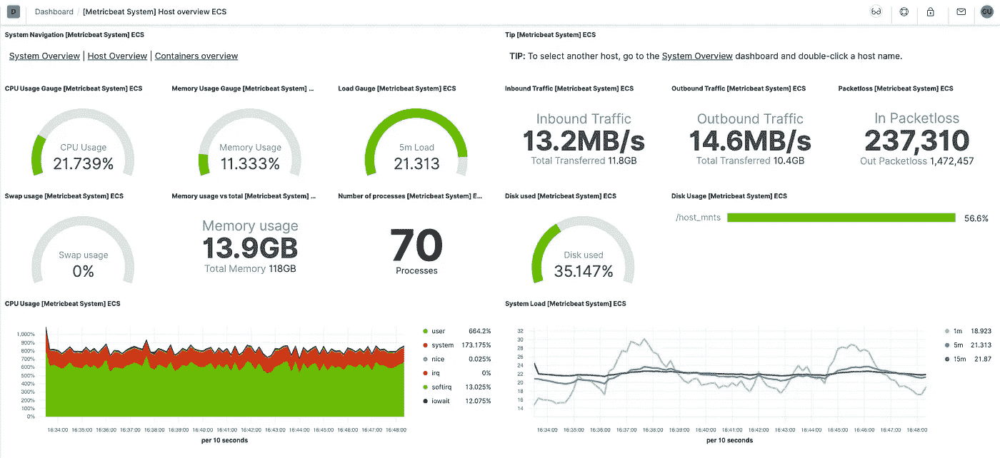

# 发现基巴纳

> 原文：<https://levelup.gitconnected.com/discovering-kibana-685bc6cefc1>

我们已经简短地谈过基巴纳。我们知道它是“堆栈上的窗口”，允许我们进行监控、管理和可视化，我们还看到了如何使用开发工具控制台与 Elasticsearch 进行交互。

今天让我们试着把注意力集中在基巴纳。Kibana 有三个主要用途。

*   **管理和监控:**通过 Kibana，我们可以管理堆栈，增加安全性，例如谁可以访问我们的集群，通过[空间](https://www.elastic.co/guide/en/kibana/master/xpack-spaces.html)隔离工作环境来定义工作区，在监控方面，我们可以通过仪表盘检查 Elasticsearch、Logstash 或 Kibana 本身是否正常工作。
*   **可视化和发现**:这里 Kibana 将使用 Elasticsearch 来创建可视化。Kibana 为创建数据可视化提供了多种选择，包括*仪表盘*、*画布*和许多其他选项。我们可以使用图形界面来搜索和发现我们的文档。实用不是吗？🆒
*   **搜索并保护您的数据** : Kibana 是您访问这些功能和更多功能的入口，包括日志分析、安全漏洞检测等。

注意:在版本 *6.6* 之前，一个 Kibana 实例只能连接到*一个 Elasticsearch 节点*。如今，要保证高可用性，已经不再是这样了。

如果您还没有阅读过这篇关于安装 Kibana 和 Elasticsearch 的文章，我邀请您阅读这篇文章。基巴纳登录页面如下所示:

该界面非常直观，因为它提供了许多关于如何使用不同服务的教程，以及练习和测试 Kibana 提供的特性的样本数据。根据所提供的服务，有几种接口可用。因此，除其他外，我们发现:

## 发现

下面的界面是使用 *kibana_sample_data_flights 生成的。*

这是一个数据探索界面。您可以访问匹配所选索引模式的每个索引中的每个文档。此外，您可以输入搜索词、过滤搜索结果、可视化结果、创建警报，甚至向数据视图添加字段。我强烈建议你看一下由弹性团队提供的关于如何开始使用这个界面的教程。

## 安慰

该接口为您提供了与 Elasticsearch 的 REST APIs 进行交互的可能性。在这里，您可以在左侧块中发送请求，在右侧查看您的响应，获取您的请求历史记录(*维护最近成功执行的 500 个请求的列表*)或通过单击运行按钮旁边的设置图标查看 API 端点的文档。首先打开 Kibana 的登陆页面，在*管理*行，选择*开发工具*、*控制台*，然后写下你的请求💁。

## 数据可视化工具

从 *Visualize library* 访问，顾名思义，data visualizer 将允许您将数据转换成不同的图表，以便于阅读和解释*(赋予它生命)*。Kibana 为您提供大量图表，如*条形图、折线图、饼图、表格数据*、*等。根据你掌握的事实和将要用到的情景选择一个。*

## 监视

您可以使用此页面监视集群的性能和正常运行。这里收集了来自集群中的 Elasticsearch 节点、Logstash 节点、Kibana 实例和 Beats 的数据。您将需要安装我们在第一章中讨论过的[，一个像 **MetricBeat** 这样的监控 beat，以便收集有关 Elasticsearch、Kibana、Logstash 和 Beats 的数据并直接发送到您的监控集群。这可以是下一篇文章的主题😉。](https://medium.com/@mhdabdel151/elastic-stack-in-3-mins-c46354d4d310)

Kibana 提供了更多的特性来帮助我们理解我们的数据，[这个官方文档的链接](https://www.elastic.co/kibana/features)将为您提供 Kibana 提供的所有特性的详尽列表。

今天就到这里，感谢您的阅读，如果您对本文有任何问题或意见，请在下面留下您的评论。

我们下次再见，看更多的帖子🚀。

阿卜杜尔-巴吉