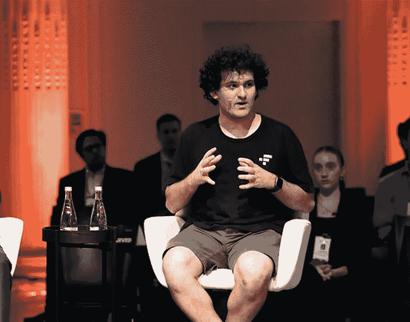
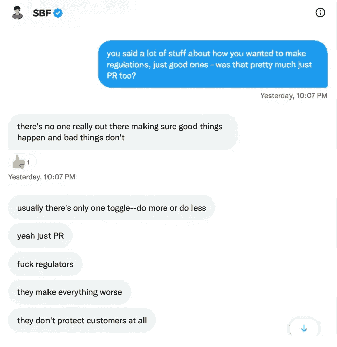
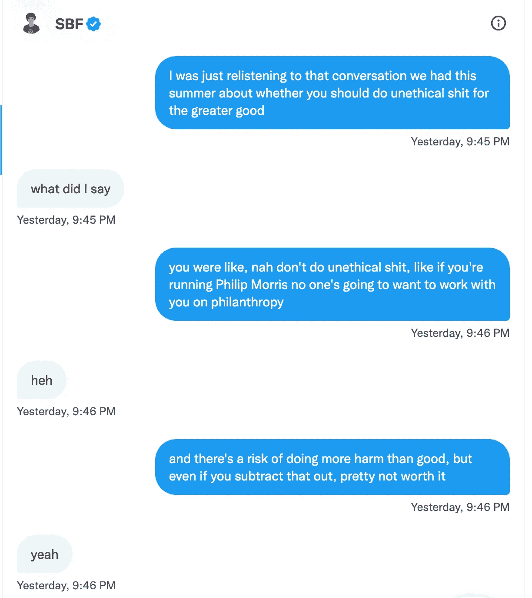
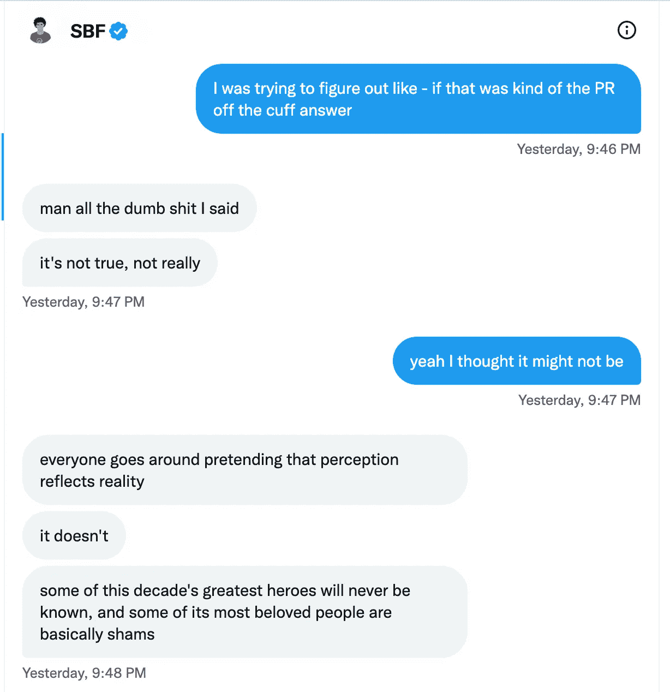
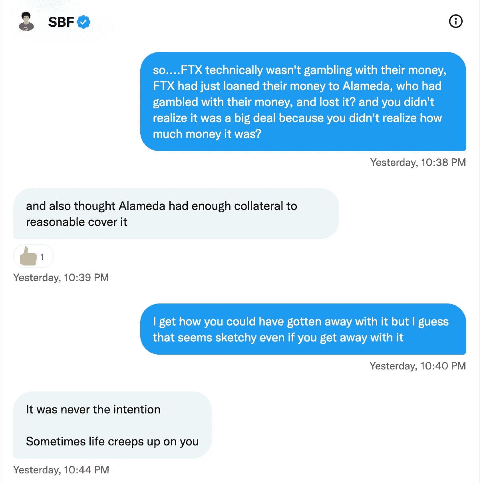
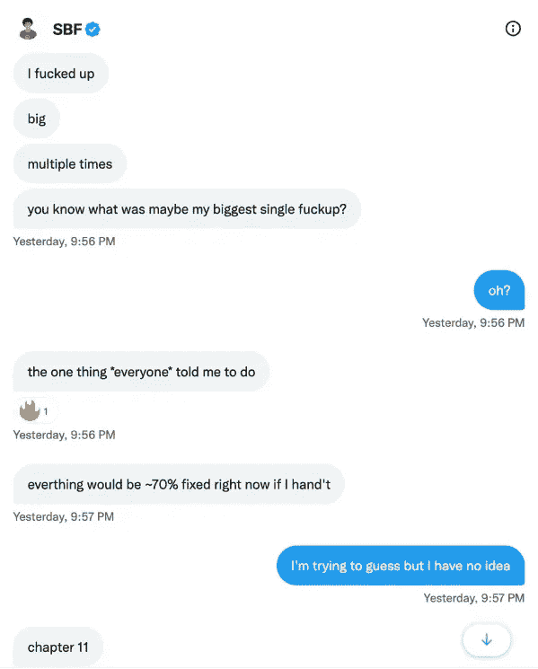
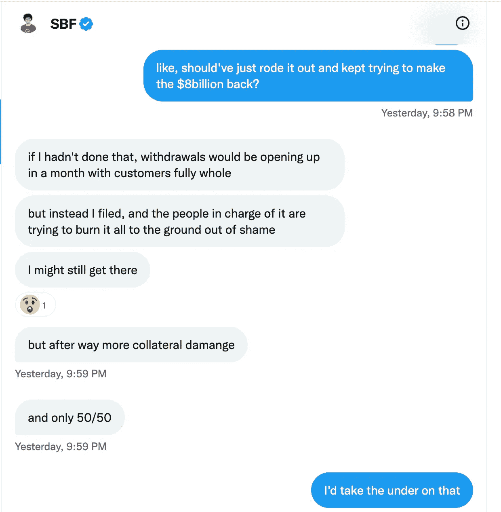

# 名誉扫地的亿万富翁比历史上任何人都更快地失去了他的净资产(加密货币)

> 原文：<https://levelup.gitconnected.com/disgraced-billionaire-lost-his-net-worth-faster-than-anyone-in-history-cryptocurrency-be6e32b8bfd8>

如果不是真实的你，你会一直暴露。

照片由[佛罗里达大学研究院](https://www.flickr.com/photos/future_investment_initiative/) — Flikr 拍摄

投资者称山姆·班克曼·弗里德(SBF)为加密货币的沃伦·巴菲特。

原因显而易见。

SBF 的交易实力、对区块链技术的了解以及建立像 FTX 这样强大平台的能力吸引了主流投资者。

他似乎也有一个伟大的世界观，那就是把他的大部分收入捐给慈善机构。

随着洋葱皮开始剥落，现在看来，他在媒体上所描绘的无私的人并不是真正的他。

SBF 是人，但他的错误最终是灾难性的。

*   他交易和借入客户存款。
*   他和其他 10 名员工住在价值 4000 万美元的豪宅里，他们都有着多重关系。
*   音盲和营销上的轻浮支出，例如 2 亿美元将迈阿密热火体育场改名为 FTX 竞技场。
*   给民主党的 4 千万美元竞选捐款
*   现在，明显缺乏悔意。

FTX 曾经是一个强大而受欢迎的加密货币交易所，价值 320 亿美元。

几乎一夜之间，它就跌到了 0 美元，并申请破产。

现在怀疑其创始人 SBF 利用 FTX 客户的资金进行交易。

FTX 用于支付客户提款的总准备金为 10 亿美元，而其姊妹公司 Alameda Research 的负债为 90 亿美元。

根据彭博[亿万富翁指数](https://www.bloomberg.com/news/articles/2022-11-11/sam-bankman-fried-s-assets-go-from-16-billion-to-zero-after-ftx-collapse?leadSource=uverify%20wall)，这是人类历史上个人净资产最高和最快的下降。

# **事情变得更糟。**

SBF 的净资产仍然只有区区 9 亿美元，尽管他还得完成 FTX 的破产。

有消息称，他的加密货币交易所已经崩溃，数十亿客户存款消失，这导致 SBF 在巴哈马被捕，随后受到美国证券交易委员会的调查。

一名新闻记者在 Twitter D.M .上找到了他，信息交流很能说明问题。

这暴露了他的真实想法。

记者凯尔西·派珀(Kelsey Piper)表示，他们不希望他做出回应，因为接受调查的人通常不会回复置评请求。

班克曼-弗里德想谈谈，在交流过程中很明显，这是非常自我驱动的，几乎没有悔恨。

SBF 坦率地谈到 FTX 在没有意识到的情况下赌博输掉了客户的钱，并挖苦了他的竞争对手。

通过文字来收集某人的语气是一项挑战，但记者凯尔西·派珀离开谈话时被他的话吓坏了，并感到 SBF 所说的困扰他的错误没有在信息中显示出来。

在 FTX 崩溃之前，SBF 是引入加密货币监管框架的典型代表，并避免批评美国监管机构。

在与派珀的交流中，他把自己的游说努力比作良好的公关。

它暴露了他的实际观点，并证实了愤世嫉俗者的观点，他们认为他试图赢得美国监管机构的支持有利于他的形象，而不是他认为对 Crypto 有利的事情。

> SBF 的回答是灰色的，风笛手是蓝色的。

来源— [凯尔西·派珀](https://www.vox.com/future-perfect/23462333/sam-bankman-fried-ftx-cryptocurrency-effective-altruism-crypto-bahamas-philanthropy#)

人们不禁要问，SBF 是否愿意走捷径来增加自己的收益。这是 Piper 在[采访](https://www.nytimes.com/2022/11/14/technology/ftx-sam-bankman-fried-crypto-bankruptcy.html)中曾经问过他的一个问题，但是在他们的 Twitter 交流中，Piper 重提了这个关于道德的问题。

SBF 回答说，“伙计，我说的那些蠢话”

SBF 坚称，FTX 从未将客户存款投资于 FTX 交易所。

来源— [凯尔西·派珀](https://www.vox.com/future-perfect/23462333/sam-bankman-fried-ftx-cryptocurrency-effective-altruism-crypto-bahamas-philanthropy#)

来源— [凯尔西·派珀](https://www.vox.com/future-perfect/23462333/sam-bankman-fried-ftx-cryptocurrency-effective-altruism-crypto-bahamas-philanthropy#)

派珀在他们的推特交流中向他施压。

尽管他继续坚称 FTX 没有动用客户存款，但他表示，姊妹公司阿拉米达从 FTX 的资产负债表上借入了过多资金，并将其用于投资。

所以，简而言之，他做到了。

当一连串的顾客想要把他们的钱取出来时，这使得 FTX 资金短缺。

SBF 说，他认为阿拉米达会有足够的钱来支付 FTX 客户的提款，但正如他所说，“有时生活会悄悄靠近你”。

来源— [凯尔西·派珀](https://www.vox.com/future-perfect/23462333/sam-bankman-fried-ftx-cryptocurrency-effective-altruism-crypto-bahamas-philanthropy#)

SBF 说，大多数交易所已经做了 FTX 所做的一些变体，只是它们与 FTX 不在一个水平上，并且没有银行挤兑(一群人都想在同一时间取出他们的存款)。

SBF 说，他不应该同意破产，并继续试图筹集更多的钱，因为如果他这样做，“提款将在一个月内开放，客户完全完整。”

如果有新的资金进来，他需要 80 亿美元来填补债权人的缺口，而有 80 亿美元闲钱的公司就那么多。

有一种理论认为，他只需要 20 亿或 30 亿美元，因为一旦客户感到安全，他们就会继续将资金留在交易所。

世界知名对冲基金经理凯文·奥利里(Kevin O'Leary)表示，一旦公司安全了，并不是所有的投资者都会走进敞开的大门，因此他认为 80 亿美元并不是立即需要的。

SBF 认为他本可以赢得一些时间来积累更多的资本，并表示破产是他最大的错误。

来源— [凯尔西·派珀](https://www.vox.com/future-perfect/23462333/sam-bankman-fried-ftx-cryptocurrency-effective-altruism-crypto-bahamas-philanthropy#)

来源——[凯尔西·派珀](https://www.vox.com/future-perfect/23462333/sam-bankman-fried-ftx-cryptocurrency-effective-altruism-crypto-bahamas-philanthropy#)

# 最后的想法

30 岁的萨姆·班克曼·弗里德在四年多的时间里成为亿万富翁，这是人类历史上最快的。

我从投资中学到的最大教训是，不要听人们说什么，而要看他们做什么。

SBF 是一个交易者，这是他赚钱的方式，交易者经常会破产。

十个孩子在经营 FTX，大部分都是第一次创业，显然没有风险管理，所有人都在互相欺骗。

他们的确是。

它没有给反对或挑战观点以及在回音室中兴奋的空间。

棺材上的最后一颗钉子是与一名记者的 Twitter D.M .交流。

这是因为他身边缺少一个有经验的团队。

这一事件让监管者起床，无疑将加速亟需的监管。

这也导致了一系列加密货币交易所显示储备证明，以缓解客户的紧张情绪。

> *如果你想在 Web3 上读到更多我的观点，请考虑成为会员。你的会员费直接支持你读的作家。如果你用我的链接* [*注册，我会赚一小笔佣金。点击这里*](https://medium.com/@jayden_levitt/membership) *。*

*本文仅供参考；不应将其视为财务、税务或法律建议。在做出任何重大的财务决定之前，你可以咨询财务专家。*