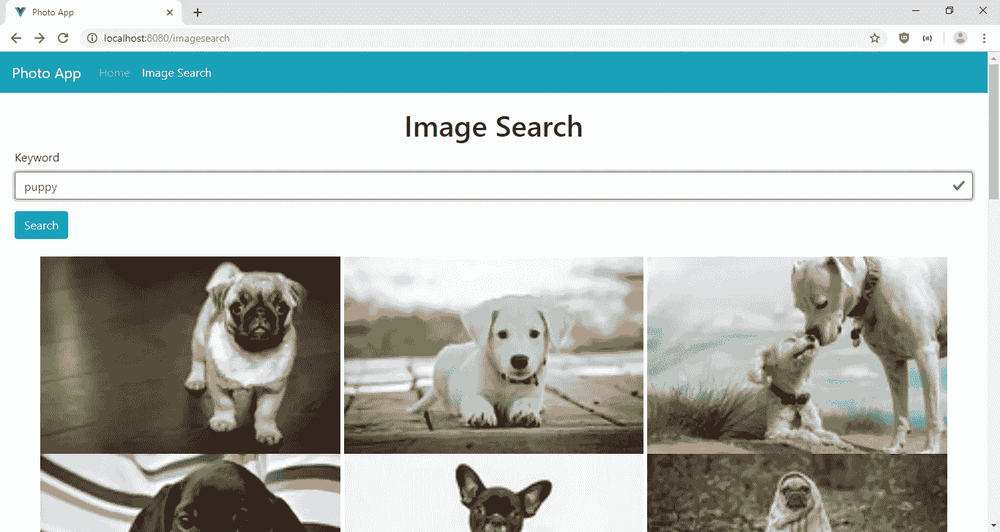
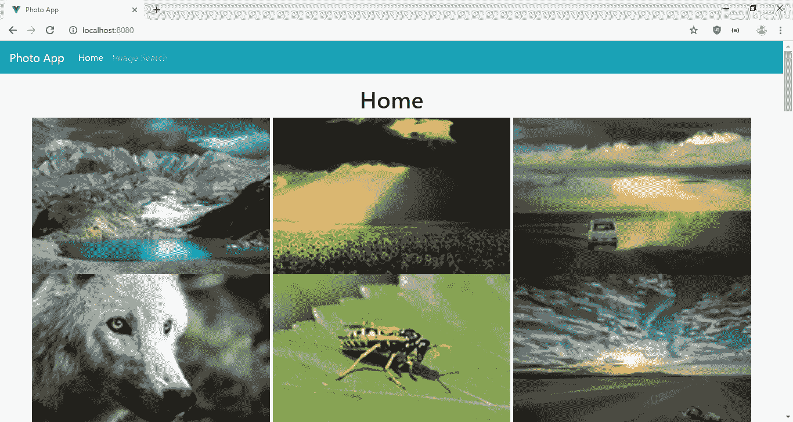

# 使用 Vue.js 显示 Google 和 Flickr 等图像

> 原文：<https://levelup.gitconnected.com/display-images-like-google-and-flickr-with-vue-js-e4cb8159ecfa>



如果你使用像谷歌图片搜索或 Flickr 这样的图片搜索网站，你会注意到它们的图片显示在一个网格中，看起来像一堵砖墙。这些图像高度不均匀，但宽度相等。这被称为砖石效应，因为它看起来像一堵砖墙。

为了实现砖石效果，我们必须将图像的宽度设置为与屏幕宽度成比例，并将图像的高度设置为与图像的纵横比成比例。

如果在没有任何库的情况下完成，这是一件痛苦的事情，所以人们制作了一些包来创造这种效果。

在本文中，我们将构建一个照片应用程序，允许用户搜索图像并在砖石网格中显示图像。图像网格将无限滚动，以获得更多的图像。我们将使用`vue-masonry`库渲染图像网格，使用 `vue-infinite-scroll`渲染无限滚动效果。

我们的应用程序将显示来自 Pixabay API 的图像。您可以查看 API 文档并在[https://pixabay.com/api/docs/](https://pixabay.com/api/docs/)注册一个密钥

## 入门指南

一旦我们有了 Pixabay API 密钥，我们就可以开始编写我们的应用程序了。首先，我们创建一个名为`photo-app`的项目。运行:

```
npx @vue/cli create photo-app
```

这将为我们的应用程序创建文件，并为内置库安装软件包。我们选择‘手动选择特性’并选择 Babel、Vue 路由器和 CSS 预处理器。

接下来，我们安装自己的软件包。我们需要上面提到的 `vue-masonry`库和`vue-infinite-scroll`。此外，我们需要 BootstrapVue 进行样式化，Axios 进行 HTTP 请求，Vee-Validate 进行表单验证。

我们通过运行以下命令来安装所有软件包:

```
npm i axios bootstrap-vue vee-validate vue-infinite-scroll vue-masonry
```

## 构建应用程序

安装好所有的包后，我们就可以开始编写我们的应用程序了。在`src`目录下创建一个`mixins`文件夹，并创建一个`requestsMixin.js`文件。

然后，我们将以下内容添加到文件中:

```
const axios = require("axios");
const APIURL = "[https://pixabay.com/api](https://pixabay.com/api)";export const requestsMixin = {
  methods: {
    getImages(page = 1) {
      return axios.get(`${APIURL}/?page=${page}&key=${process.env.VUE_APP_API_KEY}`);
    }, searchImages(keyword, page = 1) {
      return axios.get(
        `${APIURL}/?page=${page}&key=${process.env.VUE_APP_API_KEY}&q=${keyword}`
      );
    }
  }
};
```

我们在这里调用端点来搜索图像。`process.env.VUE_APP_API_KEY`是从我们项目的根文件夹中的`.env`文件中获取的。注意，我们使用的环境变量需要有以`VUE_APP`开头的键。

接下来，在`Home.vue`中，将现有代码替换为:

```
<template>
  <div class="page">
    <h1 class="text-center">Home</h1>
    <div
      v-infinite-scroll="getImagesByPage"
      infinite-scroll-disabled="busy"
      infinite-scroll-distance="10"
    >
      <div
        v-masonry="containerId"
        transition-duration="0.3s"
        item-selector=".item"
        gutter="5"
        fit-width="true"
        class="masonry-container"
      >
        <div>
          
        </div>
      </div>
    </div>
  </div>
</template><script>
import { requestsMixin } from "../mixins/requestsMixin";export default {
  name: "home",
  mixins: [requestsMixin],
  data() {
    return {
      images: [],
      page: 1,
      containerId: null
    };
  },
  methods: {
    async getImagesByPage() {
      const response = await this.getImages(this.page);
      this.images = this.images.concat(response.data.hits);
      this.page++;
    }
  },
  beforeMount() {
    this.getImagesByPage();
  }
};
</script>
```

我们在这里使用`vue-infinite-scroll`和`vue-masonry`包。注意，我们指定了`transition-duration`来调整从不显示到显示图像的过渡，并且`fit-width`使列适合容器。`gutter`以像素为单位指定每列之间的间距宽度。我们还在`v-masonry`容器中设置了一个 CSS 类名，以便以后更改样式。

在`v-masonry` `div`中，我们循环遍历这些图像，我们设置`v-masonry-tile`来表示它是平铺的，这样它会将它们调整到砖石网格的大小。

在`script`对象中，我们用`beforeMount`钩子加载页面时获取图像。因为我们添加了无限滚动，所以当用户向下滚动时，我们不断向数组添加图像。当用户按照`v-infinite-scroll`道具的指示向下滚动时，我们调用`getImagesByPage`。我们将`infinite-scroll-disabled`设置为`busy`来设置禁用滚动。`infinite-scroll-distance`表示要触发的滚动距离页面底部的百分比。

接下来在`views`文件夹中创建`ImageSearchPage.vue`并添加:

```
<template>
  <div class="page">
    <h1 class="text-center">Image Search</h1>
    <ValidationObserver ref="observer" v-slot="{ invalid }">
      <b-form [@submit](http://twitter.com/submit).prevent="onSubmit" novalidate>
        <b-form-group label="Keyword" label-for="keyword">
          <ValidationProvider name="keyword" rules="required" v-slot="{ errors }">
            <b-form-input
              :state="errors.length == 0"
              v-model="form.keyword"
              type="text"
              required
              placeholder="Keyword"
              name="keyword"
            ></b-form-input>
            <b-form-invalid-feedback :state="errors.length == 0">Keyword is required</b-form-invalid-feedback>
          </ValidationProvider>
        </b-form-group> <b-button type="submit" variant="primary">Search</b-button>
      </b-form>
    </ValidationObserver> <br /> <div
      v-infinite-scroll="searchAllImages"
      infinite-scroll-disabled="busy"
      infinite-scroll-distance="10"
    >
      <div
        v-masonry="containerId"
        transition-duration="0.3s"
        item-selector=".item"
        gutter="5"
        fit-width="true"
        class="masonry-container"
      >
        <div>
          
        </div>
      </div>
    </div>
  </div>
</template><script>
import { requestsMixin } from "../mixins/requestsMixin";export default {
  mixins: [requestsMixin],
  data() {
    return {
      form: {},
      page: 1,
      containerId: null,
      images: []
    };
  },
  methods: {
    async onSubmit() {
      const isValid = await this.$refs.observer.validate();
      if (!isValid) {
        return;
      }
      this.page = 1;
      await this.searchAllImages();
    }, async searchAllImages() {
      if (!this.form.keyword) {
        return;
      }
      const response = await this.searchImages(this.form.keyword, this.page);
      if (this.page == 1) {
        this.images = response.data.hits;
      } else {
        this.images = this.images.concat(response.data.hits);
      }
      this.page++;
    }
  }
};
</script>
```

无限滚动和砖石布局几乎相同，除了当`keyword`改变时，我们将`this.images`数组重新分配给新的项目，而不是一直将它们添加到现有的数组中，以便用户看到新的结果。

表单被包装在`ValidationObserver`中，这样我们就可以得到里面整个表单的验证状态。在表单中，我们用`ValidationProvider`包装输入，以便可以验证表单字段并显示输入的验证错误消息。我们检查是否填写了`keyword`。

一旦用户单击 Search，就会运行`onSubmit`回调，它执行`await this.$refs.observer.validate();`来获得表单验证状态。如果结果为`true`，则`searchAllImages`将运行以获取图像。

接下来，我们用以下代码替换`App.vue`中的现有代码:

```
<template>
  <div>
    <b-navbar toggleable="lg" type="dark" variant="info">
      <b-navbar-brand href="#">Photo App</b-navbar-brand> <b-navbar-toggle target="nav-collapse"></b-navbar-toggle> <b-collapse id="nav-collapse" is-nav>
        <b-navbar-nav>
          <b-nav-item to="/" :active="path == '/'">Home</b-nav-item>
          <b-nav-item to="/imagesearch" :active="path == '/imagesearch'">Image Search</b-nav-item>
        </b-navbar-nav>
      </b-collapse>
    </b-navbar>
    <router-view />
  </div>
</template><script>
export default {
  data() {
    return {
      path: this.$route && this.$route.path
    };
  },
  watch: {
    $route(route) {
      this.path = route.path;
    }
  }
};
</script><style lang="scss">
.page {
  padding: 20px;
}.item {
  width: 30vw;
}.masonry-container {
  margin: 0 auto;
}
</style>
```

我们在这里添加了 BootstrapVue `b-navbar`来显示一个带有页面链接的顶栏。在`script`部分，我们通过获取`this.$route.path`来观看当前路线。我们通过对照我们观察的`path`来检查路径来设置`active`道具，以突出链接。

在`style`部分，我们用`page`类设置页面的填充，用`item`类设置图片宽度，如`v-masonry` div 的 `item-selector`所示，我们将`masonry-container`的边距设置为`0 auto`，这样它将在页面上居中。

接下来在`main.js`中，将现有代码替换为:

```
import Vue from "vue";
import App from "./App.vue";
import router from "./router";
import "bootstrap/dist/css/bootstrap.css";
import "bootstrap-vue/dist/bootstrap-vue.css";
import BootstrapVue from "bootstrap-vue";
import { ValidationProvider, extend, ValidationObserver } from "vee-validate";
import { required } from "vee-validate/dist/rules";
import { VueMasonryPlugin } from "vue-masonry";
import infiniteScroll from "vue-infinite-scroll";Vue.config.productionTip = false;extend("required", required);
Vue.component("ValidationProvider", ValidationProvider);
Vue.component("ValidationObserver", ValidationObserver);
Vue.use(VueMasonryPlugin);
Vue.use(infiniteScroll);
Vue.use(BootstrapVue);new Vue({
  router,
  render: h => h(App)
}).$mount("#app");
```

这将添加我们在组件中使用的所有库以及我们使用的 Vee-Validate 验证规则。此外，我们在这里导入我们的引导样式，这样我们就可以在任何地方看到这些样式。

接下来在`router.js`中，将现有代码替换为:

```
import Vue from "vue";
import Router from "vue-router";
import Home from "./views/Home.vue";
import ImageSearchPage from "./views/ImageSearchPage.vue";Vue.use(Router);export default new Router({
  mode: "history",
  base: process.env.BASE_URL,
  routes: [
    {
      path: "/",
      name: "home",
      component: Home
    },
    {
      path: "/imagesearch",
      name: "imagesearch",
      component: ImageSearchPage
    }
  ]
});
```

这增加了我们的路线。

一切完成后，我们通过执行`npm run start`来运行我们的应用程序，我们应该得到:

