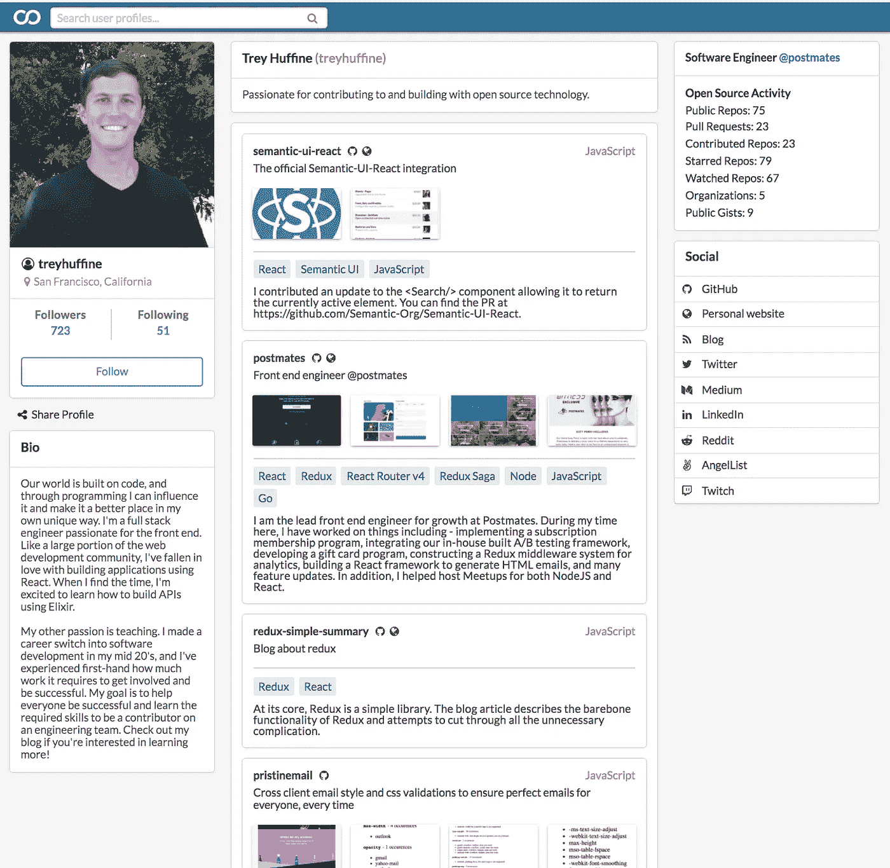
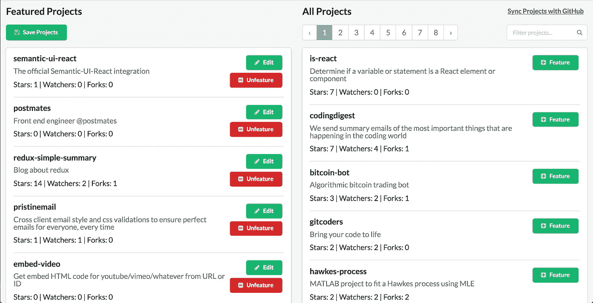
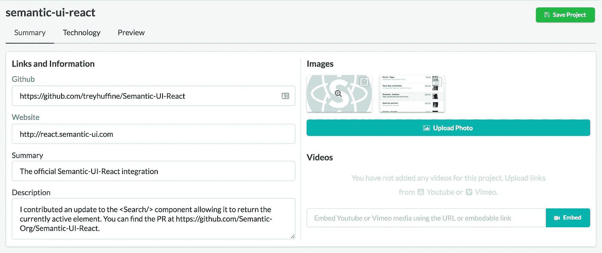
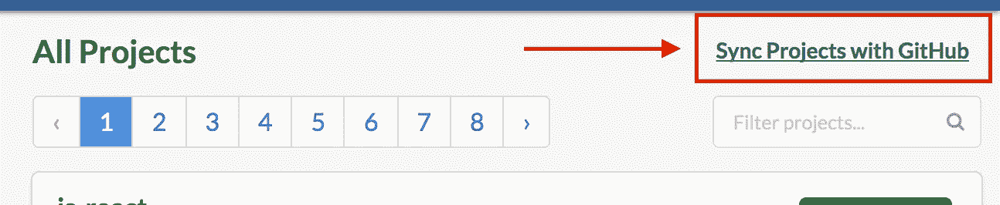

# 在 gitconnected 上展示您的项目和作品集

> 原文：<https://levelup.gitconnected.com/display-your-projects-and-portfolio-on-gitconnected-b2e72e8270b6>

作为开发人员，很难建立和维护一个投资组合。这个过程通常需要创建一个个人网站，其中涉及到拿出一个独特的设计，然后手动添加和更新每个不同的项目。在投入几个小时的努力后，我们不得不希望其他开发者或招聘人员会发现我们的网站，看到我们已经建立的很酷的东西。

[gitconnected](https://gitconnected.com) 消除了所有压力。我们开发了一种简化的方法，将过去需要几个小时或几天的流程变为只需几分钟。那么别人发现你的作品就异常容易。

首先，转到`gitconnected.com/projects`并选择您想要展示的项目。

上传截屏或视频，帮助社区更好地了解您的成果。此外，您可以添加额外的字段，如语言、库和描述，以提供更多的细节。点击保存，你就完成了！

你还可以免费获得所有新的开源软件。只需在`gitconnected.com/projects`点击“与 GitHub 同步项目”，我们将获取您所有的最新更新。

## 如果您有任何反馈或问题，请在下面回复！

 [## git connected——开发者和软件工程师社区

### 创建一个帐户或登录 gitconnected，这是连接像您这样的人的最大网络。关注最新打开的…

gitconnected.com](https://gitconnected.com)