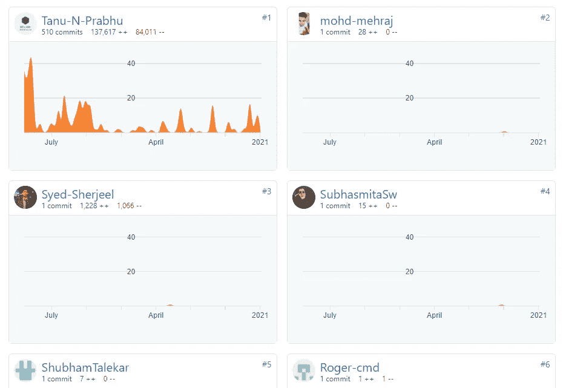

# 毫不费力地在自述文件中显示贡献者图像！

> 原文：<https://levelup.gitconnected.com/displaying-contributors-image-on-readme-files-with-no-pain-f1cbaca963e8>

## 使用 contributor-img 生成一个图像，显示 GitHub 存储库上的贡献者。

**照片由** [**Icons8 团队**](https://unsplash.com/@icons8?utm_source=unsplash&utm_medium=referral&utm_content=creditCopyText) **上** [**下**](https://unsplash.com/s/photos/project?utm_source=unsplash&utm_medium=referral&utm_content=creditCopyText)

# 介绍

在这个美丽的世界里，贡献者在贡献他们的财富、知识、快乐给社区、项目、社会，甚至是一个永无止境的问题的解决方案中扮演着突出的角色。每当我听到贡献者这个词时，我脑海中总会浮现出一个地方，那就是 GitHub。好吧，没什么疯狂的 GitHub 有超过 5600 万的用户，也就是开发者，超过 300 万的组织，超过 1 亿的仓库。其中有 100 多万活跃的贡献者，他们将数百或数千行代码推送到其他存储库。这种情况每天都会发生，甚至每小时都会发生。

现在，如果你有一个 GitHub 库，里面有超过一千个[叉](https://docs.github.com/en/free-pro-team@latest/github/getting-started-with-github/fork-a-repo)或[星](https://stars.github.com/)。你可能会像我一样收到很多拉取请求。这是普遍的事实。每当您将一个拉请求合并到您的存储库中时，生成初始请求的那个将自动成为您的存储库的贡献者。好吧，我告诉你们，没有其他简单的方法可以阻止这一切。承认吧。

# 导航至参与者仪表板

有一种方法可以从您的存储库本身导航到贡献者的仪表板。你所要做的就是导航到**洞察→贡献者。**在这里，您可以查看您的贡献者在您的存储库上执行的**添加**、**删除**和**提交**。下面是我不太出名的知识库的截图。

有 10 个贡献者把他们聚集在一起是非常激动人心的。 [**GitHub**](https://github.com/Tanu-N-Prabhu/Python/graphs/contributors)

# **GitHub 显示的贡献者(不在 Readme.md 文件上)**

GitHub sorta 很好地在存储库的右下角显示了贡献者，如下所示。

**GitHub 显示的贡献者**

但是如果你需要在你的 **Readme.md** 文件中显示贡献者呢？不要想用 Markdown 直接写所有的贡献者。现在是 2021 年，有令人惊叹的网络应用程序可以生成图片形式的贡献者列表。一个这样的例子就是 [**投稿人——img**](https://contrib.rocks/preview)**。**

# 使用 contributors-img 显示的贡献者(在 Readme.md 文件上)

> [**contributors——img**](https://dev.to/lacolaco/introducing-contributors-img-keep-contributors-in-readme-md-gci)**——**一个 web 应用程序，它生成一个图像来显示您的 GitHub 资源库的贡献者。— [杉并守](https://dev.to/lacolaco)

生成图像非常简单。你所要做的就是导航到[**contributors-img**](https://contrib.rocks/preview)**，然后粘贴你的库的**名称**和你的**用户名**，生成如下所示的 URL。**

****

****使用 contributors-img 生成图像****

**或者你也可以用代码生成一个图像。将其复制粘贴到您的 Readme.md 文件中。**

**好吧，这就对了。在输入您的凭证，比如 GitHub **用户名**和**库名**之后，您应该能够看到一个包含您所有贡献者的图像。在我的例子中，它将如下所示。**

****

****在 Readme.md 文件上显示贡献者图像****

# **结论**

**好了，伙计们，现在你们已经成功地学会了如何使用[**contributors-img**](https://contrib.rocks/preview)web 应用程序生成贡献者的图像并将其显示在 Readme.md 文件中。那么你在看这篇文章之前用过吗？如果**是**，请在评论区告诉我更多关于它的信息。如果**不是**，用完后告诉我。无论如何，在结束这个简短的教程之前，请记住要感谢贡献者，这通常是一个很好的做法。这是科技行业经常遵循的原则。好了，该说再见了。敬请关注。更多有趣的教程还在后面。在那之前，祝你白天/晚上愉快。注意安全！！！**