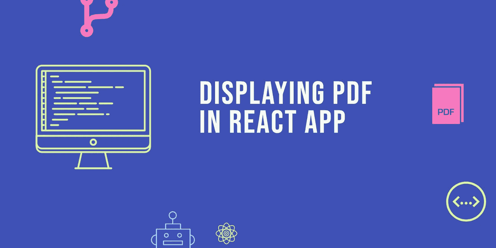
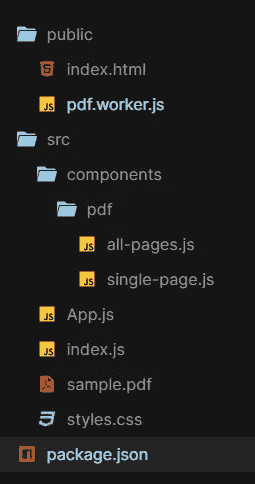

# 在 React 应用程序中显示 PDF

> 原文：<https://levelup.gitconnected.com/displaying-pdf-in-react-app-6e9d1fffa1a9>



我想向您展示一种简单易行的方法，在浏览器中使用 React 显示`PDF`文件。我将使用一个名为 [react-pdf](https://github.com/wojtekmaj/react-pdf) 的库。这个库能够在给定 URL 或项目中的本地文件或 base64 编码版本的情况下呈现`PDF`文件。

首先，使用 [Create React App](https://github.com/facebook/create-react-app) 创建一个简单的`React`应用程序。为此，您可以运行以下命令:

```
npx create-react-app display-pdf-app
cd display-pdf-app
npm start
```

之后，使用以下命令将`react-pdf`库添加到项目中:

```
npm install --save react-pdf 
```

为了渲染`PDF`文件，`react-pdf`有一个文档组件，您需要在其中传递一个文件属性。然后在文档组件中，您需要创建一个页面组件。简单不是吗？示例代码:

```
import React from 'react';
import { Document, Page } from 'react-pdf';

import samplePDF from './test.pdf';

export default function Test() {
  return (
    <Document file={samplePDF}>
      <Page pageNumber={1} />
    </Document>
  );
}
```

最终的项目结构将如下所示:



让我们从在`components` - `pdf`文件夹中创建`single-page.js`和`all-pages.js`开始，内容如下:

*   `single-page.js`

*   `all-pages.js`

现在导航到`App.js`并用以下代码替换内容:

正如你已经注意到的，我们必须在`single-page.js`组件中创建按钮来改变文档的页面。这是因为`react-pdf`没有提供用户界面。

完整的项目代码可以在这里找到 [github](https://github.com/webisora/displaying-pdf-using-react) ，你可以看到下面的演示:

如果控制台中出现以下错误:

```
Uncaught SyntaxError: Unexpected token < [http://project_server.dev/app_folder/d58d9dd3a5c5f2a8eafb.worker.js](http://project_server.dev/app_folder/d58d9dd3a5c5f2a8eafb.worker.js)...
```

然后按照以下步骤操作:

1.  将`node_modules/pdfjs-dist/build/pdf.worker.js`复制到`public/pdf.worker.js`
2.  `options={{workerSrc: "pdf.worker.js"}}`将此道具添加到`react-pdf`中的`Document`组件内。【上面的项目已经在做了。]

**参考**

*   [https://github.com/wojtekmaj/react-pdf](https://github.com/wojtekmaj/react-pdf)

我们感谢您阅读这篇文章。如果你喜欢我的写作，但不是 Medium 的会员，你可以注册一个 [Medium 会员](https://sagar-shrestha.medium.com/membership)来无限制地访问所有内容并支持我们作为作家。

[](https://sagar-shrestha.medium.com/membership) [## 加入我的推荐链接-萨加尔 Shrestha 媒体

### 阅读 Sagar Shrestha(以及媒体上成千上万的其他作家)的每一个故事。您的会员费直接支持…

sagar-shrestha.medium.com](https://sagar-shrestha.medium.com/membership) 

# 分级编码

感谢您成为我们社区的一员！升级正在改变技术招聘。 [**在最好的公司**找到你最完美的工作](https://jobs.levelup.dev/talent) **。**

[](https://jobs.levelup.dev/talent) [## 提升——改变招聘流程

### 🔥让软件工程师找到他们热爱的完美角色🧠寻找人才是最痛苦的部分…

作业. levelup.dev](https://jobs.levelup.dev/talent)