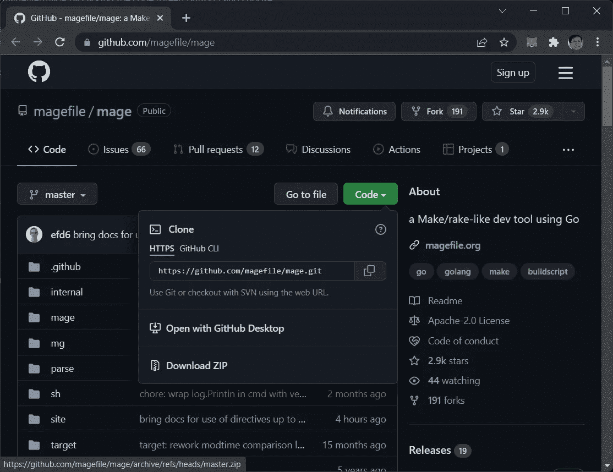
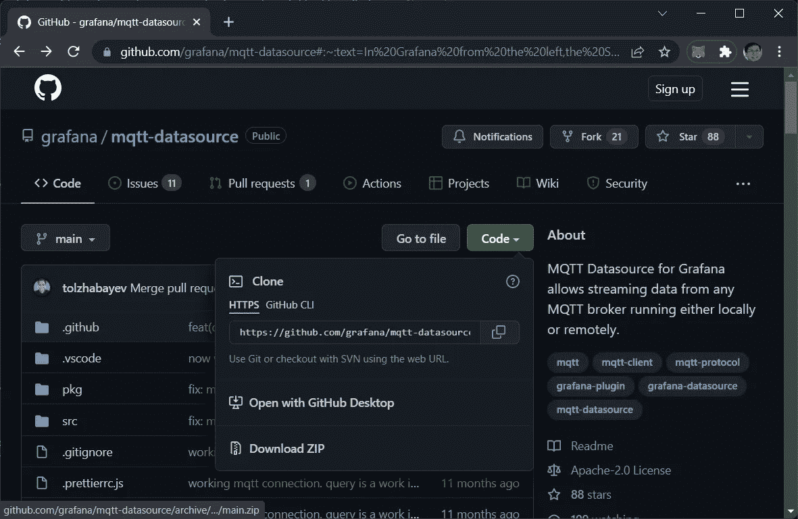

# 使用 MQTT 在 Grafana 中显示实时传感器数据

> 原文：<https://levelup.gitconnected.com/displaying-real-time-sensor-data-in-grafana-using-mqtt-3cbfe030362>

## 了解如何构建 MQTT 数据源并在


照片由 [Unsplash](https://unsplash.com?utm_source=medium&utm_medium=referral) 上的[agency followeb](https://unsplash.com/@olloweb?utm_source=medium&utm_medium=referral)拍摄

在 Grafana 8.0 中，作为 Grafana Live 功能的一部分，现在可以使用新的流 API 执行实时数据更新。这意味着您现在可以创建实时更新的图表。

为了利用这个特性，您可以使用 **MQTT** 数据源([https://github.com/svet-b/grafana-mqtt-datasource](https://github.com/svet-b/grafana-mqtt-datasource))，这是一个插件，允许 Grafana 用户实时可视化 MQTT 数据。在本文中，我将向您展示如何使用 MQTT 数据源来实时显示传感器数据。

> 为了使用 MQTT 数据源，您需要使用 **Grafana 8.0** ，这使得使用作为 **Grafana Live** 特性一部分的新流 API 来执行实时数据更新成为可能。

使用 MQTT 非常适合那些涉及 Raspberry Pi 的项目:


来源:[https://en . Wikipedia . org/wiki/Raspberry _ Pi #/media/File:Raspberry _ Pi _ 4 _ Model _ B _-_ side . jpg](https://en.wikipedia.org/wiki/Raspberry_Pi#/media/File:Raspberry_Pi_4_Model_B_-_Side.jpg)

# 将 MQTT 数据源导入 Grafana

虽然有为 Grafana 构建的 **MQTT** 数据源，但它并不与 Grafana 捆绑在一起——您需要自己构建和安装它。这就是复杂性的来源。

> 在本文中，我将向您展示如何在 Windows 上安装 MQTT 数据源。

在这一节中，我将向您展示如何构建 MQTT 数据源并将其安装在 Grafana 中。你需要一些工具/语言:

*   节点. js
*   故事
*   去
*   魔术师

如果您不熟悉这些工具和语言，也不用担心。在接下来的几节中，我将向您展示如何安装它们。

## **安装 Node.js**

从[https://nodejs.org/en/download/](https://nodejs.org/en/download/)下载安装 Node.js 。一旦 Node.js 安装到您的系统上，在命令提示符下键入以下命令来安装 **yarn** :

```
**npm install —g yarn**
```

> **Yarn** 是一个包经理，兼任项目经理。

## 安装 Go

从 https://go.dev/dl/下载并安装 Go。遵循安装程序中的说明。

> Go 是一种静态类型的编译编程语言，由 Robert Griesemer、Rob Pike 和 Ken Thompson 在 Google 设计。

## 下载图像

前往 https://github.com/magefile/mage 的[法师之源。点击**代码**按钮并选择**下载。ZIP** :](https://github.com/magefile/mage)



> **Mage** 是一个类似于 make 的构建工具，但是 Mage 不是编写 bash 代码，而是让你在 Go 中编写逻辑。

下载后，将 zip 文件的内容提取到桌面上。

接下来，通过在命令提示符下键入以下命令，找出您的 **GOPATH** 的位置:

```
**go env**
```

您可以从输出中找到`GOPATH`的路径:

```
...
set GOOS=windows
set GOPATH=**C:\Users\Wei-Meng Lee\go**
set GOPRIVATE=
...
```

键入以下命令创建一个路径调用 **Go** (如果您的计算机上还不存在该路径):

```
**cd c:\users\Wei Meng Lee\**
**mkdir Go**
```

在命令提示符下，将目录更改为 **mage-master** 文件夹:

```
**cd C:\Users\Wei-Meng Lee\Desktop\mage-master**
```

键入以下命令:

```
**go run bootstrap.go**
```

您应该会看到类似这样的内容:

```
Running target: Install
exec: go “env” “GOBIN”
exec: go “env” “GOPATH”
exec: git “rev-parse” “ — short” “HEAD”
exec: git “describe” “ — tags”
exec: go “build” “-o” “C:\\Users\\Wei-Meng Lee\\go\\bin\\mage.exe” “-ldflags=-X \”github.com/magefile/mage/mage.timestamp=2022–03–18T12:44:11+08:00\” -X \”github.com/magefile/mage/mage.commitHash=\” -X \”github.com/magefile/mage/mage.gitTag=dev\”” “github.com/magefile/mage”
```

## 下载 MQTT 数据源的源代码

去[https://github.com/grafana/mqtt-datasource](https://github.com/grafana/mqtt-datasource)下载 ZIP 文件:



下载文件后，将 zip 文件的内容解压缩到桌面。

使用代码编辑器编辑 **mqtt-datasource-main** 文件夹中名为 **package.json** 的文件。将“`rm -rf dist && ...`”替换为“`del /F /Q dist && ...`”(您替换的命令是为了确保它能在 Windows 上工作):

```
{
  “name”: “grafana-mqtt-datasource”,
  “version”: “0.0.1-dev”,
  “description”: “MQTT Datasource Plugin”,
  “scripts”: { “build”: “**del /F /Q dist** && grafana-toolkit plugin:build && mage build:backend”,
  ...
```

在命令提示符下，cd 到 **mqtt-datasource-main** 文件夹:

```
**cd C:\Users\Wei-Meng Lee\Desktop\mqtt-datasource-main**
```

并键入以下命令:

```
**yarn build
yarn install**
```

## 配置插件

将 **mqtt-datasource-main** 文件夹移动到**C:\ Program Files \ grafan alabs \ grafana \ data \ plugins**文件夹中。

> **C:\ Program Files \ grafan labs \ grafana \ data \ plugins**文件夹是 Grafana 存储各种插件的地方。

接下来，将 **defaults.ini** 文件加载到**C:\ Program Files \ GrafanaLabs \ grafana \ conf**文件夹中，并添加以下粗体语句:

```
[plugins]
enable_alpha = false
app_tls_skip_verify_insecure = false
# Enter a comma-separated list of plugin identifiers to identify plugins to load even if they are unsigned. Plugins with modified signatures are never loaded.
allow_loading_unsigned_plugins = **grafana-mqtt-datasource** # Enable or disable installing / uninstalling / updating plugins directly from within Grafana.
plugin_admin_enabled = true
```

上面的添加向 Grafana 表明允许未签名的插件(在本例中是 **MQTT 数据源**)。

在 Windows 服务中重新启动 Grafana。

# 在 Grafana 中使用 MQTT 数据源

如果您已经执行了为 Grafana 构建 MQTT 数据源的前一步，那么现在应该可以使用它了。

## 将数据发布到 MQTT 代理

在开始构建使用 MQTT 数据源显示数据的面板之前，您需要将数据写入 MQTT 代理，以便订阅它。为此，我将编写一个 Python 程序来模拟一些传感器数据。

> 如果您不熟悉什么是 MQTT 代理，请参考我以前的文章:[https://weimenglee . medium . com/using-MQTT-to-push-messages-cross-devices-1465855 b36e 5](https://weimenglee.medium.com/using-mqtt-to-push-messages-across-devices-1465855b36e5)

[](https://weimenglee.medium.com/using-mqtt-to-push-messages-across-devices-1465855b36e5) [## 使用 MQTT 跨设备推送消息

### 了解如何在 Python 应用程序中使用 MQTT

weimenglee.medium.com](https://weimenglee.medium.com/using-mqtt-to-push-messages-across-devices-1465855b36e5) 

创建一个文本文件，命名为 **publish.py** 。用以下语句填充它:

```
# pip install paho-mqtt
import paho.mqtt.client as mqtt
import numpy as np
import timeMQTTBROKER = 'test.mosquitto.org'
PORT = 1883
TOPIC = "home/temp/room1/storeroom"mqttc = mqtt.Client("python_pub")
mqttc.connect(MQTTBROKER, PORT)while True:
    MESSAGE = str(np.random.uniform(20,30))
    mqttc.publish(TOPIC, MESSAGE)
    print("Published to " + MQTTBROKER + ': ' + 
          TOPIC + ':' + MESSAGE)
    time.sleep(3)
```

要运行 **publish.py** 文件，请在命令提示符下键入以下命令:

```
$ **python publish.py**
```

## 使用 MQTT 数据源进行订阅

在 Grafana 中，通过搜索 **mqtt** 添加一个新的数据源:


按如下方式配置 **MQTT** 数据源:

*   **主持人**:test.mosquitto.org
*   **端口** : 1883

> 您可以将**验证**部分下的字段留空。

完成后点击**保存&测试**。


接下来，创建一个新的**仪表板**并添加一个新的**面板**:


使用面板配置以下内容:

*   **可视化**:时间序列
*   **数据来源** : MQTT
*   **主题**:家/温度/房间 1/储藏室

完成后点击**应用**。


现在，您应该可以看到绘制的图表。如果您能够看到图表，这意味着您能够通过 MQTT 数据源接收数据。


> **提示**:切换仪表盘查看**最后 5 分钟**查看图表特写。

# 摘要

使用 MQTT 数据源非常简单，这使得创建实时图表更新变得轻而易举。这个项目中唯一的挑战是编译 MQTT 数据源并将其安装在 Grafana 中。一旦你解决了这个问题，你会有很多乐趣！

[](https://weimenglee.medium.com/membership) [## 加入媒介与我的介绍链接-李伟孟

### 作为一个媒体会员，你的会员费的一部分会给你阅读的作家，你可以完全接触到每一个故事…

weimenglee.medium.com](https://weimenglee.medium.com/membership)