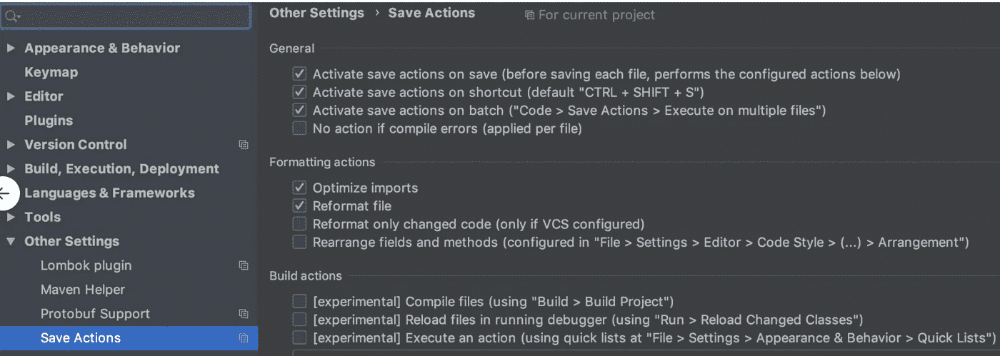

# 剖析拉请求合并延迟的原因

> 原文：<https://levelup.gitconnected.com/dissecting-why-some-pull-request-merges-get-delayed-739432b7ebba>


图片提供:Atlassian 博客

**拉请求**创建、审核、评论修改、重新审核和 [LGTM](https://www.urbandictionary.com/define.php?term=LGTM) 流程瓜分了开发者的大量带宽。不可否认这个过程的重要性。然而，这需要时间。
让我们讨论一下如何减少整个流程的周转时间。

对于本文，假设 ***开发人员*** 是请求评审的人，假设 ***同行/评审者*** 角色对应于评审开发人员拉式请求的同行(尽管他们的角色可能在不同的 PR 上互换)

# 拉式请求生命周期

广义而言，PR 批准生命周期可总结如下:


根据经验，我们得出结论，PR 获得批准的比率决定步骤是 ***不是由获得审查的时间*** 决定的，而是由制作 PR 花费的时间 ***决定的。***

> 加快整个过程的责任在于 T21 的开发者，而不是评审者。

这是 TL。文章的 DR 版本。

# 开发者责任

以下是开发人员为了加快审批过程可以遵循的指导原则。

## 指定 ETR:评估时间。

当在频道上请求审查时，需要报出 ETR 或**预计审查时间**(是的，我只是编造了这个缩写)

*   这有助于评审者更好地分配时间。如果 *ETR 是 2.5 小时*而同行没有带宽，可以调出延时。
*   这显示了对他人的思考和同情，也是尊重他人时间的一步。如果 ETR 被证明是巨大的，开发人员知道他们必须打破 PRs，因为假设无限制的对等带宽是不公平的。

这里有一个样本模板。

> 嘿，同行 P，请求审查 PR <link>(简要描述)。ETR: 40 分钟

我们在工作中遵循这一点，这有助于评审人员更好地计划。

## 尊重代码库。

永远尊重你正在工作的代码库。试着花些时间将你的改变与它真正的哲学结合起来。

*   它应该看起来像一个单一的连贯的代码库。模型类和接口遵循现有的约定。
*   特别注意[格式](https://www.smashingmagazine.com/2012/10/why-coding-style-matters/)。这应该在整个代码库中保持一致。小的吹毛求疵突然变成难以管理的、不一致的基础。
*   请考虑在 ide 中导入一个团队范围的格式化程序，或者查看代码清单。如果你正在使用 IntelliJ，[保存动作](https://plugins.jetbrains.com/plugin/7642-save-actions)插件是你的朋友。



当你保存时，这个插件自动格式化当前的工作文件

> 如果你尊重所有形式的代码库，它会让你觉得好像是一个人写了所有的东西。这样的代码库将易于审查。

## 保持小规模。

俗话说，

> 100 **行**改了= **2** 个问题， **5** 个审核意见和公开讨论
> 100 **个文件**改了= LGTM

庞大的公关是一个痛苦的审查和管理。他们从不帮助任何人。如果你觉得一份公关变得越来越长，一定要把它分成更小的几份。我们如何定义一个巨大的公关？

*   **更改的文件数量**
    通常，这是衡量 PR 有多大的一个好指标，但是它不适用于重构 PR。在最坏的情况下，将更改的文件数量保持在 **50** 以下(硬限制)。超过这个数就准备离开。


*   **增加/删除的数量** 这是衡量 PR 的一个更好的指标。通常这是审查者在审查过程中眼睛所能看到的行数。
    它兼顾了*重构*(通常情况下，相等的删除和添加)*特性*(更多的添加)*清理*(更多的删除)。

> 最不济，把增删数量控制在 1500 以内。任何以上，你需要分裂。或者你的评论者会要求你去做。


最后一个是大[号](https://www.youtube.com/watch?v=31g0YE61PLQ)

## 尽职调查——自我审查。

对你的公关进行自我检讨是非常重要的。求求你，**蛮求你**，先过一遍自己的 PR 再养。我怎么强调都不为过。这里可以减少很多周转时间。如果你以一个评论者的眼光来看待自己的 PR，你会看得更清楚。

*   你会看到**不需要检入的注释块**
*   您将看到由于复制粘贴之类的错误命名方法而导致的**错误**
*   你会看到那些早就做好的事情，现在已经无关紧要了。
*   您将看到您最终添加了**冗余信息/测试。**
*   您将看到**本地开发配置**被错误地检入到生产中。
*   您会看到明显的**格式不一致。**
*   您将看到**冗余日志、系统输出、调试信息**被检入。

作为一名开发人员，在适当的地方添加自我检查注释并为不太明显的变化提供理由也很重要。这些包括(但不限于)

*   更改配置/幻数/文字的值。
*   改变应用程序结构块或新的依赖关系。
*   更改不相关类的方法签名。
*   在同一公关范围内对公关范围之外的事情进行微调。
*   那些肯定会让你的评论者感到困惑的东西。

> 一旦你得到一份公关评估，你可以在自我评估中将其与你自己的评估进行比较。通过多次迭代，您将接近预期的评审意见，并提出最佳的 PRs，这将导致更快的合并。

## 提高质量而不是覆盖率的测试用例。

测试案例有助于获得信心。当您编写处理以下内容的单元测试时，请密切关注它们的内部结构。

*   显式并发功能(使用*闩锁、屏障、单元相位器*
*   处理非线程安全类(如*日历，简单日期格式，日期*)
*   处理使对象变异的代码。
*   处理静态资源(如嵌入式数据库、容器)
*   处理依赖于隐式顺序的单元测试(*不幸的*)

对你的单元测试进行压力测试直到失败是最重要的。否则会出现测试输出不确定的情况。您的测试可能在本地运行，但在 CI 管道上失败，反之亦然。许多人没有意识到我们可以运行单元测试直到失败。


运行测试，直到发现难以检查的错误。

根据经验，对于您编写的每个重要的测试用例，确保输出在多次调用中是一致的。

> 因为这些在代码审查中很难发现，所以我们的想法是采取一种主动的方法并预先修复它们。**不要等待审核者**指出这一点，这将最终延迟 PR 合并。

## 在团队频道上请求评论。

所有公关审查都应通过公共团队渠道(slack/teams what you)请求，而不是通过 DMs。你会问为什么？

*   团队领导随时了解要求评审的变更。
*   当其他同事看到除了最初请求的同事之外，他们也可以对评审做出贡献时，他们也可以参与进来。
*   在渠道上撞和在 DM 上撞是不一样的。如果开发人员在评审中受阻，他们可以大声疾呼。
*   如果某个特定的同事被多个要审查的 PRs 堵塞，主管可以记下并将其分配给其他人(包括自己)。

## 给公关贴上标签。

标签有助于对相关的 pr 进行分组和标记。我们可以创建大量合适的标签来更好地传达公关的范围。


**标签有什么帮助？**

*   像 `“dont merge”` 这样的标签传达意图。这意味着审查不那么严格。
*   像`*“bug fix”*`这样的标签优先于`“tooling”.`
*   它们是多种颜色的，很酷。
*   标签可以用来分组相关的变更和跟踪沿袭。

## 写公关描述。

这是一个可以在很大程度上优化的地方。

*   这是开发者向评审者传达他们的意图、设计和决策的地方。参考[样品](https://github.com/flipkart-incubator/zjsonpatch/pull/120)。
*   这是审阅者在开始审阅之前首先查看的地方。描述越吸引人，越清晰，越简洁，越好。


获取**概要**可使评审者做好相应准备。

*   如果是一个`work in progress` PR，评审者可以回到她的任务，直到 PR 回到`Ready`状态。
*   如果是一个`feature`公关，需要进行广泛的审查。
*   如果是一个`bug fix` PR，新的测试用例需要在评审者的机器上再次运行
*   如果`impact`为高，则审查优先级变为**高**。

D **描述** 描述 PR 中出现的变更。就这个`what’s`。不是那个`why’s`。保持简短和甜蜜。

> 例如这个 PR 在类<class>中为 <reason>引入了新的方法例如这个 PR 修复了类<类>中的 bug 其中<原因></reason></class>

R 这有助于在评审流程开始之前建立**上下文**。

*   构建会因为 PR 被分成小的 PR 而中断，但是整个构建成功了吗？
*   设计文档不需要是因为它是一个微不足道的改变吗？

> 例如覆盖范围因 <reason>而下降，例如超过 60 个文件因<原因>而改变</reason>

M **动机和背景** 这是我们要说出为什么的地方。公关解决特定的问题。在花精力做公关之前，我们应该清楚我们为什么要做这件事。很多时候，在编写这个块的时候，开发人员会意识到变更的子集实际上是不需要的，是多余的，或者它们属于一个单独的 PR。

*   为什么需要这种改变？旧的有什么问题？
*   这种改变如何解决问题？
*   设计变更(如果有)是内部审核还是外部审核？

> 用这些来帮助你的评论者，你就可以更快的评论了

How 可以说是这次测试中 T7，最重要的一节。这有助于评审者获得开发人员已经完成尽职调查的信心。并且代码仍然可以编译。

*   指定是否添加了**单元测试**。
    如果不是，同样应该有非常充分的理由。
*   指定新代码
    是否达到了 **> 90%的覆盖率**无论如何这都应该是预期。如果不是，请具体说明原因。
*   代码**已经在集成环境**中运行了吗？
    如果是，请分享堆栈详细信息。如果不是，请具体说明整合是如何进行的。
*   是否已经编写了**集成测试并针对现有套件运行了**？
    如果是，分享成功截图/建立链接以消除倒退。

R **相关链接/注释** 添加评审者可以用来获得关于 PR 的额外上下文的任何内容

*   在此添加设计文档、合同、解决方案文档、会议记录等。
*   此 PR 上是否执行过任何 NFR 运行？添加它们。
*   您是否添加了任何新的 API？分享卷发/招摇的规格。

# 第一轮评审后会发生什么？

审查者提供了反馈。你现在做什么？

## Ack，ack，ack。

*   你收到的每一个反馈都是评审人员为了更好地理解你的代码而付出的努力的结果。因此，让`acknowledge`知道他们的意见已被收到以及在哪里会/不会得到处理变得非常重要。
*   这让评审者认为反馈已经被采纳`positively`。否则，它会给人一种被审阅者分配了任务的感觉。此外，这对于 nit 注释不是必需的。
*   很多时候，开发人员的观点可能与评审人员不一致。最好是`courteous`，用事实来支持你的观点，而不是憋在心里或完全否定评论。展开健康的讨论。

不这样做还会增加 merge TAT(房间里的大象)。怎么会？

> 假设一个评论者添加了很少的评论，比如 10 条。开发人员已经完成了 6 项工作，并要求重新审核。其余的点要么在开发人员看来不值得修复，要么超出了范围。但是同样的需要叫出来。
> 
> 我们不能因为已经是第二轮评审，就期望评审者忽略剩下的 4 条评论。它们在评论者的眼中仍然是重要的。如果开发人员不同意，开始讨论。但总是 ack。
> 亦作注释📝比温和的竖起大拇指更有思想👍

这就是开发者的责任。我们讨论了很多问题。总结一下

```
::: Specify ETR
::: Respect the codebase
::: Keep it small
::: Due Diligence: Self Review
::: Test Cases that improve quality and not coverage
::: Requesting Reviews on the channel
::: Labelling PRs
::: Writing a good PR Description
::: Ack after review on the comments.
```

但是，等等，我们不能在没有谈到审查者责任的情况下离开。他们肯定会有一些责任，对吗？

# 审查者责任

评论者也扮演着重要的角色。特别是因为同行同时是评审者和开发者。

## 预审查指南

*   看完 ETR 没`sufficient bandwidth`复习就大声喊出来。Dev 可以选择等待或寻找另一个同伴。
*   与开发人员分享评审完成的粗略估计。这应该是在频道上，再次。这有助于开发人员更好地计划。
*   如果 PR 超过以上指定的阈值，`feel free to reject the PR`或请求 dev 分割成多个 PR
*   如果 PR 代码覆盖率下降到阈值以下，理想情况下应该是 `be rejected`，除非开发人员提供了有效的推理

## 审查指南

*   花些时间浏览一下 PR 描述和开发者已经建立的上下文。`Value the effort.`
*   对于特性、设计或增强 PR，最好在本地 IDE 中检查分支，并从那里开始审查。
*   提供建设性的反馈和你同事的`avoid critical assessment`。总是用事实来补充你的论点。
*   试着插话并`share your own wisdom`说明你本可以用一种不同的、看起来更好的方式来解决这个问题。
*   `Appreciate`只要适用。如果你看到整洁的公关或公关解决了一个难题，一定要记下来。

今天到此为止。我不打算如此深入地讨论这些问题，尤其是当这篇文章的重点是减少时间的时候。

但我很高兴我能触及这些细微差别。*希望这一块增值。*