# 层次聚类中的距离度量和链接方法

> 原文：<https://levelup.gitconnected.com/distance-measures-and-linkage-methods-in-hierarchical-clustering-8b7d488d7ebc>

距离或邻近度量用于确定数据集中相似对象之间的相似性或“接近度”。

邻近性度量的目标是找到相似的对象并将它们分组到同一个群集中。

可用于计算[分层聚类](https://medium.com/@lzpdatascience/what-is-the-difference-between-hierarchical-and-partitional-clustering-edc0d488c7c4)中的邻近矩阵的距离度量的一些常见示例，包括如下:

*   欧几里得距离
*   马哈拉诺比斯距离
*   闵可夫斯基距离

我不想用数学公式来解释距离，而是总结一下这些距离度量的用途和功能。如果你有兴趣了解支持这些计算的基本原理，简单的谷歌搜索可以提供大量的例子和研究论文。

# 欧几里得距离

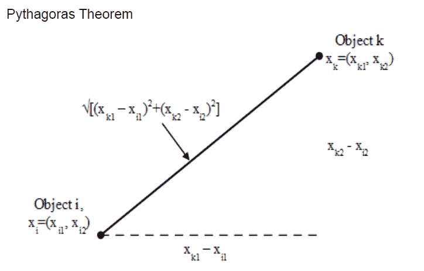

欧几里德距离是计算两点之间距离的非负度量。这两点之间的距离是基于毕达哥拉斯定理量化的。

# 马哈拉诺比斯距离

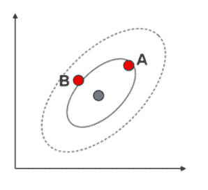

Mahalanobis 距离用于以 t 分数的形式计算两点之间的距离。Mahalanobis 距离也考虑了数据的标准化和分散性。

下面的公式定义了它。

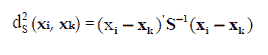

这对于非球形分布很有用，即使 A 点和 B 点与 X 点的欧氏距离相同，它的分布也可能不是均匀分布的。

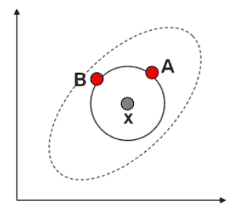

# 闵可夫斯基距离

闵可夫斯基距离由以下公式定义

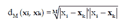

其中 M 是整数，并且根据 M 的值，它改变给予较大和较小差异的权重。例如，假设 M = 10，xi = (1，3)，xk = (2，3)，那么 d10 =平方根(| 1–3 |+| 2+3 |)=平方根(3)

由于聚类本质上是一个探索性的过程，因此可以对数据集应用多种类型的聚类算法。我们希望即使使用不同的聚类算法也能获得相同的结果。但是，计算可能会有所不同，因为每个算法使用不同的计算来达到结果。

# 聚集聚类方法的说明

正如您所记得的，在[层次集群](https://medium.com/@lzpdatascience/what-is-the-difference-between-hierarchical-and-partitional-clustering-edc0d488c7c4)中，所有对象都以单个或单个集群的形式开始。然后使用下列链接方法之一将它们合并。

*   单键
*   完全连锁
*   质心连杆机构
*   沃德连接
*   平均连锁

链接方法通过计算所有对象之间的距离或相似性来工作。然后，将最接近的一对聚类组合成一个聚类，从而减少剩余聚类的数量。

然后重复该过程，直到只剩下一个集群。

对于关联示例，我将使用一个简单的散点图来显示与下表定义的点的关系。

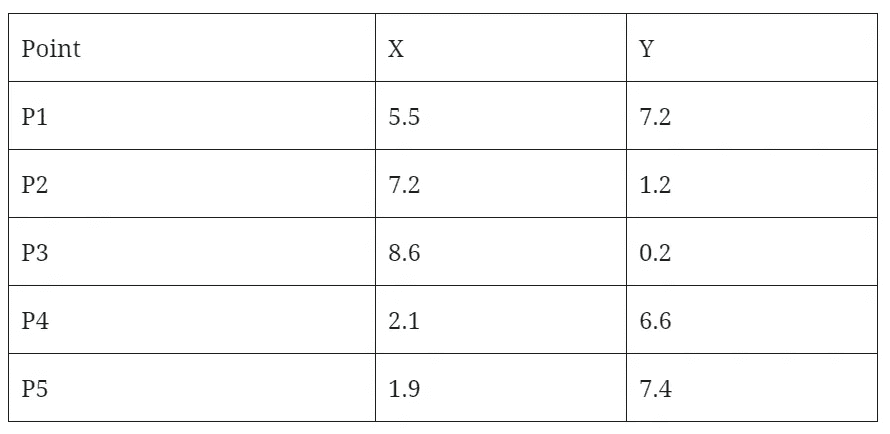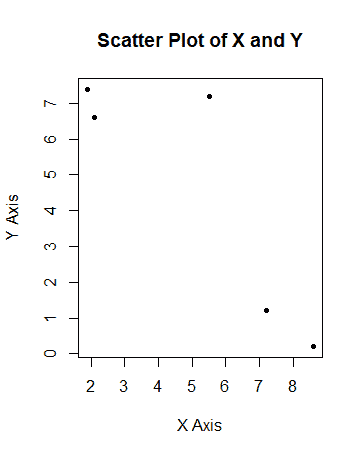

用 R studio 实现散点图的输出

如果您想重新创建散点图，可以使用下面的代码

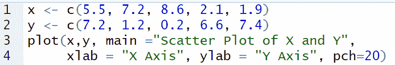

从散点图中我们可以推断出可以看到三个集群。

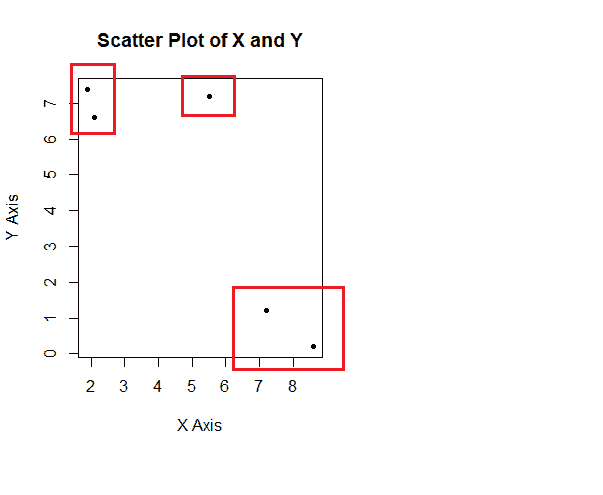

# 使用单一链接的层次聚类

对于单个链接，具有*最近最小距离*的两个集群被合并。这个过程重复进行，直到只剩下一个集群。

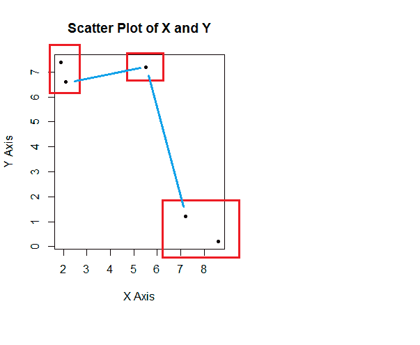

# 使用完全链接的层次聚类

对于完整的链接，具有*最近最大距离*的两个集群被合并。这个过程重复进行，直到只剩下一个集群。

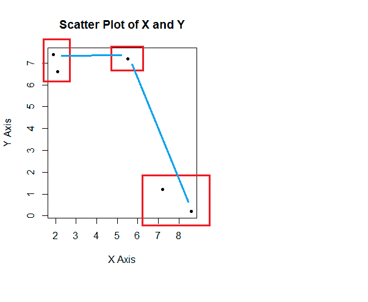

# 使用质心链接的层次聚类

对于质心链接，具有*最低质心距离*的两个聚类被合并。这个过程重复进行，直到只剩下一个集群。

让点 X 表示每个群集的质心距离。

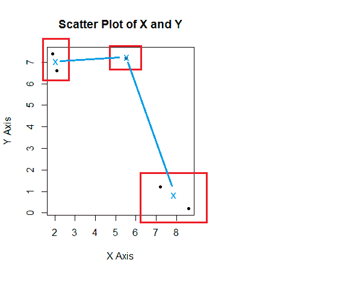

# 使用沃德链接的层次聚类

对于 Ward 关联，两个聚类根据它们的误差平方和(ESS)值进行合并。具有最低 ESS 的两个集群被合并。这个过程重复进行，直到只剩下一个集群。

# 使用平均链接的层次聚类

也称为组平均层次聚类，平均链接方法使用不同聚类中所有对象对之间的平均成对接近度。基于聚类的*最低平均距离*来合并聚类。

总结了[层次聚类中常用的距离度量和链接方法。](https://medium.com/@lzpdatascience/what-is-the-difference-between-hierarchical-and-partitional-clustering-edc0d488c7c4)

好奇的学习者？释放你在媒体上学习的全部潜力，用不到一杯咖啡的钱支持像我这样的作家。

 [## 通过我的推荐链接加入媒体——杰森·LZP

### 作为一个媒体会员，你的会员费的一部分会给你阅读的作家，你可以完全接触到每一个故事…

lzpdatascience.medium.com](https://lzpdatascience.medium.com/membership) 

刚接触 R 编程，不知道从哪里开始？不到一杯咖啡，看看我的电子书，一步一步的指南！

 [## 数据科学入门指南(PDF /电子书

### 有一段时间了，我希望每个人都保持安全和健康。本月初，由于封锁，我…

lzpdatascience.medium.com](https://lzpdatascience.medium.com/r-for-data-science-a-beginners-guide-pdf-ebook-a5fe11009443)