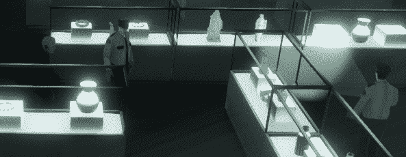
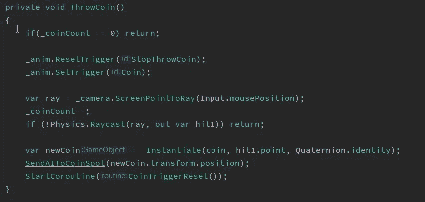
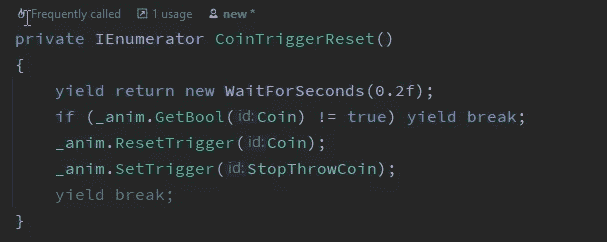
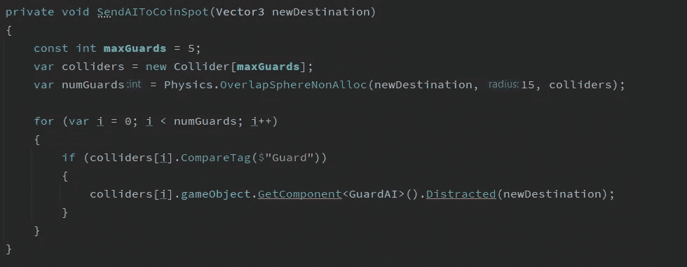
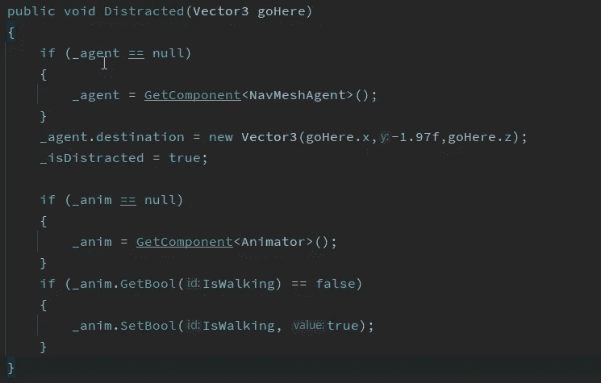
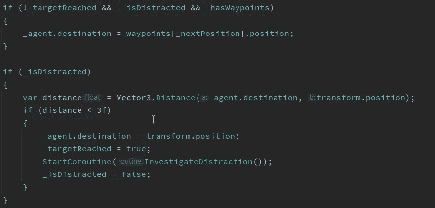

# 分散敌人的注意力 AI

> 原文：<https://levelup.gitconnected.com/distracting-the-enemy-ai-a89e645d461b>

设置硬币分散注意力



“嘿，那是什么？”

在我们简单的秘密行动游戏中，我们需要能够从他的位置移动一个固定的守卫，这样我们就可以绕过他。幸运的是，我们的英雄口袋里碰巧有一枚金币。所以我们把它扔在地上，让警卫检查一下。

因为我们已经在警卫身上设置了导航网特工，我们可以利用这一点来分散他们的注意力。在上面的截图中，你会看到当硬币出现在警卫脚后面的地面上时，警卫的头。挡住我们去路的固定警卫开始调查，我们现在可以前进了。

为了实现这一点，我们使用了两个脚本:玩家和守卫。玩家脚本有一些代码来存储扔硬币动画和硬币的预置。然后，它有三个方法组成硬币投掷动作。



扔硬币法

第一种方法是 **ThrowCoin()** ，它只在玩家右击地板上的某个地方时触发。首先我们检查玩家是否有硬币可以扔，默认情况下玩家只有一个，但我为以后的扩展添加了这个。下一步只是触发混合树中的动画。最后，我们到达真正重要的部分。我们投射一束光线到鼠标点击并存储在 hit 中，我们递减硬币计数。然后我们在鼠标点击的位置实例化硬币预置。硬币在地板上，我们告诉游戏给 **SendAIToCoinSpot()，**一个以新位置作为参数的方法。最后，我们启动一个协程来结束抛硬币的动画。



重置动画的协程

所以玩家扔了硬币，硬币出现在了地板上。那我们怎么让那边的警卫？有很多方法，但我是这样做的。



把人工智能变成硬币的逻辑

首先，我要确定有多少守卫会被分散注意力。因为我们只有 3 个守卫，所以我把人数设为 5，以防我们需要更多的守卫。下一步是创建一个可以容纳五个对撞机的对撞机阵列。numGuards 变量是神奇的地方。用统一的方法从物理学中得到的叫做**物理学。我们能够找到靠近硬币的守卫。该方法采用三个参数，重叠检查的位置是什么，在这个实例中，它是新硬币实例化的位置。接下来我们告诉它球体的半径有多远，我用半径 15 来诱捕守卫。最后，我们告诉它我们想在哪里填充我们在那个半径内找到的对撞机，对我们来说，这就是我们的对撞机阵列。**

几个重要的注意事项。这很有效，因为我只在我的守卫身上安装了碰撞器，场景中的箱子是静态物体，通过将它们排除在 NavMesh 之外，可以防止玩家和守卫在上面行走。然而，如果他们都有对撞机，我将需要扩大我的对撞机阵列，否则我可能得不到警卫。此外，这个方法的非分配版本阻止我们为进程分配内存。因为我们只想检查警卫并通知他们，所以我们选择这种方法。

一旦所有这些都完成了，我们循环遍历数组，如果碰撞器有一个“Guard”标签，我们就调用 guards GuardAI 脚本上的 Distracted 方法。



GuardAI 分散法

后卫分心的方法采取了新的立场，然后看起来像它做了很多。然而重要的是:

```
_agent.destination = new Vector3(goHere.x,-1.97f,goHere.z);
```

这行代码告诉守卫他需要移动到哪里。这个方法中的其他东西只是为了额外的润色。它 null 检查 nav 网格代理，并且如果它碰巧为 null，则设置它。然后它以同样的方式检查动画制作人，如果守卫不在他的行走动画中，它就打开动画。_isDistracted 的 bool 变量是这样的，以便 GuardAI 知道他正在走向硬币，而不是将他重新设置到一个路点。



更新了 HandleMovement()方法

上面的代码是运动代码的一个片段。它检查警卫是否分心和有路点，如果他满足正确的标准，然后他正常移动。然而，如果他分心，我们检查他离分心有多远，一旦他在一个好的范围内，我们就阻止他，设置目标达到，启动一些动画触发器的协程，并关闭他的分心。协管员在 5 秒钟后重置他的目标到达布尔，这允许移动的警卫返回到他们的巡逻中，而固定的警卫将在他被分散注意力的地方逗留。

相当多的清理工作可以添加到上面的代码中，但希望你能看到我们实际上可以抽出大部分代码，并有一个非常简单的分心系统。