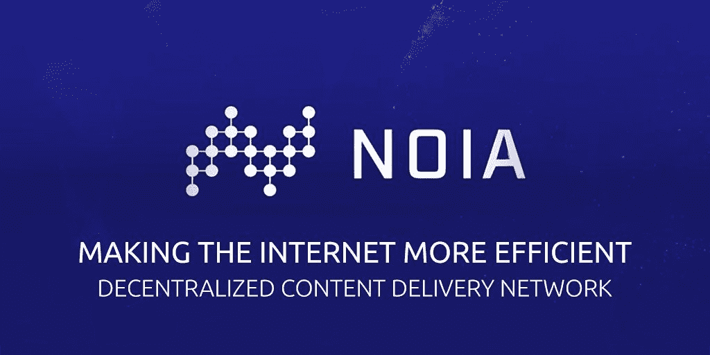
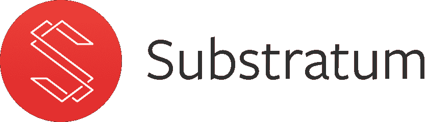
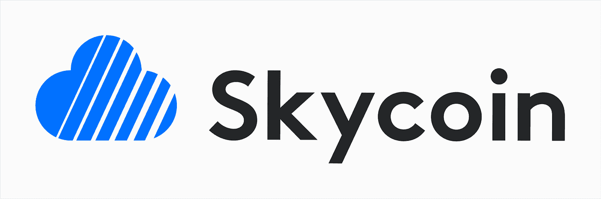

# 分布式账本技术在改善互联网接入中的应用

> 原文：<https://levelup.gitconnected.com/distributed-ledger-technology-in-a-bid-to-improve-internet-access-79e06b05d0d9>

快速问答——当代最重要的发明是什么？

你的脑袋里现在可能漂浮着许多可能的答案，但是你很难找到比互联网更值得这个赞誉的东西。互联网一手改变了我们相互交流的方式。它改变了公司和政府的工作方式。它已经在如此基本的层面上融入了我们的生活，以至于我们甚至无法想象没有它的生活。

然而，是时候改变了。

在这篇文章中，我们将看看为什么互联网需要采用一个分散的架构，并让我们自己了解三个正在这样做的项目。

# 当前互联网结构的问题

现有的互联网结构是中心化的，这导致了今天困扰互联网的两个最大的问题。

*   审查制度。
*   缺乏隐私。

# 审查制度

对于生活在北美和欧洲的人来说，网络审查的概念可能是陌生的，但对于生活在中国和巴基斯坦等国家的人来说，这是一个现实。有时候，有必要审查互联网的某些部分，比如儿童色情。然而，这些国家中的许多都对脸书和 Reddit 等社交媒体网站进行审查。即使在审查法律较为宽松的国家，属于某些个人的社交媒体账户也会被删除。

然后我们有网络中立的问题。中立的理念是互联网服务提供商(ISP)应该对所有互联网内容一视同仁。区别对待创作者或给予内容创作者优惠待遇，他们会向 ISP 支付一点额外费用，这违反了网络中立性。最近，已经有很多声音要求废除网络中立，这对正常和日常的内容创作者来说是灾难性的。

# 没有在线隐私

你上传到互联网上的所有东西都不再安全可靠。此外，您上传的所有内容都存储在中央服务器上，这使得您的数据容易受到以下影响:

*   恶意黑客。
*   服务器因技术错误关闭。
*   易受服务器所有者想要对您的数据做的任何事情的攻击。

脸书的平台上有超过 20 亿用户。他们知道你的名字，出生日期，位置，照片，工作细节，朋友，以及其他许多隐私细节。他们将所有这些数据存储在一个中央服务器中。如果你在关注整个“剑桥分析”丑闻，那么你就能猜到为什么这个机构如此不安全。

剑桥大学的数据科学家亚历山大·科岗开发了一款名为“这是你的数字生活”的应用剑桥分析公司用它来调查脸书用户的学术研究目的。不幸的是，脸书的设计允许应用程序不仅收集用户的个人信息，还收集他们所有的联系。正因为如此，剑桥分析公司能够获得惊人的 8700 万脸书用户的个人数据，其中 7060 万来自美国。

据脸书称，被窃取的信息包括一个人的“公共档案、页面喜好、生日和当前城市”一些用户甚至允许他们访问他们的新闻提要、时间线和消息。他们最终获得的数据如此详细，以至于他们能够:

*   创建数据对象的心理特征描述。
*   创建的个人资料足够详细，可以提示哪种广告最有助于说服特定地点的特定人员参加某些政治活动。

政客们付给剑桥分析公司一大笔钱，让他们利用数据泄露事件中的信息来影响以下事件:

*   2015 年和 2016 年美国政治家唐纳德·川普和特德·克鲁兹的竞选活动。
*   2016 英国退出欧盟投票。
*   2018 年墨西哥大选，2018 年，革命制度党。

# 互联网去中心化

现在你已经知道了互联网集中化的主要问题，让我们看看那些致力于互联网去中心化的项目。我们将要研究的项目有:

*   NOIA 网络。
*   底层。
*   Skycoin。

# NOIA 网络

由 Domas Povilauskas 领导的 NOIA 网络是该领域最有前途的项目之一。NOIA 网络利用分段路由、IPv6 和区块链技术在公共互联网上创建全球软件定义网络(SDN)。可编程互联网将允许来自世界各地的 ISP 和数据中心连接到 NOIA 的区块链，并作为互联网中转出售他们的基础设施。

NOIA 还帮助创建了一个分散的内容分发网络(CDN)。任何加入 Noia 网络的人都可以成为网络内容缓存的接入点(pop ),并通过世界各地的本地互联网进行传送。消费者使用 NOIA 令牌向从他们那里传递内容的节点付费。

**令牌:** NOIA

**主要合作伙伴:**思科和微软。

# 下层

根据其网站，“Substratum 是一个开源网络，允许任何人分配多余的计算资源，使互联网成为整个世界的自由和公平的地方。”简单地说，底层网络是一个世界范围的节点集合，它们在不需要 VPN 或 Tor 的情况下安全地传递内容。

任何人都可以通过这些节点托管或访问 web 内容。这些底层节点将内容从主机传输到网络用户。对于它们的服务，节点将以本地子令牌支付。

**令牌:** SUB

**主要合作伙伴:**全国基督教基金会和 HurricAide。

# Skycoin

Skycoin 希望建立一个分散的、可扩展的、快速的互联网系统。Skycoin 运行在一种完全不同的共识算法上，这种算法称为方尖碑，不同于你典型的工作证明和利害关系证明。Skycoin 是由以太坊和比特币背后的一些最早的贡献者创立的。该项目的主要开发者“Synth”在离开比特币后于 2012 年开始从事 Skycoin 的工作。他有分布式系统、数学和符号逻辑的背景。

**令牌:**天空

**关键合作伙伴:**方舟和 Metalicoin。