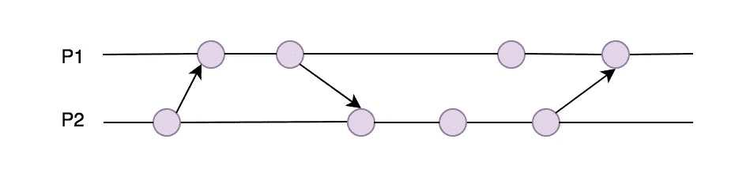
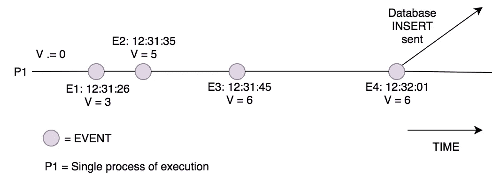
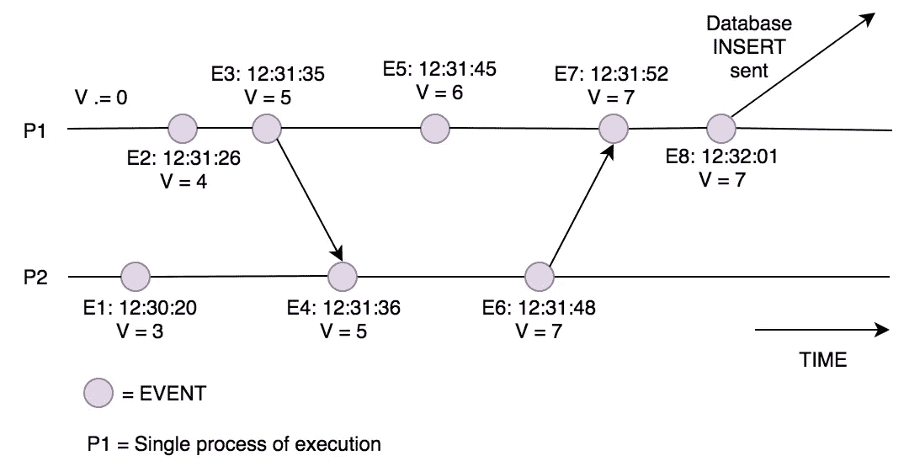
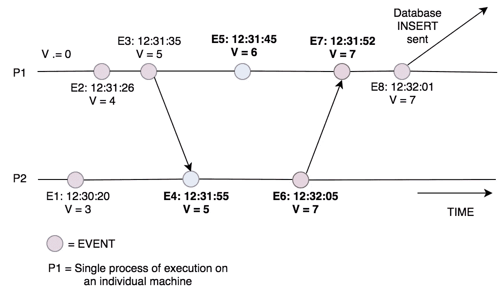
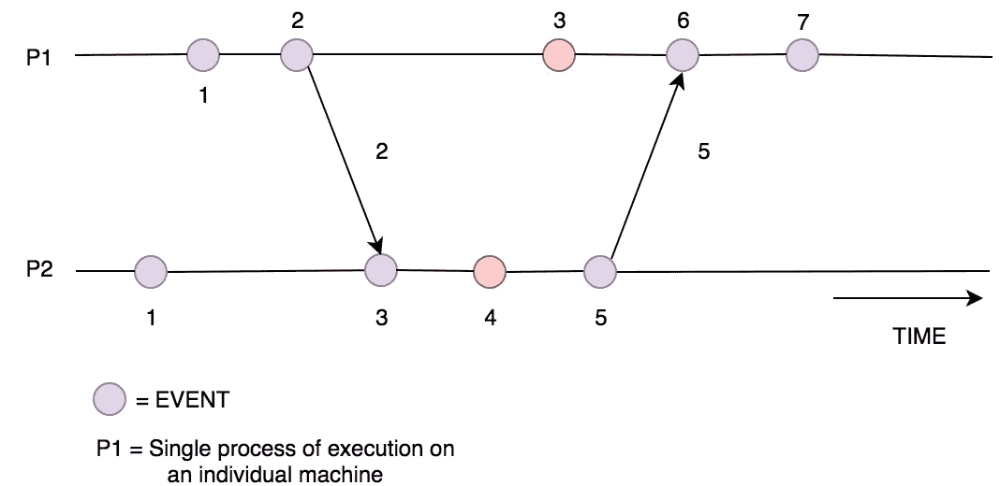
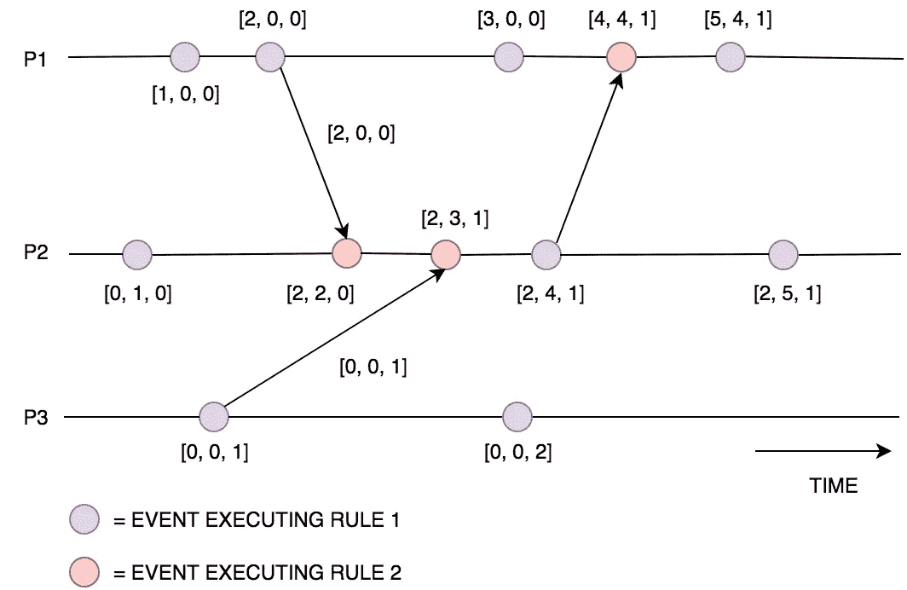

# 分布式系统:物理、逻辑和矢量时钟

> 原文：<https://levelup.gitconnected.com/distributed-systems-physical-logical-and-vector-clocks-7ca989f5f780>

分布式系统中 P1 和 P2 两个进程之间的交互。

分布式系统为我们提供了解决问题的能力，而我们不可能用一台机器来解决这些问题。然而，我最近痛苦地意识到，每一个问题的解决方案都会带来一系列新的问题和需要考虑的问题。

在分布式系统领域，我们在单机系统上遇到的最大问题之一是试图保持事件的正确时间线。这是出于多种原因需要的——其中最重要的原因之一是理解系统中事件的顺序和因果关系。这就是在评估系统执行特定操作的原因时允许执行的分析。

例如，如果您想知道为什么一个特定的值被写入您的数据库，您可以搜索导致创建`INSERT`请求的一系列事件。然后，您可以使用时间戳按时间顺序放置这些事件，从最近的到最早的，以便理解导致最终值被写入的动作的因果关系[图 1]。

图 1:这显示了单个进程[P1]的一系列事件，导致了一个数据库插入请求。您可以看到，使用时间戳允许按时间顺序放置事件，显示了变量 V 在发送到数据库时如何最终假定值为 6。

当我们只有一台机器时，即使我们有多个进程(线程)创建事件，事件的时间线也相对容易创建。这是由于所有的事件，跨进程，共享同一个物理时钟**。当这些事件中的每一个都记录了它执行的时间时，我们可以保证在构建时间线时，所有事件都将按照正确的顺序排列。这是因为所有时间戳都使用了相同的 P **物理时钟**，提供了单一的全球时间视图【图 2】。**

****

**图 2:这显示了两个进程相互发送消息，影响变量 v。您可以看到时间戳仍然有效，因为它们都在同一台机器上，具有相同的单一时间视图。因此，我们可以对事件进行排序，并确定在将 V 发送到数据库时是什么原因导致 V 等于 7。**

**然而，当我们转向分布式系统时，我们不能再依赖这个属性了。让我们以前面的例子来证明这一点。如果我们有导致插入的事件发生在多台机器上，每台机器都有自己的本地时钟，我们使用时间戳按时间顺序放置事件，我们现在必须保证每台机器的时钟都有完全相同的时间。这被称为拥有一个**全局时钟**，在分布式系统中不容易实现【图 3】。**

****

**图 3:上图显示了如果没有全局时钟，我们可能会进入的不一致状态。你可以看到 P1 和 P2 的时钟相差很大，足以让我们得到不正确的事件顺序。仅根据时间戳，我们认为 E4 发生在 E5(蓝色)之后。我们还看到，E6 是在到达 P1 的 E7(红色)后发送的。这使得系统在调查数据库插入事件时无法得出因果关系。**

**取而代之的是，一个分布式系统实际上有一个跨越所有机器的物理时间的近似值。如果事件不经常发生，近似法可能就足够了，因为只要每台机器的时钟在某个可接受的阈值内保持同步，您就总是能够将事件按正确的时间顺序排列。但是，在大多数分布式系统中，这并不是一个足够好的保证。因此，我们必须寻找一种虚拟的方式来表达机器之间的时间，这样我们就可以保持将事件放置在准确的时间线中的能力。这就是**逻辑时钟**的概念。**

****逻辑时钟**指的是在你的分布式系统中的所有机器上实现一个协议，使得这些机器能够在某个虚拟时间跨度内保持事件的一致顺序。这被更正式地指定为将事件放置在某个时间跨度中的一种方式，因此以下属性将始终为真:**

> **给定两个事件(e1，e2)，其中一个事件由另一个事件引起(e1 导致 e2 发生)。那么“由”事件(e1)的时间戳小于另一个事件(e2)。**

**为了提供该功能，任何**逻辑时钟**必须提供 2 条规则:**

**规则 1 :这决定了一个本地进程在事件发生时如何更新它自己的时钟。**

***规则 2* :决定一个本地进程收到另一个进程的消息时如何更新自己的时钟。这可以描述为该过程如何使其本地时钟与关于全球时间的信息内联。**

**最简单的实现是**标量时间**。在这种表示中，每个进程保持一个初始设置为 0 的本地时钟。然后，它提供了 2 个规则的以下实现:**

***规则 1* :在执行一个事件(不包括接收消息的事件)之前，将本地时钟加 1。**

> **本地时钟=本地时钟+ 1**

***规则 2* :当接收到一条消息时(该消息必须包括发送方的本地时钟值)，将您的本地时钟设置为接收到的时钟值和本地时钟值的最大值。此后，将本地时钟加 1[图 4]。**

> **1.本地时钟=最大值(本地时钟，接收时钟)**
> 
> **2.本地时钟=本地时钟+ 1**
> 
> **3.消息变得可用。**

****

**图 4:上图显示了如何使用标量时间，两个进程(P1 和 P2)根据它们收到的消息更新它们的本地时钟。**

**我们可以看到**标量时间**提供了一个最终一致的时间状态。这意味着可能存在不同进程之间记录的时间不同的地方，但是给定有限的时间量，这些进程将集中在正确时间的单一视图上。造成这种情况的原因是，一个流程中的内部事件(应用*规则 1)* 与另一个流程中的并发事件(图 4 中的红色事件)不一致。这是因为跨进程的全局和本地时钟使用了一个数字。为了达到因果一致性，我们需要一种方法来分别表示本地时间和全球时间。这就是**矢量时钟**的用武之地。**

**矢量时钟在标量时间上扩展，提供了一个因果一致的世界观。这意味着，通过观察时钟，我们可以看到一个事件是否促成了另一个事件。使用这种方法，每个进程为系统中每个进程的每个本地时钟保存一个带有整数的向量(整数列表)。如果有 N 个进程，那么每个进程都会维护一个 N 大小的向量。给定一个带有向量(v)的进程(Pi)，**向量时钟**执行**逻辑时钟**规则如下:**

***规则 1:* 在执行一个事件(不包括接收消息的事件)之前，进程 Pi 将它的本地向量中的值 v[i]增加 1。这是向量中引用处理器(I)的本地时钟的元素。**

> **本地向量[i] =本地向量[i] + 1**

***规则 2:* 当接收到消息(该消息必须包括发送方向量)时，循环通过发送的向量中的每个元素，并将其与本地向量进行比较，将本地向量更新为每个元素的最大值。然后将向量中的本地时钟递增 1[图 5]。**

> **1.**对于 k = 1 到 N:**local _ vector[k]= max(local _ vector[k]，sent_vector[k])**
> 
> **2.本地向量[i] =本地向量[i] + 1**
> 
> **3.消息变得可用。**

****

**图 5:上图显示了在执行内部事件、发送事件和接收事件时，向量时钟是如何更新的。它还显示了进程间发送的向量的值。**

****向量时钟**提供了事件因果一致的排序，然而这是有代价的。您可以看到，对于发送的每个消息，我们需要将整个向量发送到每个流程，以保持向量时钟同步。当有大量进程时，这种技术会变得非常昂贵，因为发送的向量非常大。相对于前面提到的最初的**矢量时钟**实现，已经有了许多改进，最显著的是:**

*   ***sing Hal–Kshemkalyani 的差分技术[1]* :这种方法通过仅发送自进程(i) →进程(j)发送最后一条消息以来发生的向量时钟更新，改进了消息传递机制。这极大地减少了发送的消息大小，但是需要 O(n)存储。这是因为每个节点现在需要为每个其他进程记住上次发送消息时向量的状态。这也需要在进程之间传递 FIFO 消息，因为它依赖于知道最后发送的消息是什么的保证，如果消息到达顺序错误，这是不可能的。**
*   ***Fowler-Zwaenepoel 直接依赖技术[2]* :该技术通过仅发送发送过程的单个时钟值来进一步减小消息大小。然而，这意味着在查看事件的因果关系时，流程无法知道它们的传递依赖关系。为了获得导致特定事件的所有依赖关系的完整视图，必须跨进程进行离线搜索。**

**总之，我们可以看到，当我们进入一个分布式系统，维持秩序成为一个困难的问题。为了解决这个问题，我们必须创造一种人为的时间观，称为**逻辑时间**。有许多解决方案提供了逻辑时间的实现。标量时钟为这个问题提供了一个简单的解决方案，给出了最终一致的事件顺序。**向量时钟**然后通过分离进程的本地和全局时钟来构建这种技术，这意味着事件排序可以因果一致。此外，对**矢量时钟**进行了改进，以提高其性能，但代价是需要更大的存储空间或需要离线进行因果关系分析。**

**这篇文章基于《分布式计算:原理、算法和系统》这本书[3]，我强烈推荐阅读这本书。**

**希望你喜欢这本书。:)**

** [## 乔·奥诺瑞——软件工程师——BJSS | LinkedIn

### 查看 Joe Honour 在全球最大的职业社区 LinkedIn 上的个人资料。乔有 5 份工作列在他们的…

www.linkedin.com](https://www.linkedin.com/in/joe-honour-8693029a) 

## 参考资料:

[1]:m . sing Hal 和 Kshemkalyani，公元 1992 年。矢量时钟的有效实现。*信息处理信*， *43* (1)，第 47–52 页。

[2]:j .福勒和 w . Zwaenepoel，1990 年 5 月。因果分布式断点。分布式计算系统，1990 年。诉讼程序。，第十届国际会议(第 134–141 页)。IEEE。

[3]: Kshemkalyani，A.D .和 Singhal，m .，2011 年。分布式计算:原理、算法和系统。剑桥大学出版社。**