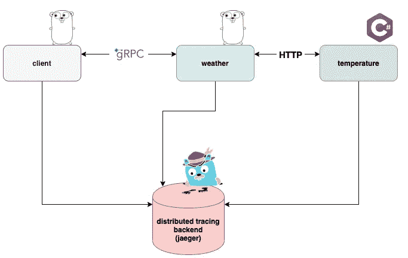
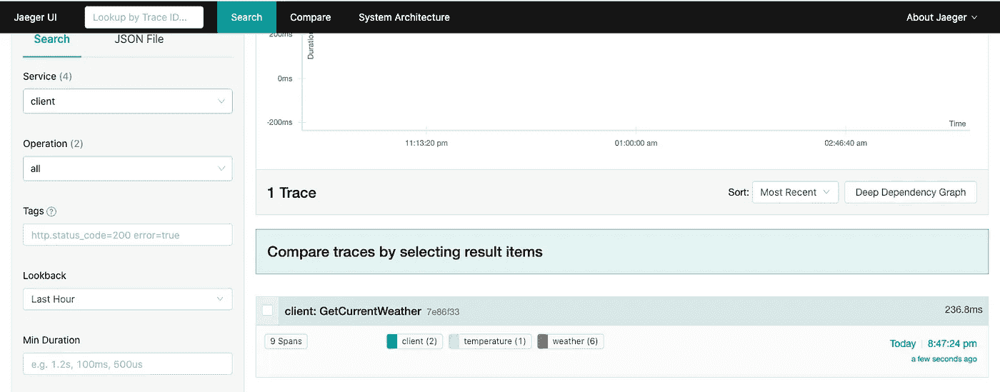
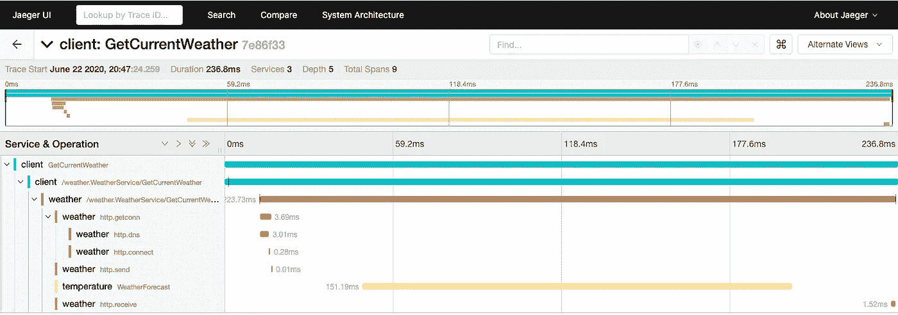
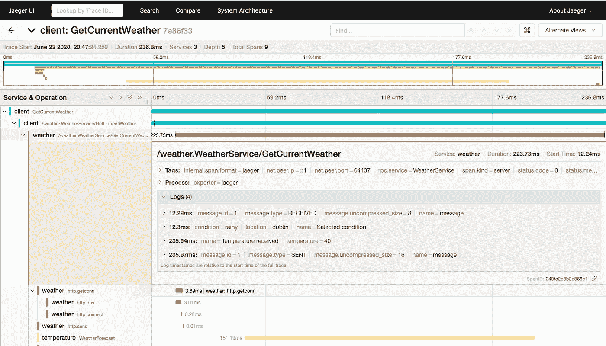

# 使用 OpenTelemetry 的分布式跟踪—第 2 部分

> 原文：<https://levelup.gitconnected.com/distributed-tracing-with-opentelemetry-part-2-cc5a9a8aa88c>

## 分布式系统中的跟踪请求

由[斯蒂芬·道森](https://unsplash.com/@srd844?utm_source=medium&utm_medium=referral)在 [Unsplash](https://unsplash.com?utm_source=medium&utm_medium=referral) 上拍摄的照片

在本文中，我们将重点关注在[上一篇文章](https://medium.com/@ricardo.linck/distributed-tracing-with-opentelemetry-part-1-6719df95a364)中提出的架构的实现。慢慢复习吧。

 [## 使用 OpenTelemetry 的分布式跟踪—第 1 部分

### 了解 OpenTelemetry 和分布式跟踪

medium.com](https://medium.com/@ricardo.linck/distributed-tracing-with-opentelemetry-part-1-6719df95a364) 

完整的代码可以在我的 [github repo](https://github.com/RicardoLinck/distributed-tracing-otel) 上找到。我将在这里创建并粘贴一些 gists 以供参考，这些将只包含最相关和最重要的代码片段。所以我真的鼓励你去我的 github 上看看完整的参考资料。由于很多人每天都在努力使 OpenTelemetry 变得更好，而且该项目仍处于早期阶段，所以这里共享的代码可能很快就会过时。

> OpenTelemetry 仍处于测试阶段，因此还不能用于生产系统。

这里又是图，不用一直在文章间切换；)

架构图

## 客户

这些请求将来自我们的客户端应用程序。这是一个用 go 编写的简单控制台应用程序，主要目标是通过 gRPC 调用*天气服务*。该应用程序将启动将被传播(上下文传播)到*天气服务*的跨度。

上面代码中的几个重要部分。在第 18 行，我们正在为我们的跟踪配置导出器。在下一个要点中，我将添加特定函数的代码。在第 20 行，我们正在为这个应用程序创建跟踪器。在第 22 行，我们添加了 gRPC 调用的拦截器。这个拦截器会在将请求发送到 gRPC 服务器之前将 span 信息添加到上下文中。这也被称为**上下文传播**。在处理分布式跟踪时，这是一个关键部分，因为这是如何将跨度捆绑在一起的。幸运的是 OpenTelemetry 提供了插件来做这件事，所以我们只需要添加拦截器，所有的信息都会被注入到请求中。在第 39 行，我们创建了一个新的 span，我们推迟了第 40 行的`.End()`函数。我们还使用返回的上下文作为传递给 gRPC 请求的上下文。在`getCurrentWeather`函数的最后，我们将响应作为一个事件添加到我们创建的 span 中。

在这个要点上，我们可以看到如何为耶格出口配置。我们依赖于 OpenTelemetry 提供的官方导出包。我们将使用相同的函数从*客户端*和*天气服务*创建导出器，因为两者都在 go 中实现。

## 气象服务

这个服务也是在 go 中实现的，所以很多东西会和*客户端*类似。该服务对请求中提供的位置执行快速查找，并调用*温度服务*来获取随机温度。它返回两条信息，`condition`和`temperature`。

这看起来与我们在*客户端*上看到的非常相似。我们对 gRPC 调用使用了一个拦截器。主要区别在于，它将做与它为*客户端*所做的相反的事情，而不是将跨度信息`injecting`到上下文中，它将把该信息`extract`出上下文。当我们能够在第 40 行上调用`span := trace.SpanFromContext(ctx)`时，我们可以看到这一点。该调用只返回一个有效的跨度，因为上下文(ctx)包含拦截器提取的跨度信息。全部由`grpctrace`包完成。在后台，该包使用 [OpenTelemetry 规范](https://github.com/open-telemetry/opentelemetry-specification/blob/master/specification/context/api-propagators.md)中指定的`Extract`和`Inject`方法。出于故障排除的目的，我们在本例中向 span 添加了不同的事件。我们在第 32 行添加所选选项(或者记录错误，以防在第 28 行的位置地图中找不到该位置)。同样，在第 37 行调用了*温度服务*之后，我们正在做同样的事情，处理错误以防出错，或者用返回的温度向 span 添加一个事件。

这是调用*温度服务*的代码。在这种情况下，由于服务是在 rest api 中实现的，我们使用`httptrace`包将 span 信息(包含在`ctx`参数中)转换成 HTTP 请求。使用`W3C`标准传播上下文。这让我们看到了样本的最后一部分。

## 温度服务

这个服务只是在用 C#实现的 rest api 上提供一个温度端点。控制器实现或任何东西都没有什么特别的。魔力全在`Startup.cs`上。

如你所见，这个实现与我们在 go 中的实现非常相似。我们为 Jaeger 配置了导出器，将采样设置为总是采样，并使用`.AddRequestCollector`添加请求收集器。这个调用设置一个中间件，将遥测添加到所有接收到的请求中。这个中间件也理解`W3C`格式和`extracts` span 信息，如果它存在的话。因此，基本上这与我们的其他服务完美契合。

## 跟踪请求

如果我们继续一起运行所有的东西，所有的跨度最终都应该被发送到 Jaeger。如果我们切换到 Jager UI，选择*客户端*服务，然后点击 **Find Traces，**我们将得到如下结果:

出现在 Jaeger 用户界面中的跨度

这个初始视图将显示与该特定服务相关的所有跨度。从这个视图中，我们已经可以看到，来自客户端的跨度实际上包含来自其他服务的跨度。如果我们单击该 span 以查看其详细信息，我们将看到如下内容:

Jaeger UI 中的跨度细节

在顶部，我们可以看到一个时间表，其中包含这个特定请求的所有跨度。这非常有助于识别瓶颈和性能问题。例如，我们可以看到我们的大部分时间都花在调用*温度服务*上。如果我们想进一步研究每个跨度，只需单击其中一个跨度。

这些是来自主要*气象服务*时段的细节。正如我们所看到的，添加到 span 中的事件在这里显示为日志。这对于故障诊断和理解这个特定请求发生了什么非常有帮助。我们可以看到，这个 span 首先是通过 gRPC 接收的，紧接着我们选择了位置的条件，然后我们从外部服务获取温度，将所有内容打包，并将响应发送回客户端。当您处理多个正在执行的并发函数时，这种方法非常有用。如果我们每个并发函数有一个 span(go routine ),我们可以很容易地理解日志属于哪一个。当我们只处理裸日志时，这是非常棘手的，因为它们可能会被无序记录，并且没有太多的上下文。不要害怕利用这一点，根据需要创建尽可能多的跨度，以便理解您的请求正在发生什么。

在这个具体的例子中，我们没有同时向不同的服务请求东西，但是这在真实的系统中肯定会发生。这显示了 OpenTelemetry 和分布式跟踪的威力。

## 最后的想法

分布式系统很难监控和排除故障。日志和度量虽然是非常有用的东西，但有时不足以让我们理解给定请求或给定场景中发生了什么。关联事物是很困难的，当你必须手动地或者跨不同的技术和平台来做时，就更困难了。OpenTelemetry 提供了一个很好的标准，具有现成的功能来帮助解决这些情况。

该标准允许我们使用不同的协议和编程语言进行几乎无缝的通信。只要你依靠标准，事情就会在两端起作用，一切都会很容易关联起来。