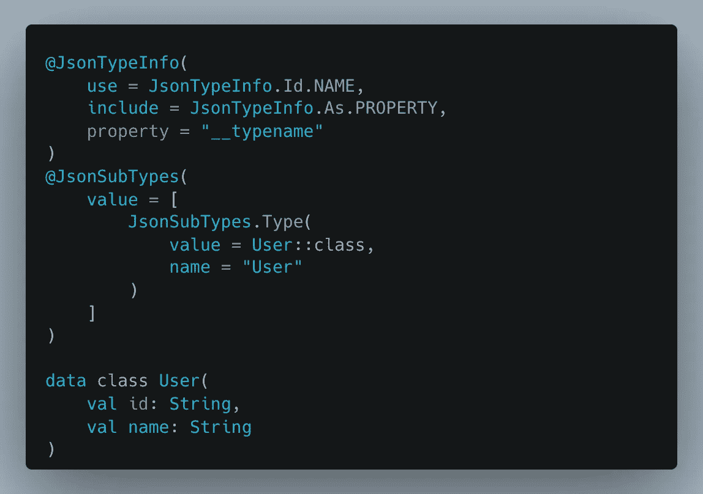

# 当 GraphQL 碍事时，将其丢弃

> 原文：<https://levelup.gitconnected.com/ditch-graphql-when-it-gets-in-the-way-4a71b4de1a12>

您或您的团队是否在 GraphQL 概念上苦苦挣扎，或者对于您正在构建的东西来说，它是否感觉太重了？我最近开发了一个 NextJS 和 Ktor 应用程序，它从 GraphQL 开始，但最终不是正确的选择。

# GraphQL 的优势

**开发者体验**

向 API 中添加新的类型和字段是很简单的，对于您的客户来说，开始使用这些字段也同样简单。这是使用 GraphQL 的最大好处，并且在设计 API 时具有灵活性。

**一个 API 供多个客户使用**

如果你有一个网站、一个 Android 应用程序和一个 iOS 应用程序，能够灵活地调整每个应用程序请求的数据，并让它们在想要接收数据的时候控制*，这种感觉真的很棒。不用维护多个 API(移动和 web)，您可以将所有精力投入到单个 API 中，并减少大量跨网络数据开发**和**开销。*

**性能**

通常使用 REST API，需要多次调用来完成一项任务或获取列表中每一项的详细数据。例如，给我一个项目列表，然后进行第二次调用来获取一个或多个项目的详细信息，以显示给用户。使用 GraphQL，您可以通过一个 API 调用而不是两个来获得列表旁边的所有详细数据。

# 认识到缺陷

**错误处理**

谈到 GraphQL，错误处理总是一个有趣的话题。使用 REST APIs，您可以在事件发生时返回特定的 HTTP 代码。灾难性或意外的错误通常会导致 500，包含错误数据的错误请求通常会导致 400。这让您可以使用前端代码中的承诺来检查是否有东西返回 ***ok*** 或 ***error*** ，然后适当地处理错误。

使用 GraphQL，您可以自行处理，因为所有内容都返回 200，然后您添加一个错误对象，您必须解析该对象以查看是否真的有错误。

如果你有复杂的错误处理，那么这就是你的前端代码变得非常复杂的地方，处理来自后端的所有错误，并试图弄清楚什么是正确的 HTML 来显示给用户。

如果您正在处理复杂的错误处理，那么在引入或继续使用 GraphQL 时，请认真考虑。

**冗长的模式**

对于这个特定的应用程序，我们使用 Ktor 而不是 Spring Boot，这是非常标准的，没有很多现成的铃铛和口哨。来自多年的 Ruby 编程，感觉很像 Sinatra。

我们引入的 [GraphQL 库](https://github.com/ExpediaGroup/graphql-kotlin)有很大的魔力，你可以在其中实现一个接口(订阅、查询、变异),然后事情就可以正常工作了。但是您必须在相当多的地方定义这些`JsonTypeInfo`注释，这样您才能使序列化与 fasterxml-jackson 一起工作。

总的来说，这限制了您在实现特定 GraphQL 接口的类中所能做的事情，并且您最终会得到许多这样的 JSON 注释。

**简单域**

对我们来说，我们正在测试一个事件源系统，它有一个简单的领域，其中有 1 或 2 个领域概念。对于我们所在的简单领域来说，在前端*和后端*实现所有的模式和基础设施感觉非常繁重，我们只需要显示一个列表，添加一个新项目，并修改单个项目的属性。

如果领域更复杂，需要多个团队或者一个联合架构，那么我们会看到更多的好处。

如果您的领域足够简单，考虑不要使用 GraphQL，添加 GraphQL 只会导致膨胀和不必要的复杂性。

**同一个团队维护的一个客户端**

对我们来说，我们有一个后端 API 和一个前端应用程序，我们 100%控制。我们没有从 API 灵活性中获得任何好处，因为我们也是更新前端的团队，可以在需要完成新功能或修复 bug 时更新后端 API 中的任何内容。

如果你没有单独的团队或公司开发前端或移动应用程序，请考虑不要使用 GraphQL。

**团队使用 GraphQL 的经验**

如果你的团队中没有至少一两个 GraphQL 专家，那么进度**会很慢。**特别是在刚开始的时候*和*每当有新人加入团队，你都会感觉慢下来。考虑为了构建和维护一个 GraphQL API，团队知道多少或者将要学习多少。

如果您没有专业知识或者希望团队和代码库的加速时间更短，可以考虑不使用 GraphQL。

# 结论

总的来说，我们已经决定最终在这个应用中远离 GraphQL，并且在我们构建的下一个应用中不使用它。您是否有过与 GraphQL 类似的经历，或者完全相反的经历？请在下面的评论中告诉我！

如果你喜欢这篇文章，考虑[订阅 Medium](https://medium.com/@ascourter/membership) ！

如果你或你的公司有兴趣找人进行技术面试，那么请在 Twitter ( [@Exosyphon](http://twitter.com/Exosyphon) )上给我发 DM，或者访问我的[网站](https://andrewcourter.com/)。如果你喜欢这样的话题，那么你可能也会喜欢我的 [Youtube 频道](https://www.youtube.com/channel/UCx3Vist13GWLzRPvhUxQ3Jg)。如果你喜欢 3D 打印的东西，去我的 [Etsy 商店](https://www.etsy.com/listing/1273702925/6-sided-fidget-cube)看看。祝您愉快！