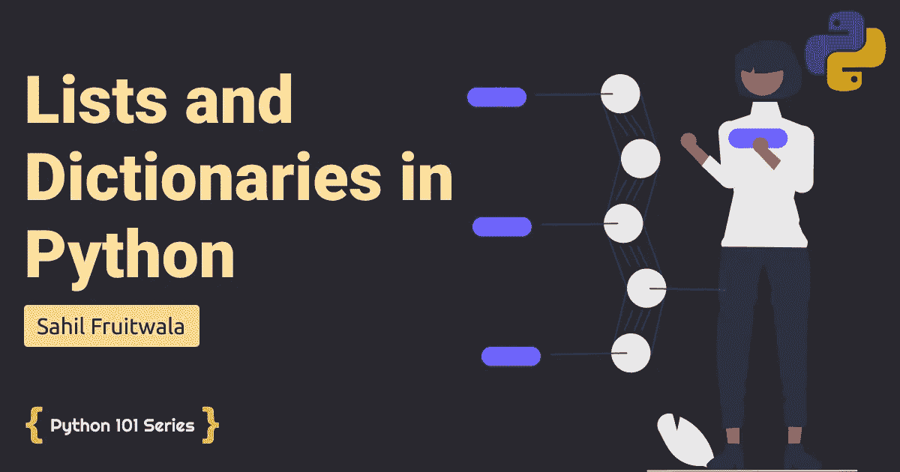

# 深入 Python 中令人生畏的列表和字典

> 原文：<https://levelup.gitconnected.com/dive-into-daunting-lists-and-dictionaries-in-python-2d22daf2c897>

## 理解 Python 中的内置列表和字典方法



深入 Python 中令人生畏的列表和字典

正如我承诺的，我来了！我又带来了一篇关于 Python 列表和字典的深度博文。在这篇博客中，我们将看看 python 提供的列表和字典的内置方法。python 中没有太多复杂的方法。所有的内置方法从名字上看都非常直观。所以，让我们开始吧！


# Python 中可爱的列表数据类型

Python 为列表提供了几个内置方法。有些你会在日常生活中用到，但有些你可能永远不会用到。所以，让我们关注重要的。

1.  insert()、append() & extend()
2.  移除()，弹出()，删除和清除()
3.  count()，index() & len()
4.  排序()&反转()
5.  复制()

# insert()、append() & extend()

## 插入()

语法:`list.insert(position, element)`
Insert()方法在列表的指定位置添加一个元素。元素可以是任何内置的数据类型。

1).将字符串插入列表

```
list1 = ["Python", "Programming"]
str1 = "Learn"
list2 = ["From", "Sahil Fruitwala"]list1.insert(0, str1)
list1.insert(3, list2)print(list1)#OUTPUT: ['Learn', 'Python', 'Programming', ['From', 'Sahil Fruitwala']]
```

2).在列表中插入数字和布尔值

```
list1 = ["Python", "Programming"]
number1 = 13
boolean1 = Falselist1.insert(0, number1)
list1.insert(10, boolean1)print(list1)# OUTPUT: ['Python', 'Programming', 13, False]
```

在这里，如果我们添加任何数字超过结束索引数据将被添加到列表的末尾。所以，当我们做`list1.insert(10, boolean1)`时，由于列表没有十个元素或第十个索引，它将在列表的末尾添加布尔数据。

## 追加()

语法:`list.append(element)`
append 方法在列表末尾添加一个元素。我们也可以在 append 方法中使用任何数据类型。

```
list1 = ["Python", "Programming"]
str1 = "Learn"
list2 = ["From", "Sahil Fruitwala"]list1.append(str1)
list1.append(list2)print(list1)
# OUTPUT: ['Python', 'Programming', 'Learn', ['From', 'Sahil Fruitwala']]
```

## 扩展()

语法:`list.extend(iterable_element)`
Extend 方法将 iterable/sequence (string，list，tuple，set)数据类型的每个元素添加到列表的末尾。

```
list1 = ["Python", "Programming"]
str1 = "Learn"
list2 = ["From", "Sahil Fruitwala"]
tuple1 = ("in", "Python 101")
set1 = {"The", "Blog Series"}list1.extend(str1)
list1.extend(list2)
list1.extend(tuple1)
list1.extend(set1)print(list1)# OUTPUT: ['Python', 'Programming', 'L', 'e', 'a', 'r', 'n', 'From', 'Sahil Fruitwala', 'in', 'Python 101', 'The', 'Blog Series']
```

# 移除()，弹出()，删除和清除()

## 移除()

语法:`list.remove(element)`
remove 方法从列表中删除特定元素的第一个实例。

```
list1 = [ 1, 2, 1, 1, 4, 5 ]
list1.remove(1)
print(list1)# OUTPUT: [2, 1, 1, 4, 5]
```

如果我们试图删除列表中不存在的元素，python 就会抛出错误。

```
list1 = [ 1, 2, 1, 1, 4, 5 ]
list1.remove(6)
print(list1)'''
OUTPUT:Traceback (most recent call last):
  File "C:\\\\Users\\\\Sahil\\\\Desktop\\\\1.py", line 2, in <module>
    list1.remove(6)
ValueError: list.remove(x): x not in list'''
```

## 流行()

语法:`list.pop()`或`list.pop(index)`
默认情况下，pop 方法删除列表的最后一个元素并返回它。我们还可以将特定的索引传递给 pop 方法。

```
list1 = ["Python", "C++", "Java", "PHP", "Rust"]
pop_element = list1.pop()
print(pop_element)
print(list1)# OUTPUT: Rust
# OUTPUT: ['Python', 'C++', 'Java', 'PHP']pop_element = list1.pop(1)
print(pop_element)
print(list1)# OUTPUT: C++
# OUTPUT: ['Python', 'Java', 'PHP']
```

## 倒三角形

语法:`del list[index]`
关键字 **del** 从列表中的特定索引中删除元素。如果我们使用不带任何索引的`del`关键字，它将从计算机内存中删除完整的变量。

```
list1 = ["Python", "C++", "Java", "PHP", "Rust"]
del list1[2]
print(list1)# OUTPUT: ['Python', 'C++', 'PHP', 'Rust']list1 = ["Python", "C++", "Java", "PHP", "Rust"]
del list1
```

## 清除()

语法:`list.clear()`
clear 方法从列表中删除所有元素。

```
list1 = ["Python", "C++", "Java", "PHP", "Rust"]
list1.clear()
print(list1)# OUTPUT: []
```

# count()，index() & len()

## 计数()

语法:`list.count(element)`
count 方法返回列表中特定元素出现的次数。

```
fruits = ['apple', 'banana', 'cherry', 'mango', 'grape', 'cherry', 'cherry']
num_of_cherry = fruits.count("cherry")
print(num_of_cherry)# OUTPUT: 3
```

## 索引()

语法:`list.index(element)`
index 方法返回列表中特定元素的索引。

```
fruits = ['apple', 'banana', 'cherry', 'mango', 'grape', 'cherry', 'cherry']
index_of_cherry = fruits.index("cherry")print(index_of_cherry)# OUTPUT: 2
```

注意:如果一个元素不存在，ion list index()将抛出错误。

## len()

语法:`len(list)`
Len 方法返回任意序列数据类型和字典的长度。

```
list1 = ['apple', 'banana', 'cherry', 'mango', 'grape', 'cherry', 'cherry']
str1 = "Python Programming"
dict1 = {'lang':"Python", 'Year':2021}print(len(list1))
print(len(str1))
print(len(dict1))# OUTPUT: 7
# OUTPUT: 18
# OUTPUT: 2
```

# 排序()&反转()

## 排序()

语法:`list.sort()`
默认情况下，sort 方法将列表中的所有元素按升序排序。我们可以通过在排序函数中提供 **reverse=True** 参数来进行降序排序操作。

```
nums = [2, 5, 1, 7, 2, 3, 4, 5, 6]nums.sort()
print(nums)
# OUTPUT: [1, 2, 2, 3, 4, 5, 5, 6, 7]nums.sort(reverse=True)
print(nums)
# OUTPUT: [7, 6, 5, 5, 4, 3, 2, 2, 1]
```

排序方法是一种就地方法。这意味着，它不返回任何值，所有的操作都在内部完成。这就是我们没有将`nums.sort()`赋给任何其他值的原因。如果我们这样做，我们将得到以下结果。

```
nums = [2, 5, 1, 7, 2, 3, 4, 5, 6]new_nums = nums.sort()
print(new_nums)# OUTPUT: None
```

## 反向()

语法:`list.reverse()`
顾名思义，reverse 方法是将整个列表反转。反向法也是一种到位法。

```
nums = [2, 5, 1, 7, 2, 3, 4, 5, 6]nums.reverse()
print(nums)
# OUTPUT: [6, 5, 4, 3, 2, 7, 1, 5, 2]
```

## 复制()

语法:`list.copy()` 在开发过程中会出现很多情况，我们要复制列表。复制方法可以帮助我们做到这一点。

```
num1 = [2, 5, 1, 7, 2, 3, 4, 5, 6]
num2 = num1num2.reverse()
print(num1)
print(num2)# OUTPUT:
[6, 5, 4, 3, 2, 7, 1, 5, 2]
[6, 5, 4, 3, 2, 7, 1, 5, 2]
```

一般情况下， **num2** 会复制 **num1** 的数据。但是，在列表的情况下，它只是将 num1 的内存地址复制到 num2。因此，无论我们在 num2 中做了什么改变，它们都会反映在 num1 中，反之亦然。因此，要正确地复制列表，我们必须使用 copy 方法。

```
num1 = [2, 5, 1, 7, 2, 3, 4, 5, 6]
num2 = num1.copy()num2.reverse()
print(num1)
print(num2)# OUTPUT:
[2, 5, 1, 7, 2, 3, 4, 5, 6]
[6, 5, 4, 3, 2, 7, 1, 5, 2]
```

或者，您也可以使用`list(list_name)`。

```
num1 = [2, 5, 1, 7, 2, 3, 4, 5, 6]
num2 = list(num1)num2.reverse()
print(num1)
print(num2)# OUTPUT:
[2, 5, 1, 7, 2, 3, 4, 5, 6]
[6, 5, 4, 3, 2, 7, 1, 5, 2]
```

# Python 中的 Dope 字典数据类型

1.  clear()、pop() & popitem()
2.  get()、items() & keys()
3.  update() & fromkeys()

# clear()、pop() & popitem()

## 清除()

语法:`dictionary.clear()`
字典的 clear()方法与它在列表中的工作方式相同。这个方法从字典中移除所有的元素。

```
blog =	{
  "language": "Python",
  "Blogger": "Sahil Fruitwala",
  "year": 2021
}print(blog)
# OUTPUT: {'language': 'Python', 'Blogger': 'Sahil Fruitwala', 'year': 2021}blog.clear()
print(blog)
# OUTPUT: {}
```

## 流行()

语法:`dictionary.pop()`或`dictionary.pop(key, default_value)`
pop()方法从字典中移除并返回特定的元素。

```
blog =	{
  "language": "Python",
  "Blogger": "Sahil Fruitwala",
  "year": 2021
}print(blog)
# OUTPUT: {'language': 'Python', 'Blogger': 'Sahil Fruitwala', 'year': 2021}year = blog.pop("year")
print(blog) # OUTPUT: {'language': 'Python', 'Blogger': 'Sahil Fruitwala'}
print(year) # 2021
```

如果键不存在，当我们需要一些默认值时，就使用 pop()。

```
blog =	{
  "language": "Python",
  "Blogger": "Sahil Fruitwala",
  "year": 2021
}year = blog.pop("years", "NotFound")
print(blog) # OUTPUT: {'language': 'Python', 'Blogger': 'Sahil Fruitwala', 'year': 2021}print(year) # NotFound
```

## popitem()

语法:`dictionary.popitem()`
pop item()从字典中删除最后一个键值对，并以元组的形式返回。

```
blog =  {
  "language": "Python",
  "Blogger": "Sahil Fruitwala",
  "year": 2021
}year = blog.popitem()
print(blog)
# OUTPUT: {'language': 'Python', 'Blogger': 'Sahil Fruitwala'}print(year)
# OUTPUT: ('year', 2021)
```

# get()、items()、keys() & values()

## 获取()

语法:`dictionary.get(keyname)`
get 方法提取指定键值

```
blog =  {
  "language": "Python",
  "Blogger": "Sahil Fruitwala",
  "year": 2021
}year = blog.get("year")
print(year)
# OUTPUT: 2021
```

## 项目()

语法:`dictionary.items()`
items 方法返回字典的视图对象。视图对象包含所有的键值对。使用 items()方法的一个缺点是，如果您在根或原始字典中进行任何更改，它也会反映在视图对象变量中。

```
blog =  {
  "language": "Python",
  "Blogger": "Sahil Fruitwala",
  "year": 2021
}view_object = blog.items()blog['year'] = 2022
print(view_object)# OUTPUT: dict_items([('language', 'Python'), ('Blogger', 'Sahil Fruitwala'), ('year', 2022)])
```

## 键()&值()

语法:`dictionary.keys()`和`dictionary.values()` 顾名思义，keys()和 values()方法返回**视图对象**或者给定字典的键和值。

```
blog =  {
  "language": "Python",
  "Blogger": "Sahil Fruitwala",
  "year": 2021
}keys = blog.keys()
print(keys)
# OUTPUT: dict_keys(['language', 'Blogger', 'year'])values = blog.values()
print(values)
# OUTPUT: dict_values(['Python', 'Sahil Fruitwala', '2022'])
```

# update() & fromkeys()

## 更新()

语法:`dictionary.get({key:value})`
update 方法用指定的值更新现有的键，如果键不存在，则添加新的键-值对。

```
blog =  {
  "language": "Python",
  "Blogger": "Sahil Fruitwala",
  "year": 2021
}blog.update({"type": "New"})
print(blog)
# OUTPUT: {'language': 'Python', 'Blogger': 'Sahil Fruitwala', 'year': 2021, 'type': 'New'}blog.update({"type": "OLD"})
print(blog)
# OUTPUT: {'language': 'Python', 'Blogger': 'Sahil Fruitwala', 'year': 2021, 'type': 'OLD'}
```

## fromkeys()

语法:`dict.fromkeys(keys, defaultvalue)`
当我们从头开始添加新参数但不知道它们的值时，这时我们可以用**键**和默认**值**创建一个字典。

```
keys =  ( "Python", "Sahil Fruitwala", 2021 )blog = dict.fromkeys(keys)
print(blog)
# OUTPUT: {'Python': None, 'Sahil Fruitwala': None, 2021: None}blog1 = dict.fromkeys(keys, "")
print(blog1)
# OUTPUT: {'Python': '', 'Sahil Fruitwala': '', 2021: ''}
```

# 结论

终于！我们已经到了这一节的末尾😁。

我知道，一次接受太多了。但是，你不需要记住我在这里提到的一切。我只是展示给你看，这样你就能回忆起什么是可能的，什么是不可能的。还有一些我在这里没有提到的其他方法。

如果您想了解更多关于列表和字典方法的信息，请查看 [GeeksforGeeks](https://www.geeksforgeeks.org/python-dictionary-methods/) 。

就这样。感谢您的阅读。

如果你需要任何帮助或者想讨论什么，请告诉我。在 Twitter 或 LinkedIn 上联系我。请务必在下面的评论中留下你的想法、问题或担忧。我很想看看他们。

> *想了解更多？*
> 
> *注册我的* [*简讯*](https://bit.ly/3Menk8Q) *，把最好的文章放进你的收件箱。*

直到下一次👋

> 查看 Python 101 系列的更多博客👇

[](/conditional-statements-and-loops-in-python-b8ac64f36faa) [## Python 中的条件和循环

### 了解 Python 中的条件语句和循环

levelup.gitconnected.com](/conditional-statements-and-loops-in-python-b8ac64f36faa) [](/string-manipulation-in-python-7f8f62236792) [## Python 中奇妙的字符串数据类型带来的乐趣

### 了解如何在 Python 中使用内置的字符串操作方法

levelup.gitconnected.com](/string-manipulation-in-python-7f8f62236792)