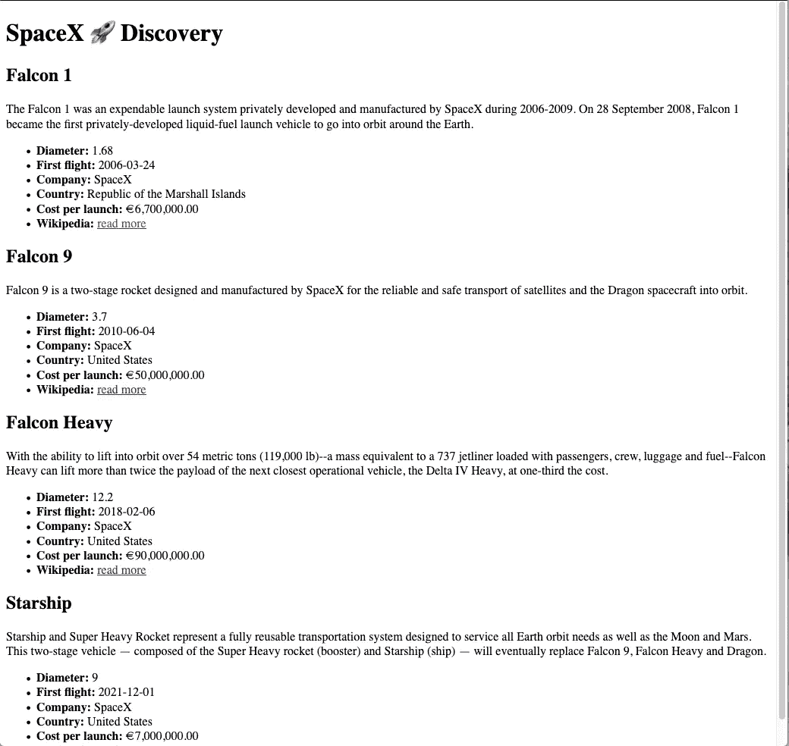

# 通过构建 SpaceX，使用 Apollo 客户端深入了解 GraphQL🚀角度 9 中的应用程序

> 原文：<https://levelup.gitconnected.com/dive-into-graphql-w-apollo-client-by-building-a-spacex-app-in-angular-8-20e703c93f0a>

由 [SpaceX](https://unsplash.com/@spacex?utm_source=unsplash&utm_medium=referral&utm_content=creditCopyText) 在 [Unsplash](https://unsplash.com/s/photos/spacex?utm_source=unsplash&utm_medium=referral&utm_content=creditCopyText) 拍摄的照片

我知道这听起来很奇怪，但是在带有 Apollo 客户端的 Angular 9 应用程序中使用 GraphQL 感觉就像驾驶 SpaceX 火箭一样🚀。为什么只有 React developer 可以是宇航员，可以乘坐 GraphQL 火箭飞行？*而且我没有任何反对的反应！每个人都可以选择自己的口味😉*

> 这个项目更新到 Angular 9，所以确保你在电脑上安装了所有需要的工具。查看这篇文章你应该为你的申请更新什么

在本教程中，我不会告诉你如何驾驶 GraphQL 火箭，但我会帮助你启动引擎，这样你就可以学习飞行。

# 火箭成员，将帮助您顺利开始本教程

当然，我的意思是，如果你具备以下基本知识，那么阅读本教程将会对你有所帮助:

*   角度 9
*   Typescript 3.7
*   GraphQL(如何使用它的基础知识)

**节点需求**

*   NodeJS ( *最新版本优先*)
*   打字稿(*最新版本优先*)

# 你会从中学到什么

您将学习如何在 Angular 8 应用程序中使用 Apollo 客户端运行 GraphQL 火箭。作为真正的棱角分明的宇航员，有一种方法可以学习这种火箭，那就是建造我们自己的 SpaceX explorer👨‍🚀

# 让我们启动角发动机

Apollo 客户端支持 Angular Router、Ionic、NativeScript。但是感谢上帝，他们支持角度示意图，这使得我们的生活在第一步变得容易得多🚀。

# 1:使用 CLI 创建角度应用程序

确保您的计算机上安装了 Angular CLI。然后运行命令创建一个新的角度。

*你想用你现有的 Angular app，那么你可以跳过这一步。*

将终端转到`spacexGraphQL`文件夹，或者打开 Visual Studio 代码(或者您喜欢的其他 IDE)并在其中打开终端。

# 2:添加阿波罗客户端

Apollo 是业界使用 GraphQL 最流行的工具。让我们通过 Angular CLI 安装 Apollo 客户端，这样它可以自动设置您需要的东西。

# 3:添加 spacex GraphQL url

进入 [SpaceX GraphQL 页面，](https://api.spacex.land/graphql/)复制 URL `[https://api.spacex.land/graphql/](https://api.spacex.land/graphql/)`并粘贴到`src/app/graphql.module.ts`中的`uri`常量变量中。

添加 SpaceX URL 后，通过下面的命令`npm start`启动应用程序，查看它是否正确运行。

# 4:从 API 模式自动生成类型

每个 GraphQL API 将显示它是一个模式。因此，我们可以自动生成这些模型和类型，而不是手工编写🙌。

首先，我们需要安装`graphql-codegen` CLI。

安装后，运行`npx graphql-codegen init`启动设置向导。

1.  您正在构建什么类型的应用程序？**有角度的**
2.  你的模式在哪里？[**https://api.spacex.land/graphql**](https://api.spacex.land/graphql/)
3.  你的运营和碎片在哪里？`**src/**/*.graphql**`
4.  挑选插件:(*用空格键选择这些插件*
5.  typescript(其他 TypeScript 插件需要)
6.  类型脚本操作(操作和片段)
7.  TypeScript Apollo Angular(typed GQL 服务)
8.  在哪里写输出？`**src/generated/graphql.ts**`
9.  是否要生成自省文件？**否**
10.  如何命名配置文件？`**codegen.yml**`
11.  package.json 中的哪个脚本应该运行 codegen？`**codegen**`

回答几个问题后，它会根据您的回答生成一个包含所有配置的`codegen.yml`文件。

看起来像这样。

运行`npm install`安装 GraphQL codegen 的插件。

现在我们只需运行`npm run codegen`来生成基于当前 GrapQL API 的模式，听起来很方便，对吧！

但是我们还没有到那一步，因为这个命令目前失败了，因为我们的项目中还没有任何`.graphql`文件。

# 5:创建第一个 GraphQL 文件

为了从 GraphQL API 生成我们所有的类型文件，我们需要创建一个 GraphQL 文件。在这个文件中，我们定义了在我们的应用程序中要使用的数据，所以我们可以留下我们不想要的数据。

在浏览器中进入 [SpaceX GraphQL](https://api.spacex.land/graphql/) 游乐场。在**浏览器**侧边栏中选择“火箭”选项。

因为我们想要显示所有 SpaceX 火箭的列表，所以我们将请求所有的火箭。如果我们想要最多 3 枚火箭，我们只需要通过选择给它一个限制。

让我们定义每个火箭需要哪些信息。通过选择属性，您可以选择任何想要的信息。

**我将选择以下内容:**

*   公司
*   每次启动的成本
*   国家
*   描述
*   直径(米)
*   首趟航班
*   身份证明（identification）
*   名字
*   维基百科（开放式百科全书）

在编辑器中，我们现在看到 GraphQL 为您构建了查询，如果您按下 play 按钮，您将在右侧获得实际的数据。

数据应该类似于下面的例子。您可以看到，我们给查询起了一个名字，以便在应用程序的更多地方重用它。

在我们为这个查询创建一个文件之前，我们需要一个`rockets`组件。

让我们为此运行以下命令。

现在，我们有了一个目录来存放从 SpaceX GraphQL API 获得的查询内容。所以让我们在火箭组件文件夹中创建一个文件`rockets.graphql`，就在我们需要它的地方。

现在我们可以运行`npm run codegen`来将我们的 GraphQL 模式生成到`src/generated/graphql.ts`中，这样我们就可以在我们的组件中使用它来引用。

要查看生成的内容，请打开文件。当滚动浏览时，您会看到 codegen 生成了整个 SpaceX GraphQL 模式的类型脚本。

当你滚动到底部，你会看到这样的东西。这是根据我们的`rockets.graphql`文件生成的。我们的查询名的名称是`getRockets`,所以我们在生成的文件中找到了它🙌。

# 6:显示火箭列表

现在让我们展示来自令人敬畏的 SpaceX API 的数据🚀。首先，我们需要采取一些步骤来做到这一点。

清洁`app.component.html`，只留下`router-outlet`在那里。

转到`app-routing.module.ts`并将火箭组件添加到 routes 数组中。

转到`rockets.component.ts`并设置它从 GraphQL API 获取数据。

您可以将这段代码复制粘贴到您的组件中，它应该可以工作。但我会带你走一遍。

我们创建了一个类型为`Rocket[]`的公共属性`rockets`。(*这种类型来自我们生成的 GraphQL 模式*)这将是一个火箭数组。它是公共的，因为我们需要在 HTML 中显示数据。

在`constructor`中，我们为`GetRocketsGQL`添加了一个私有属性，这是为了引用生成的查询文档。它将神奇地通过 Apollo 客户机发出请求。

在`ngOnInit()`中，我们用定义好的查询向 GraphQL API 发出请求，并观察结果。当我们得到结果时，我们将数据添加到`this.rockets`，这样我们就可以在 HTML 中显示它。

在 HTML 中，我们可以看到 JSON 正在工作。

转到 [http://localhost:4200](http://localhost:4200) 并检查您是否在 HTML 中看到 JSON。如果你看到了，它就工作了！如果没有，请在浏览器中检查控制台是否有错误。

但是为了正确地显示信息，您可以像这样构建您的 HTML。

看起来像是

# 期末考试:我们学到了什么？

我知道，这不是你想展示给用户的好看的应用程序😉。但是我让你来决定！

用棱角分明的材料或靴带添加一些造型，你能想到的，就能做出漂亮的东西！

我可以继续提供更多的 GraphQL 技巧和窍门，但是要更深入地学习它，你必须用它工作和玩很多次。

如果你想看看我的这个应用程序的来源，因为有些东西不工作？请查看[Angular SpaceX graph QL Github repo](https://github.com/mrfrontend-development/angular-spacexGraphQL)。

# 谢谢

谢谢你一直读到这里🙌。希望你觉得这个教程有用！如果你喜欢视频，请添加评论，这样我可以考虑。

# 阅读我的其他帖子

 [## 阿波罗的 GraphQL(微服务)架构

### GraphQL 太棒了！阿波罗围绕它制造工具，使我们的生活更容易，大规模使用它

itnext.io](https://itnext.io/graphql-microservices-architecture-by-apollo-8b6eb557c5e2)  [## 用 JavaScript 类+ TypeScript 防止“无法读取未定义的属性”…”错误

### 每个开发 JavaScript 的人都会遇到类似“无法读取 undefined 的属性“…”这样的错误。有一个…

itnext.io](https://itnext.io/prevent-cannot-read-property-of-undefined-errors-with-javascript-classes-typescript-a388c1f0ef45)  [## 从 XHR 到终点的异步/等待取货

### 我已经有一段时间没有写我的最新帖子了。我一直在忙着探索一些与我的…

medium.com](https://medium.com/@devbyrayray/from-xhr-to-fetch-with-async-await-on-the-finish-line-b021de1d226b)