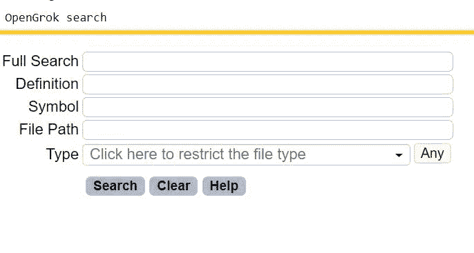
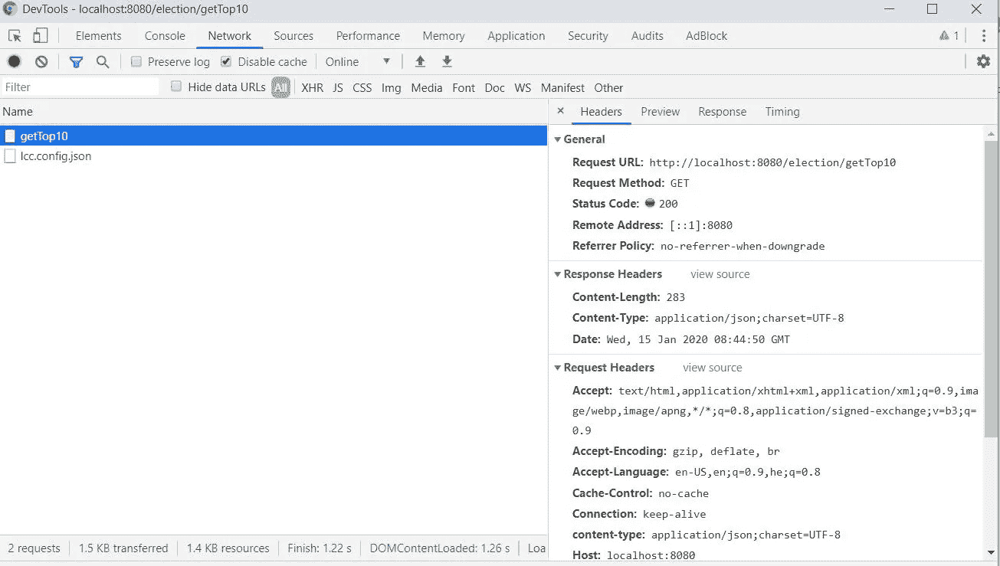

# 潜入一个不熟悉的 Web 应用程序并保持活力

> 原文：<https://levelup.gitconnected.com/diving-into-an-unfamiliar-web-application-and-staying-alive-36045112a5da>

作为开发人员，我们被期望能够深入和快速地了解不熟悉的代码，这并不容易，尤其是在没有文档和身边没有“关键人物”的时候。

当我的整个团队开始处理一个原本由另一个业务部门开发的现有项目时，我遇到了这种情况。没有文档，我们从创建项目的团队那里得到的支持很少。

另一个挑战是，我的大多数团队成员，包括我自己，都是后端开发人员，而新项目需要全面的知识和经验。

在花了一些时间之后，我可以说这对我来说是一个很好的机会。

现在我想和你分享我在一个不熟悉的代码库的 web 应用程序中处理问题的方法。

## 重要的事情先来

当运行应用程序时，遇到意外的行为，我首先想确定这种行为的来源是在客户端还是在服务器端。

为此，我打开 [chrome 开发者工具](https://developers.google.com/web/tools/chrome-devtools)(其他浏览器也有类似的工具)并检查两个选项卡:控制台和网络。

在 Console 选项卡中，我搜索错误和堆栈跟踪，这将表明问题出在客户端。

在 Network 选项卡中，我查看了 API 调用及其状态。如果它们都正常(获得 HTTP 状态代码 200)，这是问题出在客户端的另一个迹象。

由[凯利·西克玛](https://unsplash.com/@kellysikkema?utm_source=medium&utm_medium=referral)在 [Unsplash](https://unsplash.com?utm_source=medium&utm_medium=referral) 上拍摄的照片

## 客户端

当我怀疑问题源于客户端时，我可以从 chrome 开发者工具的 Sources 标签中启动调试器。但是我怎么知道从哪个文件开始调试呢？

如果我在 Console 选项卡中找到了相关的错误堆栈跟踪，这很容易，因为它会将我指向代码中的相关行。

否则，我需要在 Network 选项卡中识别可疑的 API 调用，并在源代码中搜索它们。在我的组织中，我们使用 [opengrok](https://oracle.github.io/opengrok/) ，这是一个快速且可用的源代码搜索和交叉引用引擎。但是从 IDE 中搜索也是一种选择，以防所有的源代码都加载到工作区中。

OpenGrok 搜索窗口

## 服务器端

万一我从 API 调用中得到一个错误(HTTP 状态代码不同于 200)，我将检查问题是否暴露在 API 响应中。

例如，如果 API 返回解释问题的异常或错误消息，这将引导我找到服务器端代码中的确切位置。

如果不是这样，我将不得不检查 API 设计和实现，以了解哪些服务器日志可能包含相关的错误堆栈跟踪。最后，如果根本原因仍然不清楚，我需要在日志中添加更多的打印输出或者执行远程调试。

chrome 开发者工具中的网络标签显示了带有 HTTP 状态代码 200 的 API 调用

## 一些通用提示

*   当调试不熟悉的代码时，我们并不总是知道哪些文件涉及到特定的特性。发现它的一个好方法是查看提交历史，看看哪些文件是与实现 API 的文件一起提交的。
*   检查特定文件的最近提交历史可能有助于理解流程，甚至揭示错误的来源。

## 收场白

所有的开始都是艰难的，尤其是当你没有人可以求助的时候。但是一旦你能够理解、维护和增强现有的代码，那将是一种极大的满足。

我希望你会发现我的方法有用。我将非常乐意在下面的评论中听到您在转向新项目时的挑战、建议和最佳实践。