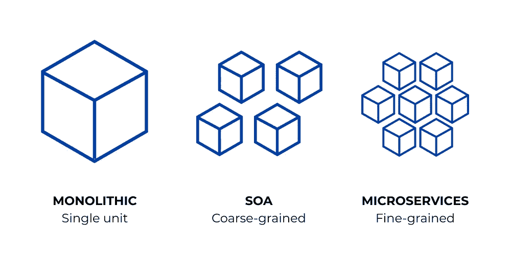
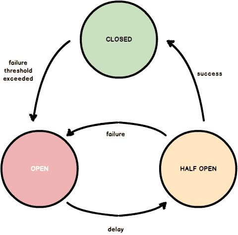
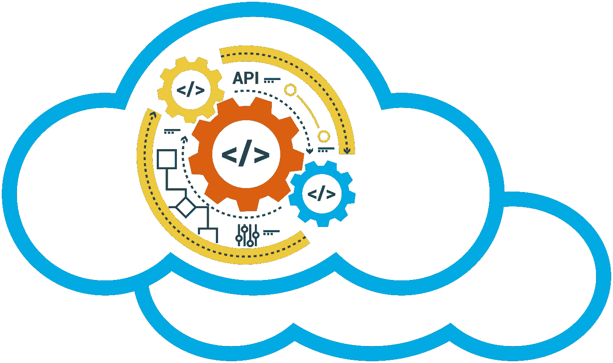
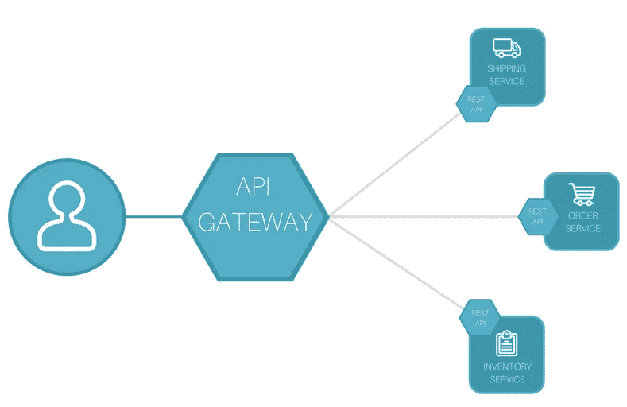

# 投入反应式微服务

> 原文：<https://levelup.gitconnected.com/diving-into-reactive-microservices-f9ff6a3f9686>

## reactive 遇到微服务会怎样？

在本文中，我们将通过将隔离技术应用到应用中，讨论从单片到面向服务的架构再到反应式微服务的转变。

# 什么是独石？

为了开始解释微服务，将其与单片应用程序进行比较是有用的。当一个应用程序作为一个单元部署时，它就被称为一个整体。Monoliths 有一个单一的共享数据库。它们通过同步方法调用进行通信，在同步方法调用中，您发送一条消息并期望立即得到响应。

# 独石的缺点是什么？

*   单片受到单个物理机器的最大尺寸的限制。随着 monolith 的增长，它需要越来越多的系统资源。
*   它们在数据库允许的范围内尽可能地扩展，因为它们通常依赖于关系数据库，为了保持一致性，关系数据库可能只运行一个实例。
*   整体组件必须作为一个组进行缩放，即使应用程序的某些组件可能需要较少的资源。
*   单片中的深度耦合导致不灵活，因此开发通常很慢。
*   由于连锁故障，一个部件的严重故障通常会拖垮整个整体。

# 什么是面向服务的架构？

面向服务的体系结构是一种体系结构风格，它将应用程序构建成一个更小的独立服务的集合。这些微服务可以物理分离，独立部署和扩展。每个微服务都有自己的逻辑和数据库，并执行特定的功能。微服务之间的通信可以是同步的，也可以是异步的，而且这些服务之间的通信只能通过 API 来完成。微服务的部署速度很快，每天部署一次甚至多次的情况并不少见。

# 面向服务架构的优点是什么？

*   由于微服务之间的隔离和松散耦合，对一个微服务内部的任何更改都不需要对另一个微服务进行更改。此外，一个微服务中的严重故障不会导致其他微服务的级联故障。
*   因为这些服务只能通过外部 API 访问，所以您可以自由地开发底层代码。
*   微服务还支持多种平台和语言。用任何编程语言和任何数据库构建应用程序都非常容易。

# 什么是反应式微服务？

反应式微服务的核心是找到在微服务之间建立更多隔离的方法。反应式微服务遵循使用各种隔离技术的隔离原则。

# 隔离的原理是什么？

随着我们从单芯片转向微服务，更多的隔离被引入。隔离减少了耦合，提高了可伸缩性。

反应式微服务被隔离为:状态、空间、时间和故障

## 状态隔离

反应式微服务只能通过其 API 访问，不提供通过数据库的后门访问。它允许微服务在内部发展，而不会影响外部。

## 太空中的隔离

反应式微服务是独立部署的，不关心其他微服务的位置。微服务的位置可以在部署期间更改，而不会影响其他微服务。它允许微服务扩展/缩减以满足需求。

## 时间上的隔离

反应式微服务是异步和非阻塞的，因此可以更有效地利用资源。在微服务之间，我们期望最终的一致性，这提供了更高的可扩展性。

## 故障隔离

反应式微服务还可以隔离故障。一个微服务的故障不会导致另一个微服务的故障。它允许系统在出现故障的情况下保持运行。

# 隔离技术有哪些？

## 散装货

图片来自[这里](https://camo.githubusercontent.com/7d5964ef9743f46b65c8d6dbb14b4859a887f8495cfcf6a954a860f804f5f0f5/687474703a2f2f6a6f6e6173626f6e65722e636f6d2f696d616765732f706f7374732f626c612d626c612d6d6963726f73657276696365732d626c612d626c612f626c615f626c615f6d6963726f73657276696365735f626c615f626c615f7064665f5f706167655f375f6f665f33315f2e706e67)

Bulkheading 是一种在应用程序中创建故障区域来隔离故障的技术，这样一个微服务中的故障不会传播到其他微服务，并且整个系统保持运行(可能处于降级状态)。

## 断路器

图片来自[这里](https://cloudandmobileblogcom.files.wordpress.com/2017/04/states.png?w=700)

断路器是隔离故障的另一种技术。当一个微服务调用另一个过载并可能失败的微服务时。调用者微服务可能没有意识到被调用的微服务处于重负载下，并且它可能会重试，从而导致被调用的微服务上的更多负载。来电微服务需要小心避免这种情况。断路器是一种避免服务过载的方法，它隔离失败的服务，这样它可以快速失败，并允许服务在不过载的情况下恢复。

## 消息驱动架构

图片来自[这里](/learning-about-reactive-messaging-patterns-ec174f510b03)

反应式微服务遵循消息驱动架构。它们使用异步非阻塞消息传递，允许隔离时间和故障。这意味着如果对微服务的请求失败，失败不会传播。此外，微服务不依赖于彼此的响应，客户端服务可以继续运行，而无需等待响应。

## 自主微服务

图片来自[这里](https://programaenlinea.net/wp-content/uploads/2019/02/microservicios-3.png)

反应式微服务本质上是自治的，它们只能通过 API 调用来保证自己的行为。微服务的隔离允许它们彼此独立运行。自主微服务有足够的信息来解决冲突和修复故障。完全自主的服务没有外部依赖性，可以无限扩展。自治允许更强的可伸缩性和可用性。自治可以通过使用最终一致性和仅通过异步消息传递进行通信来实现。

## API 网关服务

图片来自[这里](https://www.express-gateway.io/eg-vs-amazon-aws-api-gateway/)

微服务会导致 API 的复杂性。单个请求可能需要来自多个微服务的信息。客户端可以发送多个请求，但是汇总这些结果会很复杂。为了管理这种复杂性，可以引入 API 网关服务来向各个微服务发送请求，并聚合响应。聚合逻辑从客户端转移到 API 网关服务。它处理来自每个服务的故障，而客户端只需处理网关服务故障。

# 类似文章-

你也可以看看我关于*反应式建筑*系列的其他文章

*   [倾向于反应式架构](/leaning-towards-reactive-architecture-190a6e02d0e1)
*   [构建可扩展的系统](/building-scalable-systems-c09374da82d7)
*   [了解反应式消息传递模式](/learning-about-reactive-messaging-patterns-ec174f510b03/)