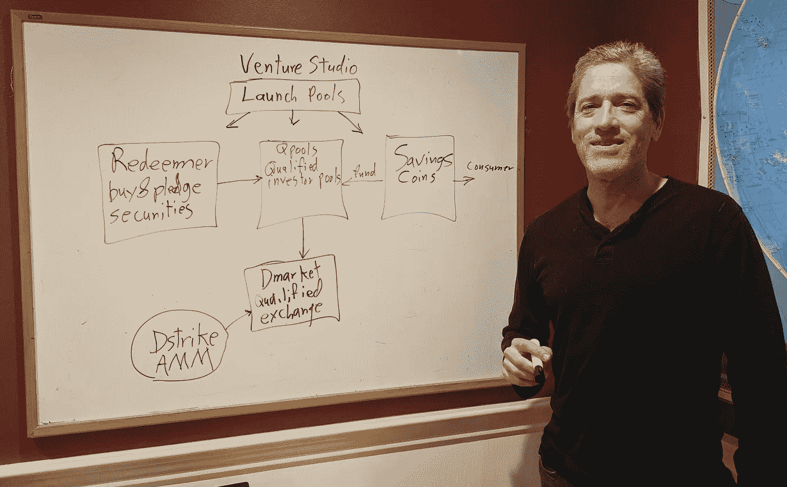

# 潜入真实世界定义

> 原文：<https://levelup.gitconnected.com/diving-into-real-world-defi-7253b82cbd3f>

DeFi 是我职业生涯中见过的最好的商业机会。这是一个炙手可热的市场，为消费者带来了实实在在的好处。幸运的是，我已经说服了七位企业家和我一起为“真实世界的 DeFi”开发产品。

Maxos 正在进行一系列项目，我们称之为“风险工作室”。这有助于我们将金融业的大规模重组分解成我们可以参与的具体项目。我们使用了每周一次的小组电话，阶段门流程，以及一套私人和公共的[不和谐](https://discord.gg/QV2xUg6eyf)渠道。

我很荣幸能和:

*   财务顾问[本杰明·罗比诺](https://www.linkedin.com/in/brobinot/)
*   安全专家和 DeFi 产量农民[安德鲁·萨德伯里](https://www.linkedin.com/in/andrewsudbury/)
*   Solidity 程序员和财务分析师 [Vojtech Hromek](https://www.linkedin.com/in/vhromek/)
*   风险投资者[霍瓦特律师协会](https://www.linkedin.com/in/csabaroberthorvath/)
*   企业企业家[弗洛朗·拉图尔](https://www.linkedin.com/in/florentlatour/)
*   企业家和战略家[塞沙·普拉塔普](https://www.linkedin.com/in/spratap/)
*   风险投资家兼 DAO 司机[史蒂夫·德雷辛斯基](https://www.linkedin.com/in/stevederezinski/)

我们将邀请更多的人加入这个群。如果你感兴趣，请告诉我。我们正在为 [React](https://angel.co/company/maxos-1/jobs/1184975-react-or-node-js-developer) 和 [Solidity](https://angel.co/company/maxos-1/jobs/1211730-blockchain-smart-contract-developer-solidity-or-rust) 等招聘。

## 关于 DeFi

DeFi 或“分散金融”用软件取代了银行、交易所、基金和保险公司。金钱和证券成为程序员可以使用的对象。参与者可以在短时间内集中他们的资源，创造新的资金，并建立更集中的组织。他们的目标是获得以下好处:

*   效率。它使用少得多的劳动力、大型机和房地产。
*   访问。任何互联网公民都可以是生产者或消费者
*   创新的步伐

DeFi 行业在 2020 年增长了约 20 倍。这在商业史上是罕见的。DeFi 软件的资产负债表或“锁定资产”增至约 200 亿美元。代币价值也增长到大约 200 亿美元。收入增长到大约 100 万 1B .扩张将持续到 2021 年。

投资者正在向 DeFi 项目投入大量资金。这些投资者中的许多人正在分散他们的比特币收益，并寻找可能遵循比特币那样轨迹的高风险、高回报的押注。

监管的不确定性将 DeFi 定位为高风险、高回报的活动。它也有助于快速成长。

“CeFi”或“TradFi”被沉重的法规负担所束缚。Crypto 和区块链形成了一个沙盒，迄今为止，监管机构大多忽略了这个沙盒。DeFi 是围绕着 ETH 和 BTC 等加密资产的借贷建立起来的。这是一个不影响传统银行的小市场。然而，稳定的硬币已经打破了盒子。用户正把越来越多的交易从旧的银行网络转移到稳定的银行账户。这绕过了监管机构花了 20 年时间建立的反洗钱检查网络。现在，监管机构希望对更多 DeFi 交易进行 KYC 和反洗钱检查，一场冲突正在酝酿之中。

解决这一冲突对于发展 DeFi 市场至关重要。加密资产不到流动资产的 1%。如果 DeFi 协议可以为非加密的“真实世界”资产提供服务，那么它们可以增长大约 100 倍。这将扩大我们为集中管理的项目融资的能力，如提供疫苗和建设可再生能源。

## 关于真实世界定义

我们正在开发将 DeFi 扩展到加密货币之外的策略。

不受监管的 DeFi 是创新和全球合作的丰富来源。如果监管者试图将 DeFi 瓦解成他们所习惯的那种受监管的组织，那将是可悲的。保持定义伟大！我们认为这种冲突可以通过兼容而不是过度监管来解决。

在某些方面，我们可以增加受监管和不受监管的世界之间的兼容性。这使得我们能够将不受监管(真正的自我监管)的 DeFi 的能量与受监管资产的规模结合起来。

## 一些现实世界的兼容性策略

例如，在 DeFi 的世界中，存在对公共证券的访问的需求。它们可以用作抵押品(价值 100T 的抵押品！)，并输入到保证金、基金形成、衍生品和资产支持证券管理以及治理的自动化流程中。证券受到严格监管，其中许多法规为消费者提供了有益的保护。然而，任何证券的 DeFi 格式也会与过时且无用的交易法规相冲突。试图遵守这些法规的“数字”交易所运营商最终制造出一种糟糕的产品，没有利用区块链自动化和全球化的优势。外汇法规构成了一个具体的矛盾点。这是一个应用我们“兼容性”理念的机会。我们可以**关闭转账**，规避外汇管制。相反，公共证券可以通过出售给受监管的(更具流动性的)公共交易系统来赎回。然后我们**开启誓师**进入 DeFi 世界。如果我们可以购买、赎回和抵押证券，我们可以保留 DeFi automation 的大部分好处。这是我们救赎者项目背后的洞察力。

**分权**是一个经典的战术。DeFi 从业者正在开发一种开源组织的科学，这种组织“足够分散”,可以使用代币而不会触发证券法。这一点很重要，因为没有办法遵守当前一代的证券交易规则，也没有办法按照应该使用令牌的方式来使用令牌，在机器之间进行交易、支付、客户奖励等。我们不知道什么是“足够分散”，但我们知道如何实现。我们需要擅长构建开源软件。我们将在分布式团队管理和持续交付中应用我们的技能。

**联合资格**:很多金融活动都需要一个确定的、合格的参与者。事实上，几乎任何金融工具都有合格的买家。如果我们遇到合规问题，了解买家的资质会很有帮助。原始解决方案是让参与者在特定于项目的门户上注册，这很烦人。几十个项目正试图提供更便携的身份识别。这一过程适用于公共证券领域，交易所成员同意分享他们的合格投资者信息。为什么它在加密中不起作用？我们会找到答案并想出如何做出贡献。

**沙盒:**我们的目标是为证券投资者带来 DeFi 自动化的全部好处，包括自动化交易、借贷、抵押品管理、资金池和监管。根据管理公共证券的规则，这目前是不可能的。然而，如果我们从一个面向有资格成为专业和老练投资者的市场开始，事情会变得容易一些。

在**销售点的选择**:期货、永久期权、期权和其他衍生品在美国受到严格监管。提供这些工具的 DeFi 项目通常要么躲在分散的交易所后面，要么禁止美国客户，或者两者兼而有之。我们注意到，监管主要是为了控制这些工具的销售。这些规定为非银行投资者的销售提供了一些风险管理和资格。我们处理这些工具的方法将为卖家提供购买者资格认证(或不认证)的选择，并在销售点提供兑换限制(或不限制)。

**担保**:通过增加追加保证金和担保等功能，MakerDao 正在从受限债券中生产可自由转让的稳定债券。这与银行从风险较高的债券和贷款中创建储蓄账户的做法相同。我们看到了一个美丽的银行架构，它保证了生息的稳定硬币或“储蓄硬币”的回报和可兑换性。

**托管**:我们的[启动池](https://medium.com/swlh/first-look-at-launch-pools-f814b40a17d7)项目提供了一个在做出关键合规决策之前与投资者合作的空间。成立基金或者公司接待投资人是要花钱的。初创公司面临着美国投资者和其他人之间的冲突，前者被迫在新项目中获得股权，后者希望获得不受监管的代币。在解决这些问题的同时，一个启动池在可退还的托管中保存资金(股份)。DeFi 增加了在承诺书、托管和 SPACs 的旧世界中不可能实现的功能。例如，投资者可以根据自己的选择来投资赚取利息和升值的资产，而不是使用特殊目的收购公司经理人的国债账户。

请就不和谐与我们[交流。](https://discord.gg/QV2xUg6eyf)

