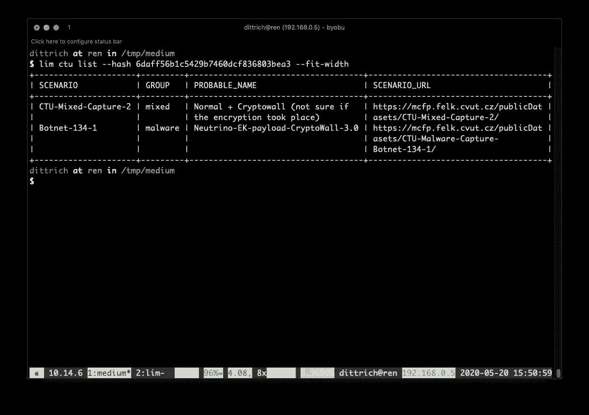

# 深入沙盒捕获的恶意软件数据

> 原文：<https://levelup.gitconnected.com/diving-into-sandbox-captured-malware-data-d0bb10a5bfd9>

## 在所有正确的地方寻找恶意软件(使用正确的工具！)

NotPetya 截图来自[CTU-恶意软件-捕获-僵尸网络-289–1](https://mcfp.felk.cvut.cz/publicDatasets/CTU-Malware-Capture-Botnet-289-1/)

我敢肯定，在某个时候，你已经收到了来自某个实体的报告或警报——US-CERT、DHS、Twitter 上转发安全研究员或反病毒公司的人，甚至可能是你的银行或信用合作社？—关于特定的威胁参与者以及他们可能对您组织的网络使用的恶意软件。你知道，就像上面截图里的恶意软件。

如果您想了解恶意软件的工作原理，以便做好应对准备，您会怎么做？

如果我给你一个免费的软件工具来帮助你搜索成百上千的网络数据包以找到关于特定恶意软件的信息，会有帮助吗？

当你读完这篇文章的时候，你可以拥有一个工具，并且知道如何使用它来获取网络数据包捕获文件！

## 循环从这里开始…

当一些恶意行为者损害了您的信息系统的*完整性*和*保密性*(进而损害了其中的信息)时，您需要采取行动。

我们假设目前你做了你所知道的一切来防止这种事情发生，但是你仍然受到了威胁。

希望你*发现了*妥协。但也有可能是其他受到类似危害的人通知了您这次危害，但可能是联邦调查局或 DHS 通知了您，或者可能是世界上许多计算机紧急响应小组(CERT)或计算机安全事件响应小组(CSIRT)组织中的一员。他们很可能以简单的*可观察指标*或更复杂的 [*危害指标* (IOCs)](https://threatpost.com/misunderstanding-indicators-of-compromise/117560/) 的形式向您提供信息。甚至国家安全局也发布了[带有可观察物和 IOC 的公告](https://media.defense.gov/2020/May/28/2002306626/-1/-1/0/CSA%20Sandworm%20Actors%20Exploiting%20Vulnerability%20in%20Exim%20Transfer%20Agent%2020200528.pdf)来帮助理解广泛的重大入侵活动！

你需要两种基本类型的信息，每一种都在因果的虚拟链条中相互关联和联系，来处理妥协。

1.  第一类是*基于主机的*信息，与文件系统中的程序、执行这些程序的进程、网络连接、注册表项等持久性机制相关联。这是关于你的计算机内部正在发生什么的信息。
2.  第二种是基于网络的信息，它与计算机进程间的数据流相关联，包裹在数据包中，将数据从一台计算机路由到另一台计算机，请求查找有关计算机的信息，等等。这是关于你的计算机*之外发生的事情的信息*在他们和互联网上的其他计算机之间的网络上(有些是良性的，有些是恶意的。)

所有这些信息不仅让您能够*响应*和*恢复对您系统的*控制，还能帮助您调整您的保护防御和检测能力，因为您现在知道可能会发生什么。然而，这是一个无尽的循环，你无法避免。

图 3–1。事故响应生命周期(来源:[NIST sp 800–61 R2](https://nvlpubs.nist.gov/nistpubs/specialpublications/nist.sp.800-61r2.pdf))

## 获得主机和网络信息的访问权限，为入侵做准备

但是，如果您还没有受到威胁，并且想要主动了解特定恶意软件工具的工作原理，以便在它被用来对付您的情况下做好准备，该怎么办呢？你如何以及从哪里获得你需要的信息？

当我第一次接触计算机和网络取证时，我很幸运。

我在`$DAYJOB`有一个操作角色，使我能够监控跨企业边界的网络流量，管理网络上被入侵系统的人通常*非常乐意*拿出计算机硬盘，交给我分析(并向他们报告如何清理和防止未来的入侵)。

在我职业生涯的早期，我发表了一系列文章，帮助其他人获得我刚刚描述的信息，以便更好地保护、检测、响应和恢复。

这包括一份关于[网络嗅探器](https://web.archive.org/web/20000816092648/http://staff.washington.edu/dittrich/misc/sniffers/)的报告，一份关于[响应可疑入侵](https://web.archive.org/web/20000816092639/http://staff.washington.edu/dittrich/R870/reacting.html)的指南，遵循我收集的[综合安全清单](https://web.archive.org/web/20000303125927/http://staff.washington.edu/dittrich/R870/security-checklist.html)，一种用于[计算计算机安全事件损害的方法](https://web.archive.org/web/20010304040516/http://staff.washington.edu/dittrich/misc/faqs/incidentcosts.faq)，关于新生磁盘取证分析工具的首批详细指南之一(后来成为 Unix 系统取证分析的[基本步骤](https://web.archive.org/web/20010124095100/http://staff.washington.edu/dittrich/misc/forensics/)，许多第一批公开的 DDoS 工具分析( [trinoo](https://web.archive.org/web/20000815075728/http://staff.washington.edu/dittrich/misc/trinoo.analysis) ， [部落洪水网](https://web.archive.org/web/20000229182625/http://staff.washington.edu/dittrich/misc/tfn.analysis)、 [stacheldraht](https://web.archive.org/web/20000229173628/http://staff.washington.edu/dittrich/misc/stacheldraht.analysis) 、 [Shaft](https://www.usenix.org/legacy/publications/library/proceedings/lisa2000/full_papers/dietrich/dietrich_html/index.html) 、 [mstream](https://web.archive.org/web/20000816021407/http://staff.washington.edu/dittrich/misc/mstream.analysis.txt) )，我维护了[分布式拒绝服务工具](https://web.archive.org/web/20130705151616/https://staff.washington.edu/dittrich/misc/ddos/)最全的网页。

这些出版物大多涉及对硬盘内容、逆向工程恶意软件和网络数据包捕获的分析，采用 [PCAP 格式](https://wiki.wireshark.org/Development/LibpcapFileFormat)。我维护了一个[网络分析工具列表，并指导](https://davedittrich.github.io/network.html)进行分析，这样任何人(甚至是你！)可以重复我所做的。

但是我能分享的信息是有限的。

出于许多法律和道德原因，我不能发布网络数据包捕获或硬盘副本，这是我加入[蜜网项目](https://medium.com/swlh/tales-from-the-crypt-3-ca8801b9f725)的动力之一，在那里我们发布了许多[挑战](https://www.honeynet.org/challenges/)，其中包括蜜罐硬盘的位映像副本、数据包捕获、恶意软件工件等。供人分析。这些都是*仍然*有价值和经常使用的资源。

没有直接安全操作角色或关系的研究人员，以及学习成为恶意软件分析师的学生，需要访问与互联网连接网络上的*真实*恶意软件相关联的*真实*数据，以便对其进行研究并锻炼他们的分析技能。

虽然可以设置蜜罐来收集此类数据，但设置蜜罐并不像看起来那么容易。获取此类数据的一种更简单的方法是从已经建立了蜜罐或恶意软件分析“沙箱”环境并向公众提供数据的人那里获取。

这导致研究人员和学生从像蜜网项目这样的组织中寻找数据，但是也有其他来源！

## CTU 恶意软件捕获设施

捷克布拉格的 CVUT 大学是世界上少数几所运营复杂的恶意软件分析捕获基础设施并提供发布此类数据服务的大学之一。

 [## 恶意软件捕获设施项目

### 恶意软件捕获设施项目是捷克技术大学 ATG 小组为捕获…

mcfp.weebly.com](https://mcfp.weebly.com/) 

*CTU 恶意软件捕获工具*使用一个由同温层 IPS 和 Avast 部分支持的仪表化沙盒环境，从恶意软件、手动执行的“攻击”和正常(即非恶意)系统操作中生成数据集。一些数据集被额外标记，以便在训练期间帮助机器学习算法。其他的是相对基本和原始的(但都包括恶意软件样本和 PCAP 数据包捕获文件。)

 [## 数据集概述—同温层 IPS

### 同温层 IPS 利用从真实恶意软件流量样本中创建的模型为自己提供信息。通过使用和研究恶意软件在现实中的表现，我们确保我们创建的模型和我们对性能的测量是真实的。我们的姐妹项目，恶意软件捕获设施项目…

www.stratosphereips.org](https://www.stratosphereips.org/datasets-overview) 

2018 年 12 月，他们的 [Aposemat 物联网项目](https://www.stratosphereips.org/aposemat)开始制作物联网专用数据集——包括 Mirai 未来组合和 CoinMiner 等恶意软件——这些数据集也包含在同温层 IPS 网站上。

总之，CTU 数据集集合包括*超过 360 个个体捕获*！

一些被很好地注释、标记，并且包括来自多个分析工具的输出。其他的很少，但都包括至少原始的 PCAP 捕获。恶意软件捕获工具已经运行了许多年，并且显然在不断发展其收集基础设施和处理。

要找到您特定的研究或教育所需的数据，可能需要花费一些努力来搜索、挖掘许多级别的 web 服务器目录结构，以及争论许多浏览器标签。

正如 Raymond Hettinger 喜欢说的，“有了*就有了*更好的方式！”所以我写了一个。；)

## 从命令行访问 CTU 数据集

不久前，我有一个客户项目，需要网络数据包捕获和恶意软件工件(包括系统事件日志)来运行“大数据”工具。我向命令行界面(CLI)添加了一些子命令，我使用匿名的 LANL [统一主机和网络数据集](https://csr.lanl.gov/data/2017.html)的子集进行研究和原型开发。

然而，我需要非匿名化的数据来适当地审查结果，并找到了 CTU 数据集集合的方法。它包含了一些我想使用的有代表性的代理 C&C 恶意软件，所以我写了我的第一个 Python 异步代码来高效地(并且温和地！)抓取网页以缓存它们的元数据，以便于搜索、检索和处理。

后来，我的另一个客户需要恶意软件和相关数据来模拟事件响应/安全运营中心分析和报告，这与我为[蜜网项目取证挑战](http://www.all.net/journal/deception/www.honeynet.org/project.honeynet.org/challenge/results/index.html)执行的参考分析一致。CTU 数据集再次包含了我需要的东西，我的工具帮助我快速移动。

我拉出子命令，并启动了一个新的 CLI，旨在用于为我在 2019 年共同创立的一家初创企业制作商业产品和服务的原型。我把这个程序命名为`lim`(我们公司名字的简称，利民信息公司)。

然后，在 2020 年 1 月，一种新型冠状病毒在世界各地蔓延，我和我的搭档发现自己身处美国两个最初的 SARS-COV-2 病毒社区传播热点(华盛顿州的金县和加利福尼亚州的圣克拉拉县)。我们的小说业务陷入了人工昏迷，其创始人被隔离在“呆在家里”的命令下，前途未卜。😷

还有什么更好的时机来发布这款工具，演示如何使用它，
并看看它的发展方向？:)

## 我们去打猎吧！

为了演示如何使用`lim`来探索恶意软件和相关元数据，让我们寻找一个在 2018-2019 年期间足够广泛出现的著名恶意软件家族，以接收官方的美国证书[警报(TA18–201 a)](https://www.us-cert.gov/ncas/alerts/TA18-201A)，即 *Emotet* 。

> Emotet 是一种高级的模块化银行特洛伊木马，主要用作其他银行特洛伊木马的下载程序或下载程序。Emotet 仍然是影响州、地方、部落和地区(SLTT)政府以及私营和公共部门的最昂贵和最具破坏性的恶意软件之一。
> 
> […] Emotet 是[多态的，意味着它]可以逃避典型的基于签名的检测。它有几种维护持久性的方法，包括自动启动注册表项和服务。它使用模块化动态链接库(dll)来不断发展和更新其功能。此外，Emotet 支持虚拟机，如果在虚拟环境中运行，可能会生成错误的指示器。

因此，Emotet 主要被视为多阶段入侵序列中的第一阶段。他们提到的“垃圾邮件”通常是一种精心起草的消息，以保证收件人(a)会打开该消息(从而使他们的计算机受到感染),以及(b)不愿意——即使他们注意到任何奇怪的事情——向任何可以阻止入侵的人报告潜在的问题。

一些精心制作的消息在 [Dragos Security 2019 年回顾](https://www.dragos.com/wp-content/uploads/The-ICS-Threat-Landscape.pdf)报告中有所描述，该报告还提到他们看到了 Emotet 部署的两个特定的二级下载:

> Emotet 于 2018 年底首次出现，感染了多个 ICS 相关实体。在整个 2019 年，它继续影响企业，在夏季有短暂的下降。Emotet 是一种常见的模块化特洛伊木马，部署了 **Trickbot** 和 **Ryuk** 恶意软件。
> — [Dragos Security 2019 年度回顾](https://www.dragos.com/wp-content/uploads/The-ICS-Threat-Landscape.pdf)

让我们看看是否可以在 CTU 数据集场景的描述中找到任何包含“emotet”、“ryuk”或“trickbot”的场景。

第一次运行其中一个`lim ctu`子命令时，它会抓取网站一次并缓存结果。这只需要几秒钟。

按组获取场景计数

现在我们可以在场景描述中搜索“emotet ”(为了节省屏幕空间，只显示前三列。)

列出按描述内容过滤的场景

对“ryuk”做同样的操作没有显示结果，但是对“trickbot”有一些结果。

列出按描述内容过滤的方案(续)

“僵尸网络-114”有四个捕获，值得注意的是*在 **PROBABLE_NAME** 字段中没有*的名称“emotet”。以下是该场景的全部细节:

显示方案的元数据

我们可以在浏览器窗口中打开网页(在 Mac、Linux 上，很快就会在 Linux 2 的 Windows 子系统上打开)?！)用命令`lim ctu overview Botnet-114–1`。

这显示了第一个*疑似* emotet 样本于 2015 年 4 月在沙盒中运行。具有相同基础名称的多个场景(`Botnet-114–1`、`Botnet-114–2`、`Botnet-114–3`和`Botnet-114–4`)表明他们执行了多次运行，以查看它们之间的不同之处。

您还可以通过哈希(MD5、SHA1 或 SHA256)搜索方案。下面是一个随机选择的示例，其中多个场景与同一个二进制文件相关:

列出按哈希过滤的场景

统计数据也可用于元数据属性。默认情况下，显示`GROUPS`属性(如上所示)。

我们可以执行的一个简单分析是确定特定恶意软件样本的出现频率。以下是 MD5 哈希出现次数的部分列表:

按属性获取场景计数

77 个场景没有记录 MD5 散列，而绝大多数捕获只涉及运行一两次的二进制文件。

前三名是什么？我们可以通过列出场景，按哈希过滤:

列出按哈希过滤的场景

现在让我们得到所有的“超级用户”并检索每个涉及 emotet 的场景的 PCAP 文件。这展示了如何编写跨多个场景的批量分析任务的脚本。

通过单个命令中的描述内容从多个场景中检索数据

## 千步之旅

好了，这是第一步！

我们已经能够识别一些候选场景，查看它们的描述，并从命令行(而不是浏览器)检索它们的一些内容。

我们现在就有这么多时间，但是你还可以做得更多。

你可以在 https://pypi.org/project/lim-cli 的[从 PyPi 获得`lim`(称为`lim-cli`，因为与一个预先存在的包名称冲突)。](https://pypi.org/project/lim-cli)

 [## lim-cli

### 用于访问、操作和处理计算机和网络安全信息的 Python CLI(例如，PCAP、Netflow…

pypi.org](https://pypi.org/project/lim-cli) 

按照[文档链接获取安装说明](https://lim-cli.readthedocs.io/en/latest/installation.html)。

试试看，让我知道你的想法！

【感谢 Sebastian Garcia、Lukas Rist 和其他人对本文的反馈。]

*要引用 CTU 数据集，请引用 Sebastian Garcia、Martin Grill、Jan Stiborek 和 Alejandro Zunino 的论文“僵尸网络检测方法的实证比较”。计算机与安全杂志。2014.第 45 卷，第 100-123 页。*[*http://dx.doi.org/10.1016/j.cose.2014.05.011*](http://dx.doi.org/10.1016/j.cose.2014.05.011)