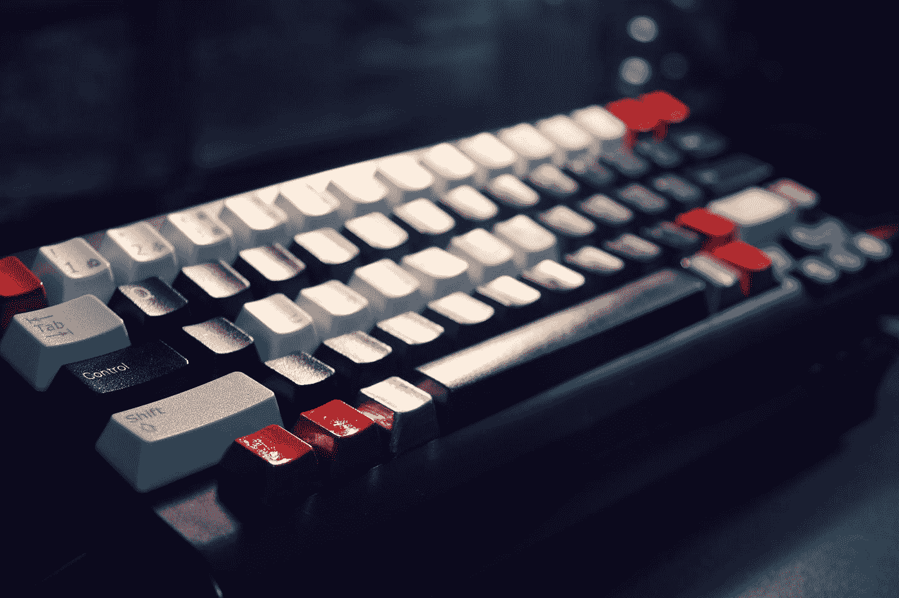
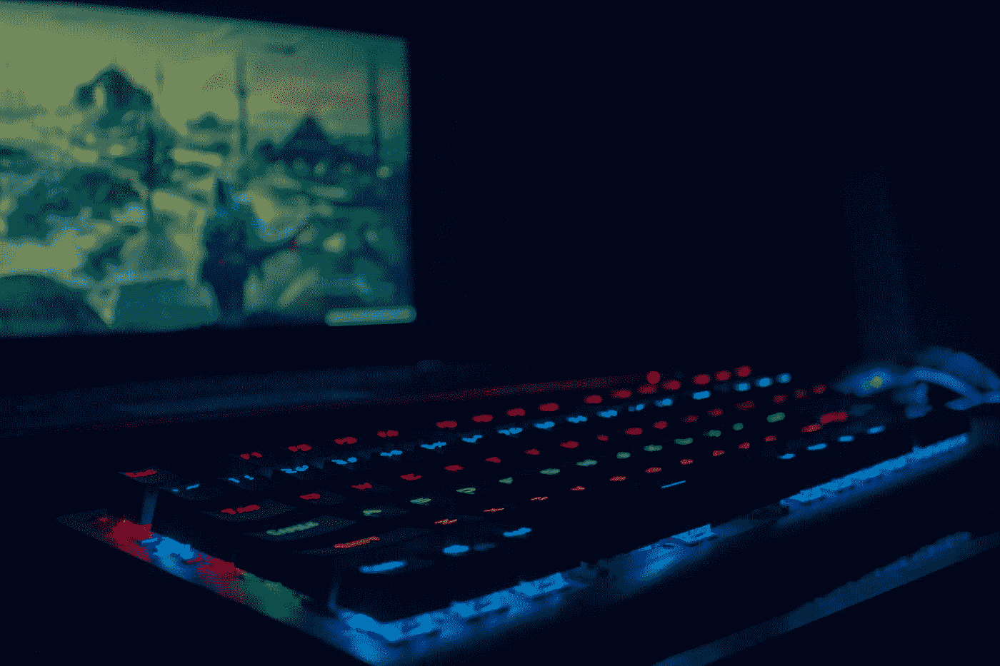
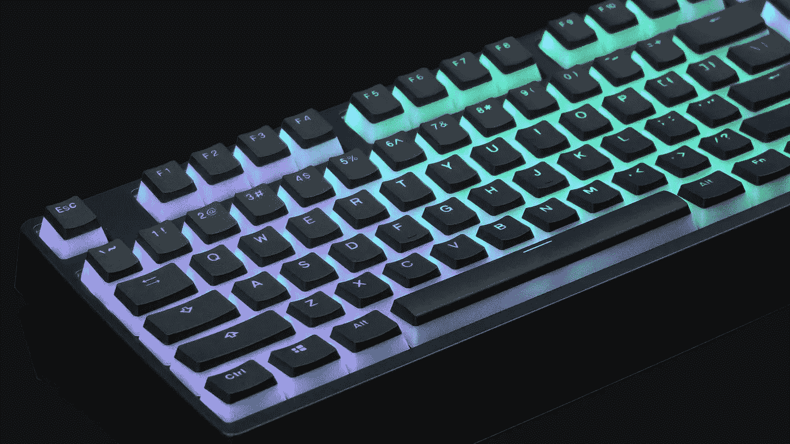
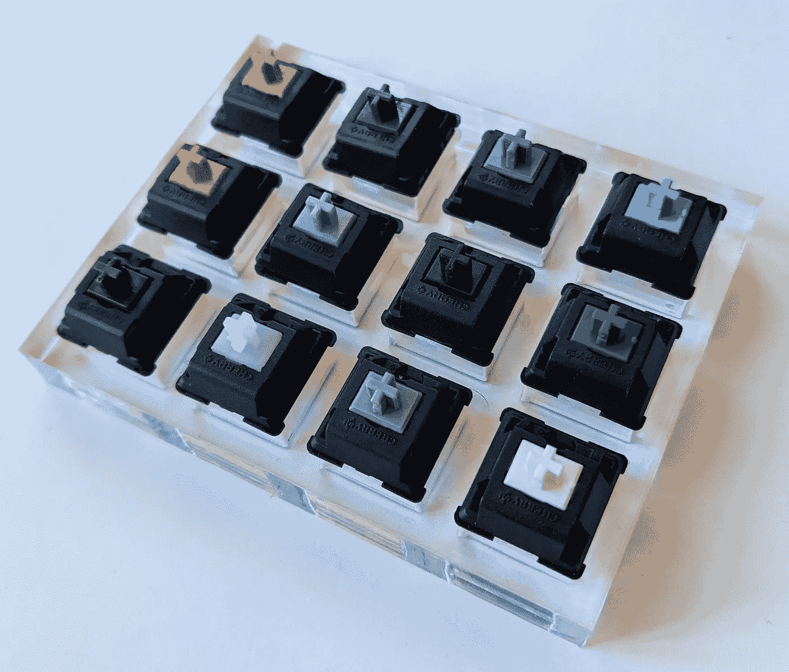
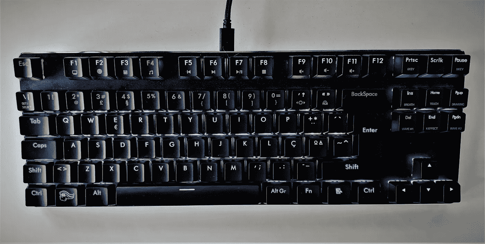

# DIY 机械键盘:你需要知道的一切

> 原文：<https://levelup.gitconnected.com/diy-mechanical-keyboard-everything-you-need-to-know-9bf23610aa6e>

机械键盘的定制选项是无穷无尽的。从键帽到线缆，这里是我自己组装机械键盘学到的一切。

日本摄影在 [Unsplash](https://unsplash.com?utm_source=medium&utm_medium=referral) 上拍摄的照片

# 大小

首先，当你想组装自己的键盘时，你需要选择它的尺寸。有许多不同的尺寸可供选择，它们分为三类:

*   全部
*   TKL
*   小型的，紧凑的

一个**全**键盘是商店里可以买到的最标准的尺寸。除了字母键之外，它还有导航键(箭头、Home、End……)和数字键盘，给人一种不用看就能输入数字的感觉。

**TKL** 代表**无钥匙**。它没有 Num pad，使它成为一个中等大小的键盘。对我来说，这是键盘的理想尺寸。它很光滑，不会在桌子上占用太多空间，无论何时外出，都可以放在背包里。

**紧凑**键盘真的很紧凑。它们类似于较小的笔记本电脑键盘，尽管它们可能甚至没有箭头键。这是定制键盘最常见的构建因素，我知道为什么。它们简约、便携，并且能完成工作。

**奖励:**你可以在 [KBDFans 的商店](https://kbdfans.com/collections/diy-kit)深入挖掘这个话题。

# 布局

至于键盘的布局，基本上可以从这两个里面挑一个:

*   美国国家标准学会
*   国际标准化组织

**ANSI** 是**美国布局**。最大的不同是它有一个单行的回车键，通常比“右移”小一点。

**ISO** 是**国际布局**，有两行回车键。

只要选择你最常用的就行，但是要知道找到 ANSI 键盘的零件更容易。

# 准系统

这是拼图的第一块。它是键盘的基础，自下而上由四部分组成:

*   情况
*   印刷电路板
*   盘子
*   电缆

无论何时选择这些组件中的任何一个，都要确保它们符合您想要的大小和布局。

## 情况

市场上有很多外壳材料可供选择:塑料、铝、钛、陶瓷、木材、…

需要注意的重要东西是**橡胶脚**，这样你的键盘就不会滑走，还有**支架**可以调节其高度/倾斜度。我强烈建议买一个两者都具备的箱子。

## 印刷电路板

PCB 是键盘的心脏。

你需要注意的最重要的特性是**是否是热插拔的**，这意味着你要么简单地连接开关，要么需要将它们焊接到电路板上。

第二重要的是它是否支持 **N 键翻转**。现在大部分都有！

> “每次按键都被正确地检测到，而不管当时有多少其他键被按下”
> 
> [https://en . Wikipedia . org/wiki/Rollover _(key)](https://en.wikipedia.org/wiki/Rollover_(key))2021 年 4 月 18 日

最后，如果你想有一个**背光键盘**，你的 PCB 必须支持它，要么内置 led，要么有适当的孔供你以后焊接它们。

## 盘子

它被放置在 PCB 的顶部，以正确地固定您的开关。像表壳一样，它可以由不同的材料制成，你必须注意它是如何安装的。它通常用螺丝固定在外壳上，尽管它也可以简单地扣在外壳上。

## 电缆

我建议买一个带**可拆卸电缆**的 PCB，这样可以更方便地携带你的键盘。除此之外，还有大量的电缆可供你选择。

# 背后照明

[Ahmed Atef](https://unsplash.com/@ahmedatef19?utm_source=medium&utm_medium=referral) 在 [Unsplash](https://unsplash.com?utm_source=medium&utm_medium=referral) 上拍摄的照片

## 颜色；色彩；色调

大多数背光键盘提供两种颜色选项:

*   单色发光二极管
*   RGB 发光二极管(百万种颜色)

他们可能会提供一些适合键盘品牌的不同选项，如惠普的 Omen Spacer，除了红色的 WASD 和箭头键之外，它还有白色的背光。

大多数制造商还开发专有软件来定制他们键盘的背光颜色、亮度和效果。
此外，它们通常具有不同的配置文件，以便随时切换。

## 效果

有大量的背光效果可供选择:

*   静电
*   无缝改变颜色
*   波动
*   连锁反应
*   彩虹
*   [数]矩阵
*   俄罗斯方块
*   派克曼
*   …

想看更多吗？前往 YouTube 。

## 布丁键帽

写键盘背光，我不能不提布丁键帽。
它们的底部略微不透明，以反射 led 的光线，增加视觉效果。自己看:

[kbdfans 上的照片](https://kbdfans.com/collections/backlit-keycaps/products/backlit-mechanical-keyboard-translucent-keycap)

# 开关

就用户体验而言，这些是键盘最重要的组成部分。它们负责你从打字中获得的乐趣，按下这些按钮来记录击键的满足感，以及将你的手指向上推到原始位置的力。

抱歉，我有点失控了。

## 类型

有三种不同类型的开关:

*   线性的
*   触觉的
*   Clicky

**线性**开关是其中最平滑的**。它们的阻力最小，它们的**垂直运动是直线的**，没有任何东西可以阻止你。这就像你在没有任何交通堵塞的海滩上巡航，或者偶然碰到每一个绿灯。
如果您正在寻找游戏方面的纳米优势，这些就是您正在寻找的交换机。**

****触觉**开关有一个小的**凸起**，在此之前，你可以将按键完全按下。在最初的几毫米里，它们提供了一个小阻力，在那次颠簸之后，它们会一路向下，没有任何摩擦。这些通常最适合打字，因为你的大脑会得到“我已经按下了这个键”的反馈。**

****Clicky** 开关感觉类似于触觉开关，并且有一个额外的**卡嗒声**，每当注册一个键时都会发出。因此，它们也有一个初始的**凸起**，当听到咔哒一声时，它们变得无阻力并一直向下。如果你一个人住，并且想惩罚自己的过错，选择这些。开个玩笑！这些开关拥有大量的粉丝，但请记住，它们真的很吵**，会惹恼坐在你旁边的人。****

## ****轮廓****

****大多数开关制造商制造标准尺寸的开关。它们大约 3 厘米高，遵循适合大多数 PCB 的标准引脚排列。****

****最近，已经有一些低姿态的机械键盘被生产出来，但是如果你正在制造你自己的，你将很难找到兼容的材料。
与标准相比，它们的引脚位置不同，键帽的连接器可能不同，键帽需要更短，PCB 安装孔的直径可能不同。****

****今年早些时候，Cherry MX 甚至发布了新的**超薄**开关。它只有 3.5 毫米高，而且它是如此之新，还没有任何键盘可供你试用，所以现在甚至不要费心用这些来制作自己的键盘。****

## ****房屋****

****开关装在**不透明**或**透明**外壳中。没有任何物理差异，只是透明的允许 led 的光通过。****

****它们也可以是**盒装开关**，这实际上是一个非常聪明的概念，可以让你的键盘防溅。与这些不同的是，密钥注册机制是密封的。****

## ****噪声级****

****键盘发出的噪音取决于几个因素:****

*   ****底部向下的力****
*   ****弹簧弹力****
*   ****阻尼器****

******下压力**是按键时噪音的主要来源。你可以轻轻地按下按键以获得最小的声音反馈，或者在每次按键时用力按压，没有办法按键不会发出声音，尤其是那个长空格键。****

****但是，您可以选择一些无声版本的线性或触觉开关(clicky 没有此选项)。我已经做到了，你会感觉到不同的！
静音开关在阀杆和外壳的接触部分有内置阻尼器。****

******弹簧的弹力**负责你按下按键时得到的反馈。不幸的是，它还会产生自下而上的噪音，即阀杆撞击外壳顶部时产生的噪音。
但是，我感觉弹簧产生的力在降低自下而上的噪音方面的影响比在增加自下而上的噪音方面更大。****

******减震器**是小橡胶 o 型圈，可以添加到键帽上，以减少按压时的冲击噪音。你可以选择薄或厚，橡胶或塑料，黑色或透明。我试过厚橡胶透明键盘，因为它们能最大程度地降低打字噪音。不幸的是，我没有感觉到使用它们有什么不同，所以我的建议是完全避免使用它们。****

## ****陆兵****

****除非开关是预先润滑的(真的很少)，否则你会想自己润滑它们。它减少了内部部件之间的摩擦，改善了打字体验。
市场上有两种陆兵期权:****

*   ****油****
*   ****贿赂****

****它们都很好用，所以你应该选择你更喜欢的。我选择了油，因为它比油脂更容易涂抹。****

****陆兵开关时最重要的规则是:****

> ******少即是多！******

****添加更多的油或油脂比去除任何一种都容易。此外，简单的按键动作有助于润滑油的均匀分布。****

****好的。明白了！但是润滑什么呢？
你应该润滑开关运动部件的接触点。这包括与阀杆接触的下壳体内部、弹簧本身以及阀杆的导轨、支腿和弹簧接触杆。****

****立正！**不要润滑点击开关**和**当陆兵触摸开关的杆**时要非常小心。****

****润滑的咔嗒声开关可能会停止发出咔嗒声，您可能会在两个开关之间听到不同的咔嗒声。****

****触觉开关的杆腿不应该润滑，否则你会破坏它们应有的触感。****

****您的键盘也有稳定器来平衡较大的键。你可以在你的空格键，回车键等等下面找到它们。就我个人而言，我没有给它们加润滑油，但是根据互联网上的说法，没什么好担心的。把它们拆开，润滑接触部分，然后把所有东西装回去。****

## ****品牌****

****有一些开关制造商，他们通常生产相同类型的开关。你会发现 Cherry MX，Gateron，Kailh，Outemo，Zeal 等等。****

********

****布鲁诺·马丁斯拍摄的照片****

****有一个大多数制造商遵循的潜规则，可以帮助你确定你想要的开关:****

****红色是线性的
棕色是触觉型的
蓝色是点击型的****

****但是，正如你所看到的，有相当多的变种。所以，在购买它们的时候，一定要仔细阅读产品说明。****

****除了照片中的采样器，我只买了静音的红樱桃 MX 开关和 Kailh 铜开关，感觉质量很高。所以为了品牌对比，我建议你[在 YouTube 上搜索](https://www.youtube.com/results?search_query=mechanical+switches+brands+comparison)。****

# ****键帽****

****至于键帽，定制选项是无穷无尽的。****

****你可以得到从空白键帽到透明的任何东西。它们大多是黑色或白色的，但你也可以找到一些彩色的。有些看起来很整洁，字母印在前面而不是顶部。我可以继续描述它们，但是，老实说，浏览这样的目录对你来说更容易。****

****我的选择是带有透明字母的黑色键帽。通过软件 LED 定制选项，我使它看起来非常漂亮。****

# ****费用****

****制作你自己的机械键盘是一个有趣的爱好，但是它并不比买一个预建的便宜。****

****相比之下，在写这篇文章的时候，PC Gaming Race 的一个光荣的 GMMK 至少要花 110 美元，你还需要买 lube 和花几个小时陆兵每个开关。与此同时，一台 Razer Ornata V2 售价 100 美元，随时可以使用。****

# ****结论****

********

****布鲁诺·马丁斯拍摄的照片****

****这是我自己的机械键盘，这些是我从组装它中学到的要点。****

****我希望这个故事对你的新宠物项目有所帮助，并欢迎在评论中提出任何讨论或问题。****

****感谢阅读。****